# Mapping des tables de calcul astrologique et d'interpretation

Ce document cartographie les tables SQLite liees au calcul du theme astrologique, aux predictions derivees et a leur interpretation. Il s'appuie sur `backend/horoscope.db` et sur l'inventaire `.codex-artifacts/astrology-interpretation-calculation-tables-inventory.csv`.

> Note: pour un schema reduit au theme astrologique uniquement, sans LLM, personas ni references de versions, utiliser `.codex-artifacts/astrology-theme-focused-schema.md` et `.codex-artifacts/astrology-theme-focused-tables.csv`.

## Schema global

```mermaid
graph TD
    subgraph REF [Referentiels astrologiques]
        reference_versions[reference_versions]
        planets[planets]
        signs[signs]
        houses[houses]
        aspects[aspects]
    end

    subgraph CALCREF [Profils et poids de calcul]
        planet_profiles[planet_profiles]
        house_profiles[house_profiles]
        aspect_profiles[aspect_profiles]
        astro_points[astro_points]
        sign_rulerships[sign_rulerships]
        prediction_categories[prediction_categories]
        planet_category_weights[planet_category_weights]
        house_category_weights[house_category_weights]
        point_category_weights[point_category_weights]
    end

    subgraph RULES [Rulesets moteur]
        prediction_rulesets[prediction_rulesets]
        ruleset_event_types[ruleset_event_types]
        ruleset_parameters[ruleset_parameters]
    end

    subgraph INPUTS [Entrees utilisateur et contexte]
        users[users]
        user_birth_profiles[user_birth_profiles]
        geo_place_resolved[geo_place_resolved]
    end

    subgraph NATAL [Calcul du theme natal]
        chart_results[chart_results result_payload JSON]
    end

    subgraph DAILY [Calculs de prediction quotidienne]
        daily_prediction_runs[daily_prediction_runs]
        daily_prediction_category_scores[daily_prediction_category_scores contributors_json]
        daily_prediction_turning_points[daily_prediction_turning_points driver_json]
        daily_prediction_time_blocks[daily_prediction_time_blocks]
    end

    subgraph CALIB [Calibration et normalisation]
        category_calibrations[category_calibrations]
        calibration_raw_days[calibration_raw_days]
        user_prediction_baselines[user_prediction_baselines]
    end

    subgraph LLMCONF [Configuration interpretation LLM]
        llm_use_case_configs[llm_use_case_configs]
        llm_prompt_versions[llm_prompt_versions]
        llm_assembly_configs[llm_assembly_configs]
        llm_execution_profiles[llm_execution_profiles]
        llm_output_schemas[llm_output_schemas]
        llm_personas[llm_personas]
        llm_release_snapshots[llm_release_snapshots]
    end

    subgraph PERSONA [Personas et templates metier]
        astrologer_profiles[astrologer_profiles]
        astrologer_prompt_profiles[astrologer_prompt_profiles]
        consultation_templates[consultation_templates]
        editorial_template_versions[editorial_template_versions]
    end

    subgraph INTERP [Interpretations produites]
        user_natal_interpretations[user_natal_interpretations interpretation_payload JSON]
    end

    subgraph OBS [Observabilite interpretation]
        llm_call_logs[llm_call_logs]
        llm_call_log_operational_metadata[llm_call_log_operational_metadata]
        llm_replay_snapshots[llm_replay_snapshots]
    end

    reference_versions --> planets
    reference_versions --> signs
    reference_versions --> houses
    reference_versions --> aspects

    planets --> planet_profiles
    houses --> house_profiles
    aspects --> aspect_profiles
    signs --> sign_rulerships
    planets --> sign_rulerships
    planets --> planet_category_weights
    houses --> house_category_weights
    astro_points --> point_category_weights
    prediction_categories --> planet_category_weights
    prediction_categories --> house_category_weights
    prediction_categories --> point_category_weights

    reference_versions --> prediction_rulesets
    prediction_rulesets --> ruleset_event_types
    prediction_rulesets --> ruleset_parameters
    prediction_rulesets --> category_calibrations
    prediction_categories --> category_calibrations

    users --> user_birth_profiles
    geo_place_resolved --> user_birth_profiles
    user_birth_profiles --> chart_results
    reference_versions --> chart_results
    prediction_rulesets --> chart_results

    chart_results --> daily_prediction_runs
    users --> daily_prediction_runs
    reference_versions --> daily_prediction_runs
    prediction_rulesets --> daily_prediction_runs
    daily_prediction_runs --> daily_prediction_category_scores
    daily_prediction_runs --> daily_prediction_turning_points
    daily_prediction_runs --> daily_prediction_time_blocks
    prediction_categories --> daily_prediction_category_scores
    ruleset_event_types --> daily_prediction_turning_points

    calibration_raw_days --> category_calibrations
    daily_prediction_category_scores --> user_prediction_baselines
    chart_results --> user_prediction_baselines

    chart_results --> user_natal_interpretations
    llm_use_case_configs --> llm_prompt_versions
    llm_prompt_versions --> llm_assembly_configs
    llm_personas --> llm_assembly_configs
    llm_execution_profiles --> llm_assembly_configs
    llm_output_schemas --> llm_assembly_configs
    llm_release_snapshots --> llm_assembly_configs
    llm_personas --> astrologer_profiles
    astrologer_profiles --> astrologer_prompt_profiles
    astrologer_profiles --> user_natal_interpretations
    llm_prompt_versions --> user_natal_interpretations
    llm_assembly_configs --> user_natal_interpretations
    consultation_templates --> user_natal_interpretations
    editorial_template_versions --> daily_prediction_runs

    user_natal_interpretations --> llm_call_logs
    llm_call_logs --> llm_call_log_operational_metadata
    llm_call_logs --> llm_replay_snapshots
```

## Schema relationnel compatible

```mermaid
erDiagram
    reference_versions ||--o{ planets : versions
    reference_versions ||--o{ signs : versions
    reference_versions ||--o{ houses : versions
    reference_versions ||--o{ aspects : versions
    reference_versions ||--o{ prediction_categories : versions
    reference_versions ||--o{ astro_points : versions
    reference_versions ||--o{ prediction_rulesets : supports

    planets ||--|| planet_profiles : profiles
    houses ||--|| house_profiles : profiles
    aspects ||--|| aspect_profiles : profiles
    signs ||--o{ sign_rulerships : ruled_by
    planets ||--o{ sign_rulerships : rules

    planets ||--o{ planet_category_weights : weights
    houses ||--o{ house_category_weights : weights
    astro_points ||--o{ point_category_weights : weights
    prediction_categories ||--o{ planet_category_weights : categories
    prediction_categories ||--o{ house_category_weights : categories
    prediction_categories ||--o{ point_category_weights : categories

    prediction_rulesets ||--o{ ruleset_event_types : event_types
    prediction_rulesets ||--o{ ruleset_parameters : parameters
    prediction_rulesets ||--o{ category_calibrations : calibrates
    prediction_categories ||--o{ category_calibrations : calibrated

    users ||--o{ user_birth_profiles : owns
    user_birth_profiles ||--o{ chart_results : produces
    users ||--o{ chart_results : owns
    reference_versions ||--o{ chart_results : computed_with
    prediction_rulesets ||--o{ chart_results : computed_with

    users ||--o{ daily_prediction_runs : owns
    chart_results ||--o{ daily_prediction_runs : informs
    reference_versions ||--o{ daily_prediction_runs : computed_with
    prediction_rulesets ||--o{ daily_prediction_runs : computed_with
    daily_prediction_runs ||--o{ daily_prediction_category_scores : scores
    daily_prediction_runs ||--o{ daily_prediction_turning_points : turning_points
    daily_prediction_runs ||--o{ daily_prediction_time_blocks : time_blocks
    prediction_categories ||--o{ daily_prediction_category_scores : scored
    ruleset_event_types ||--o{ daily_prediction_turning_points : triggers

    calibration_raw_days ||--o{ category_calibrations : feeds
    daily_prediction_category_scores ||--o{ user_prediction_baselines : feeds
    chart_results ||--o{ user_prediction_baselines : feeds

    chart_results ||--o{ user_natal_interpretations : interpreted
    users ||--o{ user_natal_interpretations : owns
    llm_use_case_configs ||--o{ llm_prompt_versions : prompts
    llm_prompt_versions ||--o{ llm_assembly_configs : assembled
    llm_personas ||--o{ llm_assembly_configs : persona
    llm_execution_profiles ||--o{ llm_assembly_configs : execution
    llm_output_schemas ||--o{ llm_assembly_configs : output_schema
    llm_release_snapshots ||--o{ llm_assembly_configs : release
    llm_personas ||--o{ astrologer_profiles : public_profile
    astrologer_profiles ||--o{ astrologer_prompt_profiles : prompt_profile
    astrologer_profiles ||--o{ user_natal_interpretations : persona_used
    llm_prompt_versions ||--o{ user_natal_interpretations : prompt_used

    user_natal_interpretations ||--o{ llm_call_logs : traced_by
    llm_call_logs ||--o{ llm_call_log_operational_metadata : metadata
    llm_call_logs ||--o{ llm_replay_snapshots : replay
```

## Lecture du flux

1. Les tables `reference_versions`, `planets`, `signs`, `houses` et `aspects` definissent le vocabulaire astrologique versionne.
2. Les tables `planet_profiles`, `house_profiles`, `aspect_profiles`, `astro_points`, `sign_rulerships` et les tables de poids par categorie enrichissent ce vocabulaire pour le calcul.
3. Les tables `prediction_rulesets`, `ruleset_event_types` et `ruleset_parameters` portent les parametres actifs du moteur.
4. `user_birth_profiles` fournit les donnees de naissance; `chart_results` persiste le theme calcule dans `result_payload`.
5. Les predictions quotidiennes s'appuient sur le theme et les rulesets puis persistent leurs sorties dans `daily_prediction_runs`, `daily_prediction_category_scores`, `daily_prediction_turning_points` et `daily_prediction_time_blocks`.
6. L'interpretation natale combine `chart_results` avec la configuration LLM, les prompts, les personas et les templates; le resultat final est stocke dans `user_natal_interpretations.interpretation_payload`.
7. Les tables `llm_call_logs`, `llm_call_log_operational_metadata` et `llm_replay_snapshots` ne pilotent pas le calcul, mais documentent les executions LLM.

## Tables prioritaires pour un export complet

Pour completer le premier CSV au-dela de `planets`, `houses`, `signs`, `aspects` et `orbes`, les tables les plus importantes sont :

- `planet_profiles`, `house_profiles`, `aspect_profiles`
- `prediction_categories`, `planet_category_weights`, `house_category_weights`, `point_category_weights`
- `astro_points`, `sign_rulerships`
- `prediction_rulesets`, `ruleset_event_types`, `ruleset_parameters`
- `chart_results`, `user_natal_interpretations`
- `llm_use_case_configs`, `llm_prompt_versions`, `llm_assembly_configs`, `llm_personas`, `astrologer_profiles`, `astrologer_prompt_profiles`

## Points d'attention

- `chart_results.result_payload`, `daily_prediction_category_scores.contributors_json`, `daily_prediction_turning_points.driver_json` et `user_natal_interpretations.interpretation_payload` sont des colonnes structurees qui contiennent l'essentiel du calcul ou de l'interpretation.
- Les tables de reference contiennent deux versions en base locale; la version active du code est `2.0.0`.
- Certaines tables existent mais sont vides en local, notamment `category_calibrations`, `calibration_raw_days`, `user_prediction_baselines`, `editorial_template_versions` et `llm_active_releases`.
