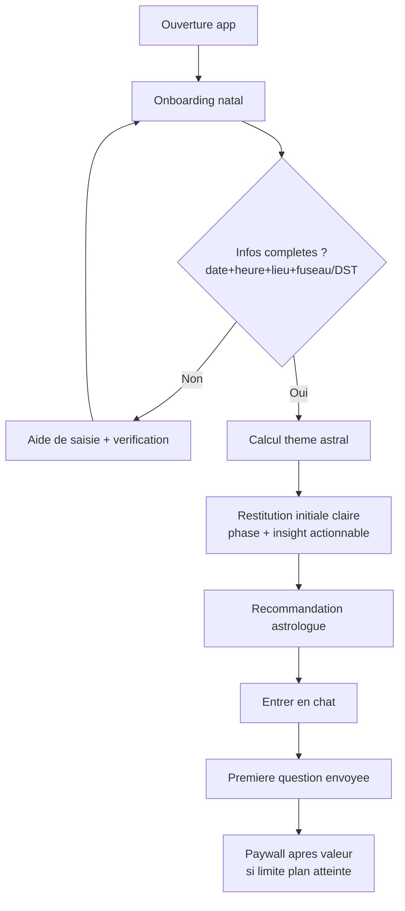
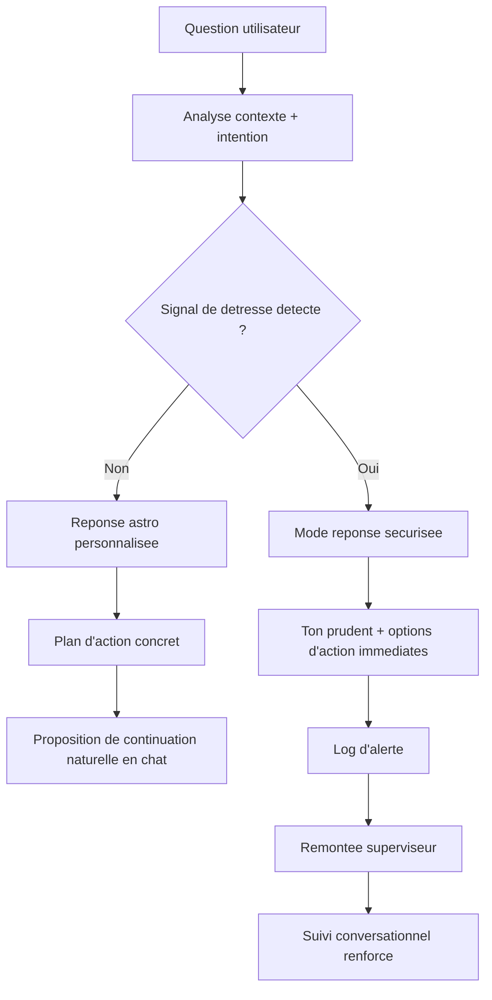
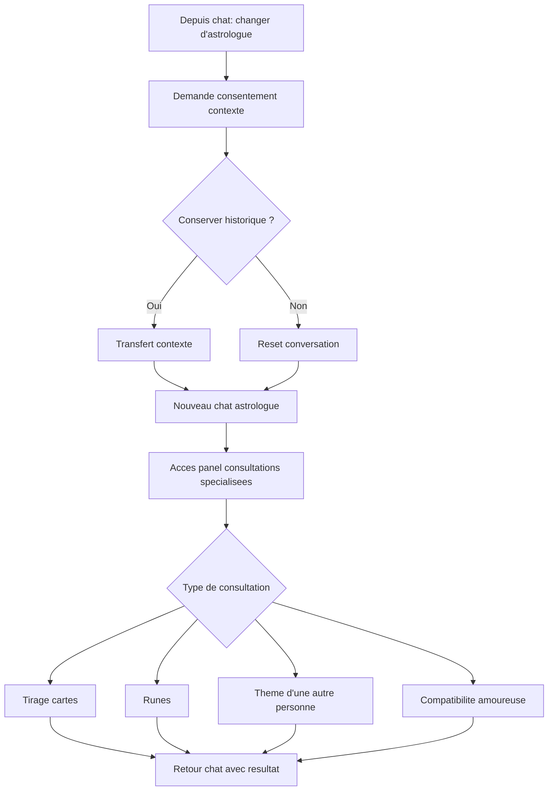
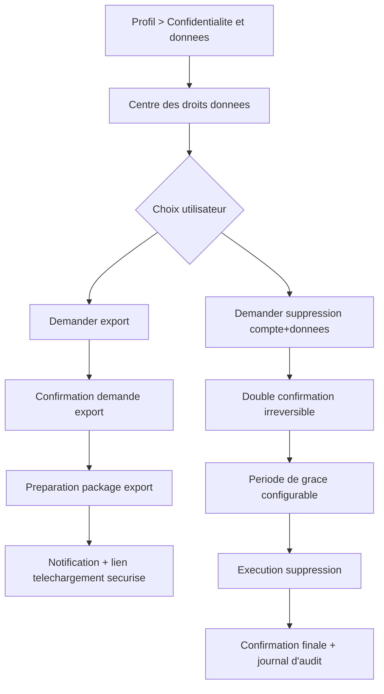

# UX Design Specification horoscope_front

**Author:** Cyril
**Date:** 2026-02-17T23:03:00+01:00

---

<!-- UX design content will be appended sequentially through collaborative workflow steps -->

## Executive Summary

### Project Vision

horoscope_front vise a apporter une valeur immediate des l'inscription: aider l'utilisateur a comprendre la phase qu'il traverse, anticiper les dynamiques a venir, et transformer l'incertitude en orientation concrete.
Le produit doit reduire l'inquietude, rassurer dans les periodes floues, et soutenir les decisions pendant les moments sensibles de la vie (rendez-vous importants, relations, nouvelles difficiles).

### Target Users

Le coeur de cible est une population a maturite numerique plutot basique, avec une attente de simplicite maximale.
Ils cherchent une guidance personnelle credible, car ils sont souvent deçus par:
- des sites complexes avec des informations trop generales,
- des horoscopes generalistes a faible valeur,
- des astrologues perçus comme chers ou peu fiables.

Usage principal:
- usage periodique: consultations regulieres pour se situer dans ses cycles,
- usage critique: consultations ponctuelles lors de moments de stress ou de decision.

Priorite device:
- d'abord mobile,
- puis desktop.

### Key Design Challenges

- Produire un "wow" immediat des l'inscription: "ce theme me ressemble vraiment".
- Rendre une matiere complexe (astrologie) ultra lisible pour des utilisateurs peu technophiles.
- Installer la confiance rapidement (clarte, credibilite, sensation d'accompagnement) dans des moments emotionnellement charges.

### Design Opportunities

- Concevoir un onboarding express centre sur la reconnaissance de soi (miroir identitaire immediat).
- Transformer l'astrologie en langage d'action quotidienne: "ou j'en suis", "ce que j'anticipe", "quoi faire maintenant".
- Construire une experience mobile-first de reassurance: ton, rythme, et structure penses pour les moments critiques.

## Core User Experience

### Defining Experience

L'experience coeur de horoscope_front repose sur une boucle simple:
1) un theme astral de demarrage tres soigne pour creer l'adhesion initiale,
2) un chat astrologue contextuel comme interaction recurrente principale.

L'action la plus frequente est le chat avec l'astrologue.
Le point critique a reussir absolument est la qualite du theme astral initial: c'est le moment qui conditionne le retour utilisateur.
Si une seule interaction doit etre parfaitement fluide, c'est la conversation chat (lecture, envoi, comprehension immediate des reponses).

### Platform Strategy

La strategie plateforme est:
- web mobile-first (PWA/site) en priorite,
- extension desktop en second temps.

Le mode d'interaction principal est tactile, avec adaptation clavier/souris sur desktop.
Le produit doit rester majoritairement en ligne, mais permettre la consultation offline des derniers echanges pour maintenir la continuite d'usage.

### Effortless Interactions

Les interactions a rendre invisibles et naturelles:
- auto-remplissage des donnees pertinentes,
- suggestions contextuelles de questions,
- relances intelligentes selon la phase utilisateur.

Une opportunite differenciante forte est d'eliminer la friction des alternatives actuelles:
- pas de prise de rendez-vous obligatoire,
- pas de cout eleve pour obtenir une personnalisation utile,
- acces immediat a une guidance personnalisee hebdomadaire.

L'application doit aussi proposer automatiquement des points de repere hebdomadaires personnalises, sans effort de parametrage complexe.

### Critical Success Moments

Le moment de verite principal est la restitution du theme astral initial.
C'est la scene de comparaison directe avec les autres experiences de conversation (messenger, LLM, chats concurrents):
si ce moment est mediocre, la credibilite s'effondre.

Le flux le plus sensible est l'onboarding:
- collecte des informations,
- comprehension immediate de la valeur,
- premiere lecture astro perçue comme juste et utile.

L'onboarding doit etre irreprochable en clarte, rythme et sentiment de personnalisation.

### Experience Principles

- Le theme astral initial est une promesse de confiance, pas une simple formalite.
- Le chat est le coeur vivant du produit: rapide, clair, continu, contextuel.
- Mobile-first signifie decisions UX orientees pouce, lisibilite et immediatete.
- Toute friction inutile (prise de rendez-vous, etapes lourdes, ambiguite) doit etre supprimee.
- Chaque ecran doit reduire l'incertitude et renforcer la sensation d'etre accompagne.

## Desired Emotional Response

### Primary Emotional Goals

L'objectif emotionnel principal est de rassurer l'utilisateur et de rendre sa lecture de vie plus claire.
Chaque interaction doit transformer le flou en comprehension actionable, sans dramatisation ni fatalisme.

### Emotional Journey Mapping

- A l'inscription: curiosite positive, envie d'en decouvrir plus.
- Pendant le chat: attention captee, sentiment d'etre ecoute et accompagne.
- Apres la reponse: clarte mentale, apaisement, sentiment de comprendre ce qui se joue et quoi faire ensuite.
- En cas de friction (latence, erreur, incomprehension): proteger l'espoir et le controle perçu, eviter tout ressenti d'impasse ou de noirceur.

Un principe critique s'applique dans les moments sensibles: si un signal de detresse apparait, l'experience doit redoubler de soutien, de douceur et de cadrage constructif.

### Micro-Emotions

Etats emotionnels a renforcer:
- confiance en soi retrouvee,
- sentiment d'avoir un partenaire qui eclaire,
- motivation a agir avec discernement.

Etats emotionnels a eviter absolument:
- jugement,
- negativisme,
- culpabilite,
- impression qu'il n'existe aucune issue.

### Design Implications

- Rassurance active: ton empathique, formulations non jugeantes, langage simple et explicite.
- Clarte decisionnelle: chaque reponse doit finir par des reperes concrets (ce que j'observe, ce que je peux faire maintenant, ce que je peux surveiller ensuite).
- Protection emotionnelle: bannir les formulations catastrophistes ou deterministes; privilegier les options, les nuances et les marges de manoeuvre.
- Gestion des moments critiques: detecter les signaux de detresse et adapter la reponse avec plus de prudence, de soutien et de guidance pratique.
- Continuité relationnelle: maintenir la memoire contextuelle pour renforcer le sentiment d'etre compris dans la duree.

### Emotional Design Principles

- Eclairer sans effrayer.
- Rassurer sans infantiliser.
- Guider sans imposer.
- Clarifier sans simplifier a l'exces.
- Toujours laisser a l'utilisateur une perspective d'action et de progression.

## UX Pattern Analysis & Inspiration

### Inspiring Products Analysis

Produits de reference cites:
- ChatGPT
- Facebook
- Instagram
- applications de motivation / yoga / respiration

Ce qu'ils apportent de pertinent pour horoscope_front:
- ChatGPT: fluidite conversationnelle, clarte de la zone d'echange, sensation d'immediatete.
- Facebook/Instagram: interface lisible, repères visuels familiers, parcours scroll vertical continu qui limite la charge cognitive.
- Apps bien-etre: ton accompagnant, rituels simples et recurrents, sentiment de progression personnelle.

Leur point commun utile: reduire l'effort mental d'utilisation tout en maintenant l'engagement dans la duree.

### Transferable UX Patterns

Patterns de navigation:
- Flux vertical continu pour consulter facilement contenu astro, historique et points hebdomadaires.
- Architecture d'ecrans tres lisible avec priorite a une action principale par vue.

Patterns d'interaction:
- Chat central toujours accessible, reponse rapide et cadence conversationnelle naturelle.
- Suggestions de prompts/contextes prets a l'emploi pour guider les utilisateurs peu technophiles.
- Micro-rituels recurrents inspires du bien-etre (check-in hebdo, respiration rapide, point d'ancrage avant guidance).

Patterns visuels:
- Interface simple, claire, sans surcharge.
- Identite de marque singuliere et expressive pour installer une forte personnalite, sans sacrifier la lisibilite.

### Anti-Patterns to Avoid

- Bugs ou instabilites visibles dans les flux critiques (onboarding, theme, chat).
- Interface complexe ou surchargee qui noie l'utilisateur.
- Ambiguite sur "quoi faire maintenant" ou "ce que l'app sait faire".
- Multiplication d'options secondaires qui detournent de la valeur principale.
- Parcours obscurs sans feedback clair sur l'etat systeme.

### Design Inspiration Strategy

Ce qu'on adopte:
- La fluidite de conversation type assistant moderne.
- La simplicite structurelle des apps grand public.
- Le rythme de consultation recurrent des apps bien-etre.

Ce qu'on adapte:
- Le scroll vertical pour des contenus astro actionnables (phase actuelle, guidance, prochaines etapes).
- Les interactions ludiques en gardant un ton rassurant et credible.
- Les suggestions automatiques pour un public a maturite numerique basique.

Ce qu'on evite:
- Toute complexite d'interface qui ralentit la comprehension.
- Toute opacite fonctionnelle sur les capacites de l'application.
- Toute experience generique sans personnalite: l'interface doit rester simple mais immediatement reconnaissable.

## Design System Foundation

### 1.1 Design System Choice

Approche retenue: Themeable System hybride base sur Tailwind CSS + shadcn/ui (primitives Radix).

Cette combinaison offre:
- une base de composants fiables et accelerateurs,
- une personnalisation visuelle tres poussee,
- une liberte forte pour construire une identite "mystique moderne" sans effet template.

### Rationale for Selection

- Le projet exige une forte singularite visuelle: un systeme trop "pre-style" (Material/Ant) limiterait la personnalite.
- L'equipe veut aller vite sans repartir de zero: composants prets + surcouche design est le bon compromis.
- Le produit est mobile-first avec chat central: cette approche permet d'optimiser finement densite, rythme vertical, et lisibilite tactile.
- Les primitives headless facilitent la coherence et la robustesse sur les parcours critiques (onboarding, theme astral, chat).

### Implementation Approach

- Mettre en place un socle de design tokens (couleurs, typo, spacing, radius, elevation, motion).
- Utiliser les composants shadcn/ui comme base fonctionnelle, puis les re-designer pour la marque.
- Prioriser un kit minimal pour MVP:
  - chat thread,
  - message composer,
  - cards de guidance,
  - etapes d'onboarding,
  - feedback states (loading/error/empty).
- Verrouiller des regles d'usage pour eviter la derive visuelle entre ecrans.

### Customization Strategy

- Construire une identite "mystique moderne" via:
  - palette sobre et contrastes lisibles,
  - typographie expressive mais tres readable,
  - iconographie symbolique legere (sans surcharge esoterique),
  - micro-interactions apaisantes et non gadget.
- Garder une structure d'interface ultra simple:
  - 1 action principale par ecran,
  - hierarchie visuelle immediate,
  - langage clair pour public peu technophile.
- Definir des variantes emotionnelles:
  - mode "rassurance",
  - mode "clarification",
  - mode "decision".

## 2. Core User Experience

### 2.1 Defining Experience

Interaction definissante:
"Avec horoscope_front, je peux savoir comment les astres influent ma vie."

Le coeur d'usage repose sur un chat astro unique et central:
- l'utilisateur fournit ses donnees essentielles pour etablir son theme astral,
- il accede ensuite immediatement a la conversation avec un astrologue recommande selon son profil,
- il peut ensuite approfondir avec des consultations specifiques (moments critiques, tirages cartes/rhunes, compatibilite amoureuse).

La promesse UX est une orientation immediate et actionnable, dans une interface visuelle tres simple.

### 2.2 User Mental Model

Le modele mental utilisateur est hybride:
- part "miroir de soi" (comprendre sa phase et son etat),
- part "aide a la decision" (quoi faire maintenant),
- part "projection" (ce qui peut arriver ensuite).

Les utilisateurs attendent des reponses:
- claires et directes dans la forme,
- nuancees dans le fond,
- personnalisees a leur contexte et exploitables concretement.

### 2.3 Success Criteria

Criteres de succes du coeur d'experience:
- temps de reponse chat cible: < 1 seconde percue,
- friction d'entree minimale: 1 etape maximum entre ouverture de l'app et premiere question envoyee,
- signal de succes principal: reponse claire, adaptee, personnalisee, et perçue comme pertinente par l'utilisateur.

Indicateurs supplementaires:
- l'utilisateur comprend rapidement la phase qu'il traverse,
- l'utilisateur identifie au moins une action concrete apres la reponse,
- l'utilisateur ressent que l'accompagnement "fait sens" pour sa situation.

### 2.4 Novel UX Patterns

Approche retenue: pattern etabli (chat) specialise astro.
- Interaction principale volontairement familiere (format conversationnel connu).
- Singularite apportee par la couche metier: theme natal, astrologue recommande, consultations contextuelles, extensions esoteriques (cartes/rhunes), compatibilite.
- Innovation de service sans casser les conventions d'usage de messagerie.

### 2.5 Experience Mechanics

1. Initiation
- A l'ouverture, l'utilisateur voit clairement quoi faire.
- Le parcours commence par la collecte des donnees indispensables au theme astral.
- Une recommandation d'astrologue apparait ensuite automatiquement.

2. Interaction
- L'utilisateur entre directement dans le chat astro.
- Il pose une question libre ou choisit une suggestion contextuelle.
- Il peut ensuite:
  - continuer avec l'astrologue recommande,
  - choisir un autre profil dans une galerie,
  - demander une consultation specifique (moment critique, tirage, compatibilite).

3. Feedback
- Retour immediat dans l'interface (prise en compte de la question, progression de reponse).
- Reponses formulees de facon claire, personnalisee, orientee decision.
- Signaux visuels simples confirmant la progression et la comprehension.

4. Completion
- L'utilisateur sait qu'il a termine quand il peut reformuler:
  - "Je comprends ce qui se passe",
  - "Je sais quoi faire ensuite."
- L'application propose alors le prochain pas naturel (suivi, question complementaire, consultation ciblee).

## Visual Design Foundation

### Color System

Aucune charte existante imposee: la palette est definie pour une identite "mystique moderne" avec inspiration liquid glass.

Direction colorielle:
- Base sombre profonde pour installer le calme et la concentration.
- Accents chauds eclairants pour symboliser guidance, clarte et espoir.
- Effets de transparence/flou (glass) pour la hierarchie et la sensation premium.

Palette semantique (intention):
- Primary: lueur ambree doree (actions principales, CTA)
- Secondary: bleu nuit/desature (structure, navigation)
- Surface: couches translucides sombres (cards, panneaux, chat)
- Success: vert doux lumineux (validation, progression)
- Warning: ambre chaud (attention sans anxiete)
- Error: rouge attenue (alerte lisible, non agressive)

Regles:
- Contrastes forts texte/fond sur mobile.
- Accents lumineux utilises avec parcimonie pour conserver l'effet premium.

### Typography System

Direction typographique: approche proche des usages Apple, privilegieant lisibilite, sobriete et elegance.

Strategie:
- Titres: style net, moderne, a fort impact.
- Corps: tres lisible, fluide en lecture mobile.
- Hierarchie simple et stable (peu de niveaux, differenciation claire par taille/poids).

Rendu attendu:
- Ton premium, rassurant, non demonstratif.
- Lecture confortable sur parcours longs (chat + interpretation).

### Spacing & Layout Foundation

Intentions de layout:
- Espacement aere pour laisser "respirer" l'interface.
- Rythme vertical fluide (scroll naturel, sections bien separees).
- 1 action principale par ecran pour limiter la charge cognitive.

Systeme:
- Grille mobile-first avec marges genereuses.
- Espacement coherent entre blocs conversationnels, cartes astro et actions.
- Densite maitrisee: jamais de saturation d'information dans les moments sensibles.

### Accessibility Considerations

- Lisibilite prioritaire sur fond sombre (taille texte, poids, contraste).
- Etats interactifs explicites (focus, actif, erreur, succes).
- Zones tactiles confortables pour usage mobile.
- Feedback visuel clair pour ne jamais laisser l'utilisateur dans l'incertitude.

Note: la cible accessibilite WCAG 2.1 AA sera appliquee comme reference de mise en oeuvre.

## Design Direction Decision

### Design Directions Explored

Huit directions visuelles ont ete explorees dans le showcase HTML:
- Direction 01 - Glass Minimal Oracle
- Direction 02 - Warm Night Feed
- Direction 03 - Messenger Mystic
- Direction 04 - Astro Dashboard Lightbeam
- Direction 05 - Ritual Steps
- Direction 06 - Profile Galaxy
- Direction 07 - Quiet Focus
- Direction 08 - Hybrid Signature

L'exploration a couvert:
- variations de hierarchie d'information,
- patterns de chat et de navigation,
- niveaux de densite et d'espacement,
- applications de la palette sombre/chaleur en style liquid glass.

### Chosen Direction

Direction retenue: **Direction 08 - Hybrid Signature**.

Cette direction combine:
- familiarite conversationnelle type messagerie,
- flux vertical lisible pour les reperes astro,
- composante rituelle legere pour accompagner les moments critiques.

### Design Rationale

- Aligne avec le coeur produit: chat central astro, immediate et actionnable.
- Conserve une interface simple pour public peu technophile, tout en gardant une forte personnalite.
- Respecte la direction emotionnelle: rassurer, clarifier, guider sans dramatiser.
- Compatible avec la fondation visuelle choisie: sombre chaleureux, glass, espacement aere.

### Implementation Approach

- Utiliser Direction 08 comme base produit MVP.
- Integrer certains micro-elements des autres pistes si necessaire:
  - clarte minimale de Direction 01,
  - rituel guidant de Direction 05,
  - sobriete de lecture de Direction 07.
- Prioriser les ecrans critiques:
  - onboarding natal,
  - premier theme astral,
  - chat astrologue,
  - guidance hebdomadaire.

## User Journey Flows

### MVP vs Post-MVP Scope Clarification

Ce document UX couvre la vision cible et des extensions. Pour execution, le perimetre suivant fait foi:

**MVP (a implementer en priorite)**
- onboarding natal (date, heure, lieu, verification fuseau/DST)
- generation et restitution du theme natal initial
- chat astrologue principal avec contexte conversationnel
- guidance quotidienne/hebdomadaire de base
- droits donnees RGPD (export + suppression) via parcours dedie
- quota/messages et paywall en lien avec le plan B2C d entree

**Post-MVP (a planifier, non bloquant MVP)**
- consultations specialisees (tirage cartes, runes, compatibilite, theme d une autre personne)
- multi-profils astrologues avances
- experience B2B self-service complete
- optimisations visuelles/rituelles non critiques

Regle de priorisation: en cas de conflit entre vision UX et scope produit, appliquer le scope MVP du PRD et des epics.

### Journey 1 - Onboarding natal -> premier theme -> entree chat

Objectif: obtenir une premiere valeur forte avant monétisation.

Points UX:
- verification forte des donnees critiques avant calcul.
- premiere valeur avant paywall.
- entree en chat immediate apres restitution.

### Journey 2 - Chat critique -> guidance -> gestion detresse

Objectif: clarifier et proteger l'utilisateur dans les moments sensibles.

Points UX:
- pas de CTA figes: interaction en chat naturel.
- branche detresse obligatoire avec supervision.

### Journey 3 - Changement astrologue + panel consultations specialisees

Objectif: garder la continuite tout en laissant le controle utilisateur.

Points UX:
- consentement explicite avant transfert d'historique.
- possibilite de repartir de zero.
- "pan" dedie hors chat pour actions complementaires.

### Journey 4 - Droits donnees (RGPD): export et suppression

Objectif: garantir une experience claire, reversible et traçable pour FR29/FR30.

Points UX:
- vocabulaire simple sur les effets de chaque action.
- double confirmation obligatoire pour suppression.
- suivi d'etat visible (recu, en cours, termine, echec) dans l'espace compte.
- acces support direct depuis l'ecran en cas de blocage.

### Journey Patterns

- Pattern 1: valeur d'abord, monétisation ensuite.
- Pattern 2: verification des donnees critiques avant calcul.
- Pattern 3: chat naturel continu comme colonne vertebrale.
- Pattern 4: consentement explicite quand le contexte personnel est reutilise.
- Pattern 5: modules specialises accessibles depuis un espace dedie puis reinjection dans le chat.

### Flow Optimization Principles

- reduire a 1 etape max vers la premiere question chat.
- afficher un feedback de progression clair a chaque etape critique.
- proteger l'utilisateur en cas de detresse (reponse securisee + supervision).
- ne jamais bloquer l'utilisateur dans une impasse: toujours une suite conversationnelle.
- garder l'interface visuelle simple et aeree, meme dans les parcours complexes.

## Component Strategy

### Design System Components

Composants fondation (Tailwind + shadcn/ui + primitives Radix) utilises comme base:
- Button, Input, Textarea, Select
- Dialog, Sheet, Tabs
- Card, Badge, Avatar
- ScrollArea, Tooltip, Toast
- Skeleton, Switch

Ces composants couvrent:
- structure UI standard,
- interactions de base,
- feedback systeme,
- overlays et navigation secondaire.

Approche:
- reutiliser le maximum de primitives existantes,
- personnaliser fortement le rendu via design tokens,
- garder des patterns d'usage stables pour public peu technophile.

### Custom Components

### AstralThemeInsightCard

**Purpose:** Presenter un insight astrologique clair et actionnable apres calcul de theme ou en suivi quotidien.  
**Usage:** Sur ecran d'accueil, restitution initiale, syntheses conversationnelles.  
**Anatomy:** titre de phase, resume en 1 phrase, niveau de confiance/periode, action recommandee, lien vers approfondissement chat.  
**States:** loading, default, expanded, error-data, stale-data.  
**Variants:** initial insight, weekly insight, critical-moment insight.  
**Accessibility:** titres semantiques, lecture ecran lineaire, contrastes AA, focus visible sur actions.  
**Content Guidelines:** phrases courtes, non fatalistes, orientees decision.  
**Interaction Behavior:** tap ouvre details ou lance question de suivi dans le chat.

### AstroChatThread

**Purpose:** Coeur conversationnel de l'application (interaction principale recurrente).  
**Usage:** Ecran principal apres onboarding; disponible en continu.  
**Anatomy:** fil messages, zone saisie, etat generation, indicateurs contexte astrologue, historique.  
**States:** idle, typing, generating, partial-stream, error-retry, offline-readonly, handoff-safe-mode.  
**Variants:** mode standard, mode detresse securise.  
**Accessibility:** navigation clavier, annonces ARIA pour nouveaux messages, ordre de lecture coherent, zones tactiles confortables.  
**Content Guidelines:** clarte, personnalisation contexte, conclusion actionnable.  
**Interaction Behavior:** conversation naturelle sans CTA fixes; suggestions contextuelles facultatives.

### ConsultationHubPanel

**Purpose:** Regrouper les consultations specialisees hors flux chat principal.  
**Usage:** section dediee de l'application + acces direct depuis demande en chat.  
**Anatomy:** grille de modules (tirage cartes, rhunes, theme d'une autre personne, compatibilite), prerequis, estimation delai, lancement.  
**States:** default, module-locked, module-ready, in-progress, completed, error.  
**Variants:** vue catalogue, vue detail module, vue resultat avec retour chat.  
**Accessibility:** labels explicites, navigation simple, feedback de progression clair.  
**Content Guidelines:** expliquer le "pourquoi/quoi/comment" avant lancement module.  
**Interaction Behavior:** lancement module -> resultat interprete -> reinjection conversationnelle dans AstroChatThread.

### WeeklyGuidanceRitualCard

**Purpose:** Installer un rituel hebdomadaire de guidance pour retention et reassurance.  
**Usage:** home/feed, rappel hebdo, resume de phase.  
**Anatomy:** titre semaine, energie dominante, point d'attention, action de la semaine, bouton "en parler au chat".  
**States:** upcoming, active, completed, missed, updated.  
**Variants:** light check-in, full weekly ritual, critical-week mode.  
**Accessibility:** lecture concise, contraste renforce, timing lisible.  
**Content Guidelines:** ton motivant et rassurant, eviter injonctions.  
**Interaction Behavior:** un tap permet d'ouvrir une conversation contextualisee sur le rituel.

### DistressSafetyGuard (cross-cutting component)

**Purpose:** Proteger l'utilisateur en cas de detresse detectee.  
**Scope:** composant transversal branche au chat et aux modules.  
**Behaviors confirmed:**
- detection de signaux de detresse,
- bascule en mode reponse securisee (ton prudent),
- proposition d'actions immediates,
- log d'alerte,
- remontee superviseur,
- trace/audit des evenements.

### ContextTransferConsentModal + ReportAstrologerAction

**Purpose:** Gerer le consentement lors d'un changement d'astrologue et offrir un signalement.  
**Behaviors confirmed:**
- consentement obligatoire avant transfert contexte,
- option "continuer avec historique",
- option "repartir de zero",
- remember choice desactive par defaut,
- action "signaler un astrologue" disponible dans le flux de changement.

### DataRightsCenter (RGPD)

**Purpose:** Centraliser les demandes d'export et suppression de donnees utilisateur.  
**Usage:** Espace Profil > Confidentialite et donnees.  
**Anatomy:** deux actions primaires (export, suppression), statut des demandes, historique, aide support.  
**States:** idle, pending, processing, completed, failed, cancelled.  
**Accessibility:** libelles explicites, confirmations lisibles, parcours clavier complet.  
**Interaction Behavior:** toute action sensible declenche confirmation, puis retour d'etat trace.

### Component Implementation Strategy

- Utiliser les composants de fondation pour 80% de la structure.
- Construire les composants custom critiques autour des parcours prioritaires (theme, chat, consultations, rituel).
- Encapsuler la logique sensible (detresse, consentement, signalement) dans des composants dedies et testables.
- Aligner tous les composants sur:
  - design tokens communs,
  - etats UX explicites (loading/error/empty/offline),
  - accessibilite WCAG 2.1 AA.

### Implementation Roadmap

**Phase 1 - MVP critique**
- AstralThemeInsightCard
- AstroChatThread
- ConsultationHubPanel
- WeeklyGuidanceRitualCard

**Phase 2 - Securite & confiance**
- DistressSafetyGuard
- ContextTransferConsentModal
- ReportAstrologerAction

**Phase 3 - Optimisation experience**
- enrichissement variantes, finesse micro-interactions, cohesion inter-modules.

## UX Consistency Patterns

### Button Hierarchy

**Primary Action**
- Un seul bouton primaire par ecran.
- Couleur ambree chaude (guidance/action principale).
- Libelle orienté action concrete ("Commencer mon theme", "Envoyer", "Continuer").

**Secondary Action**
- Style ghost/glass discret.
- Utilise pour actions de support ("Voir details", "Plus tard").

**Danger Action**
- Reserve a actions irreversibles (reset contexte, suppression).
- Confirmation systematique via modal.

**Rules**
- Jamais deux CTA primaires concurrents.
- Priorite mobile: zone tactile large, positionnement stable en bas d'ecran quand critique.

### Feedback Patterns

**Success**
- Message court + consequence claire ("Theme genere", "Contexte transfere").
- Couleur success douce, non flashy.

**Warning**
- Alerte non anxiogene avec solution proposee.
- Exemple: "Heure de naissance incertaine, verifier pour un resultat plus precis."

**Error**
- Formulation explicite + action de recuperation immediate ("Reessayer", "Corriger").
- Pas de jargon technique.

**Distress Mode**
- Pattern dedie:
  - ton prudent et non jugeant,
  - options d'action immediates,
  - log d'alerte + remontee superviseur.
- Priorite: ne jamais renforcer sentiment d'impasse.

### Form Patterns

**Onboarding Natal Form**
- Champs obligatoires:
  - date de naissance,
  - heure locale precise,
  - lieu (ville/pays),
  - verification fuseau/DST.
- Validation progressive inline (pas uniquement en fin).
- Auto-completion et suggestions pour limiter l'effort.

**Form Rules**
- Une consigne simple par etape.
- Messages d'erreur lies au champ, avec exemple attendu.
- Bouton suivant actif seulement quand minimum viable atteint.

### Navigation Patterns

**Primary Navigation**
- Chat comme point d'ancrage principal.
- ConsultationHub accessible:
  - en section dediee,
  - et via demande depuis le chat.

**Context Transfer Navigation**
- Changement astrologue -> modal consentement obligatoire.
- Choix:
  - continuer avec historique,
  - repartir de zero.
- Option "signaler un astrologue" disponible dans ce flux.

**Back/Recovery**
- Retour toujours possible sans perte silencieuse.
- Confirmation uniquement sur actions destructives.

### Additional Patterns

**Loading**
- Skeleton glass aere + texte de progression humain.
- Pour chat: etat "generation en cours" explicite.

**Empty States**
- Toujours expliquer quoi faire ensuite.
- Exemple: "Aucun rituel hebdo pour l'instant, lance ton premier check-in."

**Offline**
- Derniers echanges consultables en lecture seule.
- Actions d'envoi desactivees avec message clair de reprise reseau.

**Retry**
- Action unique de relance, sans multiplier les choix.
- Conservation du contexte utilisateur apres echec.

## Responsive Design & Accessibility

### Responsive Strategy

**Mobile (priorite)**
- Ecran centre sur le chat et l'action immediate.
- Navigation principale compacte en bas (chat, guidance, consultations, profil).
- Onboarding en etapes courtes, une decision a la fois.
- Lecture offline en mode read-only des derniers echanges.

**Tablet**
- Meme logique mobile, avec espace accru pour:
  - panneau contexte (phase actuelle, rituel hebdo),
  - chat principal.
- Touch-first conserve (cibles tactiles larges, gestures simples).

**Desktop**
- Exploiter l'espace en 2 colonnes:
  - gauche: navigation + contexte astro,
  - droite: chat/consultation active.
- Garder les memes patterns que mobile pour continuité cognitive.

### Breakpoint Strategy

Approche mobile-first avec breakpoints standards:
- Mobile: 320 - 767
- Tablet: 768 - 1023
- Desktop: 1024+

Regles:
- Priorite au contenu critique (question/reponse, action suivante).
- Reflow progressif, pas de rupture de pattern entre devices.

### Accessibility Strategy

Niveau cible: **WCAG 2.1 AA**.

Exigences clefs:
- contraste texte/fond conforme (min 4.5:1).
- navigation clavier complete (desktop).
- compatibilite lecteur d'ecran (structure semantique + ARIA).
- zones tactiles min 44x44 px.
- focus visible et ordre logique de tabulation.
- messages d'erreur comprehensibles, non techniques.
- mode detresse redige en langage prudent, non jugeant, non catastrophiste.

### Testing Strategy

**Responsive**
- tests reels mobile iOS/Android + desktop Chrome/Edge.
- verification de lisibilite sur petits ecrans et mode paysage.
- test performance percue sur reseau degrade.

**Accessibility**
- audit automatise (axe/lighthouse).
- navigation clavier-only.
- tests lecteurs d'ecran (VoiceOver/NVDA).
- verification contraste et simulation daltonisme.
- revue specifique des parcours critiques:
  - onboarding natal,
  - premier theme,
  - chat,
  - mode detresse.

### Implementation Guidelines

- HTML semantique + ARIA strictement utile.
- media queries mobile-first, unites relatives (rem/%).
- composants avec etats explicites: loading/error/empty/offline.
- gestion focus lors modals (consentement contexte, signalement astrologue).
- aucun blocage silencieux: toujours une voie de recuperation.
- contenu chat et feedback redactes en phrases courtes et actionnables.
