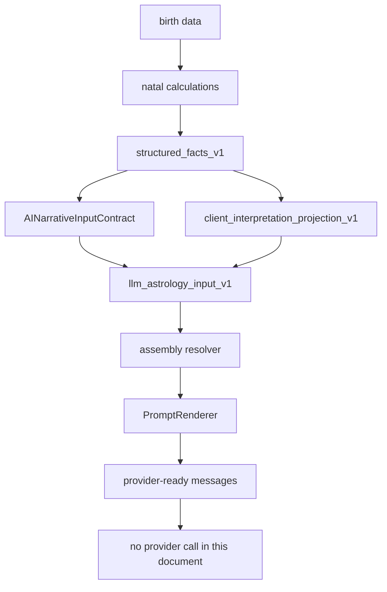
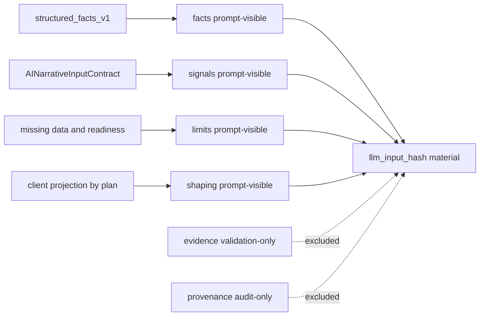
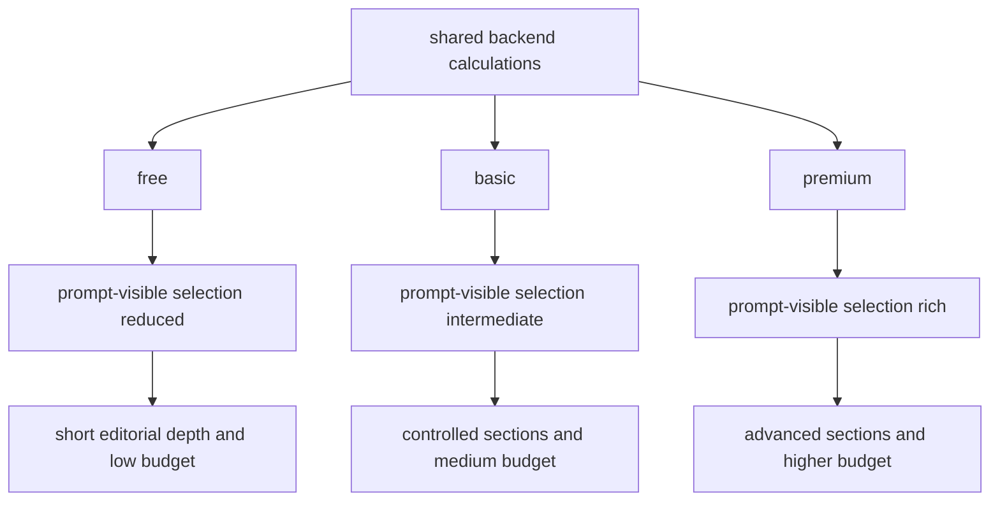
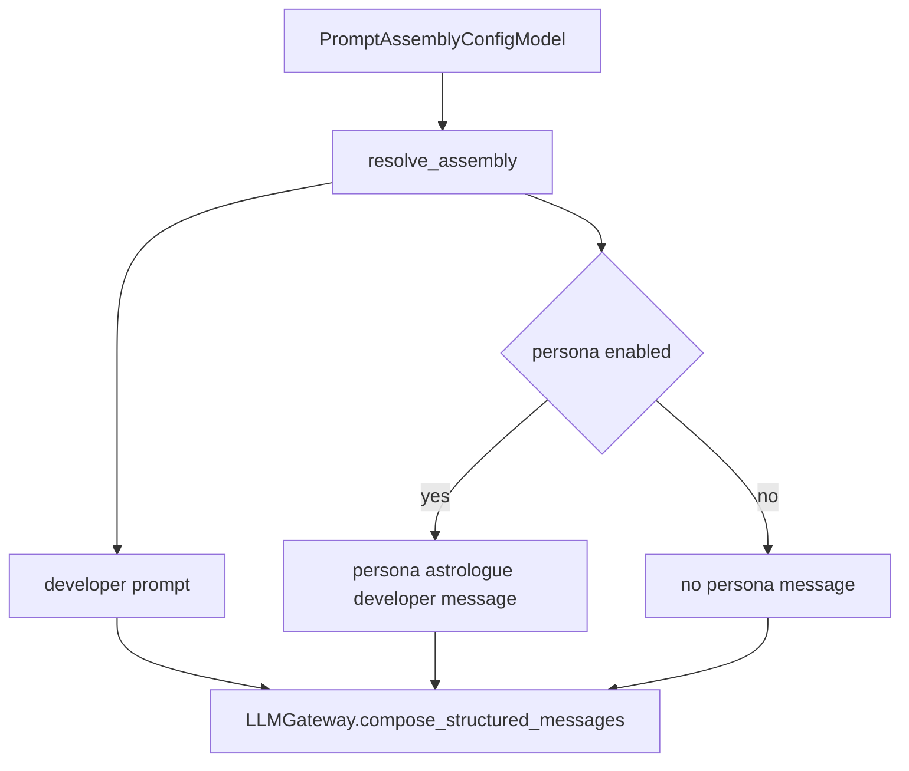
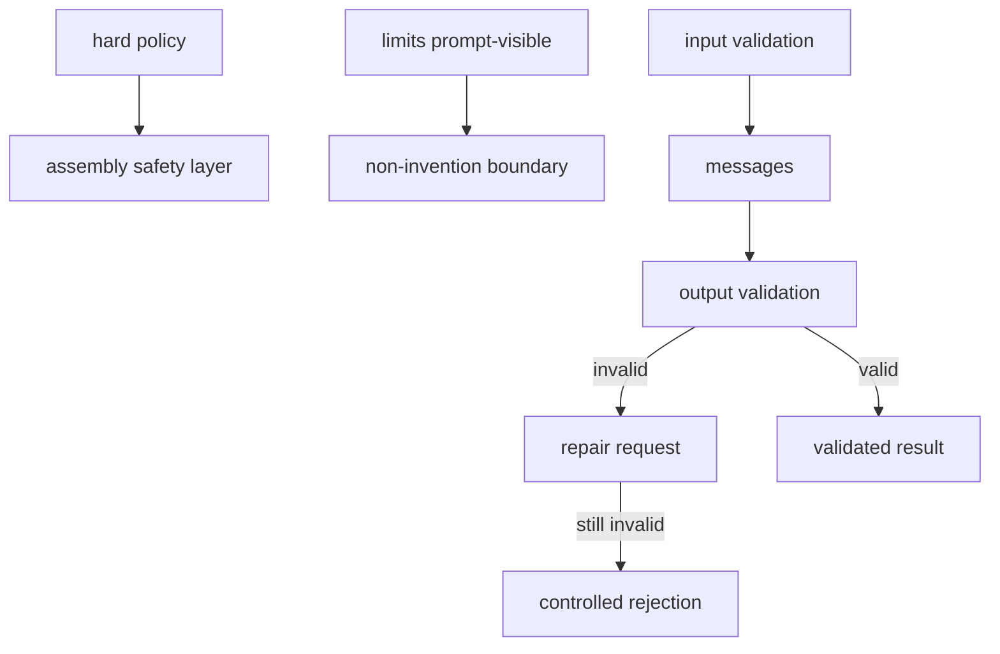
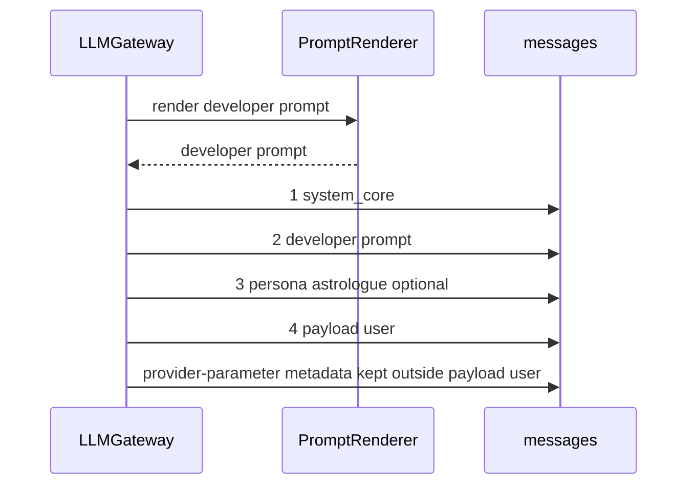
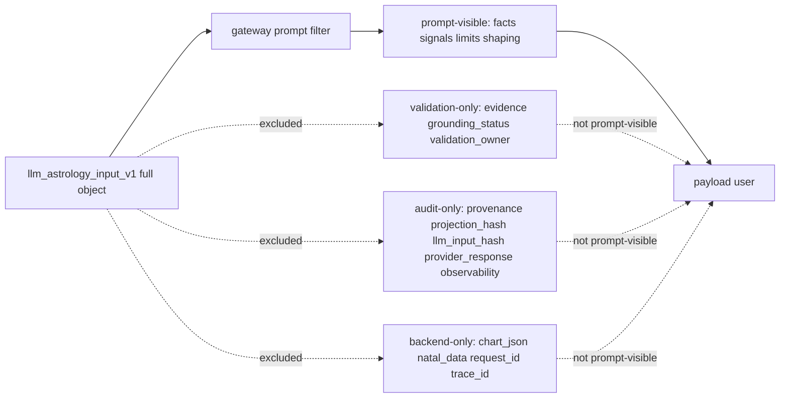
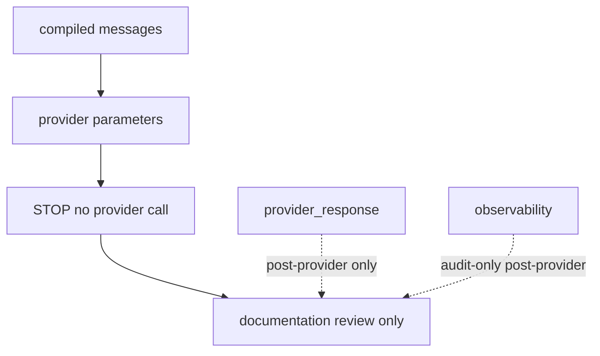

<!-- Commentaire global: ce document ajoute les diagrammes Mermaid du flux de construction des prompts natals sans changer le runtime. -->

# Graphiques Mermaid de construction des prompts de theme astral natal

Ce document est une annexe graphique de `_condamad/docs/prompt-generation-cartography/natal-prompt-construction-by-plan.md`. Il couvre les plans `free`, `basic` et `premium` pour le flux natal moderne fonde sur `llm_astrology_input_v1`.

Aucun appel provider LLM reel n'est represente ou effectue par ces diagrammes. La frontiere s'arrete au payload gateway-owned `messages` et aux provider parameters documentes comme `provider-parameter`.

Sources principales: `_condamad/docs/prompt-generation-cartography/prompt-generation-current-implementation.md`, `_condamad/docs/prompt-generation-cartography/natal-prompt-construction-by-plan.md`, `_condamad/audits/prompt-generation-cartography/2026-05-27-1822/03-runtime-gateway-handoff-audit.md`, `_condamad/audits/prompt-generation-cartography/2026-05-27-1835/04-natal-astrology-input-audit.md`, `backend/app/domain/llm/runtime/gateway.py`, `backend/app/domain/llm/configuration/assembly_resolver.py`, `backend/app/domain/llm/prompting/prompt_renderer.py`, `backend/app/domain/astrology/interpretation/llm_astrology_input_v1.py`.

## Comment lire les diagrammes

- Les labels Mermaid restent ASCII pour faciliter le rendu.
- `prompt-visible` signifie inclus dans `system_core`, `developer prompt`, `persona astrologue` ou `payload user`.
- `backend-only`, `validation-only`, `audit-only` et `provider-parameter` indiquent une donnee hors payload prompt-visible.
- Les plans partagent les calculs backend; ils different par selection prompt-visible, profondeur editoriale, sections et budget.
- Les blocs `evidence`, `provenance`, `projection_hash`, `llm_input_hash`, `provider_response`, `chart_json`, `natal_data` et `observability` ne sont pas des inputs prompt-visible du flux natal moderne.

## Pipeline global theme astral

Legende: le pipeline relie `birth data`, input natal, assembly et `messages`; le diagramme s'arrete avant tout appel provider.

## Construction des donnees injectees

Legende: seuls `facts`, `signals`, `limits` et `shaping` forment le materiau prompt-visible; `evidence` et `provenance` restent hors prompt.

## Differenciation par plan

Legende: `free`, `basic` et `premium` reutilisent les calculs; la difference porte sur le shaping, la profondeur editoriale et le budget.

## Introduction astrologue/persona

Legende: la persona est dessinee separement du `developer prompt`; les owners cites sont `assembly_resolver.py` et `gateway.py`.

## Securite et non-invention

Legende: hard policy, non-invention, validation, repair et rejection sont des couches distinctes; elles ne fusionnent pas en un prompt unique.

## Messages finaux provider

Legende: l'ordre structure est `system_core`, `developer prompt`, persona optionnelle, puis `payload user`; les provider parameters restent hors payload user.

## Frontiere prompt-visible vs backend-only

Legende: `chart_json`, `natal_data`, `projection_hash`, `llm_input_hash`, `provider_response` et `observability` restent hors `payload user`.

## Exclusions et no-call boundary

Legende: le document montre la limite avant provider; `provider_response` et `observability` sont post-provider ou audit-only, pas des entrees du prompt.

## Verification notes

- `diagram`: les sections ci-dessus couvrent `Pipeline global theme astral`, `Construction des donnees injectees`, `Differenciation par plan`, `Introduction astrologue/persona`, `Securite et non-invention`, `Messages finaux provider`, `Frontiere prompt-visible vs backend-only` et `Exclusions et no-call boundary`.
- `plan`: les plans `free`, `basic` et `premium` sont explicites dans le diagramme de differenciation.
- `visibility`: les termes `prompt-visible`, `backend-only`, `validation-only`, `audit-only` et `provider-parameter` sont declares et utilises.
- `source`: les chemins sources sont cites en tete de document; les textes exacts de prompt restent a extraire depuis la configuration runtime.
- `legend`: chaque bloc Mermaid a une legende courte sous le diagramme.
