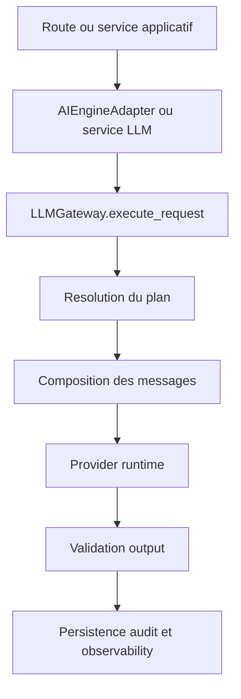
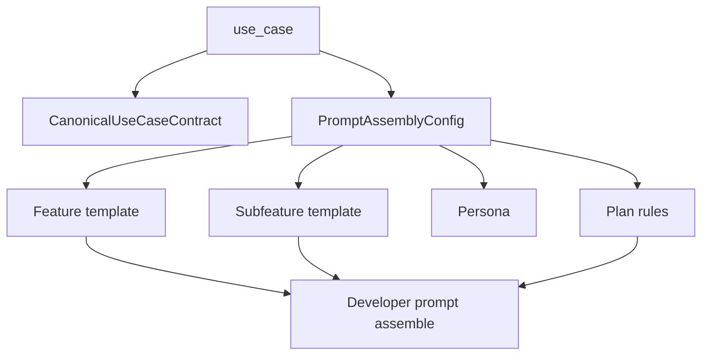
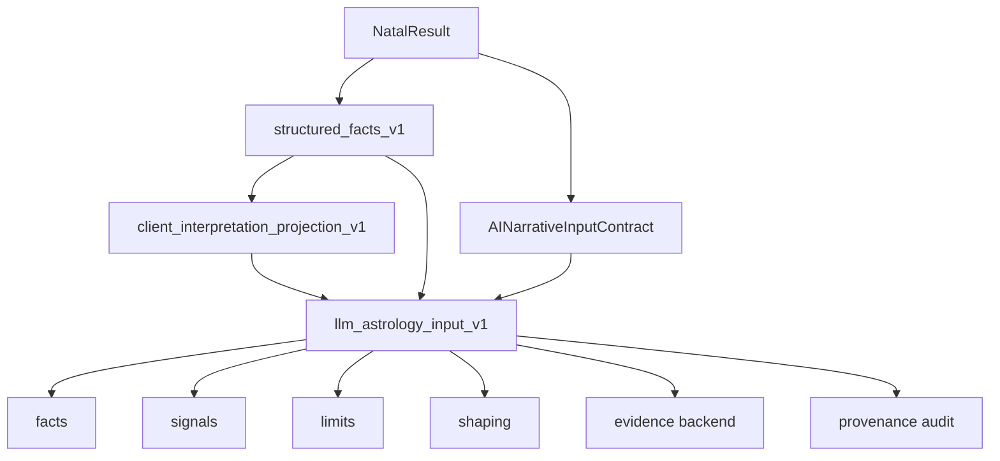
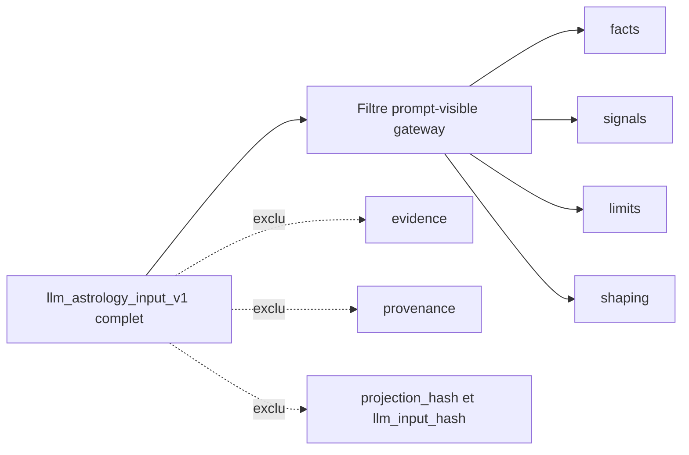
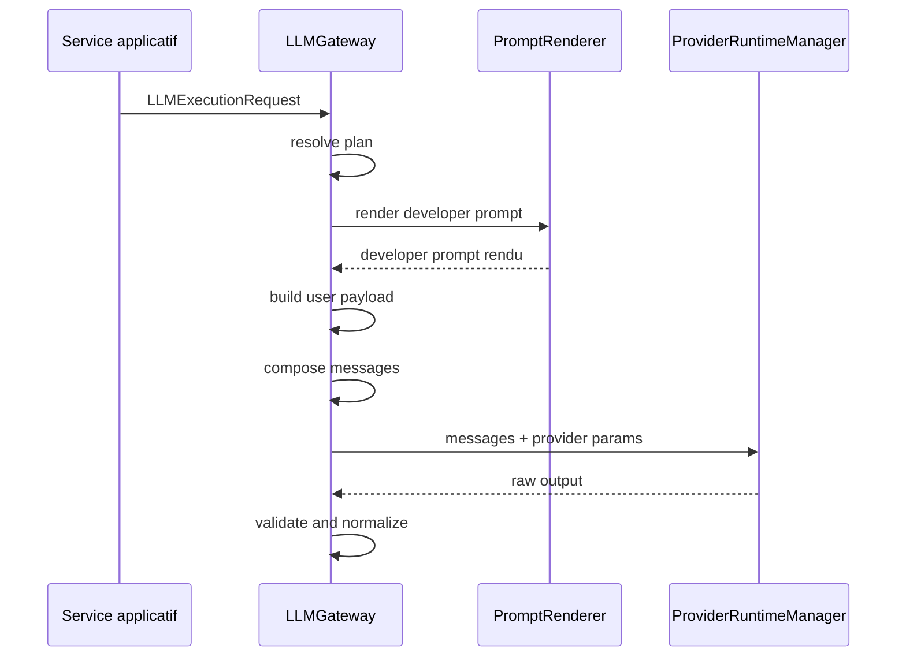
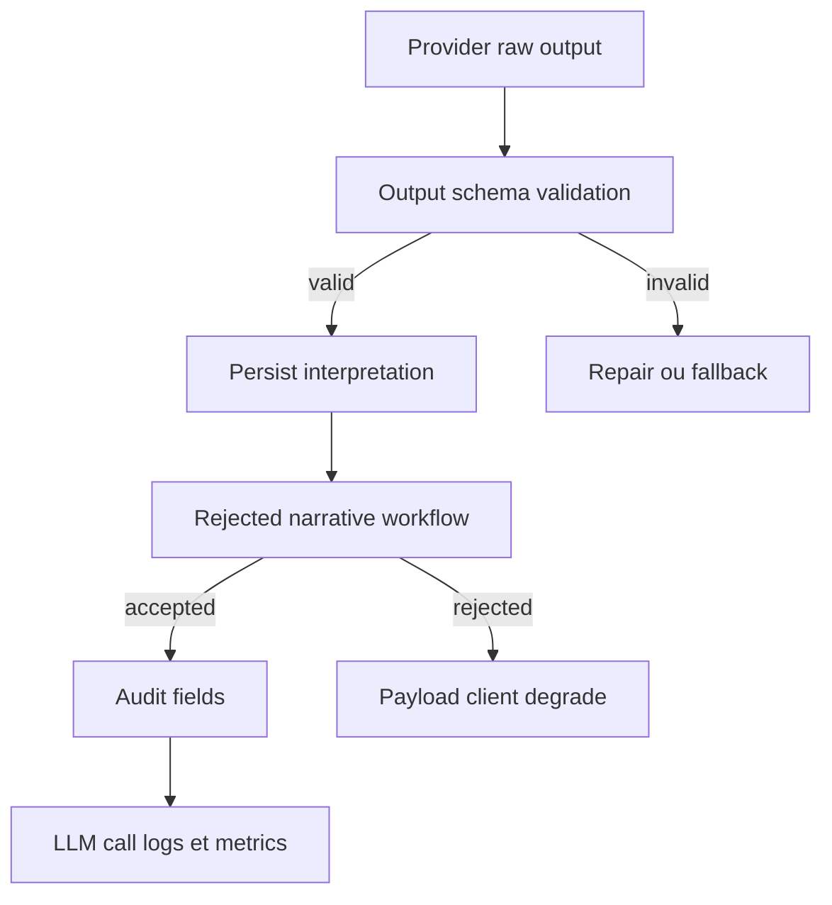

<!-- Commentaire global: documentation finale CS-350 de la cartographie actuelle de generation des prompts LLM. -->

# Prompt Generation Current Implementation

## Executive summary

Cette cartographie documente l'implementation actuelle de generation des prompts LLM a partir des audits CS-343 a CS-347, de l'architecture CS-348, du rapport CS-349 et des sources backend inspectees. Le flux nominal moderne pour le natal part d'un use case canonique, resout une assembly, rend le developer prompt, construit `llm_astrology_input_v1`, filtre les blocs prompt-visible, compose les messages provider, valide la sortie, puis persiste les ancres d'audit et d'observability.

Les donnees prompt-visible sont limitees aux blocs prouves comme envoyables au provider. Les donnees backend-only, validation-only et audit-only restent hors prompt: `evidence`, `provenance`, `projection_hash`, `llm_input_hash`, reponses provider, audit metadata et observability.

Sources principales: `_condamad/audits/prompt-generation-cartography/2026-05-27-1800/01-surface-inventory-audit.md`, `_condamad/audits/prompt-generation-cartography/2026-05-27-1809/02-configuration-assembly-placeholder-audit.md`, `_condamad/audits/prompt-generation-cartography/2026-05-27-1822/03-runtime-gateway-handoff-audit.md`, `_condamad/audits/prompt-generation-cartography/2026-05-27-1835/04-natal-astrology-input-audit.md`, `_condamad/audits/prompt-generation-cartography/2026-05-27-1847/05-output-validation-persistence-audit.md`, `_condamad/architecture/prompt-generation-cartography/2026-05-27-0000/architecture-prompt-generation-llm.md`, `_condamad/reports/prompt-generation-cartography/2026-05-27-0000/report-prompt-generation-cartography.md`.

## Scope et non-goals

Scope:

- documenter le runtime LLM actuel sans changer le code;
- cartographier les owners de configuration, rendu, input natal, provider handoff, validation, audit et observability;
- exposer les chemins nominaux et non nominaux avec Mermaid;
- garder visibles les blockers connus: output schema ownership split et semantic grounding borne.

Non-goals:

- pas de modification de `backend/app/**`, `backend/tests/**`, `frontend/src/**` ou migrations;
- pas de reecriture de prompt, schema, provider ou comportement de fallback;
- pas d'appel provider reel;
- pas de correction des gaps CS-343 a CS-349.

## Vue d'ensemble de la chaine

Le chemin nominal observe est:

1. une route ou un service applicatif choisit un use case;
2. `backend/app/domain/llm/configuration/canonical_use_case_registry.py` decrit le contrat canonique;
3. `backend/app/domain/llm/configuration/assembly_resolver.py` resout l'assembly et `assemble_developer_prompt`;
4. `backend/app/domain/llm/prompting/prompt_renderer.py` rend les placeholders;
5. `backend/app/services/llm_generation/natal/interpretation_service.py` construit l'input natal moderne;
6. `backend/app/domain/llm/runtime/gateway.py` filtre, compose et transmet les `messages`;
7. `backend/app/domain/llm/runtime/output_validator.py` valide la sortie;
8. les services de persistence et d'observability stockent les ancres backend-only.



## Glossaire

`use case`: cle fonctionnelle qui selectionne contrat, assembly, schema et famille de placeholders.

`assembly`: configuration runtime de blocs de prompt, persona, plan rules, budget et schema.

`developer prompt`: texte assemble par `assemble_developer_prompt`, puis rendu par `PromptRenderer`.

`prompt-visible`: donnees autorisees dans le payload provider.

`backend-only`: donnees reservees au backend, incluant runtime-only, validation-only et audit-only.

`llm_astrology_input_v1`: contrat natal moderne produit par `LLMAstrologyInputV1Builder`.

`observability`: logs, metadata, replay snapshot et compteurs servant a investiguer, pas a prouver la justesse semantique.

## Carte des owners de code

| Responsabilite | Owner | Symboles cites | Frontiere |
|---|---|---|---|
| Use cases canoniques | `backend/app/domain/llm/configuration/canonical_use_case_registry.py` | `CanonicalUseCaseContract`, `CANONICAL_USE_CASE_CONTRACTS`, `NATAL_LLM_ASTROLOGY_INPUT_SCHEMA` | runtime-only config |
| Resolution assembly | `backend/app/domain/llm/configuration/assembly_resolver.py` | `resolve_assembly`, `assemble_developer_prompt` | prompt-visible developer prompt |
| Rendu placeholders | `backend/app/domain/llm/prompting/prompt_renderer.py` | `PromptRenderer.render`, `extract_placeholders` | prompt-visible apres validation |
| Input natal riche | `backend/app/domain/astrology/interpretation/llm_astrology_input_v1.py` | `LLMAstrologyInputV1Builder`, `build_llm_input_hash_material` | prompt-visible + backend-only |
| Orchestration natale | `backend/app/services/llm_generation/natal/interpretation_service.py` | `_build_llm_astrology_input_v1`, `_apply_narrative_answer_audit` | runtime-only + audit-only |
| Gateway provider | `backend/app/domain/llm/runtime/gateway.py` | `LLMGateway`, `compose_structured_messages`, `compose_chat_messages`, `execute_request` | provider handoff |

## Use case et contrats canoniques

`canonical_use_case_registry.py` declare les contrats canoniques, dont les use cases modernes qui exigent `llm_astrology_input_v1` dans `NATAL_LLM_ASTROLOGY_INPUT_SCHEMA`. CS-344 classe ces contrats comme entree de configuration, pas comme unique owner final des schemas de sortie. CS-348 garde le blocker: l'output schema ownership reste partage entre contrats canoniques, assembly rows, fallback catalog, bootstrap schemas et tests.



## Resolution d'assembly et developer prompt

Le flux nominal CS-344 est `AssemblyRegistry.get_active_config_sync` -> `resolve_assembly` -> `assemble_developer_prompt` -> `PromptRenderer.render` -> schema resolution dans le gateway. Les seeds sous `backend/app/ops/llm/bootstrap/**` sont des entrees de provisioning et ne doivent pas etre documentees comme runtime truth.

Les chemins de fallback existent mais sont non nominaux: `_resolve_fallback_use_case_config`, `catalog.build_fallback_use_case_config`, catalog output schema et bootstrap no-assembly fallback hors production. Ils ne remplacent pas l'assembly nominale.

## Gouvernance des placeholders

`PromptRenderer` extrait et rend les placeholders declares par famille dans la gouvernance LLM. Pour le natal moderne, `llm_astrology_input_v1` est le carrier attendu; les carriers legacy `chart_json` et `natal_data` ne sont pas autorises comme inputs prompt-visible du flux moderne. Les placeholders optionnels peuvent avoir un fallback explicite, mais les placeholders requis doivent etre fournis ou refuser le rendu.

Sources: CS-344 placeholder family matrix, `backend/app/domain/llm/prompting/prompt_renderer.py`, `backend/app/domain/llm/configuration/assembly_resolver.py`.

## Construction de `llm_astrology_input_v1`

CS-346 prouve la chaine:

`NatalInterpretationService` -> `StructuredFactsV1Builder` -> `AINarrativeInputBuilder` -> `ClientInterpretationProjectionV1Builder` -> `LLMAstrologyInputV1Builder` -> `AIEngineAdapter.generate_natal_interpretation` -> projection prompt-visible du `LLMGateway`.



## Projection prompt-visible vs backend-only

La frontiere est explicite:

- prompt-visible: `facts`, `signals`, `limits`, `shaping`;
- backend-only runtime: `request_id`, `trace_id`, profils et metadata d'execution;
- validation-only: `evidence`, `grounding_status`, `validation_owner`, `evidence_refs`;
- audit-only: `provenance`, `projection_hash`, `llm_input_hash`, `provider_response`, `persisted_answer`, observability metadata.

`backend/app/domain/llm/runtime/gateway.py` contient le filtrage avant provider, et `backend/app/domain/astrology/interpretation/llm_astrology_input_v1.py` contient les roles et le hash prompt-visible.



## Composition des messages provider

CS-345 identifie `messages` comme dernier payload gateway-owned avant provider. `LLMGateway._call_provider` transmet `messages`, modele, famille, tokens, `response_format`, `request_id`, `trace_id`, `use_case`, `reasoning_effort` et `verbosity` au `ProviderRuntimeManager`.



## Modes `structured` et `chat`

`compose_structured_messages` produit: system core, developer prompt, persona optionnelle, puis user payload. Il n'inclut pas l'historique de chat.

`compose_chat_messages` produit: system core, developer prompt, persona optionnelle, historique valide, puis user payload ou message de fallback locale. Les items d'historique malformes sont ignores avec log, sans devenir prompt contract nominal.

Sources: CS-345 structured/chat message shape et `backend/app/domain/llm/runtime/gateway.py`.

## Provider parameters et output schema

Les parametres provider sont runtime/provider-only: modele, temperature, tokens, `response_format`, reasoning effort, verbosity, request/trace/use case. Ils influencent l'appel mais ne sont pas des champs prompt-visible du payload utilisateur.

Le schema de sortie est valide apres provider par `validate_output`. Le blocker CS-344/CS-348 demeure: choisir un owner nominal unique pour l'output schema avant d'en faire un contrat produit stable.

## Validation, repair, fallback et rejet

CS-347 separe:

- validation d'entree: bloque avant messages;
- validation de sortie: parse JSON, JSON Schema, normalisation et sanitation;
- repair: nouveau prompt de repair apres output invalide;
- fallback: non nominal, teste ou tolere selon le cas, jamais preuve de chemin principal;
- rejet: `RejectedNarrativeAnswerOutcome` et payload client degrade quand les preuves sont partielles, invalides ou non fondees.



## Persistence audit et observability

`backend/app/services/llm_generation/natal/interpretation_service.py` enrichit la persistence avec `prompt_version`, `prompt_ref`, `projection_hash`, `llm_input_hash`, `evidence_refs` et `grounding_status`. Ces champs sont backend-only et audit-only. `llm_call_logs`, replay snapshots et admin audit contracts soutiennent l'investigation et la tracabilite, pas une preuve de justesse semantique complete.

## Seeds/bootstrap et chemins non nominaux

CS-344 classe `backend/app/ops/llm/bootstrap/**` comme provisioning. Les chemins `catalog.py`, fallback config, provider fallback, test fallback et bootstrap no-assembly fallback sont separes du nominal. Les documents ne doivent pas promouvoir ces chemins en runtime truth.

Les carriers legacy `chart_json` et `natal_data` peuvent rester dans des contextes historiques, de tests, d'admin sample ou non modernes; ils sont exclus du prompt-visible moderne lorsque `llm_astrology_input_v1` est present.

## Tests et guardrails

Tests et gardes cites par les sources:

- `backend/tests/architecture/test_llm_astrology_input_payload_boundaries.py` garde les exclusions audit-only et validation-only;
- `backend/tests/llm_orchestration/test_llm_astrology_input_boundaries.py` garde le handoff provider local;
- `backend/tests/unit/domain/astrology/test_llm_astrology_input_v1.py` garde la forme, les owners et les blocs disjoints;
- `backend/tests/unit/domain/astrology/test_llm_astrology_input_hash.py` garde le hash prompt-visible;
- `backend/tests/unit/domain/astrology/test_llm_astrology_input_evidence.py` garde les evidence refs;
- `backend/tests/integration/test_llm_legacy_extinction.py` garde l'extinction des carriers legacy avec `--long`;
- `_condamad/stories/regression-guardrails.md` contient notamment RG-002 pour ne pas deplacer la logique metier dans les routeurs API v1 et RG-042 pour la gouvernance des docs LLM source-of-truth.

Validation documentaire CS-350: scans `rg` sur Mermaid, symbols LLM, prompt-visible/backend-only, chemins nominaux et non nominaux.

## Risques residuels et open questions

Risques residuels:

- output schema ownership split: une decision produit/architecture est requise avant convergence;
- semantic grounding borne: evidence refs et policy checks ne sont pas un verificateur semantique complet;
- observability et replay sont audit-only, pas preuve de correction;
- certains tests legacy longs exigent `pytest --long`;
- exact guardrail registry pour handoff provider/post-provider reste a decider dans une story dediee.

Open questions:

- quel composant devient l'owner nominal unique des output schemas?
- les fallback catalog schemas sont-ils supportes produit ou seulement non nominaux toleres?
- faut-il promouvoir les long guards dans la validation CI obligatoire?

## How to verify

Executer depuis la racine du repo:

```powershell
rg -n "```mermaid|llm_astrology_input_v1|LLMGateway|PromptRenderer|assemble_developer_prompt|prompt-visible|backend-only" _condamad/docs/prompt-generation-cartography
rg -n "nominal|fallback|repair|rejet|degrade|guardrails|How to verify" _condamad/docs/prompt-generation-cartography
rg -n "prompt-generation-current-implementation" _condamad/docs/prompt-generation-cartography
```

Pour les validations Python, activer d'abord le venv:

```powershell
.\.venv\Scripts\Activate.ps1
python -B -c "from pathlib import Path; assert Path('_condamad/docs/prompt-generation-cartography/prompt-generation-current-implementation.md').exists()"
```

Cette documentation ne valide pas un appel provider reel. Elle valide la cartographie source-alignee du flux actuel.
