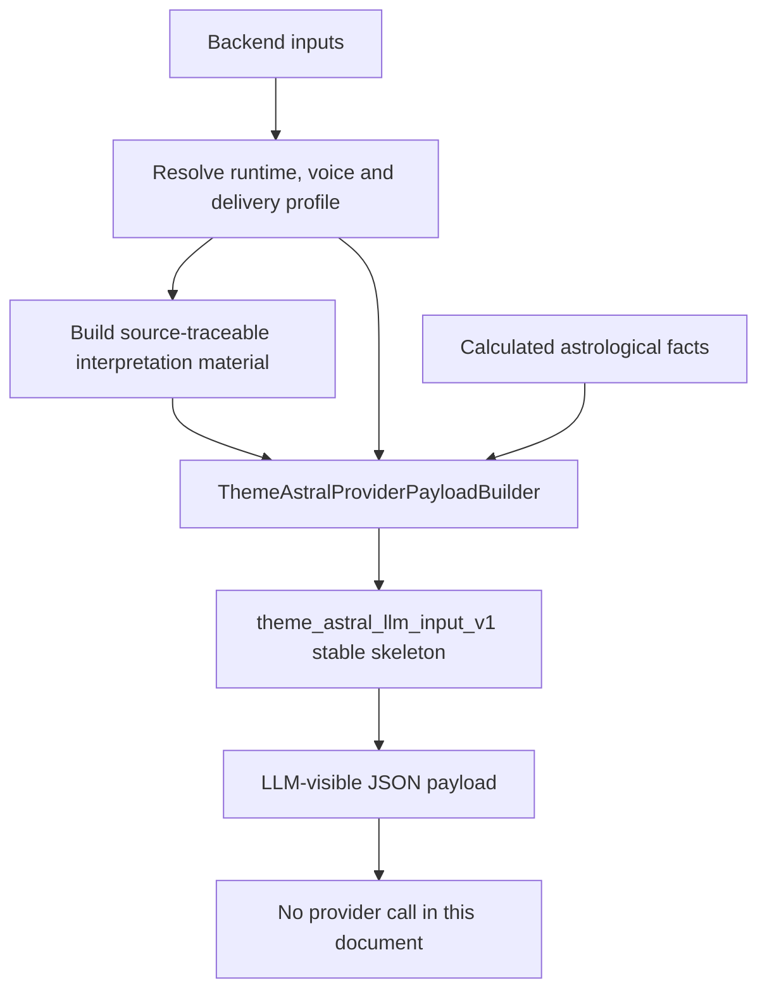
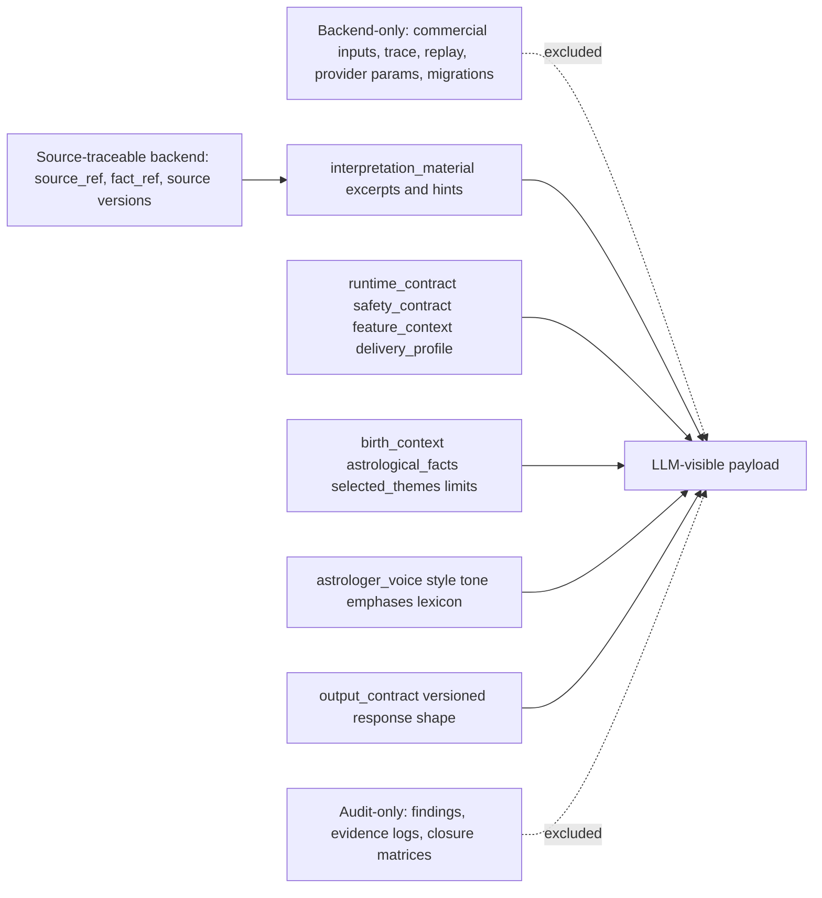

<!-- Commentaire global: ce document synthetise la structure JSON theme astral transmise au LLM sans modifier le runtime. -->

# Structure JSON theme astral LLM v1

## Resume executif

`theme_astral_llm_input_v1` est le contrat de reference pour la charge utile `theme_astral` transmise au LLM. Le squelette est stable pour tous les profils de livraison: les cles ne changent pas, seules les valeurs, quantites, budgets, selections et profondeurs varient via `delivery_profile`.

Le backend resout les entrees commerciales, l'assembly, la persona, les sources interpretatives et les contraintes de sortie avant le handoff. Le LLM recoit uniquement les blocs utiles a la redaction: `runtime_contract`, `safety_contract`, `astrologer_voice`, `feature_context`, `delivery_profile`, `input_data` et `output_contract`. Les preuves techniques, traces, hashes, IDs internes sensibles, migrations, replays, logs et details d'audit restent `backend-only` ou `audit-only`.

Sources principales: `_condamad/architecture/theme-astral-prompt-contract/2026-05-28-1217/archi-theme-astral-prompt-contract-v1.md`, `_condamad/audits/theme-astral-prompt-contract/2026-05-28-1152/`, `_condamad/audits/theme-astral-prompt-contract/2026-05-28-1203/`, `_condamad/audits/theme-astral-prompt-contract/2026-05-28-1409/`, `_condamad/audits/theme-astral-prompt-contract/2026-05-28-1418/`, `backend/app/domain/llm/runtime/theme_astral_provider_payload_builder.py`, `backend/app/domain/llm/configuration/theme_astral_contracts.py`, `backend/app/domain/astrology/interpretation/interpretation_material_builder.py`, `backend/app/domain/astrology/interpretation/interpretation_material_contracts.py`, `backend/tests/llm_orchestration/test_theme_astral_provider_payload_builder.py`, `backend/tests/integration/llm/test_theme_astral_prompt_contract_bigbang.py`.

Aucun appel provider LLM reel n'a ete effectue pour produire ce document.

## Principes de construction

1. Le backend construit un seul carrier provider-visible pour `theme_astral_llm_input_v1`; les instructions restent dans l'assembly et les donnees structurantes restent dans le payload utilisateur.
2. Les profils commerciaux ne sont pas des donnees de payload. Ils sont resolus cote backend en `delivery_profile`, puis seules les valeurs non commerciales de profondeur, budget, quantite, selection et longueur sont visibles.
3. Les textes d'interpretation proviennent de sources table-backed ou runtime-owned, restent source-tracables cote backend, et sont selectionnes par le builder de materiau interpretatif avant le handoff.
4. `astrologer_voice` influence seulement le style, le ton, les emphases et le lexique. Il ne modifie ni les faits astrologiques, ni les sources, ni les limites, ni le contrat de sortie.
5. Les absences doivent rester explicites par objets ou listes vides; la variation de profil ne supprime pas les cles du squelette canonique.
6. Les donnees d'audit, de replay, de debug, de migration et de persistence ne franchissent pas la frontiere LLM-visible.

## Frontiere backend-only / LLM-visible

| Zone | Exemples | Regle de visibilite | Source |
|---|---|---|---|
| LLM-visible | Squelette canonique, faits astrologiques normalises, materiau interpretatif source, limites, profil de livraison, contrat de sortie | Visible car necessaire a la redaction bornee | `theme_astral_provider_payload_builder.py`, tests de payload |
| Source-traceable backend | `source_ref`, `fact_ref`, versions de source, famille de source, raison de selection | Utilise pour prouver la provenance; seuls les extraits utiles ou hints passent dans `interpretation_material` | `interpretation_material_contracts.py`, `interpretation_material_builder.py` |
| Backend-only | Entrees commerciales, entitlements, IDs internes sensibles, execution profile, provider parameters, logs, replays, migrations | Resolu ou trace cote backend; non decrit comme matiere de payload | rapport CS-363, audits CS-362 et CS-368 |
| Audit-only | preuves de scan, matrices de fermeture, registres de finding, evidence logs | Sert a la verification CONDAMAD; ne nourrit pas la generation | audits `theme-astral-prompt-contract` |

## Squelette JSON canonique

```json
{
  "runtime_contract": {},
  "safety_contract": {},
  "astrologer_voice": {},
  "feature_context": {},
  "delivery_profile": {},
  "input_data": {
    "birth_context": {},
    "astrological_facts": {},
    "interpretation_material": {},
    "selected_themes": {},
    "limits": {}
  },
  "output_contract": {}
}
```

Le nom de contrat `theme_astral_llm_input_v1` identifie cette structure. `theme_astral_prompt_v1` reste le nom de famille prompt/provider associe, mais la documentation ne duplique pas le texte exact des prompts ni des payloads complets.

## Description des blocs

| Bloc JSON | Role | Source | Visibilite | Verification |
|---|---|---|---|---|
| `runtime_contract` | Identifie le contrat, sa version et les references prompt/assembly/schema/persona utilisables par le runtime sans exposer les details de trace. | CS-363, `theme_astral_contracts.py`, `theme_astral_provider_payload_builder.py` | LLM-visible pour le sous-ensemble contractuel; trace complete backend-only | `rg runtime_contract backend/app/domain/llm backend/tests` |
| `safety_contract` | Porte les regles de non-invention, de source obligatoire, de limites et de prudence editoriale. | CS-363, `_safety_contract` dans le builder, tests de payload | LLM-visible | `rg safety_contract backend/app/domain/llm backend/tests` |
| `astrologer_voice` | Definit style, ton, emphases, lexique et preferences de formulation. | CS-364, CS-366, `theme_astral_contracts.py`, persona owner | LLM-visible, style-only | `rg astrologer_voice backend/app/domain/llm backend/tests` |
| `feature_context` | Donne la feature, le contexte d'usage, la locale et les informations non commerciales utiles au rendu. | CS-363, CS-366, `_feature_context` | LLM-visible | `rg feature_context backend/app/domain/llm backend/tests` |
| `delivery_profile` | Decrit profondeur, budgets, groupes autorises, quantites, sections et longueur attendue apres resolution backend. | CS-363, CS-364, CS-366, `resolve_theme_astral_provider_delivery_profile` | LLM-visible, derive non commercial | `rg delivery_profile backend/app/domain/llm backend/tests` |
| `input_data.birth_context` | Fournit le contexte de naissance normalise necessaire a la redaction. | CS-366, `ChartInterpretationInputRuntimeData`, `_birth_context` | LLM-visible | `rg birth_context backend/app/domain/llm backend/tests` |
| `input_data.astrological_facts` | Transporte les faits calcules, filtres et stabilises issus du moteur astrologique. | CS-366, `_astrological_facts`, tests de payload | LLM-visible | `rg astrological_facts backend/app/domain/llm backend/tests` |
| `input_data.interpretation_material` | Fournit les textes, hints ou signaux interpretatifs source-attribues depuis les tables et owners runtime. | CS-365, CS-366, `InterpretationMaterialBuilder`, contrats de materiau | LLM-visible avec provenance source-traceable backend | `rg interpretation_material backend/app/domain backend/tests` |
| `input_data.selected_themes` | Liste les themes retenus par la feature et le profil de livraison pour guider la structure de reponse. | CS-366, `_selected_themes`, tests de payload | LLM-visible | `rg selected_themes backend/app/domain/llm backend/tests` |
| `input_data.limits` | Expose les donnees manquantes, incertitudes, sections indisponibles et limites de generation. | CS-363, CS-366, `_limits` dans le builder | LLM-visible | `rg limits backend/app/domain/llm backend/tests` |
| `output_contract` | Fixe la version de reponse, les sections attendues, les bornes de longueur et les obligations de schema. | CS-363, CS-364, CS-366, `THEME_ASTRAL_RESPONSE_CONTRACT_ID`, `_output_contract` | LLM-visible | `rg output_contract backend/app/domain/llm backend/tests` |

## Variations par delivery profile

`delivery_profile` est resolu par la logique backend avant toute construction de payload provider. La resolution part des entrees produit et runtime, mais le payload ne contient que des valeurs non commerciales: `depth`, budgets de faits, budgets de materiau, selection de sections, politiques de longueur, contraintes de sortie et niveau de detail attendu.

Le jeu canonique persiste en DB et transmis au provider est `essential`, `expanded` et `complete`. Les anciennes profondeurs de seed ne constituent pas des valeurs runtime actives.

Les variations autorisees sont:

- densite des faits astrologiques transmis;
- nombre de sources interpretatives selectionnees;
- nombre maximal de themes ou sections;
- budget de sortie et longueur cible;
- profondeur de conseil et granularite redactionnelle;
- exigences de structure dans `output_contract`.

Les variations interdites sont:

- changer les cles du squelette canonique;
- exposer les etiquettes commerciales comme donnees de payload;
- laisser `astrologer_voice` modifier les faits;
- reconstruire `interpretation_material` dans le prompt au lieu de reutiliser le builder source-attribue;
- promouvoir des traces backend ou audits en contenu visible.

## Contrat de retour demande au LLM

`output_contract` demande une reponse versionnee et explicite. La profondeur peut varier par `delivery_profile`, mais le schema reste declare: identifiant de contrat de reponse, version, sections attendues, nombre maximal de sections, style d'evidence autorise, bornes de longueur et compatibilite.

Le LLM doit rediger a partir de `input_data` et respecter `safety_contract`. Il ne doit pas inventer de source, transformer une limite en certitude, ni modifier les faits astrologiques. Les obligations de validation, persistence, replay et audit appartiennent au backend.

## Diagrammes Mermaid

### Diagramme 1 - Construction du JSON



Source: CS-363 architecture, CS-365 material builder, CS-366 provider payload builder, CS-367 bigbang handoff tests.

### Diagramme 2 - Frontiere backend-only / LLM-visible



Source: audits CS-361/CS-362/CS-368/CS-369 and backend payload boundary tests.

## Checklist de validation

- Le document existe sous `_condamad/docs/prompt-generation-cartography/theme-astral-llm-json-structure-v1.md`.
- Les dix sections attendues sont presentes.
- Le squelette canonique contient `runtime_contract`, `safety_contract`, `astrologer_voice`, `feature_context`, `delivery_profile`, `input_data.birth_context`, `input_data.astrological_facts`, `input_data.interpretation_material`, `input_data.selected_themes`, `input_data.limits` et `output_contract`.
- Chaque bloc de la table a un role, une source, une visibilite et une verification.
- `delivery_profile` est documente comme resolution backend, sans etiquettes commerciales LLM-visibles.
- Les textes d'interpretation sont table-backed et source-tracables cote backend.
- `astrologer_voice` est borne au style, ton, emphases et lexique, sans mutation des facts.
- Deux blocs Mermaid sont presents: construction du JSON et frontiere backend-only / LLM-visible.
- Les preuves techniques et audits restent hors payload.
- Aucun appel provider LLM reel n'a ete effectue.

## Liens vers les exemples complets CS-371

CS-371 est le owner des exemples complets par profil de livraison. Cette page ne produit pas ces payloads complets; elle fixe seulement la lecture du squelette, des blocs, des sources et des frontieres. Quand CS-371 sera implemente, les exemples devront pointer vers ce document pour rester alignes avec `theme_astral_llm_input_v1`.
