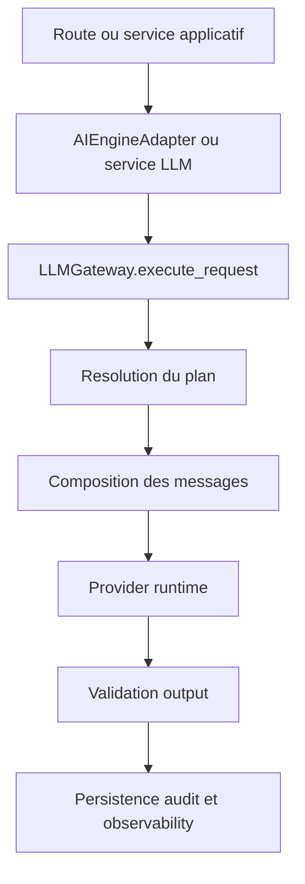
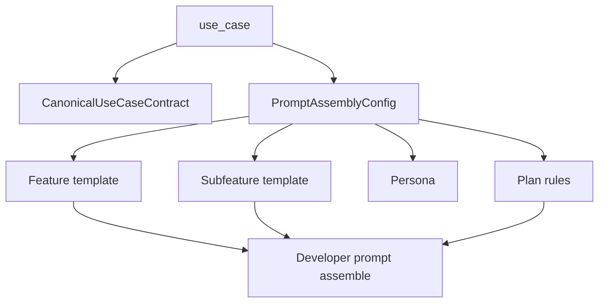
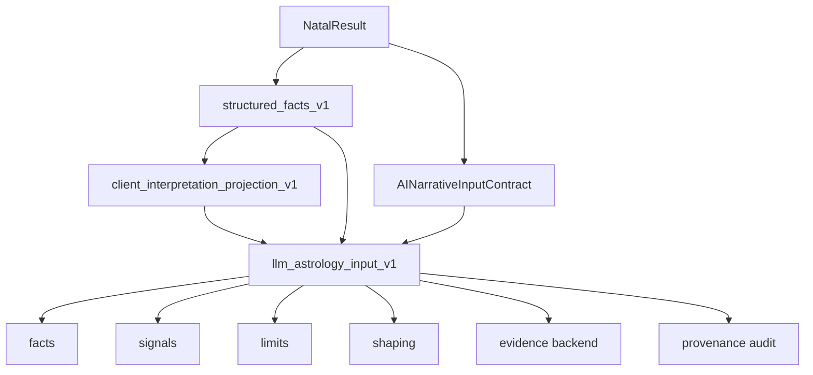
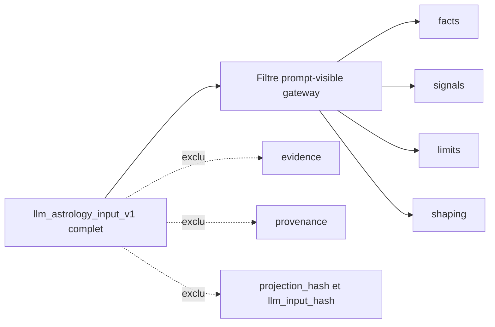
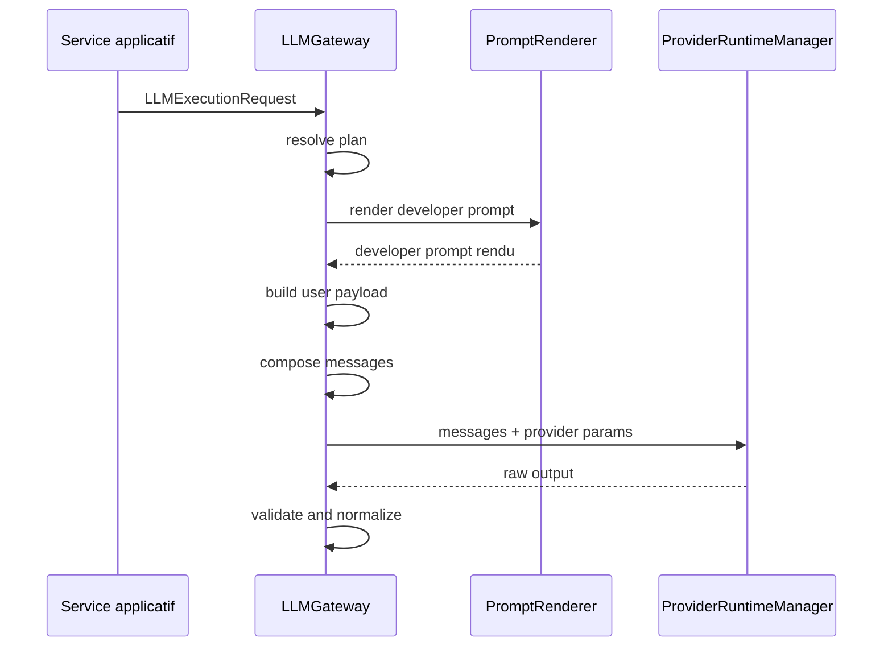
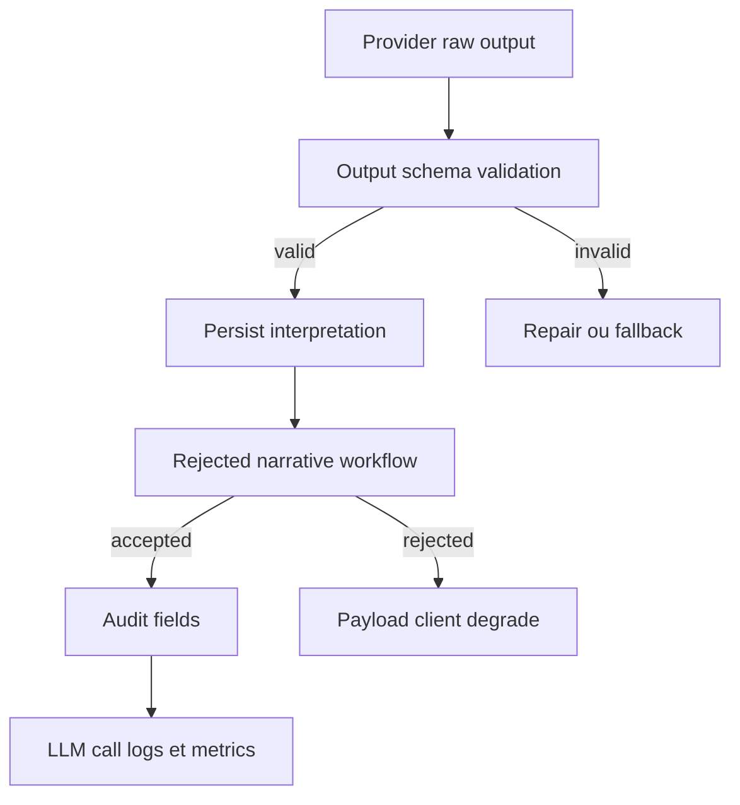

# CS-350 - Documentation Cartographie Generation Prompt LLM Mermaid

<!-- Commentaire global: ce brief cadre le document final detaille qui explique visuellement et textuellement l'implementation actuelle de generation des prompts. -->

## Resume

Produire le document final tres detaille de cartographie de l'implementation actuelle de generation des prompts LLM, avec schemas Mermaid integres.

Cette story est volontairement la derniere de la chaine: elle consomme les audits, l'architecture et le rapport pour ecrire une documentation exploitable par un nouvel agent ou un developpeur.

## Contexte

L'application possede plusieurs couches de generation de prompt:

- configuration canonique des use cases;
- resolution d'assembly;
- rendu des placeholders;
- construction de l'input astrologique riche;
- composition system/developer/persona/user;
- handoff provider;
- validation output;
- persistence audit et observability.

Les stories CS-343 a CS-349 doivent fournir l'evidence. Cette story transforme cette evidence en documentation finale.

## Objectif

Creer un document qui permet de comprendre sans relire tout le code:

- comment un use case LLM est choisi;
- comment le developer prompt est compose;
- comment les placeholders sont gouvernes;
- comment `llm_astrology_input_v1` est construit;
- quels blocs entrent ou n'entrent pas dans le prompt provider;
- comment les messages provider sont assembles;
- comment la sortie est validee, persistee et auditee;
- quelles gardes empechent la reintroduction de carriers legacy ou de donnees audit-only dans le prompt.

## Perimetre inclus

1. Lire les audits CS-343 a CS-347.
2. Lire l'architecture CS-348.
3. Lire le report CS-349 s'il existe.
4. Produire une documentation narrative detaillee.
5. Ajouter des schemas Mermaid maintenables.
6. Ajouter une section de glossaire des concepts.
7. Ajouter une section "chemins de code a lire en premier".
8. Ajouter une section "comment verifier la cartographie".

## Hors perimetre

- Modifier le code applicatif.
- Corriger les gaps identifies.
- Ajouter des tests.
- Reecrire les prompts.
- Faire un appel provider reel.

## Sources obligatoires

- `_condamad/audits/prompt-generation-cartography/**/01-surface-inventory-audit.md`
- `_condamad/audits/prompt-generation-cartography/**/02-configuration-assembly-placeholder-audit.md`
- `_condamad/audits/prompt-generation-cartography/**/03-runtime-gateway-handoff-audit.md`
- `_condamad/audits/prompt-generation-cartography/**/04-natal-astrology-input-audit.md`
- `_condamad/audits/prompt-generation-cartography/**/05-output-validation-persistence-audit.md`
- `_condamad/architecture/prompt-generation-cartography/**/architecture-prompt-generation-llm.md`
- `_condamad/reports/prompt-generation-cartography/**/report-prompt-generation-cartography.md`
- `backend/app/domain/llm/runtime/gateway.py`
- `backend/app/domain/llm/configuration/assembly_resolver.py`
- `backend/app/domain/llm/configuration/canonical_use_case_registry.py`
- `backend/app/domain/llm/prompting/prompt_renderer.py`
- `backend/app/domain/astrology/interpretation/llm_astrology_input_v1.py`
- `backend/app/services/llm_generation/natal/interpretation_service.py`

## Livrables attendus

Creer le document principal:

```text
_condamad/docs/prompt-generation-cartography/prompt-generation-current-implementation.md
```

Optionnellement, si le document devient trop long, creer un document supplementaire dedie aux schemas:

```text
_condamad/docs/prompt-generation-cartography/prompt-generation-mermaid-diagrams.md
```

## Structure obligatoire du document principal

1. Executive summary.
2. Scope et non-goals.
3. Vue d'ensemble de la chaine.
4. Glossaire.
5. Carte des owners de code.
6. Use case et contrats canoniques.
7. Resolution d'assembly et developer prompt.
8. Gouvernance des placeholders.
9. Construction de `llm_astrology_input_v1`.
10. Projection prompt-visible vs backend-only.
11. Composition des messages provider.
12. Modes `structured` et `chat`.
13. Provider parameters et output schema.
14. Validation, repair, fallback et rejet.
15. Persistence audit et observability.
16. Seeds/bootstrap et chemins non nominaux.
17. Tests et guardrails.
18. Risques residuels et open questions.
19. How to verify.

## Schemas Mermaid obligatoires

Le document doit inclure au moins les schemas suivants:

### 1. Vue globale



### 2. Resolution configuration



### 3. Construction de `llm_astrology_input_v1`



### 4. Projection prompt-visible



### 5. Composition provider



### 6. Validation et audit



## Criteres d'acceptation

1. Le document principal existe.
2. Il detaille l'implementation actuelle avec chemins de fichiers et symboles.
3. Les schemas Mermaid sont valides syntaxiquement et lisibles.
4. La frontiere prompt-visible vs backend-only est explicite.
5. Les chemins nominaux et fallbacks sont separes.
6. Les tests et guardrails sont cites avec leurs chemins.
7. Les limites et gaps sont marques sans inventer de fait non source.
8. Un developpeur peut suivre la construction d'un prompt natal moderne de bout en bout.

## Validation attendue

```powershell
rg -n "```mermaid|llm_astrology_input_v1|LLMGateway|PromptRenderer|assemble_developer_prompt|prompt-visible|backend-only" _condamad/docs/prompt-generation-cartography
rg -n "prompt-generation-current-implementation" _condamad/docs/prompt-generation-cartography
```

## Risques

Le risque principal est de produire un document trop narratif et pas assez traçable. Chaque section technique doit citer au moins un chemin de fichier, un symbole ou un artefact d'audit.

