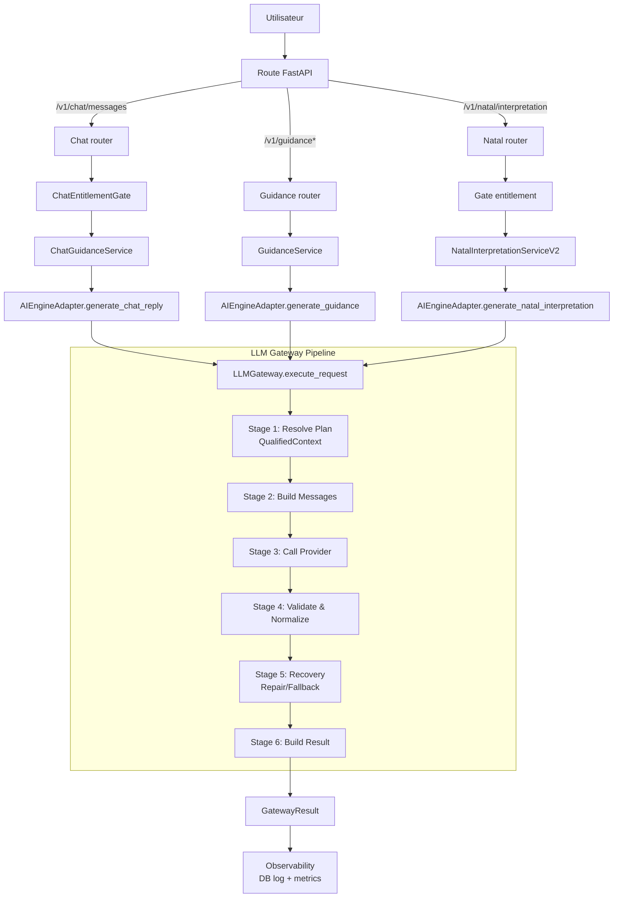
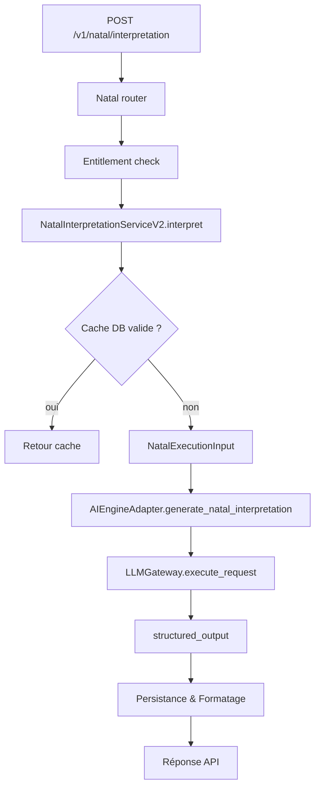
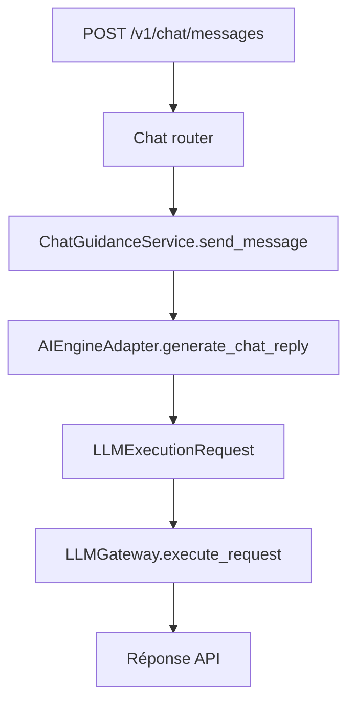
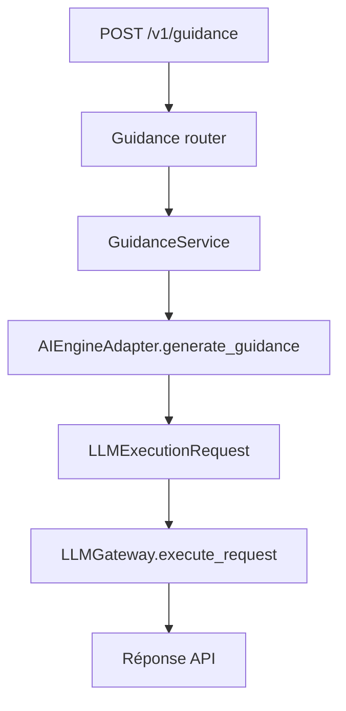

# Architecture des processus LLM

## Objectif

Ce document décrit le flux réel des appels LLM dans le backend, tel qu'il est implémenté aujourd'hui dans les parcours suivants :

- interprétation natale
- chat astrologique
- guidance quotidienne, hebdomadaire et contextuelle
- réparation automatique des sorties invalides

Il corrige une lecture trop linéaire du système : les routes HTTP, les services métier, l'adapter et le gateway ont des responsabilités distinctes.

## Principes structurants

- Le point d'orchestration central des appels LLM est `LLMGateway.execute_request()`.
- `chat`, `guidance` et `natal` passent tous par `AIEngineAdapter` (couche applicative canonique).
- Le gateway ne calcule pas la logique produit : il résout la config, compose les messages, appelle OpenAI, valide, répare et journalise.
- Le `repair` n'est pas un use case séparé : c'est une relance du même use case avec un prompt technique forcé.

## Contrats d'exécution canoniques

Depuis l'Epic 66, la plateforme migre vers un contrat d'exécution explicite et typé via `LLMExecutionRequest`. Ce contrat remplace les dictionnaires `user_input` et `context` par des modèles Pydantic structurés, garantissant l'absence de dépendances d'infrastructure (Session DB, etc.) dans le coeur de l'orchestration.

### Modèles principaux

- **`LLMExecutionRequest`** : Contrat racine transportant l'input utilisateur, le contexte, les flags opérationnels et les surcharges éventuelles.
- **`ExecutionUserInput`** : Entrées directes (use_case, locale, message, question, situation). Inclut `conversation_id` et `persona_id_override`.
- **`ExecutionContext`** : Données de support (historique typé `ExecutionMessage`, données natales, chart JSON). Inclut `extra_context` pour les extensions transitoires.
- **`ExecutionFlags`** : Drapeaux de pilotage (repair, skip common context, validation strict, visited use cases pour anti-boucle).
- **`ExecutionOverrides`** : Surcharges explicites de stratégie (interaction mode, question policy). Usage restreint aux migrations et tests.
- **`ExecutionMessage`** : Message d'historique typé (role, content, content_blocks pour GPT-5+).

### Contrats Métier Canoniques

Certains domaines utilisent des contrats d'entrée spécifiques pour simplifier l'interaction avec la couche applicative :

- **`NatalExecutionInput`** : Regroupe toutes les variables nécessaires à une interprétation (use case, niveau, données du thème, catalogue d'evidence, persona). Il est converti automatiquement en `LLMExecutionRequest` par l'adapter.

### Règle de migration legacy

La méthode `LLMGateway.execute()` est conservée comme **wrapper legacy**. Elle convertit systématiquement ses arguments dictionnaires en `LLMExecutionRequest` via `_legacy_dicts_to_request()` avant d'appeler le nouveau point d'entrée canonique `execute_request()`. 

Toute nouvelle logique de plateforme doit être implémentée exclusivement dans `execute_request()`.

## Pipeline d'Orchestration (`execute_request`)

Le flux d'exécution est structuré en **6 étapes explicites** pour garantir la séparation des responsabilités et faciliter le débogage :

1.  **Stage 1: Resolve Plan** (`_resolve_plan`) : Résolution de la configuration, du modèle, des prompts et du persona dans un objet `ResolvedExecutionPlan`. Qualification du contexte commun (`QualifiedContext`).
2.  **Stage 2: Build Messages** (`_build_messages`) : Composition des couches de messages (System, Developer, Persona, History, User).
3.  **Stage 3: Call Provider** (`_call_provider`) : Appel technique au client provider (OpenAI).
4.  **Stage 4: Validate & Normalize** (`_validate_and_normalize`) : Validation du format de sortie (JSON) et parsing via le pipeline de validation.
5.  **Stage 5: Recovery (Repair/Fallback)** (`_handle_repair_or_fallback`) : Gestion récursive des erreurs via réparation automatique ou basculement de use case.
6.  **Stage 6: Build Final Result** (`_build_result`) : Assemblage du `GatewayResult` final avec ses métadonnées de traçabilité enrichies.

## Pipeline de Validation de Sortie (`validate_output`)

Le traitement de la réponse brute du LLM est découpé en **4 étapes séquentielles** garantissant l'intégrité et la sécurité des données :

1.  **Parse JSON** (`parse_json`) : Conversion de la chaîne brute en dictionnaire. Gestion spécifique de la suppression des `disclaimers` en V3 (tag `v3_disclaimers_stripped`).
2.  **Schema Validation** (`validate_schema`) : Validation stricte contre le JSON Schema configuré. Catégorise les erreurs en `schema_error`.
3.  **Field Normalization** (`normalize_fields`) : Normalisation des alias d'evidence (ex: `SUN` → `PLANET_SUN_...`) pour réduire les faux positifs (tag `evidence_alias_normalized`).
4.  **Evidence Sanitization** (`sanitize_evidence`) : 
    - Détection d'hallucinations (comparaison au catalogue).
    - Vérification de la règle bidirectionnelle (présence dans le texte).
    - Filtrage sécurisé : suppression silencieuse des items hors catalogue (tag `evidence_filtered_non_catalog`).

La politique `strict=True` rend ces anomalies visibles via des warnings mais ne bloque pas la réponse, préservant la continuité du service tout en assurant une sortie conforme au catalogue.

## Qualification du Contexte (`QualifiedContext`)

Le socle commun de contexte est désormais qualifié avant l'injection dans le prompt pour mesurer la pertinence des données fournies au LLM.

### Niveaux de Qualité (`context_quality`)
- **`full`** : Tous les champs structurants et secondaires sont présents.
- **`partial`** : Au moins une source de données est manquante (ex: pas d'interprétation natale pré-existante) mais les données critiques (données natales brutes) sont disponibles.
- **`minimal`** : Les données critiques manquent (ex: pas de données natales ET pas d'interprétation), le LLM fonctionnera en mode dégradé.

### Provenance (`source`)
- **`db`** : Données extraites avec succès de la base.
- **`partial_db`** : Mix de données DB et de fallbacks.
- **`fallback`** : Échec de récupération des données métier, utilisation de valeurs par défaut uniquement.

## Télémétrie et Observabilité (`GatewayMeta`)

La plateforme expose désormais trois axes d'analyse orthogonaux dans les métadonnées de chaque réponse :

1.  **Axe 1 : Chemin d'Exécution** (`execution_path`) : Décrit le flux de contrôle (`nominal`, `repaired`, `fallback_use_case`, `test_fallback`).
2.  **Axe 2 : Qualité des Données** (`context_quality`) : Décrit la richesse du contexte injecté (`full`, `partial`, `minimal`).
3.  **Axe 3 : Transformations** (`normalizations_applied`) : Liste les normalisations effectuées sur la sortie (tags de validation).

Cette séparation permet de distinguer un incident technique (ex: repair) d'une dégradation fonctionnelle liée aux données utilisateur (ex: contexte partiel).

## Couche Applicative LLM (`AIEngineAdapter`)

Bien que conservant son nom legacy `AIEngineAdapter` (décision Option A, Epic 66), ce module fait office de **couche applicative canonique** pour les appels LLM.

### Rôle et Responsabilités
- **Construction du contrat** : transformer les entrées métier typées (historique de chat, paramètres de guidance, NatalExecutionInput) en une `LLMExecutionRequest`.
- **Exécution orchestrée** : appeler `LLMGateway.execute_request()`.
- **Mapping d'erreurs** : traduire les exceptions techniques de la plateforme en erreurs applicatives avec les codes HTTP corrects.

### Pattern pour nouveau Use Case
Pour ajouter un nouveau parcours LLM :
1. Créer une méthode `generate_xxx()` dans `AIEngineAdapter`.
2. Définir si besoin un contrat métier (ex: `XxxExecutionInput`) dans `models.py`.
3. Construire la `LLMExecutionRequest` (input, context, flags).
4. Appeler `gateway.execute_request(request, db)`.
5. Mapper les erreurs via `_handle_gateway_error()`.

## Vue d'ensemble

## Processus 1 : interprétation natale

## Processus 2 : chat astrologique

## Processus 3 : guidance

## Sources code principales

- `backend/app/api/v1/routers/natal_interpretation.py`
- `backend/app/services/natal_interpretation_service_v2.py`
- `backend/app/services/ai_engine_adapter.py`
- `backend/app/llm_orchestration/gateway.py`
- `backend/app/llm_orchestration/models.py`
- `backend/app/llm_orchestration/services/output_validator.py`
- `backend/app/prompts/common_context.py`
