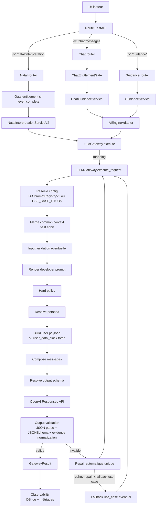
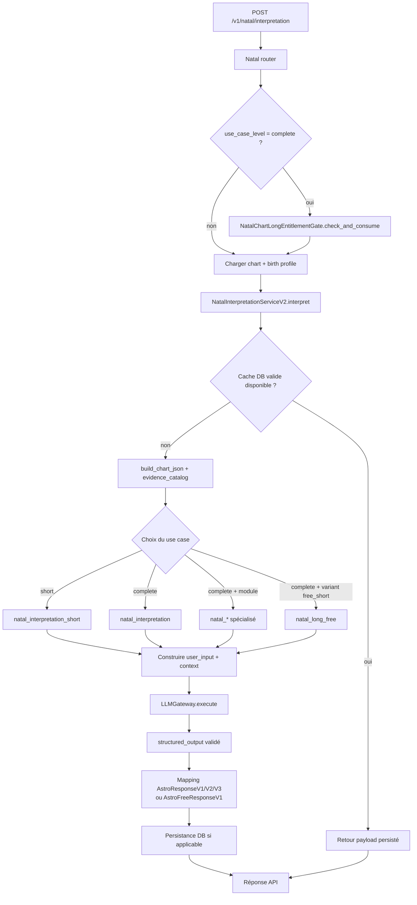
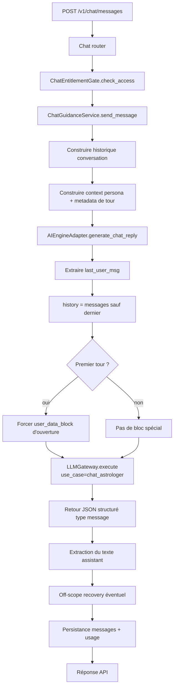
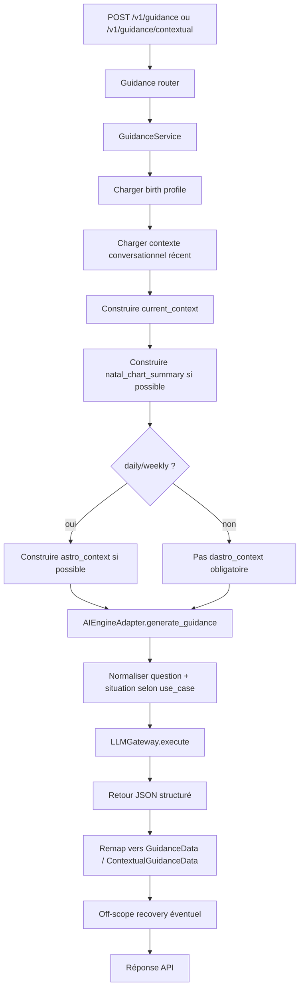
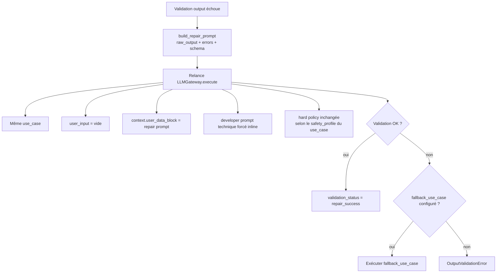

# Architecture des processus LLM

## Objectif

Ce document décrit le flux réel des appels LLM dans le backend, tel qu'il est implémenté aujourd'hui dans les parcours suivants :

- interprétation natale
- chat astrologique
- guidance quotidienne, hebdomadaire et contextuelle
- réparation automatique des sorties invalides

Il corrige une lecture trop linéaire du système : les routes HTTP, les services métier, l'adapter et le gateway ont des responsabilités distinctes.

## Principes structurants

- Le point d'orchestration central des appels LLM est `LLMGateway.execute()`.
- `chat` et `guidance` passent d'abord par des services métier, puis par `AIEngineAdapter`, avant d'atteindre le gateway.
- `natal` appelle directement `LLMGateway` depuis `NatalInterpretationServiceV2`.
- Le gateway ne calcule pas la logique produit : il résout la config, compose les messages, appelle OpenAI, valide, répare et journalise.
- Le `repair` n'est pas un use case séparé : c'est une relance du même use case avec un prompt technique forcé.

## Contrats d'exécution canoniques

Depuis l'Epic 66, la plateforme migre vers un contrat d'exécution explicite et typé via `LLMExecutionRequest`. Ce contrat remplace les dictionnaires `user_input` et `context` par des modèles Pydantic structurés, garantissant l'absence de dépendances d'infrastructure (Session DB, etc.) dans le coeur de l'orchestration.

### Modèles principaux

- **`LLMExecutionRequest`** : Contrat racine transportant l'input utilisateur, le contexte, les flags opérationnels et les surcharges éventuelles.
- **`ExecutionUserInput`** : Entrées directes (use_case, locale, message, question, situation). Inclut `conversation_id` et `persona_id_override`.
- **`ExecutionContext`** : Données de support (historique typé `ExecutionMessage`, données natales, chart JSON). Inclut `extra_context` pour les extensions transitoires.
- **`ExecutionFlags`** : Drapeaux de pilotage (repair, skip common context, validation strict, visited use cases pour anti-boucle).
- **`ExecutionOverrides`** : Surcharges explicites de stratégie (interaction mode, question policy). Usage restreint aux migrations et tests.
- **`ExecutionMessage`** : Message d'historique typé (role, content, content_blocks pour GPT-5+).

### Règle de migration legacy

La méthode `LLMGateway.execute()` est conservée comme **wrapper legacy**. Elle convertit systématiquement ses arguments dictionnaires en `LLMExecutionRequest` via `_legacy_dicts_to_request()` avant d'appeler le nouveau point d'entrée canonique `execute_request()`. 

Toute nouvelle logique de plateforme doit être implémentée exclusivement dans `execute_request()`.

## Couche Applicative LLM (`AIEngineAdapter`)

Bien que conservant son nom legacy `AIEngineAdapter` (décision Option A, Epic 66), ce module fait office de **couche applicative canonique** pour les appels LLM.

### Rôle et Responsabilités
- **Construction du contrat** : transformer les entrées métier typées (historique de chat, paramètres de guidance) en une `LLMExecutionRequest`.
- **Exécution orchestrée** : appeler `LLMGateway.execute_request()`.
- **Mapping d'erreurs** : traduire les exceptions techniques de la plateforme en erreurs applicatives avec les codes HTTP corrects.

### Pattern pour nouveau Use Case
Pour ajouter un nouveau parcours LLM (ex: Story 66.7 Natal) :
1. Créer une méthode `generate_xxx()` dans `AIEngineAdapter`.
2. Construire la `LLMExecutionRequest` (input, context, flags).
3. Appeler `gateway.execute_request(request, db)`.
4. Mapper les erreurs via `_handle_gateway_error()`.

## Vue d'ensemble

## Processus 1 : interprétation natale

### Notes

- Le cache DB est consulté avant l'appel LLM.
- Le cache est ignoré si la version de prompt persistée n'est plus la version active.
- `persona_id` est requis pour les interprétations complètes normales.
- Le variant `free_short` utilise le use case `natal_long_free` et un mapping de sortie spécifique.

## Processus 2 : chat astrologique

### Notes

- Le use case effectif est `chat_astrologer`.
- Au premier tour, l'adapter peut remplacer le payload utilisateur par un bloc d'ouverture enrichi.
- Le service métier gère ensuite la récupération hors-scope et la persistance des messages.

## Processus 3 : guidance

### Notes

- `guidance_daily` et `guidance_weekly` reconstruisent une question synthétique côté adapter.
- `guidance_contextual` reconstruit la question à partir de `objective`, `time_horizon` et `situation`.
- `astro_context` est ajouté quand sa construction réussit, surtout pour daily et weekly.

## Processus 4 : repair automatique

### Notes

- Le `repair` n'a pas son propre routeur ni son propre use case.
- Le gateway réutilise le même use case et force un developer prompt technique inline.
- Le `repair` est tenté une seule fois.

## Résolution du modèle

Ordre de résolution du modèle :

1. variable d'environnement granulaire `OPENAI_ENGINE_*`
2. variable legacy `LLM_MODEL_OVERRIDE_*`
3. modèle issu de la config DB ou du stub
4. `settings.openai_model_default`

Adaptations automatiques pour les modèles de raisonnement (`o1`, `o3`, `o4`, `gpt-5`) :

- `max_output_tokens` monté à au moins `16384`
- `timeout_seconds` monté à au moins `180`
- `reasoning_effort` forcé à `medium` si absent
- `temperature` non envoyée au provider

## Tableau des composants et responsabilités

| Composant | Couche | Responsabilités | Ne fait pas |
| --- | --- | --- | --- |
| `natal_interpretation.py` | Route FastAPI | Validation HTTP, récupération du `request_id`, mapping des erreurs, gate entitlement pour le complet | Ne compose pas les prompts |
| `chat.py` | Route FastAPI | Validation HTTP, auth, entitlement chat, mapping des réponses | Ne parle pas directement à OpenAI |
| `guidance.py` | Route FastAPI | Validation HTTP, auth, mapping d'erreurs guidance | Ne construit pas le contexte LLM |
| `NatalInterpretationServiceV2` | Service métier | Cache DB, choix du use case, préparation `chart_json`, `evidence_catalog`, appel gateway, mapping de schéma, persistance | Ne gère pas l'historique de chat |
| `ChatGuidanceService` | Service métier | Historique conversation, contexte persona, récupération hors-scope, persistance des messages, quotas et usage | Ne résout pas les prompts DB |
| `GuidanceService` | Service métier | Contexte conversationnel, résumé natal, `astro_context`, appel adapter, remapping des sorties guidance | Ne compose pas directement les messages provider |
| `AIEngineAdapter` | Adaptation applicative | Normalisation des payloads `chat` et `guidance`, création de blocs spéciaux, traduction d'erreurs gateway -> service | Ne décide pas des règles produit |
| `LLMGateway` | Orchestration LLM | Résolution config, merge common context, rendu prompt, hard policy, persona, composition messages, appel provider, validation, repair, fallback, observabilité | Ne connaît pas les endpoints HTTP |
| `PromptRegistryV2` | Infrastructure LLM | Lecture du prompt publié en DB, cache TTL, invalidation, publication, rollback | Ne rend pas le template |
| `PromptRenderer` | Service LLM | Interpolation des variables `{{...}}`, contrôle des placeholders requis | Ne choisit pas les variables métier |
| `compose_persona_block` | Service LLM | Conversion d'une persona DB en bloc injecté dans les messages | Ne décide pas si la persona est autorisée |
| `get_hard_policy` | Policy | Fournit les consignes système immuables selon le profil de sécurité | Ne fait pas de validation métier |
| `ResponsesClient` | Provider OpenAI | Appel OpenAI Responses API, gestion retries/timeouts, adaptation GPT-5, parsing du texte de sortie | Ne connaît pas les use cases métier au sens produit |
| `validate_output` | Validation LLM | Parse JSON, JSON Schema Draft7, normalisation et filtrage des `evidence`, warnings | Ne reconstruit pas le contenu métier |
| `build_repair_prompt` | Validation LLM | Produit le texte demandé au modèle pour corriger un JSON invalide | Ne déclenche pas lui-même l'appel de repair |
| `log_call` | Observabilité | Persistance des logs d'appel LLM en DB, hash input, replay snapshot chiffré | Ne bloque pas le flux principal en cas d'échec |
| `CommonContextBuilder` | Contexte commun | Injection best effort d'un socle commun : natal, précision, astrologer profile, période, date | Ne remplace pas le contexte spécifique au service métier |

## Sources code principales

- `backend/app/api/v1/routers/natal_interpretation.py`
- `backend/app/api/v1/routers/chat.py`
- `backend/app/api/v1/routers/guidance.py`
- `backend/app/services/natal_interpretation_service_v2.py`
- `backend/app/services/chat_guidance_service.py`
- `backend/app/services/guidance_service.py`
- `backend/app/services/ai_engine_adapter.py`
- `backend/app/llm_orchestration/gateway.py`
- `backend/app/llm_orchestration/providers/responses_client.py`
- `backend/app/llm_orchestration/services/output_validator.py`
- `backend/app/llm_orchestration/services/repair_prompter.py`
- `backend/app/llm_orchestration/services/prompt_registry_v2.py`
- `backend/app/llm_orchestration/services/prompt_renderer.py`
- `backend/app/llm_orchestration/services/persona_composer.py`
- `backend/app/llm_orchestration/services/observability_service.py`
- `backend/app/prompts/common_context.py`
- `backend/app/prompts/catalog.py`

## Limites et points d'attention

- Le `common context` est injecté en best effort : s'il échoue, le gateway continue.
- Certains documents historiques du dépôt décrivent une version partielle ou antérieure du flux. Ce document reflète l'implémentation actuelle.
- Les variables réellement injectées dans le prompt dépendent des placeholders requis par la version de prompt active en DB.
