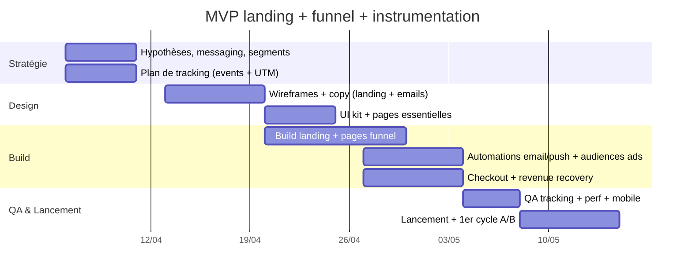

# Landing page et funnel complet pour convertir des visiteurs en utilisateurs payants

## Executive summary

Ce rapport propose un **blueprint “agnostique secteur”** (produit, cible et prix non précisés) pour concevoir une **landing page performante** et un **funnel complet** (pages + emails + push + retargeting + upsells + prévention du churn) afin de transformer des visiteurs froids en utilisateurs payants. L’approche s’appuie sur des principes durablement observés en UX et marketing : priorité au contenu critique **au-dessus de la ligne de flottaison** et à la hiérarchisation claire de l’information, réduction de la friction (notamment dans les formulaires), cohérence “message match” entre acquisition et page d’atterrissage, onboarding orienté “time-to-value”, et optimisation paywall/checkout + recouvrement des paiements échoués. citeturn0search0turn0search4turn0search1turn0search6turn0search3turn4search2turn1search1

Deux scénarios de monétisation sont proposés et intégrés au funnel :  
- **Scénario A — Abonnement (mensuel/annuel)** avec essai (ou micro-engagement) : attention au contexte récent où les conversions “trial → paid” restent fortes dans certains cas (médiane 50% dans un rapport Recurly 2024), mais les tendances indiquent aussi une **baisse des conversions d’essais** sur plusieurs années, ce qui impose un onboarding très focalisé et/ou des alternatives (micro-subscriptions, paywalls progressifs). citeturn1search0turn1search8  
- **Scénario B — Freemium + achats in-app / crédits** : le produit livre une valeur gratuite claire, puis vend l’intensité (quotas), des “packs”, ou des modules premium ; si l’app est mobile, intégrer les règles de commission des stores dans l’économie du modèle. citeturn11search14turn11search3

Côté SEO et performance, la recommandation est de concevoir la landing page comme un **actif SEO + conversion** : structure sémantique propre (H1, titres cohérents), titres et snippets travaillés, données structurées si pertinentes, mobile-first et respect des **Core Web Vitals** (cibles LCP ≤ 2,5 s, INP < 200 ms, CLS ≤ 0,1) pour limiter l’abandon et soutenir la performance business. citeturn2search0turn2search1turn2search2turn2search3turn1search2turn1search7turn12search2turn12search5

## Hypothèses et scénarios de monétisation

### Hypothèses explicites

Comme l’offre, le public et le secteur ne sont pas définis, le plan suppose un **produit digital “self-serve”** (SaaS B2B léger, app B2C, outil en ligne, plateforme) où la conversion peut se faire sans vente “high-touch” (pas de démo obligatoire). Le funnel est donc optimisé pour :
- **Compréhension immédiate** (valeur + preuve produit) au-dessus de la ligne de flottaison. citeturn0search0turn0search4  
- **Réduction de l’effort** à chaque étape (formulaires et checkout). citeturn0search1  
- **Onboarding in-app** favorisant un “aha moment” mesurable et rapide. citeturn0search3turn0search11  
- **Optimisation + tests** continus (A/B test bien cadré). citeturn12search0turn12search18

### Scénario A — Abonnement mensuel ou annuel

**Structure de prix indicative (à adapter)**  
- Mensuel : prix “accessible” pour réduire la barrière d’entrée.  
- Annuel : remise visible (ex. “2 mois offerts”) pour booster le cash et la rétention à moyen terme (classique dans les modèles d’abonnement, très présent aussi dans les outils B2B).  
- Essai : soit **essai gratuit** (avec onboarding + relances), soit **micro-engagement** (“premier mois à prix réduit”) si le trial est trop sujet à l’abus. La baisse observée des conversions de trial dans certaines analyses sectorielles plaide pour tester activement ces variantes. citeturn1search8turn1search0

### Scénario B — Freemium + achats in-app (IAP) ou crédits

**Principe** : livrer une valeur gratuite récurrente (usage limité) et monétiser l’intensité ou des fonctionnalités à forte valeur.  
- Paywall “progressif” (après obtention de valeur).  
- Packs de crédits / modules / add-ons.  
- Si app mobile : intégrer les commissions et programmes de réduction (par ex. programme “small business” Apple, et évolutions de frais Google Play annoncées en 2026 avec calendriers et taux variables selon cas). citeturn11search14turn11search3turn11search7

## Structure détaillée de la landing page

### Principes de structure et de persuasion

1) **Au-dessus de la ligne de flottaison** (le plus critique d’abord)  
Les utilisateurs passent une part importante de leur attention en haut de page ; ils scrollent, mais seulement si ce qu’ils voient d’emblée justifie le coût d’interaction. Il faut donc placer **promesse + preuve + CTA** immédiatement. citeturn0search0turn0search4

2) **Confiance et crédibilité**  
La perception de confiance provient notamment de la qualité de design, de la transparence (“up-front disclosure”), du contenu clair et à jour, et de la connexion au reste du web (indices de légitimité). citeturn3search0turn3search13

3) **Friction minimale**  
Sur les formulaires, la recherche Baymard montre que le nombre de champs pèse fortement sur l’effort perçu ; il faut donc demander le minimum, et étaler si nécessaire. citeturn0search1

4) **Message match acquisition → landing**  
Le copy et la promesse de la landing doivent refléter l’angle exact des ads/SEO (continuité psychologique). Unbounce insiste sur cet alignement. citeturn0search6turn0search2

### Wireframe ASCII commenté

```text
┌──────────────────────────────────────────────────────────────────────────┐
│ Top bar: Logo | Comment ça marche | Tarifs | Connexion                    │
│ (option: switch langue)                                                   │
├──────────────────────────────────────────────────────────────────────────┤
│ HERO (au-dessus de la ligne de flottaison)                                │
│ [H1: Promesse = résultat concret + public]                                │
│ Sous-titre: mécanisme + bénéfice + délai (sans jargon)                    │
│ Bullets (3): 1) bénéfice #1  2) bénéfice #2  3) bénéfice #3               │
│ [CTA primaire]   [CTA secondaire "Voir un exemple"]                       │
│ Micro-réassurance: "Sans CB" "Annulation 1 clic" "RGPD" (selon modèle)    │
│ À droite: visuel produit (screenshot réel) + mini-légendes                │
├──────────────────────────────────────────────────────────────────────────┤
│ PREUVES RAPIDES (logos / métriques / badges)                              │
│ "Déjà utilisé par …" | "Note moyenne …" | "X cas traités"                 │
├──────────────────────────────────────────────────────────────────────────┤
│ PROBLÈME → OPPORTUNITÉ                                                    │
│ "Aujourd’hui, vous perdez…" (symptômes) + "Nous rendons cela simple"      │
├──────────────────────────────────────────────────────────────────────────┤
│ SOLUTION (Comment ça marche)                                              │
│ Étape 1 → Étape 2 → Étape 3 (avec captures + bénéfices)                   │
├──────────────────────────────────────────────────────────────────────────┤
│ PREUVE (avant/après, cas client, témoignages)                             │
│ 2-3 testimonials + 1 mini étude de cas + FAQ "fiabilité / sécurité"       │
├──────────────────────────────────────────────────────────────────────────┤
│ OFFRE & PRIX (packaging clair)                                            │
│ Free/Freemium vs Pro vs Business (ou Mensuel/Annuel)                      │
│ Tableau comparatif features + ancrage + "annuler quand vous voulez"       │
│ CTA "Démarrer l’essai" / "Passer Pro"                                     │
├──────────────────────────────────────────────────────────────────────────┤
│ OBJECTIONS (FAQ) + CTA final                                              │
│ "Est-ce pour moi ?" "Combien de temps ?" "Données ?" "Support ?"          │
│ [CTA] + rappel micro-réassurance                                          │
├──────────────────────────────────────────────────────────────────────────┤
│ Footer: Mentions légales | Confidentialité | Sécurité | Contact | Presse  │
└──────────────────────────────────────────────────────────────────────────┘
```

### Copywriting proposé (adaptable secteur)

Ci-dessous, des propositions **avec variables** à remplacer :  
- `{résultat}` : résultat concret (“gagner du temps sur…”, “réduire…”, “automatiser…”, “mieux décider…”)  
- `{public}` : “équipes marketing”, “freelances”, “PME”, “créateurs”, “RH”, etc.  
- `{preuve}` : chiffre, délai, “exemples”, ou promesse de démo/diagnostic.

**H1 (3 options)**  
- Option 1 : “Obtenez **{résultat}** en moins de {délai} — sans complexité.”  
- Option 2 : “Le moyen le plus simple pour {public} de **{résultat}**.”  
- Option 3 : “Arrêtez de {douleur}. Commencez à **{résultat}**.”

**Sous-titre (1-2 lignes)**  
“{Produit} analyse {entrée} et vous donne {sortie} actionnable. Démarrez en {délai} et voyez un premier résultat dès aujourd’hui.”

**Bullets (exemples)**  
- “✔ {bénéfice} mesurable dès la première session”  
- “✔ Modèles prêts à l’emploi + personnalisation”  
- “✔ Export / intégrations (ou ‘aucun setup technique’ selon cible)”

**Preuves sociales (formats)**  
- Témoignages “résultat → contexte → crédibilité” (ex. “-27% de {KPI} en 3 semaines”)  
- Logos clients (si possible) + avis + “connection to the rest of the web” (presse, partenaires) pour renforcer la confiance. citeturn3search0turn3search13  
- Si paiement : signaux de sécurité/clarification près des champs sensibles (Baymard montre que la perception de sécurité se joue sur ces détails). citeturn3search1

### CTA et micro-réassurance

**3 variantes CTA (à tester)**  
- “Démarrer gratuitement”  
- “Obtenir mon résultat en {délai}”  
- “Voir mon plan personnalisé”

**Micro-réassurance** (sélection selon modèle)  
- Abonnement : “Essai sans engagement — annulation en 1 clic”  
- Freemium : “Toujours gratuit — upgrade quand vous voulez”  
- Checkout : “Paiement sécurisé — reçu immédiat — support {canal}” (renforcer la perception de sécurité au bon endroit). citeturn3search1

### SEO on-page et performance

**SEO on-page (à appliquer sur la landing)**  
- Titre (title link) et H1 cohérents : Google s’appuie sur plusieurs sources (titres visibles, headings, etc.) ; éviter des headings en compétition visuelle. citeturn2search0  
- Meta description comme “pitch” orienté intention : Google peut utiliser la balise meta description si elle résume mieux la page ; elle doit informer et intéresser. citeturn2search1  
- Mobile-first : Google utilise la version mobile pour indexation/classement (recommandation forte d’avoir une expérience mobile équivalente). citeturn2search2  
- Données structurées si éligibles (ex. software app, FAQ, avis) en respectant les politiques ; elles aident Google à comprendre le contenu et conditionnent l’éligibilité aux résultats enrichis. citeturn2search3turn2search7

**Performance (budget et cibles)**  
- Viser des Core Web Vitals “bons” : LCP ≤ 2,5 s, INP < 200 ms, CLS ≤ 0,1 (seuils recommandés). citeturn1search2turn1search7  
- La performance influence la conversion ; web.dev synthétise que des sites plus rapides améliorent des résultats business, et publie des cas d’impact (baisse du bounce, uplift conversions) associés à l’amélioration CWV. citeturn12search2turn12search5turn12search8

image_group{"layout":"carousel","aspect_ratio":"16:9","query":["SaaS landing page wireframe example","pricing page conversion design example","product onboarding flow UI example","high converting landing page above the fold example"],"num_per_query":1}

## Funnel complet de conversion

### Pages et séquences de base

Le funnel ci-dessous fonctionne pour les deux scénarios, avec des différences au niveau du paywall/checkout.

**Étape acquisition**  
- SEO (requêtes “solution à {problème}”, “outil pour {résultat}”, “alternative à X”, “template pour Y”).  
- Ads (Meta / Google) avec “message match” landing dédié. citeturn0search6turn5search11  
- Retargeting sur visiteurs (sans conversion) et sur engagés (scroll, clic CTA, démarrage formulaire). citeturn5search6turn5search11

**Étape landing**  
- Landing segmentée (au moins 2 versions selon intention : “résultat rapide” vs “comparatif/solution”). Principe “message match”. citeturn0search6turn0search2

**Étape capture/activation**  
- Option 1 : quiz/diagnostic (lead magnet)  
- Option 2 : compte immédiat avec “setup progressif” (champ minimum, puis enrichissement)  
Réduire fortement le nombre de champs demandés d’entrée. citeturn0search1

**Étape onboarding**  
- Guides in-app, checklists “first value”, personnalisation, segmentation. Pendo recommande des expériences d’onboarding contextuelles et adaptatives (guides in-app, analytics produit, feedback). citeturn0search3turn0search11

**Étape conversion**  
- Scénario A (abonnement) : paywall après premier bénéfice, puis checkout.  
- Scénario B (freemium) : limites (quota) + upsell contextuel + pack.

**Étape rétention**  
- Contenu/insights/valeur récurrente, relances comportementales, prévention churn involontaire (paiements échoués). Stripe met en avant des fonctions de revenue recovery et dunning pour réduire le churn involontaire ; Smart Retries optimise les moments de relance des paiements échoués via modèles ML. citeturn4search2turn1search1turn4search7turn1search17

### Schéma mermaid du funnel (flow)

```mermaid
flowchart LR
  A[Acquisition: SEO + Ads] --> B[Landing page segmentée]
  B -->|CTA| C[Capture: quiz/diagnostic OU signup]
  C --> D[Onboarding in-app: time-to-value]
  D --> E{Modèle de prix}
  E -->|Scénario A: abonnement| F[Paywall + Trial/Starter]
  F --> G[Checkout]
  E -->|Scénario B: freemium| H[Limites + Upsell contextuel]
  H --> G

  G --> I[Welcome + Activation (email/in-app)]
  I --> J[Rétention: valeur récurrente + nudges]
  J --> K{Risque churn?}
  K -->|Paiement échoué| L[Revenue recovery: retries + dunning]
  K -->|Inactivité| M[Winback: contenu + offre]
  L --> J
  M --> J

  B -. retargeting .-> B
  C -. email .-> I
  D -. push/in-app .-> J
```

### Email automation : 5 emails “types” (templates prêts à adapter)

Les objets/subjects sont inspirés de pratiques recommandées autour de la clarté, de la personnalisation et du test (Mailchimp souligne la valeur de la personnalisation et de la capacité à tester les subject lines). citeturn3search9

**Email 1 — Welcome + livraison de valeur (J0, immédiat)**  
- **Objet** : “Votre {résultat} est prêt ✅”  
- **Pré-header** : “2 minutes pour voir votre premier gain.”  
- **Corps** :  
  Bonjour {Prénom},  
  Voici votre {livrable} basé sur {info fournie}.  
  **Étape suivante (30 secondes)** : cliquez ici pour {action clé} et obtenir {bénéfice immédiat}.  
  _Pourquoi c’est important :_ la plupart des utilisateurs voient un premier {KPI} s’améliorer quand ils font {action clé}.  
  **CTA** : “Voir mon {livrable}”  
- **But** : amener à l’événement d’activation (AHA).

**Email 2 — Éducation (J1)**  
- **Objet** : “Le raccourci pour {résultat} (sans {douleur})”  
- **Pré-header** : “La méthode en 3 étapes que vous pouvez appliquer aujourd’hui.”  
- **Corps** :  
  {Prénom},  
  Si vous cherchez {résultat}, évitez {erreur fréquente}.  
  Dans {Produit}, la mécanique est simple :  
  1) {entrée} → 2) {traitement} → 3) {sortie actionnable}.  
  **CTA** : “Activer {fonction clé}”

**Email 3 — Preuve sociale + cas (J3)**  
- **Objet** : “Comment {persona} a obtenu {chiffre} en {délai}”  
- **Pré-header** : “Avant/après + ce qu’ils ont fait concrètement.”  
- **Corps** : mini-cas structuré (contexte → action → résultat → leçon) + lien “voir l’exemple”.  
- **CTA** : “Reproduire ce setup”

**Email 4 — Objections + confiance (J5)**  
- **Objet** : “Réponses rapides à vos questions (avant de continuer)”  
- **Pré-header** : “Sécurité, annulation, fiabilité — tout est ici.”  
- **Corps** : FAQ courte + liens vers pages légales, support, politique d’annulation.  
  Les signaux de confiance comptent : transparence et qualité perçue influencent la trustworthiness. citeturn3search0  
- **CTA** : “Continuer”

**Email 5 — Offre / upgrade (J7)**  
- **Objet** : “Débloquez {bénéfice premium} (offre {durée})”  
- **Pré-header** : “Passez à {plan} pour {résultat}, annulation en 1 clic.”  
- **Corps** : 3 bullets “ce que vous gagnez” + prix + ancrage annuel + rappel essai.  
- **CTA** : “Passer à {plan}”

### Push notifications et in-app messages (exemples + bonnes pratiques)

Pour le push, l’enjeu est d’**obtenir la permission** et d’être pertinent. OneSignal recommande l’usage d’un “soft prompt/push primer” avant la demande système (notamment sur iOS) et insiste sur la segmentation et le timing. citeturn5search0turn5search8turn5search2

**Triggers push (3 exemples)**  
- Activation incomplète (après 6–24h) : “Terminez {setup} → votre {résultat} complet est prêt.”  
- Valeur récurrente (quotidien/hebdo) : “Nouveau {insight} disponible : {bénéfice} en 30 sec.”  
- Risque churn (inactivité 7 jours) : “Vous voulez reprendre ? Voici un {raccourci} pour {résultat}.”

**Segmentation**  
- Segmenter améliore l’engagement ; OneSignal rapporte un uplift moyen d’ouverture chez les utilisateurs utilisant des segments plus avancés (au-delà des segments par défaut). citeturn5search16

### Retargeting ads (audiences + messages)

**Mécanique**  
- Meta Pixel permet de construire des audiences sur visiteurs site et de créer des audiences similaires (lookalikes) pour acquisition. citeturn5search6  
- Google Ads remarketing ré-engage les visiteurs via listes. citeturn5search11

**Audiences (exemple standard)**  
- Visiteurs landing (0–7 jours) sans “lead”  
- Visiteurs pricing / checkout (0–7 jours) sans achat  
- Leads (email capturé) sans activation in-app  
- Trial actifs sans upgrade (J3–J10)  
- Anciens payants (winback)

**Angles créatifs (exemples)**  
- “Voir un exemple” (preuve produit)  
- “Avant / Après” (résultat)  
- “Objection buster” (sécurité, annulation, simplicité)

### Upsells et prévention du churn

**Upsells recommandés**  
- Upsell annuel (“2 mois offerts”) après 7–14 jours d’usage actif.  
- Add-ons (modules, packs, sièges) pour augmenter l’ARPA.  
- Pour les abonnements, Paddle met en avant l’importance de packaging/pricing comme levier de croissance (à tester, pas à deviner). citeturn11search5turn12search0

**Prévention du churn involontaire (paiement échoué)**  
- Activer dunning + payment retries. Stripe documente Smart Retries (choix de timings optimaux via ML) et un ensemble de fonctions “revenue recovery”. citeturn1search1turn4search2turn4search7turn1search17  

**Prévention du churn volontaire (mauvaise perception de valeur)**  
- Onboarding personnalisé + valeur récurrente + rappels contextuels. Les principes d’onboarding Pendo insistent sur la personnalisation et la réduction de friction. citeturn0search11turn0search3

## Parcours utilisateur et messages par segment

### Nouveau visiteur

**Objectif** : compréhension + micro-engagement (clic CTA / scroll / “voir un exemple”).  
**Message** : résultat clair, preuve produit visible (screenshot), et CTA unique. Les principes NN/g recommandent de mettre le contenu critique haut dans la page et de guider le scroll. citeturn0search0turn0search4  
**Canaux** : landing + retargeting 0–7 jours.  
**Message type** : “Obtenez {résultat} en {délai}. Voir un exemple réel.”

### Lead chaud

**Définition** : a visité pricing, commencé un formulaire, ou a demandé un diagnostic.  
**Objectif** : lever objections + déclencher activation.  
**Messages** : transparence (prix, annulation), preuve sociale, sécurité, et 1 bénéfice immédiat. La perception de sécurité et les signaux au bon endroit comptent particulièrement autour du paiement. citeturn3search1turn3search0  
**Canaux** : email (J0–J3), retargeting “pricing/checkout”.

### Utilisateur d’essai (scénario abonnement)

**Objectif** : atteindre l’aha moment + usage répété (habitude).  
**Messages** : checklists + nudges in-app, guidance personnalisée, emails comportementaux. Pendo recommande l’onboarding in-app et des expériences adaptatives. citeturn0search3turn0search11  
**Canaux** : in-app + email + push (si opt-in).

### Abonné perdu

**Objectif** : winback (retour) ou apprentissage (raison churn)  
**Messages** :  
- “On a amélioré X” (valeur produit)  
- “Offre de retour” (ex. 1 mois à tarif réduit / pack)  
- “Récupération paiement” si churn involontaire (dunning). Stripe définit l’usage des dunning messages/emails pour paiements échoués et la réduction de churn involontaire. citeturn4search7turn4search19turn4search2

## Mesure, métriques et plan de tests A/B prioritaires

### Métriques clés (pilotage)

| Étape | KPI principal | KPI secondaires | Comment mesurer |
|---|---|---|---|
| Acquisition → Landing | CTR/Session quality | % scroll, clic “voir exemple” | Events analytics + UTM |
| Landing → Lead | Taux de conversion CTA | Abandon formulaire | Tracking formulaire (Baymard : réduire champs) citeturn0search1 |
| Lead → Activation | Activation rate (événement AHA) | Time-to-value | Events produit (Pendo : analytics + onboarding) citeturn0search3 |
| Activation → Paid | Trial-to-paid / Upgrade rate | Conversion checkout | Bench + suivi (Recurly chiffres + tendance) citeturn1search0turn1search8 |
| Paid → Rétention | Retention cohorts | Usage récurrent, churn | Cohortes + churn analysis citeturn4search9turn0search15 |
| Paiements | Taux d’échec paiement | Recovery rate | Smart Retries + revenue recovery citeturn1search1turn4search2 |

### Priorisation des tests A/B (impact élevé, effort raisonnable)

NN/g rappelle qu’un A/B test doit éviter de modifier trop d’éléments à la fois si l’on veut comprendre le rôle de chaque variable ; et qu’il faut combiner quanti et quali pour comprendre le “pourquoi”. citeturn12search0

| Priorité | Hypothèse testable | Variantes | Metric de succès |
|---|---|---|---|
| Haute | Le “message match” augmente la conversion | Landing A (angle {douleur}) vs B (angle {gain}) | CVR landing→lead citeturn0search6 |
| Haute | Une preuve produit au-dessus de la ligne de flottaison réduit le bounce | Hero avec screenshot vs hero “illustration” | Bounce / scroll / CTA clicks citeturn0search4turn0search0 |
| Haute | Réduire les champs augmente la complétion | Form court vs form long | Completion rate citeturn0search1 |
| Haute | Un CTA orienté bénéfice convertit mieux | “Démarrer gratuit” vs “Obtenir {résultat}” | CTA click + lead rate |
| Moyenne | Paywall timing: après valeur > avant valeur | Paywall immédiat vs post-activation | Paid conversion + satisfaction |
| Moyenne | Offre: essai vs micro-engagement | 7j trial vs 1€ premier mois | Paid conversion + refund/churn citeturn1search8 |
| Moyenne | Performance: diminuer LCP améliore conversion | Optimisation média/script | CVR + bounce (web.dev) citeturn12search2turn12search8 |

## Mise en œuvre, ressources, stack d’outils et exigences SEO/performance

### Calendrier de mise en œuvre

Hypothèse : un MVP “conversion-ready” en 4–6 semaines, puis itérations data.



### Ressources nécessaires (rôles) et charge indicative

- **Growth/Marketing stratège** (messaging, offres, plan d’expérimentation)  
- **Copywriter** (landing + emails + ads)  
- **Designer** (wireframes, UI, visuels de preuve)  
- **Développeur web / no-code builder** (pages + tracking + performance)  
- **Ops / CRM** (email automation, segmentation, délivrabilité)  
- **Data/Analytics** (events, dashboards, cohorte, attribution)

Budget (ordre de grandeur, à adapter) :  
- **Low** (no-code + templates + set-up minimal) : outils + 1–2 freelances  
- **Medium** (design + dev + instrumentation + 2 cycles de tests)  
- **High** (multi-landing, personnalisation, data pipeline, expérimentation continue)  
Ces budgets varient surtout selon la complexité produit, la volumétrie et le niveau d’intégration.

### Tableau comparatif d’outils (CMS, analytics, email automation, paiement)

> Coûts “low/medium/high” sont **indicatifs** et basés sur prix affichés (souvent USD, parfois HT). Les tarifs évoluent ; vérifier au moment du choix.

| Catégorie | Option low | Option medium | Option high |
|---|---|---|---|
| CMS / landing builder | entity["company","WordPress.com","managed wordpress hosting"] (à partir de ~4–9$/mo selon cycle) citeturn15view2 | entity["company","Webflow","website builder"] (Basic ~14$/mo, CMS ~23$/mo, Business ~39$/mo en annuel) citeturn14view0turn14view2 | entity["company","Framer","website builder"] (Basic ~10$/mo, Pro ~30$/mo, Scale ~100$/mo + usage) citeturn16view1 |
| Analytics | entity["company","Plausible Analytics","web analytics"] (Starter ~9$/mo) citeturn9search3 | entity["company","Matomo","web analytics"] (Cloud dès ~29/mo HT, on-prem 0€ logiciel) citeturn19view3 | entity["company","PostHog","product analytics"] (free tier + add-ons/enterprise à partir de paliers) citeturn7search3turn7search7 |
| Email automation | entity["company","Brevo","email marketing platform"] (Starter dès ~9$/mo) citeturn22search0 | entity["company","Mailchimp","email marketing"] (Free 0$ puis selon contacts) citeturn13view4turn9search5 | entity["company","Customer.io","customer messaging platform"] (Essentials dès ~100$/mo, Premium dès ~1000$/mo) citeturn8search4 |
| Paiement web (PSP) | Stripe (EEA cartes standard ~1,5% + 0,25€) citeturn13view5 | entity["company","PayPal","payments platform"] (frais variables selon type transaction ; barème officiel PDF) citeturn10search2turn10search10 | entity["company","Adyen","payment platform"] (Interchange++ : frais fixe + frais par moyen de paiement ; souvent “mid/high” selon volume) citeturn10search5 |
| Paiement + gestion taxes (Merchant of Record) | entity["company","Paddle","merchant of record payments"] (5% + 50¢/transaction) citeturn13view6 | entity["company","Lemon Squeezy","merchant of record payments"] (pricing pay-as-you-go, frais affichés) citeturn10search12turn10search1 | (High) MoR “sur devis” selon besoins entreprise + compliance étendue |

### Recommandations SEO et performance (checklist actionnable)

**Mobile-first et indexation**  
- S’assurer que la version mobile contient le même contenu essentiel (Google indexe mobile-first). citeturn2search2  

**Core Web Vitals (priorité conversion)**  
- LCP ≤ 2,5s, INP < 200ms, CLS ≤ 0,1 (notamment sur mobile). citeturn1search2turn1search7  
- Traiter en priorité : images (format, dimension, lazyload), JS (réduire/retarder), polices (preload), stabilité layout (réserver l’espace). Les gains de CWV sont associés à des améliorations de métriques business dans des cas publiés. citeturn12search5turn12search8  

**SEO on-page**  
- Title & H1 cohérents, éviter plusieurs titres visuellement “principaux”. citeturn2search0  
- Meta description comme pitch, alignée sur l’intention. citeturn2search1  
- Données structurées si pertinentes (FAQ, produit, avis) en respectant les politiques. citeturn2search3turn2search7  

**Mesure performance**  
- Utiliser Lighthouse (score = moyenne pondérée de métriques) et accepter une variabilité de mesure ; tester plusieurs fois et en conditions comparables. citeturn12search3turn12search9  

### Sources prioritaires utilisées

- NN/g : hiérarchisation homepage et importance du haut de page, “fold”, confiance, et bonnes pratiques A/B testing. citeturn0search0turn0search4turn3search0turn12search0  
- Baymard : réduction des champs de formulaire, perception de sécurité au checkout. citeturn0search1turn3search1  
- Unbounce : “message match” et optimisation landing PPC, et pratiques de test. citeturn0search6turn12search18turn12search1  
- Pendo : onboarding orienté rétention, personnalisation et guidance in-app. citeturn0search3turn0search11  
- Recurly : métriques d’abonnement (trial-to-paid médiane) + tendances de conversion d’essais. citeturn1search0turn1search8  
- Stripe : revenue recovery, Smart Retries, dunning messages/emails, et principes de rétention/churn. citeturn4search2turn1search1turn4search7turn4search1  
- Google (Search + web.dev) : mobile-first indexing, titles/snippets, structured data, Core Web Vitals et seuils, impact business de la performance. citeturn2search2turn2search0turn2search1turn1search2turn12search5turn12search2  
- OneSignal : opt-in “soft prompt”, timing et segmentation push. citeturn5search0turn5search8turn5search16  
- Meta Pixel + Google remarketing docs : audiences et re-ciblage. citeturn5search6turn5search11