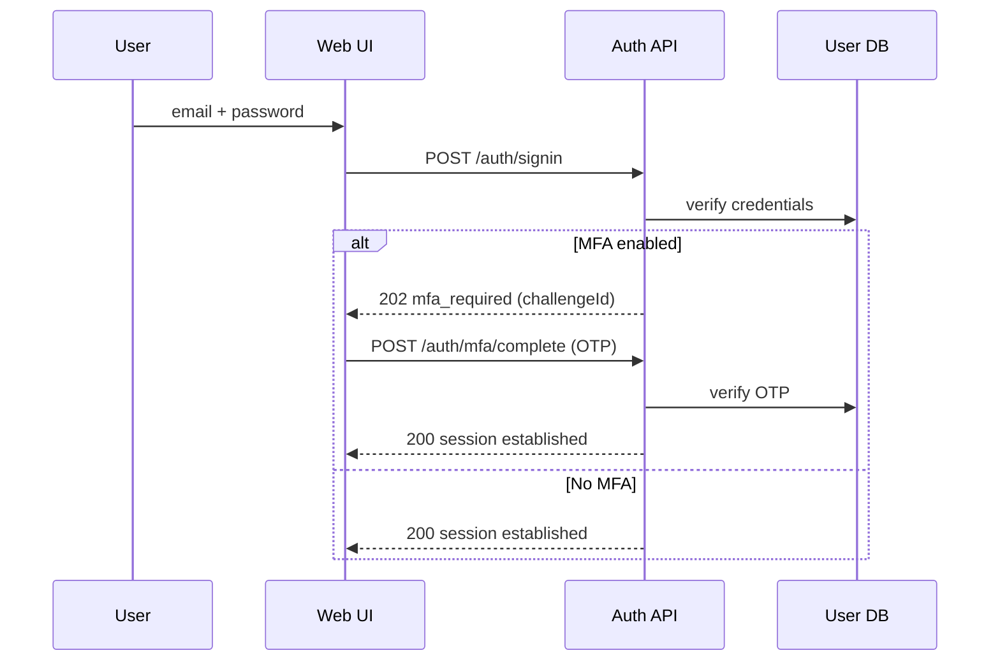
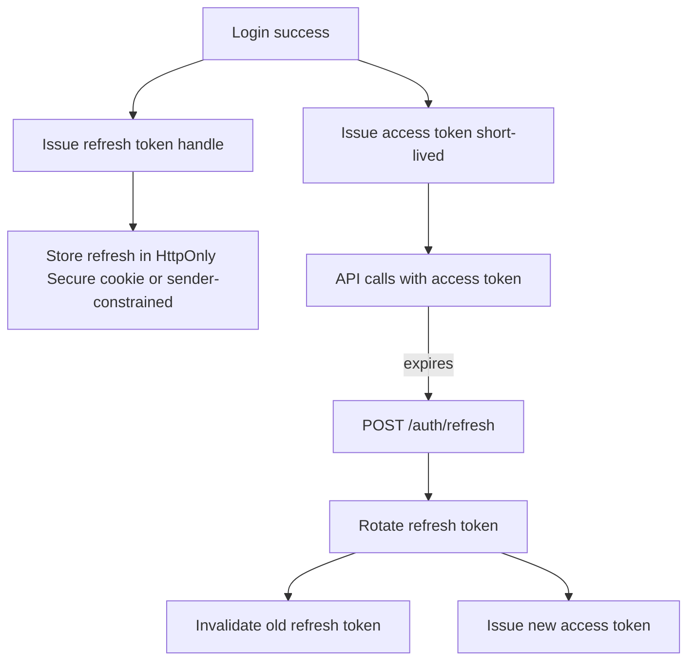
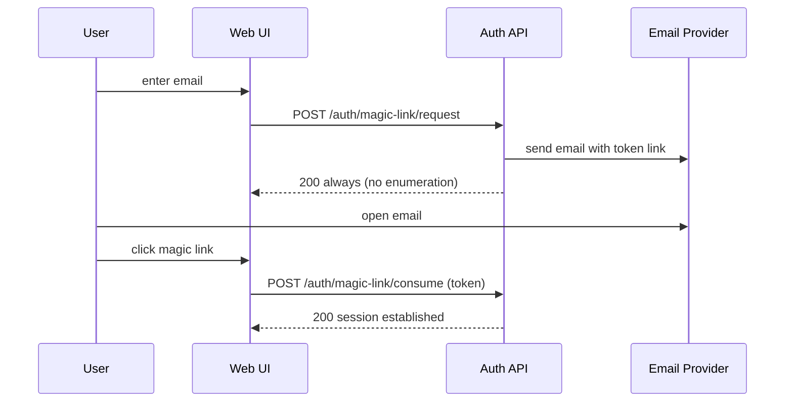

# Écrans Signup et Signin efficaces et modernes pour une application web d’astrologie

## Résumé exécutif

Cette spécification décrit un **système d’authentification web** (signup/signin) à la fois **frictionless pour le grand public** et **robuste pour les usages Pro/B2B et Admin**, dans une esthétique “cosmic minimal” (premium, sobre, lisible). Elle est alignée sur des sources de référence : entity["organization","OWASP","web security nonprofit"] (anti-brute-force, anti-enumeration, MFA, sessions), entity["organization","IETF","internet standards body"] (OAuth / sécurité des jetons), entity["organization","W3C","web standards consortium"] (WCAG 2.1 AA), entity["organization","CNIL","data protection authority france"] (RGPD : minimisation, consentement, conservation) et entity["organization","NIST","us standards institute"] (règles de mots de passe et UX “password manager friendly”). citeturn0search0turn1search2turn1search3turn8view0turn0search2turn7search4turn1search4turn10search1

Conception UX clé : **binder la complexité** derrière un parcours “identifiant d’abord” (email), proposer 3 voies d’accès cohérentes (email+mot de passe, **magic link**, social login), puis **MFA adaptative** (obligatoire pour Admin, fortement recommandée pour Pro/B2B ; optionnelle et progressive pour B2C). La politique sécurité propose : **anti-enumeration**, contrôles anti-automatisation (rate limiting, délais exponentiels, CAPTCHA en “defense-in-depth”), **email verification**, sessions en cookies **Secure/HttpOnly/SameSite**, et pour les refresh tokens : **rotation** (ou mécanismes sender-constrained type DPoP) conformément aux Best Current Practices OAuth modernes. citeturn4view0turn4view1turn1search30turn0search2turn6search1turn4view2

Recommandation technique par défaut : **React + Next.js (App Router) + TypeScript**, une couche UI “headless/primitives” pour maîtriser l’identité visuelle sans sacrifier l’accessibilité, et une solution auth selon contexte (build vs service) avec contrats API clairs. Les critères d’accessibilité visent **WCAG 2.1 AA** (contrastes texte et non-texte, focus visible, erreurs identifiées, reflow, feedback ARIA). citeturn7search4turn7search5turn7search1turn7search0turn0search11turn0search31

## Objectifs produit pour signup/signin et besoins par persona

### Objectifs produit (signup/signin)

**Conversion sans perte de confiance (B2C)**  
L’écran d’auth doit obtenir un “oui” rapide sans sur-sollicitation : champs minimaux, choix explicites, feedback clair et rassurant. Les erreurs doivent être identifiables et actionnables (WCAG “Error Identification”), sans exposer d’informations sensibles (anti-enumeration). citeturn7search0turn4view1

**Sécurité “by default” (tous segments)**  
- Réduire l’impact des attaques d’identification/authentification (credential stuffing, brute force) via contrôles anti-automatisation, délais et/ou verrouillage mesuré. citeturn4view0turn1search30turn0search24turn10search3  
- Sécuriser les sessions : cookies avec attributs appropriés (Secure, HttpOnly, SameSite) et politique de durée. citeturn4view2turn11search23  
- Alignement OAuth moderne : rotation des refresh tokens (ou tokens sender-constrained) et bonnes pratiques pour apps navigateur. citeturn0search2turn6search0turn2search5  

**Scalabilité et gouvernance (Pro/B2B & Admin)**  
Le login doit supporter : MFA forcée, politiques par rôle, audit, compatibilité future SSO (OIDC/SAML), et récupération sécurisée. Les surfaces d’auth multiples doivent rester cohérentes (web app, admin, API, éventuelles apps mobiles) afin d’éviter des “bypass” de MFA. citeturn8view0turn9search4  

### Personas (au moins 3) et besoins d’authentification

**Persona Grand Public (B2C)**  
- Attentes : “je veux accéder vite à mon profil astrologique”, tolérance faible aux frictions.  
- Auth recommandée : email + mot de passe **ou** magic link ; social login en option visible (Google/Apple).  
- MFA : optionnelle, proposée après valeur perçue (ex : après sauvegarde d’un thème, achat, ou accès à données sensibles). La MFA répétée trop souvent dégrade l’expérience ; d’où l’intérêt d’une MFA activée sur signaux de risque (nouvel appareil / localisation). citeturn8view0  

**Persona Pro/B2B (développeur / intégrateur / responsable produit)**  
- Attentes : fiabilité, gestion d’accès, sécurité “auth assurance”.  
- Auth recommandée : email+mot de passe + MFA (TOTP, passkeys ensuite), ou SSO d’entreprise (OIDC/SAML) si besoin.  
- Besoin : “device remembered”, sessions longues mais sûres (rotation tokens), accès rapide à dashboard et clés API. Alignement OAuth/OIDC standard (nonce, PKCE). citeturn0search2turn2search0turn2search5turn6search0  

**Persona Administrateur (ops / support / contenu)**  
- Risque supérieur (comptes privilégiés) : exigences plus strictes.  
- Auth recommandée : MFA **obligatoire**, politiques de verrouillage adaptatives, audit, et idéalement SSO. L’OWASP souligne l’importance d’éviter les angles morts (API alternative, mobile, etc.) qui contournent MFA. citeturn8view0turn0search24  

## Parcours utilisateurs détaillés et architecture de l’information

### Architecture de l’auth (IA minimale)

L’auth est structurée en **8 vues** (routes) + états :

- `/auth/signin` (entrée unique)  
- `/auth/signup` (optionnel : peut être un mode dans signin)  
- `/auth/magic-link/sent` (confirmation d’envoi)  
- `/auth/verify-email` (post-signup email+password)  
- `/auth/mfa` (challenge MFA)  
- `/auth/reset/request` (demande reset)  
- `/auth/reset/confirm` (nouveau mot de passe)  
- `/auth/locked` (verrouillage / délai / assistance)

Principe : une **page unique “signin”** peut héberger plusieurs méthodes (password, magic link, social) via progressive disclosure, mais le **coût cognitif** est maîtrisé en commençant par l’email. Côté sécurité, les flux “forgot password” exigent messages et timings cohérents pour éviter l’énumération de comptes. citeturn4view1turn4view0

### Parcours : signup email + mot de passe (avec vérification email)

1) **Écran signup** : email, mot de passe, acceptation CGU, option marketing non cochée par défaut.  
2) **Validation front** : format email, règles minimales (longueur).  
3) **Submit** → état loading (bouton + spinner, inputs disabled).  
4) **Succès** → écran “Vérifiez votre email” : explication + bouton “Renvoyer” (cooldown).  
5) **Clique email** → callback de vérification → session créée / activée ou compte marqué “verified”.  
6) Retour app → “profil” ou “créer votre thème”.

Bonnes pratiques mot de passe (UX et politique) : minimum 8 caractères, permettre des secrets longs (jusqu’à 64+), permettre le “coller” (password managers), éviter règles arbitraires de complexité ; comparer aux listes de secrets compromis. citeturn10search1turn10search0

### Parcours : signin email + mot de passe (+ MFA si activée)

1) **Écran signin** : email + mot de passe.  
2) Sur échec : message générique (anti-enumeration) : “Email ou mot de passe incorrect.”  
3) Si MFA activée : redirection `/auth/mfa` (OTP TOTP 6 chiffres, ou autre facteur).  
4) Sur OTP invalide : erreur contextualisée + compteur tentatives + option “Utiliser un autre moyen” / “Codes de secours”. L’OWASP recommande la cohérence MFA sur toutes les méthodes d’auth disponibles. citeturn8view0turn4view0

### Parcours : passwordless (magic link)

Deux modes UX possibles (choisir un seul pour éviter confusion) :

**Mode A – “Lien de connexion” sur page signin (recommandé B2C)**  
1) Email → “Recevoir un lien de connexion”.  
2) Écran “Lien envoyé” (ne confirme jamais l’existence du compte).  
3) Clic lien → session créée (et email implicitement prouvé par possession).  
4) Si compte jamais créé : création “just-in-time” (avec CGU acceptées côté web avant envoi).  

Auth.js documente le mécanisme “verification token envoyé par email” et une validité par défaut (ex. 24h) selon configuration, ce qui doit être reflété dans la microcopy (durée indicative, resend). citeturn3search0turn3search1

**Mode B – “Invitation / accès pro” (recommandé Pro/Admin)**  
Le magic link est utilisé pour onboarding sécurisé, mais MFA est ensuite exigée pour finaliser l’accès (step-up). (Conserver cohérence : les chemins alternatifs ne doivent pas devenir des contournements.) citeturn8view0

### Parcours : social login (OIDC/OAuth)

1) Sur signin : choisir “Continuer avec …”.  
2) Redirection vers fournisseur via **Authorization Code + PKCE** (éviter implicite, recommandé pour apps navigateur). citeturn6search12turn2search5  
3) Retour redirect URI : backend échange le code, vérifie `state` + `nonce` (OIDC) pour lier session client et atténuer la replay. citeturn2search0turn2search5  
4) Si email déjà existant : liaison de comptes (flow explicite “Nous détectons un compte existant…” sans fuite d’info vers un attaquant non authentifié).

### Parcours : MFA (enrollment + challenge)

**Enrollment (après login)**  
- Écran “Sécurisez votre compte” (optionnel B2C / requis Admin) : proposer TOTP (Authenticator) + codes de secours.  
- QR code + champ OTP.  
- Confirmation + affichage codes de secours (une fois) + CTA “Télécharger / copier”.

Le guide OWASP MFA propose des mécanismes UX comme la MFA basée sur le risque (nouvel appareil / nouvelle localisation) pour limiter la fréquence des prompts. citeturn8view0

**Challenge à la connexion**  
- OTP 6 chiffres (auto-advance, paste) + “Se souvenir de cet appareil 30 jours” (si politique autorise).  
- Échecs : after N essais, ralentissements/délai, possibilité d’utiliser codes de secours.

### Parcours : reset mot de passe

1) `/auth/reset/request` : email.  
2) Réponse UI **identique** que le compte existe ou non (“Si un compte existe…”) + latence cohérente. citeturn4view1  
3) Mail : lien avec token aléatoire à usage unique + expiration courte.  
4) `/auth/reset/confirm` : saisir nouveau mot de passe + confirmation.  
5) À la fin : ne pas auto-connecter par défaut ; demander login standard et proposer invalidation des sessions (OWASP : complexité et risques si auto-login après reset). citeturn4view1  
6) Protection : rate limiting sur demandes reset pour éviter “reset flooding”. citeturn4view1  

## Wireframes recommandés et états d’interface

### Layout recommandé (cosmic minimal) et responsive

**Desktop (≥1024px)** : split view 40/60  
- Gauche : visuel léger (gradient étoilé très discret + slogan).  
- Droite : “Auth Card” (max 440–480px), hiérarchie typographique claire, actions alignées.

**Tablet (640–1023px)** : centré, visuel réduit (illustration en header).  
**Mobile (<640px)** : full-height, card non flottante, CTA sticky bas, prioriser une seule méthode à la fois (“email d’abord”, puis options). WCAG Reflow : éviter scroll 2D, garder champs et CTA dans un flux vertical. citeturn0search11turn0search3

### Wireframes (ASCII)

**Signin (default)**

```
[Logo]                    (Lang FR ▼)   (Thème ☾)

Titre: Se connecter
Sous-texte: Accédez à votre profil astrologique et à vos tirages.

[ Continuer avec Google ]   [ Continuer avec Apple ]
──────────────  ou  ──────────────

Email
[__________________________]

Mot de passe                      (Afficher)
[__________________________]

[ Se connecter ]  (loading → spinner)

Lien secondaire:
Mot de passe oublié ?   •   Recevoir un lien de connexion
```

**Magic link sent**

```
Titre: Vérifiez votre boîte mail
Texte: Si un compte existe pour cette adresse, nous venons d’envoyer un lien de connexion.
[ Renvoyer le lien ] (disabled 30s)     [ Changer d’email ]
Aide: Pensez à vérifier les spams.
```

**MFA challenge (OTP)**

```
Titre: Vérification
Texte: Saisissez le code à 6 chiffres de votre application d’authentification.

[ _ ] [ _ ] [ _ ] [ _ ] [ _ ] [ _ ]
Erreur inline si échec: Code invalide. Réessayez.

[ Valider ]
(Options) Utiliser un code de secours • Aide
```

### États obligatoires (toutes pages auth)

- **Default** : formulaire actif, actions secondaires visibles.  
- **Loading** : désactiver interactions, garder lisibilité, spinner accessible.  
- **Error** : erreurs champ par champ + bannière “globale” en haut si échec serveur ; erreurs identifiées en texte (WCAG 3.3.1). citeturn7search0  
- **Success** : confirmation, prochaines étapes.  
- **Locked / throttled** : message + timer + alternative (magic link / reset). OWASP décrit le verrouillage et met en garde contre l’usage “DoS” ; il faut privilégier des délais exponentiels et seuils mesurés. citeturn4view0  
- **Verify email** : guidance claire + renvoi avec cooldown.  

### Dialogs & modals (ex. “Choisir une autre méthode”)

Si modals utilisés, appliquer le pattern WAI-ARIA : focus piégé, tabulation interne, fermeture via Échap, et pas de focus hors dialog sans fermeture. citeturn6search3turn6search7  

image_group{"layout":"carousel","aspect_ratio":"16:9","query":["modern web app login screen dark mode ui","otp verification code input ui design","password strength meter ui component","email verification screen ui design"],"num_per_query":1}

## Design system “Auth” : composants spécifiques, tokens, microcopy et accessibilité

### Tokens visuels (subset auth)

**Couleurs (hex) – thème dark par défaut**  
- Background : `#070A14`  
- Surface/card : `#0B1020`  
- Border : `#2C3557`  
- Text primary : `#F5F7FF`  
- Text muted : `#A0A6BC`  
- Primary accent : `#B8A9FF`  
- Focus ring (info) : `#66E6FF`  
- Success : `#00D3A7`  
- Danger : `#FF4D6D`

**Règles WCAG**  
- Texte : viser ≥ 4.5:1 (SC 1.4.3 AA). citeturn7search5  
- UI non-texte (bordures input, focus ring, icônes signifiantes) : viser ≥ 3:1 (SC 1.4.11 AA). citeturn7search1  
- Focus visible (SC 2.4.7). citeturn0search31  

**Typographie (recommandation)**  
- Sans-serif UI (400/500/600), taille base 16px, line-height 1.4–1.6 pour lisibilité.  
- Titres auth : 24–28px (H1) ; sous-textes 14–16px.

### Composants auth (catalogue avec props/variants)

Les composants ci-dessous sont pensés pour être **réutilisables** dans B2C, B2B et Admin, avec “policy toggles” (exiger MFA, exiger mot de passe, autoriser social, etc.).

**AuthShell**  
- Props : `title`, `subtitle`, `brandVariant: "b2c"|"b2b"|"admin"`, `sideIllustration?: boolean`, `languageSwitcher?: boolean`  
- Variants : `compact` (mobile), `split` (desktop)

**TextField**  
- Props : `id`, `label`, `value`, `onChange`, `type`, `autoComplete`, `inputMode`, `error?`, `hint?`, `required?`  
- A11y : associer erreurs via `aria-describedby`, marquer invalidité via `aria-invalid`. citeturn11search2turn11search6  

**PasswordField + StrengthMeter**  
- Props : `minLength=8`, `maxLength=64`, `showToggle`, `strength: "empty"|"weak"|"ok"|"strong"`, `breachCheckState`  
- Microcopy : privilégier longueur et passphrases. NIST recommande ≥8, permettre ≥64, autoriser le collage, et éviter règles de composition arbitraires. citeturn10search1turn10search0  

**AuthMethodSwitcher**  
- Props : `enabledMethods: { password:boolean; magicLink:boolean; social:boolean }`  
- UX : basculer sans perdre email saisi (state conservé).

**SocialButton**  
- Props : `provider: "google"|"apple"|...`, `variant: "solid"|"outline"`, `disabledReason?`  
- Notes : afficher un micro-texte “Nous ne publions jamais sans votre accord”.

**OtpInput (6 digits)**  
- Props : `length=6`, `value`, `onChange`, `onComplete`, `error?`, `pasteMode: "smart"`  
- UX : auto-focus, auto-advance, paste complet.  
- A11y : annoncer erreurs (bannière `role="alert"` si global). (ARIA patterns : utiliser zones d’alerte/message de façon cohérente). citeturn6search7turn11search2  

**InlineAlert / ErrorBanner**  
- Props : `tone: "danger"|"warning"|"info"`, `title?`, `message`, `actions?`  
- A11y : `role="alert"` pour erreurs bloquantes.

**Toast**  
- Props : `tone`, `message`, `duration`, `actionLabel?`, `onAction?`  
- Usage : feedback non bloquant (ex. “Lien renvoyé”).

**LockedNotice**  
- Props : `remainingSeconds`, `alternativeActions: { magicLink:boolean; reset:boolean; contact:boolean }`  
- UX : limiter culpabilisation (“Pour votre sécurité…” + timer clair).

### Exemples de code (React / JSX)

**TextField (avec a11y erreurs)**  
(Associer erreur/hint via `aria-describedby` et état via `aria-invalid`.) citeturn11search2turn11search6

```tsx
import * as React from "react";

type TextFieldProps = {
  id: string;
  label: string;
  value: string;
  onChange: (v: string) => void;
  type?: React.HTMLInputTypeAttribute;
  autoComplete?: string;
  inputMode?: React.HTMLAttributes<HTMLInputElement>["inputMode"];
  required?: boolean;
  hint?: string;
  error?: string;
};

export function TextField({
  id, label, value, onChange,
  type = "text",
  autoComplete,
  inputMode,
  required,
  hint,
  error,
}: TextFieldProps) {
  const describedBy = [
    hint ? `${id}-hint` : null,
    error ? `${id}-err` : null,
  ].filter(Boolean).join(" ");

  return (
    <div className="ui-field">
      <label className="ui-label" htmlFor={id}>
        {label}{required ? " *" : ""}
      </label>

      <input
        id={id}
        className={`ui-input ${error ? "ui-input--error" : ""}`}
        value={value}
        type={type}
        autoComplete={autoComplete}
        inputMode={inputMode}
        onChange={(e) => onChange(e.target.value)}
        aria-invalid={Boolean(error)}
        aria-describedby={describedBy || undefined}
      />

      {hint && !error && <div id={`${id}-hint`} className="ui-hint">{hint}</div>}
      {error && <div id={`${id}-err`} className="ui-error">{error}</div>}
    </div>
  );
}
```

**PasswordField (show/hide + règles NIST-friendly)**  
(Autoriser “coller”, éviter règles arbitraires, privilégier longueur.) citeturn10search0turn10search1

```tsx
type PasswordFieldProps = {
  id: string;
  label?: string;
  value: string;
  onChange: (v: string) => void;
  minLength?: number;
  maxLength?: number;
  error?: string;
};

export function PasswordField({
  id,
  label = "Mot de passe",
  value,
  onChange,
  minLength = 8,
  maxLength = 64,
  error,
}: PasswordFieldProps) {
  const [show, setShow] = React.useState(false);

  const strength =
    value.length === 0 ? "empty" :
    value.length < minLength ? "weak" :
    value.length < 14 ? "ok" : "strong";

  return (
    <div className="ui-field">
      <label className="ui-label" htmlFor={id}>{label}</label>

      <div className="ui-password">
        <input
          id={id}
          className={`ui-input ${error ? "ui-input--error" : ""}`}
          type={show ? "text" : "password"}
          value={value}
          onChange={(e) => onChange(e.target.value)}
          minLength={minLength}
          maxLength={maxLength}
          autoComplete="current-password"
          aria-invalid={Boolean(error)}
        />
        <button
          type="button"
          className="ui-password__toggle"
          onClick={() => setShow(!show)}
          aria-label={show ? "Masquer le mot de passe" : "Afficher le mot de passe"}
        >
          {show ? "Masquer" : "Afficher"}
        </button>
      </div>

      <div className={`ui-strength ui-strength--${strength}`} aria-hidden="true">
        {/* barres / label visuel */}
        <span />
      </div>

      <div className="ui-hint">
        {minLength}+ caractères — une phrase est parfaite.
      </div>

      {error && <div className="ui-error" role="alert">{error}</div>}
    </div>
  );
}
```

### Accessibilité (WCAG 2.1 AA) – exigences concrètes pour auth

- **Erreurs identifiées et décrites en texte** (pas seulement rouge). citeturn7search0  
- **Contraste texte** (≥4.5:1) et **contraste composants** (≥3:1 pour bordures, focus). citeturn7search5turn7search1  
- **Focus visible** sur tous éléments interactifs ; focus ring clairement perceptible. citeturn0search31  
- **Reflow** : authentification utilisable à 320px sans scroll horizontal. citeturn0search11  
- **Dialog** : focus piégé + Échap. citeturn6search3  

### Animations & transitions (sobres + respects “reduce motion”)

Utiliser `prefers-reduced-motion` pour réduire/remplacer les animations non essentielles. citeturn11search0

```css
:root {
  --dur-fast: 120ms;
  --dur-base: 200ms;
  --ease-out: cubic-bezier(0.16, 1, 0.3, 1);
}

.auth-card {
  animation: authEnter var(--dur-base) var(--ease-out) both;
}

@keyframes authEnter {
  from { opacity: 0; transform: translateY(8px); }
  to   { opacity: 1; transform: translateY(0); }
}

.ui-input:focus-visible {
  outline: 2px solid #66E6FF;
  outline-offset: 2px;
}

.ui-shake {
  animation: shake 260ms var(--ease-out);
}

@keyframes shake {
  0% { transform: translateX(0); }
  25% { transform: translateX(-6px); }
  50% { transform: translateX(6px); }
  100% { transform: translateX(0); }
}

@media (prefers-reduced-motion: reduce) {
  .auth-card, .ui-shake { animation: none; }
}
```

## Recommandations techniques, tableaux comparatifs et structure de composants

### Framework front-end : comparaison (et recommandation)

| Option | Sécurité/Robustesse auth | UX & productivité UI | Courbe d’apprentissage | Écosystème | Coût |
|---|---|---|---|---|---|
| React + Next.js | Excellent pour SSR/Routes/API co-localisées ; bon support auth “server-first” | Très bon pour design system custom | Moyen | Très large | OSS + coût équipe |
| Vue + Nuxt | Très bon ; patterns clairs | Très bon | Faible à moyen | Large | OSS |
| Svelte + SvelteKit | Très performant et agréable dev | Excellent pour UI rapide | Faible à moyen (patterns spécifiques) | Plus petit | OSS |

**Recommandation par défaut** : React + Next.js si l’application combine B2C + B2B + Admin dans la même base, avec des parcours auth riches et une forte exigence “design system”. (Comparatif : facteur principal = écosystème + intégration auth + maturité tooling.) citeturn6search0turn0search2

### UI libs : accessibilité et personnalisation

- Radix Primitives : gère des détails a11y difficiles (ARIA, focus management, keyboard). citeturn12search0  
- Headless UI : composants “completely unstyled, fully accessible” pensés pour intégration style. citeturn12search1  

### Libraries / plateformes auth : options réalistes

Les besoins (B2C, B2B, Admin) justifient de distinguer 3 stratégies : **build**, **BaaS**, **IdP/CIAM**.

| Option | Sécurité | UX | Courbe d’apprentissage | Écosystème | Coût |
|---|---|---|---|---|---|
| Auth.js (build sur votre backend) | Très bon si correctement implémenté ; support email/magic link et nombreux providers OAuth | UI 100% custom | Moyen (infra, tokens, email) | Fort | OSS + coût dev/ops |
| entity["company","Clerk","auth platform"] (CIAM managed) | Très bon ; MFA, flows custom/hosted, enforcement | Très rapide à ship | Faible | Bon | SaaS (coût récurrent) |
| entity["company","Supabase","backend platform"] Auth (BaaS) | Très bon, large palette méthodes (password, magic link, OTP, social, SSO, MFA) | UI custom via SDK | Moyen | Bon | usage-based |
| Firebase Auth | Large couverture méthodes + FirebaseUI ; MFA (notamment via Identity Platform) | UI drop-in possible | Faible à moyen | Très large | freemium/usage |
| entity["company","Auth0","identity platform"] (IdP) | Très complet (passwordless, OIDC/OAuth, policies) | Hosted login possible | Moyen | Très large | SaaS |

Sources : Auth.js “email provider” (token, lien, expiration) citeturn3search0 ; NextAuth email/magic link citeturn3search1 ; Clerk MFA et enforcement citeturn3search5turn3search2 ; Supabase auth methods + MFA citeturn3search3turn3search6turn3search17 ; Firebase Auth + FirebaseUI et MFA citeturn9search13turn9search9 ; Auth0 magic link citeturn9search0turn9search18.

**Recommandation par défaut (stack non imposée)**  
- Si vous voulez **contrôle UX maximal** + logique auth intégrée à votre app : Auth.js + backend maison, avec contrats API ci-dessous. citeturn3search0turn3search24  
- Si vous voulez **time-to-market** (B2C + B2B + Admin) et analytics/policies : Clerk ou Auth0 (hosted/embeddable), puis customiser l’UI. citeturn3search9turn9search18  
- Si vous avez déjà un backend Postgres/edge : Supabase Auth (bon compromis). citeturn3search3turn3search6  

### i18n FR et tests

- i18n : react-i18next (avec i18next) pour gérer traduction et workflow localisation. citeturn12search3turn12search7  
- E2E : Playwright (Chromium, WebKit, Firefox) pour valider l’auth cross-browser, y compris flows OAuth/MFA. citeturn12search2turn12search6  

### Structure recommandée des composants réutilisables (front)

```txt
src/
  features/auth/
    routes/
      SignInPage.tsx
      SignUpPage.tsx
      MagicLinkSentPage.tsx
      VerifyEmailPage.tsx
      MfaChallengePage.tsx
      ResetRequestPage.tsx
      ResetConfirmPage.tsx
      LockedPage.tsx
    components/
      AuthShell.tsx
      AuthCard.tsx
      AuthMethodSwitcher.tsx
      SocialButtons.tsx
      OtpInput.tsx
      PasswordField.tsx
      ErrorBanner.tsx
    api/
      authClient.ts
      types.ts
      contracts.ts
    state/
      useAuthSession.ts
      authStore.ts
```

## Sécurité & RGPD, contrats API et schémas Mermaid

### Sécurité : exigences minimales (auth)

**Anti-automatisation & anti-bruteforce**  
- Mettre en place : rate limiting, délais croissants (exponentiels), éventuellement CAPTCHA après plusieurs échecs (defense-in-depth). citeturn4view0turn10search3turn1search30  
- Verrouillage : attention au risque de DoS (verrouiller un compte peut être abusé). OWASP recommande de concevoir le lockout avec prudence, et de prévoir des voies de récupération. citeturn4view0  

**Anti-enumeration (login, reset, magic link)**  
- Messages et timings cohérents, en particulier pour “forgot password”. citeturn4view1  
- Côté UI : préférer “Si un compte existe…” (reset/magic link) et “Identifiants incorrects” (login).

**Sessions & cookies**  
- Cookies de session : toujours `Secure`, `HttpOnly`, et un `SameSite` approprié ; ces attributs sont détaillés par OWASP et MDN. citeturn4view2turn11search23turn11search15  

**OAuth moderne : refresh token rotation / sender-constrained**  
- RFC 9700 (Best Current Practice) exige pour clients publics : refresh tokens sender-constrained ou **refresh token rotation**. citeturn0search2  
- DPoP (RFC 9449) : mécanisme pour sender-constrain tokens et détecter les replays. citeturn6search1  
- Browser-based apps : usage de code flow + PKCE recommandé (réduction risques vs implicit). citeturn6search12turn2search5  

**MFA**  
- Expérience : MFA “risk-based” pour éviter prompts trop fréquents. citeturn8view0  
- Sécurité : toutes les méthodes d’auth doivent respecter la politique MFA (éviter contournements). citeturn8view0  

**Mots de passe (backend)**  
- Stockage : OWASP recommande Argon2id (avec paramètres minimaux) si disponible. citeturn5view0  
- Politique UX : NIST recommande longueur, paste autorisé, pas de règles arbitraires, blocage des secrets compromis. citeturn10search1turn10search0  

### RGPD (inscriptions) : données, consentement, conservation

- Minimisation : collecter des données “adéquates, pertinentes et limitées à ce qui est nécessaire”. citeturn1search1turn1search5  
- Consentement : si vous ajoutez une finalité marketing, il doit être **libre, spécifique, éclairé et univoque**, distinct de la création de compte. citeturn1search4  
- Conservation : définir des durées (pas de conservation indéfinie) et règles d’archivage/suppression. citeturn1search5turn1search9  

### Contrats API essentiels (REST JSON)

JSON se conforme à RFC 8259. citeturn6search6  
Les endpoints sont donnés en version “build-your-backend”. Si vous utilisez un fournisseur (Clerk/Supabase/Auth0/Firebase), vous mappez ces contrats vers leurs SDK.

#### Endpoints

**Signup / Signin**
- `POST /v1/auth/signup` (email + password)  
- `POST /v1/auth/signin` (email + password)  
- `POST /v1/auth/refresh`  
- `POST /v1/auth/logout`

**Email verification**
- `POST /v1/auth/email/verify` (token)  
- `POST /v1/auth/email/resend`  

**Password reset**
- `POST /v1/auth/password/reset/request`  
- `POST /v1/auth/password/reset/confirm`

OWASP forgot password : tokens aléatoires, à usage unique, expirations, messages cohérents, rate limiting, pas d’auto-login par défaut. citeturn4view1  

**Magic link**
- `POST /v1/auth/magic-link/request`  
- `POST /v1/auth/magic-link/consume` (token)

Auth.js/NextAuth : mécanisme “verification token envoyé par email” et durée par défaut souvent 24h selon la config ; exposez cette réalité dans la microcopy + expire/resend. citeturn3search0turn3search1  

**Social**
- `GET /v1/auth/oauth/:provider/start` (redirection)  
- `GET /v1/auth/oauth/:provider/callback` (code, state)  
PKCE : RFC 7636 décrit l’attaque “authorization code interception” et la mitigation PKCE. citeturn2search5  
Nonce : OIDC exige de vérifier le `nonce` dans l’ID Token quand utilisé. citeturn2search0  

**MFA**
- `POST /v1/auth/mfa/enroll` (init : secret/QR)  
- `POST /v1/auth/mfa/verify` (activer facteur)  
- `POST /v1/auth/mfa/challenge` (déclencher challenge au login)  
- `POST /v1/auth/mfa/complete` (soumettre OTP)  

#### Payloads (exemples)

**Signup**
```json
{
  "email": "user@example.com",
  "password": "une-phrase-longue-que-j-aime",
  "acceptTerms": true,
  "marketingOptIn": false
}
```

**Signin**
```json
{
  "email": "user@example.com",
  "password": "..."
}
```

**Refresh (rotation)**
```json
{
  "refreshToken": "opaque-or-jwt-handle"
}
```

Rotation refresh tokens : recommandée/obligatoire selon contexte (RFC 9700) pour réduire l’impact d’un refresh token volé. citeturn0search2  

**Forgot password request**
```json
{
  "email": "user@example.com"
}
```

**Magic link request**
```json
{
  "email": "user@example.com",
  "purpose": "signin"
}
```

### Mermaid : auth flow, lifecycle tokens, passwordless

**Auth flow (email/password + MFA)**



**Token lifecycle (access + refresh rotation)**



RFC 9700 : rotation refresh token (ou sender-constrained) pour clients publics. citeturn0search2turn6search1  

**Passwordless magic link flow**



Anti-enumeration et protections reset/magic link : messages cohérents, rate limiting, tokens à usage unique. citeturn4view1turn3search0  

## Checklist d’implémentation et priorisation MVP sur 3 sprints

### Sprint 1 (Fondations + signup/signin core)

- Design tokens “Auth” + composants : AuthShell, TextField, PasswordField, ErrorBanner, Toast.  
- Routes : signin/signup, reset request/confirm, verify email, magic-link sent.  
- A11y : contrastes, focus visible, erreurs textuelles (WCAG). citeturn7search5turn0search31turn7search0  
- Sécurité : rate limiting, délais croissants, messages cohérents anti-enumeration. citeturn4view0turn4view1turn1search30  
- Tests E2E “happy paths” (signup, signin, reset) avec Playwright. citeturn12search6  

### Sprint 2 (Passwordless + social login + durcissement UX)

- Magic link : request/consume + resend cooldown + copywriting email. citeturn3search0  
- Social login : code flow + PKCE ; validation state/nonce. citeturn2search5turn2search0  
- Hardening : verrouillage “soft” + alternative (reset/magic link) pour éviter DoS. citeturn4view0turn10search3  
- Internationalisation FR (préparer EN) via react-i18next. citeturn12search3  

### Sprint 3 (MFA + segmentation B2B/Admin)

- MFA TOTP : enrollment + challenge + recovery codes ; step-up sur actions sensibles. citeturn8view0  
- Règles par rôle : MFA forcée admin, optionnelle mais incitative B2C.  
- Token/session : refresh rotation (ou sender-constrained), cookies Secure/HttpOnly/SameSite. citeturn0search2turn4view2turn11search23  
- RGPD : consentement marketing séparé, minimisation, durées de conservation, suppression/export. citeturn1search4turn1search1turn1search9  

### Microcopy FR (exemples prêts à intégrer)

**Signin**
- Titre : “Se connecter”  
- Sous-texte : “Retrouvez votre thème astral, vos tirages et votre historique.”  
- Erreur auth (anti-enumeration) : “Email ou mot de passe incorrect.”  
- Lien : “Recevoir un lien de connexion”

**Magic link**
- “Si un compte existe pour cette adresse, nous venons d’envoyer un lien de connexion.” citeturn4view1  
- “Le lien expire dans 15 minutes.” *(choisir une durée réelle ; si usage Auth.js / NextAuth par défaut, adapter la mention à la config)* citeturn3search0turn3search1  
- “Renvoyer le lien” (avec cooldown : “Réessayez dans 30 s”)

**Verify email (post-signup)**
- “Confirmez votre adresse email pour sécuriser votre compte.”  
- “Vous n’avez rien reçu ? Vérifiez vos spams, ou renvoyez l’email.”

**Reset**
- Confirmation : “Si un compte existe, vous recevrez un email pour réinitialiser votre mot de passe.” citeturn4view1  
- Nouveau mot de passe : “8 caractères minimum. Une phrase est idéale.” citeturn10search1  

**MFA**
- Titre : “Vérification”  
- Aide : “Saisissez le code à 6 chiffres généré par votre application.”  
- Erreur : “Code invalide. Vérifiez l’heure de votre appareil et réessayez.”  
- Option : “Utiliser un code de secours”  
- “Se souvenir de cet appareil” (si politique autorise)

**Locked**
- “Pour votre sécurité, l’accès est temporairement limité.” citeturn4view0  
- “Réessayez dans 02:15, ou utilisez un lien de connexion.”