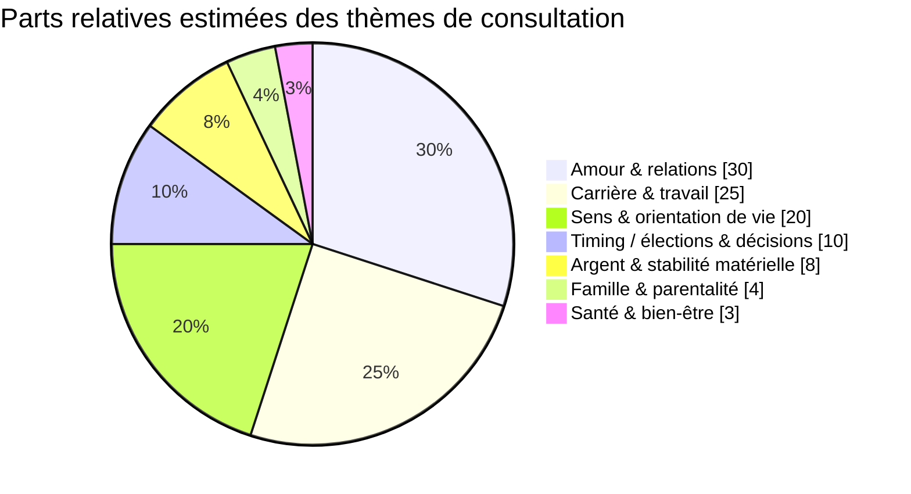
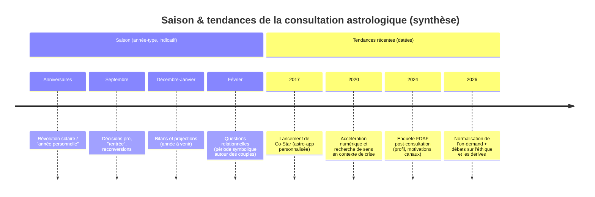

# Thématiques récurrentes qui poussent à consulter un astrologue

## Résumé exécutif

La demande de consultation astrologique se structure autour de quelques **domaines de vie très stables** (amour/relations, travail/carrière, argent/stabilité matérielle, santé/bien‑être), auxquels s’ajoutent des demandes de **sens/orientation** et de **timing** (« est‑ce le bon moment ? », « quand agir ? »). Dans des sources francophones récentes décrivant la pratique de consultation (plateformes, presse, fédération professionnelle), l’amour ressort comme un pôle majeur des attentes, suivi de près par le travail, tandis que l’argent irrigue un grand nombre de demandes, souvent de façon indirecte. citeturn30view0turn18view1turn18view0turn22view0

Une enquête de terrain menée par la **entity["organization","Fédération des Astrologues Francophones","astrology federation, france"]** (109 répondants, 2024) montre toutefois que, dans le segment « astrologie de consultation » défendu par cette fédération, les premières raisons déclarées sont avant tout **mieux se connaître**, **comprendre ce qui arrive**, **trouver du sens**—et que l’astrologie y est majoritairement perçue comme un outil de connaissance de soi et de développement personnel, bien plus que comme un art prédictif. citeturn13view0

Les **canaux** se sont fortement diversifiés : la recherche d’un astrologue passe beaucoup par **Internet et les médias** (42% dans le panel FDAF), mais on observe aussi des consultations en **cabinet**, à distance (visio/téléphone), et dans des **événements** (bars/tiers‑lieux, salons) avec des formats courts (« lecture flash »). citeturn13view0turn32view0turn28view0

Le marché est en train de se recomposer autour de trois tendances : **digitalisation et “on-demand”**, **hybridation avec le coaching / développement personnel**, et **micro‑formats** (15 minutes, chat/email). Ces tendances augmentent l’accessibilité mais renforcent aussi des risques connus (consultations répétées dans des moments de vulnérabilité, confusion entre accompagnement et promesse de prédiction, dépendance). citeturn30view1turn22view0turn34view0turn28view0turn31view0

## Corpus, méthode et fiabilité des estimations

Le présent rapport s’appuie sur une triangulation de sources francophones (prioritaires quand disponibles) :

1. **Données structurées “métier”** : synthèse d’une enquête post‑consultation publiée dans une gazette de la FDAF en juillet 2024 (n=109) incluant profil, fréquence, canaux d’acquisition, motivations et satisfaction. citeturn13view0  
2. **Presse / enquêtes grand public** : reportage décrivant des consultations (formats, prix, lieux, profils), incluant des chiffres d’enquête sur les jeunes et des analyses sociologiques du rôle de l’astrologie (incertitude, projection). citeturn28view0  
3. **Plateformes et pages de services** (proxy de la “demande exprimée”) : catégories “thématiques”, canaux (téléphone/chat/email/visio) et exemples de questions proposées aux clients. citeturn22view0turn18view1turn18view0turn18view2  
4. **Documents d’éthique / cadrage** (limites santé, prudence sur le prévisionnel) : code de déontologie FDAF. citeturn19view0  
5. **Ressources méthodologiques** sur des branches précises (horaire, élective, synastrie) : sites explicatifs de pratique et publications fédératives. citeturn25view0turn25view1turn27view0

### Comment sont produites les “fréquences estimées”

Il n’existe pas, dans les sources consultées, de mesure unique, représentative et récente donnant la part exacte de chaque thème **spécifiquement pour l’astrologie** à l’échelle francophone. Les parts proposées plus bas sont donc des **estimations** : elles agrègent (a) les thèmes récurrents décrits comme “noyau dur” des consultations ésotériques au sens large, (b) les catégories mises en avant par des plateformes couvrant astrologie/voyance, (c) les formulations d’offres de consultations astrologiques (natal, transits, synastrie, etc.), et (d) les motivations déclarées dans l’enquête FDAF—tout en explicitant les biais. citeturn30view0turn22view0turn13view0

## Thématiques récurrentes et fréquence estimée

### Classement des thématiques par fréquence estimée

Les thèmes ci‑dessous sont classés du plus fréquent au moins fréquent, avec une **part relative indicative** (100% au total). Les justifications s’appuient sur la convergence entre (i) plateformes (catégories et FAQ), (ii) presse/terrain, (iii) cadrages professionnels. citeturn22view0turn28view0turn13view0turn30view0

1. **Amour & relations** (~30%)  
   L’amour est explicitement décrit comme “central” dans les demandes récurrentes et occupe une place structurante dans les exemples de questions (retour d’un ex, fidélité, avenir du couple) et dans les offres de synastrie/compatibilité. citeturn30view0turn18view1turn22view0turn27view0  

2. **Carrière, travail & trajectoire professionnelle** (~25%)  
   Les questions de travail arrivent “juste après” l’amour dans les récits de consultation ; les plateformes mettent en avant des questions typiques (accepter une offre, évolution d’entreprise, relations avec collègues, reconversion). citeturn30view0turn18view0turn22view0  

3. **Sens, identité & orientation de vie** (~20%)  
   Dans l’enquête FDAF, la première motivation déclarée est “mieux me connaître”, suivie de “comprendre ce qui m’arrive” et “trouver du sens”, et l’image dominante de l’astrologie est celle d’un outil de connaissance de soi/développement personnel. Les plateformes associent aussi l’astrologie à la mission/chemin de vie. citeturn13view0turn18view2turn22view0turn28view0  

4. **Timing, élections & décisions ponctuelles** (~10%)  
   Beaucoup de demandes sont formulées comme “quand agir ?” : l’astrologie est promue pour choisir des périodes propices (transits) ou, dans sa branche élective, pour sélectionner une date/heure de départ d’un projet. citeturn22view0turn25view1turn34view0  

5. **Argent, stabilité matérielle & parfois immobilier** (~8%)  
   L’argent est décrit comme transversal, souvent en toile de fond (situations “bloquées”, charges, retards), et apparaît comme une “question” filtrable sur certaines plateformes. citeturn30view0turn22view0  

6. **Famille & parentalité** (~4%)  
   Ce thème apparaît dans les listes “domaines de vie” et dans certaines offres (synastrie parent‑enfant, soutien aux parents), mais il est moins central dans les FAQ grand public que l’amour et le travail. citeturn32view0turn34view1turn18view4  

7. **Santé & bien‑être** (~3%)  
   Les demandes santé sont décrites comme plus visibles depuis quelques années dans l’univers de la voyance au sens large, mais les cadres professionnels rappellent fortement les limites : prudence, interdiction de prédire des événements touchant la vie physique/la santé, et absence d’actes médicaux. En pratique, la santé apparaît donc souvent sous une forme “bien‑être / stress / hygiène de vie” plutôt que “diagnostic/prédiction”. citeturn30view0turn19view0turn27view0  

Ces parts sont une estimation de synthèse (non une mesure nationale unique), construite à partir de catégories/FAQ de plateformes, récits de consultation, et cadrages professionnels. citeturn22view0turn30view0turn28view0turn13view0turn19view0

### Exemples de formulations de demandes clients par thème

Les formulations suivantes sont des modèles réalistes, reconstitués à partir de questions typiques publiées (FAQ/plateformes) et de la manière dont les consultations sont décrites. citeturn18view1turn18view0turn18view2turn22view0turn25view0

**Amour & relations**  
« Mon ex va‑t‑il revenir ? » citeturn18view1  
« Notre couple a‑t‑il un avenir ? » citeturn18view1  
« Suis‑je compatible avec mon/ma partenaire actuel·le ? » citeturn22view0  
« Quels sont nos points de tension et comment les travailler ? » (souvent en synastrie / relationnel) citeturn27view0turn34view1  

**Carrière, travail & trajectoire**  
« Dois‑je accepter cette nouvelle offre d’emploi ? » citeturn18view0  
« Vais‑je réussir mon projet de reconversion ? » citeturn18view0  
« Comment améliorer mes relations avec mes collègues ? » citeturn18view0  
« Que me réserve cette période sur le plan professionnel ? » citeturn22view0  

**Sens, identité & orientation de vie**  
« Quels sont mes talents cachés et comment les activer ? » citeturn18view2  
« Quel est mon chemin de vie / ma mission ? » citeturn18view2turn22view0  
« Pourquoi je vis toujours les mêmes blocages ? » citeturn22view0turn13view0  
« J’ai l’impression de ne plus me reconnaître : qu’est‑ce qui se joue ? » (formulation clinique/transition) citeturn28view0turn34view1  

**Timing, élections & décisions ponctuelles**  
« Quand est le bon moment pour changer de voie ? » citeturn22view0  
« Est‑ce le bon moment pour lancer mon projet / signer un contrat ? » (transits/élective) citeturn25view1turn34view0turn22view0  
« Vais‑je obtenir ce poste ? » (horaire, question fermée) citeturn25view0  

**Argent & stabilité matérielle**  
« Est‑ce que ma situation financière va se débloquer ? » (fréquent en voyance, souvent indirect) citeturn30view0  
« Est‑ce une période favorable pour investir / démarrer une activité rémunératrice ? » (timing) citeturn25view1turn22view0  

**Famille & parentalité**  
« Comment mieux comprendre la dynamique avec mon enfant / parent ? » (relationnel) citeturn34view1turn32view0  
« Quels domaines de vie familiaux vont être mis en lumière cette année ? » citeturn32view0turn18view4  

**Santé & bien‑être**  
« Je traverse une fatigue/stress : que dit mon thème sur mon équilibre et mes rythmes ? » (plutôt bien‑être que diagnostic) citeturn30view0turn19view0  
« Comment mieux gérer mon énergie et éviter l’épuisement ? » (formulation souvent “préventive”) citeturn28view0turn19view0  

## Méthodes astrologiques demandées et adéquation aux questions

Les méthodes ci‑dessous correspondent aux demandes mentionnées : natal, transits (incluant souvent révolution solaire), horaire, élective, synastrie (et parfois thème composite). citeturn22view0turn25view0turn25view1turn27view0turn32view0

| Méthode | Ce que le consultant attend typiquement | Types de questions où elle est la plus utilisée | Indices dans les sources |
|---|---|---|---|
| Natal (thème de naissance) | Profil, potentiel, schémas, domaines de vie, “carte” personnelle | Sens/orientation, identité, patterns relationnels, choix de trajectoire | Mis en avant comme base de la consultation (décrypter le thème natal; outil de connaissance de soi) citeturn22view0turn34view1turn13view0 |
| Transits (période du moment) | Lecture “du maintenant”, cycles, périodes propices/délicates, “éclairage temporel” | Timing de décisions, périodes de blocage/transformation, préparation à un changement (pro/affectif) | “Choisir les bons moments pour agir (transits)” + questions “que me réserve cette période ?” citeturn22view0turn13view0 |
| Révolution solaire (souvent associée aux transits) | “Année à venir” personnelle à partir de l’anniversaire | Bilan & projection annuelle, priorités de l’année, périodes clés | Décrite comme éclairant l’année qui s’ouvre à partir de l’anniversaire, repérage d’opportunités/périodes clés citeturn32view0 |
| Horaire | Réponse tranchée à une question précise (“jugement”) | Décisions ponctuelles : job, confiance, engagement, issue d’une situation | Définie comme réponse à une question précise et concrète; exemples “Vais‑je obtenir ce poste ?” citeturn25view0 |
| Élective | Choisir une date/heure “auspicieuse” pour démarrer un événement/projet | Lancement d’activité, signature, mariage/déménagement, actions à fort enjeu | Définie comme sélection d’un moment favorable; “élection” citeturn25view1 |
| Synastrie / thème composite | Comprendre la dynamique d’une relation (harmonies, tensions, leviers) | Couple, relation parent‑enfant, associés, relations pro | Définie comme comparaison de thèmes (synastrie) et création éventuelle d’un thème de la relation (composite) citeturn27view0turn32view0turn34view1 |

Point important : dans les cadres professionnels explicitement éthiques, le **prévisionnel** doit être abordé “avec prudence”, et la santé/les événements touchant la vie physique ne doivent pas faire l’objet de prédictions formelles. Cela influe directement sur l’usage des méthodes (notamment transits/horaire) et sur la formulation des réponses. citeturn19view0turn27view0

## Profils de consultants et motivations psychologiques

### Profils observables et biais de segmentation

Dans l’enquête de la FDAF (post‑consultation), les répondants sont **très majoritairement des femmes** (103/109), **plutôt âgés** (principalement plus de 50 ans), et **plutôt CSP+** ; la couverture géographique inclut presque toutes les régions françaises et quelques répondants belges. citeturn13view0  
Cette structure reflète vraisemblablement un segment : celui d’une clientèle allant vers des astrologues “professionnels” affiliés à une fédération et positionnés sur la connaissance de soi. La gazette elle‑même souligne qu’il s’agit d’une indication et non d’une preuve de représentativité, et mentionne aussi des biais possibles (questionnaire donné par l’astrologue). citeturn13view0

En parallèle, les reportages et analyses sur les pratiques ésotériques chez les jeunes décrivent un usage important chez les **11‑24 ans** (croyances et intérêt), ainsi qu’une diffusion via applications et réseaux sociaux, avec des profils allant d’étudiants à jeunes cadres dans les grandes villes (exemple parisien). citeturn28view0turn10view0  
La presse française souligne aussi le rôle de la “suspension d’incrédulité” (usage comme fiction performative, comparable à des pratiques culturelles) et l’attrait pour une spiritualité non dogmatique. citeturn28view0

### Motivations psychologiques dominantes

**Recherche de sens et connaissance de soi**  
Le triptyque “mieux me connaître / comprendre ce qui m’arrive / trouver du sens” apparaît explicitement comme tête de motivations dans l’enquête FDAF, et se retrouve dans les offres de consultation (thème natal, cycles, trajectoire). citeturn13view0turn22view0turn34view1

**Gestion de l’incertitude et besoin de projection**  
Des analyses sociologiques rapportées dans la presse décrivent l’astrologie comme une manière de se projeter dans l’avenir et de réduire l’incertitude, notamment professionnelle ou affective. citeturn28view0turn30view0

**Besoin de validation, de réassurance et d’écoute**  
Les textes sur la voyance/consultation en ligne insistent sur la fonction de “respiration” et de réassurance dans l’attente (examen médical, décision, résultat incertain), et sur la répétition de consultations comme réponse à l’angoisse plutôt qu’à une quête de vérité. citeturn30view0turn30view1  
La satisfaction dans l’enquête FDAF est largement associée à des mots comme “éclairage”, “sens”, “explication”, et au vécu de la séance comme “moment d’écoute et d’échange”. citeturn13view0

**Curiosité et usage culturel**  
La digitalisation (notifications, contenus faciles à partager) transforme l’expérience astrologique en pratique du quotidien et en langage social (compatibilités, discussion entre amis), comme l’illustrent les récits d’applications et de consultations en tiers‑lieux. citeturn24view0turn28view0

### Limites psychologiques et enjeux d’emprise

Un chapitre académique disponible via **entity["organization","Cairn.info","academic publishing platform"]** (collection **entity["book_series","Que sais-je ?","puf book series"]**, **entity["organization","Presses Universitaires de France","academic publisher, france"]**) décrit la consultation comme un espace opérant dans l’affectivité, pouvant créer une position dominante du praticien et un mécanisme “d’attente croyante”, avec un risque de contrainte/manipulation si le cadre éthique est faible. citeturn31view0  
Ces risques sont amplifiés par certains dispositifs numériques (facturation à la minute, disponibilité permanente, relances, promotions), qui peuvent favoriser la répétition de consultations en période de vulnérabilité. citeturn30view1turn28view0

## Canaux, fréquence, saisonnalité et tendances récentes

### Canaux de consultation observés

**Plateformes en ligne (multi‑canaux)**  
Les plateformes structurent la demande par “thématiques” (amour, travail, développement personnel) et proposent plusieurs canaux (téléphone, chat, mail, visio), avec une mise en avant explicite de l’asynchronicité (écrire plutôt que parler) et de la facilité d’entrée (“à 3 clics”). citeturn22view0turn18view1turn18view0

**Cabinet + distance (pratiques hybrides)**  
Des astrologues affichent des dispositifs hybrides : cabinet en ville moyenne et rendez‑vous à distance, avec recueil des coordonnées de naissance et travail préparatoire, et possibilité d’enregistrer la séance—ce qui correspond à une attente de “réécoute” et d’intégration progressive. citeturn32view0turn34view1

**Événements et lieux culturels**  
Le cas parisien de **entity["point_of_interest","Ground Control","venue, paris"]** illustre un canal “événementiel” : consultations courtes en soirée (tirage/lecture flash 15 minutes), prix et public “étudiants et jeunes cadres”. citeturn28view0

### Fréquence et intensité de recours

Dans le panel FDAF, **22%** consultaient pour la première fois ; parmi les autres, la moyenne déclarée est d’environ **3,8 consultations sur les cinq dernières années**. citeturn13view0  
Côté plateformes numériques, les dispositifs (disponibilité, facturation à la minute, “maintenant”) peuvent mécaniquement favoriser une fréquence plus élevée, ce qui est décrit comme une dérive possible lorsque l’angoisse devient un déclencheur récurrent. citeturn30view1turn28view0

### Saisonniété des demandes

Les données publiques précises sur la saisonnalité des consultations astrologiques francophones sont limitées (voir section “Limites”). On peut néanmoins documenter des **mécanismes saisonniers structurels** liés aux offres :

- **Anniversaire / “année personnelle”** : la révolution solaire est explicitement vendue comme lecture de l’année s’ouvrant à partir de l’anniversaire, ce qui crée une saisonnalité individuelle (pics autour de la date de naissance). citeturn32view0  
- **Périodes de transition** (séparation, reconversion, crises identitaires) : les reportages décrivent l’entrée en consultation au moment où “tout change”, ce qui renvoie davantage à une saisonnalité par événements de vie qu’au calendrier civil. citeturn28view0turn34view1  

Les éléments datés reposent sur des sources explicitant la date (lancement d’app, enquêtes publiées, reportages). La partie “saison (année‑type)” est indicative et doit être validée par des données d’usage (voir recommandations d’enquête). citeturn24view0turn13view0turn30view1turn32view0turn28view0

image_group{"layout":"carousel","aspect_ratio":"16:9","query":["consultation astrologue en cabinet","thème astral carte du ciel natal","application astrologie notifications","synastrie couple astrologie"],"num_per_query":1}

### Tendances récentes structurantes

**Digitalisation et personnalisation algorithmique**  
L’article de **entity["organization","Vogue France","fashion magazine, france"]** décrit la montée des applications astrologiques via l’exemple de **entity["company","Co-Star","astrology app"]** : notifications, hyper‑personnalisation, logique de partage social. citeturn24view0  
La presse française souligne que la diffusion récente auprès des jeunes passe notamment par les applications et des comptes sur réseaux sociaux. citeturn28view0turn10view0

**Micro‑consultations, accessibilité et “économie de l’attention”**  
Les récits sur la voyance en ligne mettent en avant : accès à toute heure, sessions courtes, facturation à la minute, classement/notation des profils, et incitations à prolonger—ce qui transforme l’écoute en produit. citeturn30view1turn22view0

**Coaching astrologique et suivi long**  
Des offres structurent l’astrologie comme un accompagnement régulier (mensuel/bimensuel/trimestriel), combinant transits/progressions et outils de développement personnel, avec une logique de plan d’action et d’anticipation de cycles (“devenir acteur”). citeturn34view0turn34view1

## Recommandations produit pour une application ou un service

Cette section propose une architecture fonctionnelle et UX alignée sur les besoins observés (thèmes dominants, demande de timing, canaux hybrides) tout en intégrant des garde‑fous éthiques (santé, dépendance, prudence sur le prévisionnel). citeturn22view0turn13view0turn19view0turn30view1turn34view0

### Modules et fonctionnalités

**Module Thème natal “Connaissance de soi” (socle)**  
- Onboarding guidé (date/heure/lieu) + vérification de cohérence.  
- Restitution progressive : forces, défis, schémas récurrents, “domaines de vie” priorisés.  
- Sorties “actionnables” : questions de réflexion, objectifs, routines.  
Alignement source : l’astrologie comme outil de connaissance de soi et d’aide aux décisions, fortement valorisée dans l’enquête FDAF et dans les offres de consultation. citeturn13view0turn34view1turn22view0

**Module Transits & “période du moment” (timing)**  
- Carte des 8–12 prochaines semaines (et 6–12 mois) avec “fenêtres” : opportunités, vigilance, consolidation.  
- Mode “question” : l’utilisateur choisit une thématique (amour/travail/argent/sens) et obtient une lecture du timing contextualisée.  
Alignement source : “comprendre ce qui m’arrive en ce moment”, “périodes propices”, et usage des transits pour choisir quand agir. citeturn13view0turn22view0

**Module Révolution solaire / Année personnelle (saisonnalité individuelle)**  
- Déclencheur automatique à J‑30 de l’anniversaire : invitation à l’analyse de l’année à venir.  
- Tableau “priorités de l’année” + périodes clés.  
Alignement source : description explicite de la révolution solaire et de son utilité (climat général, opportunités). citeturn32view0

**Module Relations (synastrie / composite) centré sur l’usage**  
- Deux parcours : “Couple” et “Relations pro/famille”.  
- Restitution en 3 couches : compatibilités, zones de tension, leviers de communication.  
- Option “consultation humaine” pour les cas sensibles.  
Alignement source : synastrie/composite comme outils pour comprendre la dynamique relationnelle; omniprésence du thème “amour”. citeturn27view0turn18view1turn30view0

**Module Décision rapide (horaire)**  
- Formulaire contraint (une seule question, cadrage, horizon temporel, critères de succès).  
- Sortie “oui/non/orientation” + conditions + fenêtre de vérification a posteriori.  
Alignement source : l’horaire vise une réponse claire à une question précise (“Vais‑je obtenir ce poste ?”). citeturn25view0

**Module Planification (élective)**  
- Assistant “choisir une date” : type d’événement, période possible, contraintes personnelles.  
- Sortie : 3 créneaux recommandés + explicabilité (pourquoi).  
Alignement source : l’élective est définie comme le choix d’un moment auspicieux pour un projet/événement. citeturn25view1

### UX de consultation et de préparation

**Un “brief” avant consultation**  
- Mini‑questionnaire d’objectifs + 3 questions prioritaires + contexte (période, enjeux).  
- Génération d’un “dossier” remis à l’astrologue et à l’utilisateur.  
Alignement source : les consultations structurées demandent souvent des axes prioritaires et un travail préparatoire; certaines pratiques encouragent l’enregistrement/réécoute. citeturn32view0turn34view1

**Choix du canal selon la charge émotionnelle**  
- Live (visio/téléphone/chat) pour l’urgence émotionnelle et la clarification.  
- Asynchrone (email/message) pour les utilisateurs qui préfèrent “prendre du recul”.  
Alignement source : plateformes promouvant le mail quand “pas envie de parler” et l’accessibilité multi‑canal. citeturn22view0

### Éthique, sécurité et confiance

**Garde‑fous santé (obligatoires)**  
- Filtre sémantique : si la question est médicale (“diagnostic”, “traitement”, “mort”), redirection vers ressources de santé + refus de prédiction.  
- Charte visible : interdiction d’actes médicaux et de prédictions formelles touchant la santé/la vie physique.  
Alignement source : code de déontologie FDAF (limites de compétence; interdiction actes médicaux; prudence sur prévisionnel santé). citeturn19view0turn27view0

**Anti‑dépendance (particulièrement pour l’on‑demand)**  
- Plafond de dépense / temps hebdomadaire paramétrable.  
- Alertes “usage répétitif” + invitation à espacer + journaling de décision (“qu’est‑ce que je cherche à obtenir maintenant ?”).  
- Politique “no dark patterns” : pas de relances agressives quand l’utilisateur est vulnérable.  
Alignement source : description des risques de répétition et du modèle économique à la minute en ligne. citeturn30view1turn28view0

**Positionnement “éclairage, pas déterminisme”**  
- Micro‑copies : “tendances”, “périodes”, “options” plutôt que certitudes.  
- Explicabilité : pourquoi tel conseil, sur quels symboles/éléments.  
Alignement source : image majoritaire de l’astrologie comme outil d’éclairage et non de prédiction figée (FDAF, offres de consultation). citeturn13view0turn22view0turn32view0

### Mesure produit recommandée (pour objectiver les fréquences)

- Tagging obligatoire de chaque demande (amour/carrière/argent/sens/timing/famille/santé‑bien‑être).  
- Mesure “méthode choisie” (natal/transits/horaire/élective/synastrie).  
- Déclencheurs (événement de vie : rupture, reconversion, etc.) sur base déclarative.  
- Cohortes (âge, genre, CSP si accepté, localisation) avec options “non précisé” par défaut, conformément à votre exigence. citeturn13view0turn28view0turn30view1

## Limites des données et pistes d’enquêtes complémentaires

### Limites

- **Biais d’échantillon** : l’enquête FDAF (n=109) reflète la clientèle d’astrologues membres (profil très féminin, plus âgé, CSP+), et la gazette note des biais possibles (questionnaire donné par l’astrologue, absence de verbatims négatifs). citeturn13view0  
- **Frontière astrologie / voyance** : plusieurs sources décrivent un “noyau dur” de questions (amour, travail, argent, santé) pour la voyance au sens large, ce qui est très informatif pour les usages mais peut sur‑pondérer des attentes prédictives par rapport à une astrologie plus humaniste. citeturn30view0turn13view0  
- **Données de saisonnalité** : les sources montrent surtout une saisonnalité par événements (anniversaire via révolution solaire; transitions de vie) plutôt que des séries statistiques mensuelles. citeturn32view0turn28view0  
- **Qualité hétérogène des “preuves de demande”** : les pages de plateformes et de praticiens sont aussi des textes marketing ; elles sont utiles pour repérer les catégories dominantes mais surestiment potentiellement certains thèmes “vendeurs” (amour, reconversion). citeturn22view0turn18view1turn18view0  
- **Risque d’emprise** : les analyses académiques et journalistiques insistent sur la relation de pouvoir et les dérives possibles ; la mesure des dommages (dépendance, pertes financières) est peu quantifiée ici, faute de séries publiques spécialisées. citeturn31view0turn30view1turn28view0  

### Enquêtes complémentaires recommandées

1. **Baromètre francophone “consultation astrologique”** (annuel) : échantillon représentatif (âge/genre/CSP/territoire), distinguant astrologie de consultation vs voyance, et mesurant (a) thèmes, (b) méthodes, (c) canaux, (d) fréquence, (e) satisfaction/effets perçus. Point de départ utile : questionnaires post‑consultation déjà expérimentés par la FDAF. citeturn13view0  
2. **Étude “digital vs cabinet vs événement”** : comparer micro‑consultations (15 minutes) et consultations longues (1h–2h) sur les thèmes, attentes, et risques de répétition. citeturn28view0turn30view1  
3. **Étude qualitative** (entretiens) sur les “moments charnières” : séparation, reconversion, crises identitaires—afin de modéliser les déclencheurs de consultation et d’améliorer les parcours UX (triage, préparation, modules). citeturn28view0turn34view1