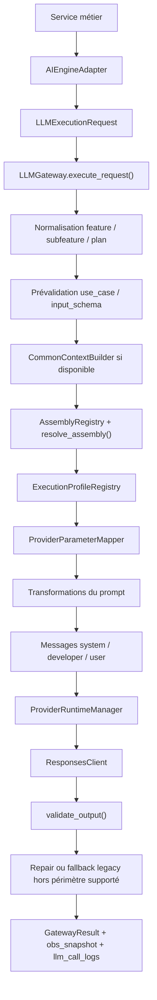
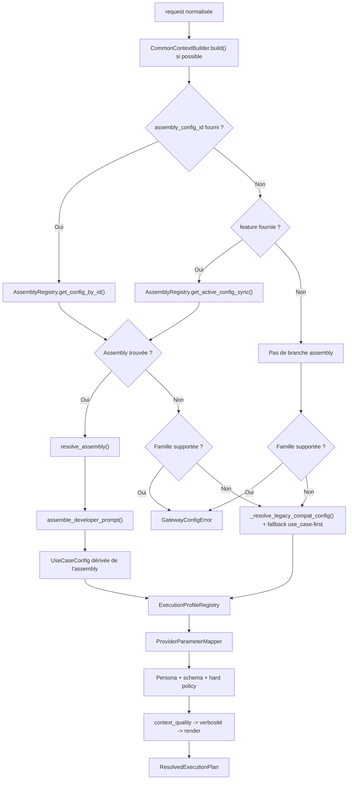
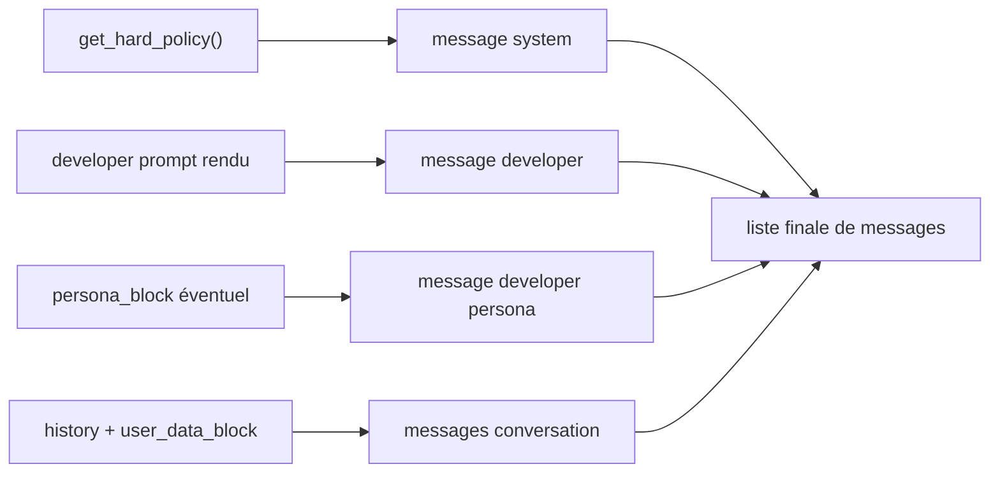

# Génération des Prompts LLM par Feature

## Introduction

Ce document décrit comment l'application construit aujourd'hui le prompt envoyé au LLM.

En langage simple, le processus est le suivant :

1. un service métier construit une requête canonique `LLMExecutionRequest` ;
2. le gateway normalise la taxonomie (`feature`, `subfeature`, `plan`) et complète le contexte ;
3. une assembly active est résolue pour choisir les bons blocs de prompt ;
4. un profil d'exécution résout le provider, le modèle et les paramètres techniques ;
5. le prompt développeur est enrichi dans un ordre fixe : assembly, budget de longueur, compensation `context_quality`, consigne de verbosité, rendu des placeholders ;
6. les messages finaux sont envoyés au provider, puis la sortie est validée et journalisée.

Les objectifs de ce pipeline sont :

- avoir une seule chaîne de construction du prompt ;
- éviter les variations concurrentes entre `use_case`, assembly, persona et paramètres provider ;
- garantir que les familles canoniques (`chat`, `guidance`, `natal`, `horoscope_daily`) passent par une configuration publiable et vérifiable ;
- rendre le comportement observable, testable et rollbackable via les release snapshots.

Le document suit le code réel, pas une architecture cible théorique.

## Maintenance de cette documentation

La maintenance de cette documentation est **obligatoire** lors de tout changement du pipeline décrit ici (gateway, assemblies, profils, releases). Les mises à jour doivent rester **traçables** via le bloc « Dernière vérification manuelle » (référence stable, date). En cas d’absence de mise à jour du document alors que le code change, une **justification d’absence de changement** est requise ; l’équipe peut aussi **justifier explicitement** pourquoi le document reste inchangé.

## Portée

Le document couvre le pipeline réellement exécuté dans :

- `backend/app/application/llm/ai_engine_adapter.py`
- `backend/app/domain/llm/runtime/gateway.py`
- `backend/app/domain/llm/governance/legacy_residual_registry.py`
- `backend/app/domain/llm/configuration/assembly_registry.py`
- `backend/app/domain/llm/configuration/assembly_resolver.py`
- `backend/app/domain/llm/configuration/execution_profile_registry.py`
- `backend/app/domain/llm/runtime/provider_parameter_mapper.py`
- `backend/app/domain/llm/prompting/prompt_renderer.py`
- `backend/app/domain/llm/runtime/context_quality_injector.py`
- `backend/app/domain/llm/runtime/length_budget_injector.py`
- `backend/app/domain/llm/prompting/context.py`
- `backend/app/ops/llm/release_service.py`
- `backend/app/domain/llm/configuration/config_coherence_validator.py`
- `backend/app/domain/llm/governance/data/prompt_governance_registry.json` (registre central versionné, Story 66.42)
- `backend/app/domain/llm/governance/prompt_governance_registry.py`
- `backend/app/ops/llm/semantic_invariants_registry.py`
- `backend/app/ops/llm/semantic_conformity_validator.py`
- `backend/app/domain/llm/runtime/provider_runtime_manager.py`
- `backend/app/domain/llm/runtime/observability_service.py`
- `backend/app/api/v1/routers/admin_llm_release.py`
- `backend/scripts/check_doc_conformity.py`
- `backend/scripts/build_llm_release_candidate.py`
- `backend/scripts/build_llm_release_readiness_report.py`
- `backend/scripts/build_llm_qualification_evidence.py`
- `backend/scripts/build_llm_golden_evidence.py`
- `backend/scripts/build_llm_smoke_evidence.py`
- `backend/scripts/legacy_residual_report.py`
- `backend/tests/fixtures/golden/natal_premium_test.yaml`
- `backend/tests/integration/test_story_66_43_provider_runtime_chaos.py`
- `scripts/activate-llm-release.ps1`
- `scripts/llm-release-readiness.ps1`

## Vue d'ensemble



Référence des étapes nommées côté `LLMGateway` (alignement contrôles 66.26) : `_resolve_plan()`, `execute_request()`, `_build_messages()`, `_call_provider()`.

## Familles canoniques et points d'entrée

| Famille | Point d'entrée réel | Taxonomie injectée | Gouvernance |
|---|---|---|---|
| `chat` | `AIEngineAdapter.generate_chat_reply()` | `feature="chat"`, `subfeature="astrologer"` | `nominal_canonical` |
| `guidance` | `AIEngineAdapter.generate_guidance()` | `feature="guidance"`, `subfeature` dérivée du `use_case` | `nominal_canonical` |
| `natal` | `AIEngineAdapter.generate_natal_interpretation()` | `feature="natal"`, `subfeature` normalisée | `nominal_canonical` |
| `horoscope_daily` | `AIEngineAdapter.generate_horoscope_narration()` | `feature="horoscope_daily"`, `subfeature="narration"` | `nominal_canonical` |

Compatibilités legacy encore gérées :

- `natal_interpretation` comme feature legacy est mappé vers `natal`
- `daily_prediction` comme feature legacy est mappé vers `horoscope_daily`
- les anciennes clés `use_case` runtime supprimées sont désormais retirées du nominal et rejetées explicitement.

## Registre central de gouvernance (Story 66.42)

La taxonomie canonique (familles, aliases nominaux, sous-familles natales), les aliases de `use_case` dépréciés et les placeholders autorisés sont définis dans un **seul artefact versionné** : `backend/app/domain/llm/governance/data/prompt_governance_registry.json` (champ `schema_version`, actuellement `1.0.0`).

- **Canonique vs legacy transitoire** : les clés `legacy_nominal_feature_aliases` et `legacy_subfeature_aliases_by_domain` décrivent explicitement la compatibilité de migration ; elles ne sont pas des extensions ad hoc de la taxonomie canonique.
- **Placeholders** : la gouvernance runtime combine `universal_placeholders` et `placeholders_by_family` ; `PromptRenderer` et `ConfigCoherenceValidator` passent tous deux par `PromptGovernanceRegistry` / `PLACEHOLDER_ALLOWLIST` dérivés du JSON.
- **Exceptions** : toute entrée dans `governed_exceptions` doit porter owner, justification, périmètre, statut et `review_by` ; une entrée incomplète fait échouer le chargement du registre.
- **État actuel** : dans l'arbre courant, `governed_exceptions` est vide ; le périmètre autorisé reste donc strictement celui du registre canonique, avec notamment `natal_chart_summary` rétabli comme placeholder `chat` optionnel.
- **Aliases use_case** : `deprecated_use_case_mapping` est désormais vide pour le runtime nominal ; les anciennes clés supprimées restent traitées en rejet explicite.

## Classes impliquées dans la génération du prompt

| Classe / fonction | Rôle réel |
|---|---|
| `AIEngineAdapter` | point d'entrée applicatif ; construit `LLMExecutionRequest` |
| `ExecutionUserInput` | porte `use_case`, `feature`, `subfeature`, `plan`, question/message |
| `ExecutionContext` | porte l'historique, `natal_data`, `chart_json`, `astro_context`, `extra_context` |
| `ExecutionFlags` | porte les flags de réparation, validation stricte, skip common context, simulation |
| `LLMExecutionRequest` | contrat canonique transmis au gateway |
| `LLMGateway` | orchestration centrale de résolution, transformation, exécution, validation |
| `CommonContextBuilder` | construit le contexte commun métier quand `user_id` et DB sont disponibles |
| `QualifiedContext` | qualifie le contexte en `full`, `partial` ou `minimal` |
| `AssemblyRegistry` | résout l'assembly active depuis le snapshot actif ou les tables publiées |
| `PromptAssemblyConfigModel` | configuration d'assembly publiée en base |
| `ResolvedAssembly` | artefact intermédiaire après résolution assembly |
| `resolve_assembly()` | résout templates, persona, rules, execution config, output contract |
| `assemble_developer_prompt()` | concatène les blocs texte de l'assembly |
| `LengthBudgetInjector` | injecte la consigne éditoriale de longueur dans le developer prompt |
| `ContextQualityInjector` | ajoute une compensation si le template ne traite pas déjà `context_quality` |
| `PromptRenderer` | résout d'abord les blocs `{{#context_quality:...}}`, puis les placeholders `{{...}}` |
| `ExecutionProfileRegistry` | résout le profil d'exécution depuis le snapshot actif ou en waterfall |
| `LlmExecutionProfileModel` | profil provider/modèle/raisoning/verbosity/output/tool |
| `ProviderParameterMapper` | traduit les profils stables internes en paramètres provider |
| `compose_persona_block()` | produit le bloc stylistique persona séparé du developer prompt |
| `ResolvedExecutionPlan` | vérité immuable de l'exécution courante |
| `ProviderRuntimeManager` | gère retries, circuit breaker, timeout et classification d'erreurs |
| `ResponsesClient` | exécute l'appel Responses API |
| `validate_output()` | valide la sortie LLM contre le schéma résolu |
| `ReleaseService` | construit, valide, active et rollback les snapshots de release |
| `ConfigCoherenceValidator` | bloque les configurations incohérentes au publish et au boot |
| `ExecutionObservabilitySnapshot` | snapshot canonique d'observabilité propagé dans le résultat |

## Ordre exact du pipeline dans le gateway

Le flux réel dans `LLMGateway.execute_request()` est :

1. rejeter tôt les anciennes clés `use_case` supprimées et normaliser `feature/subfeature/plan` sur la taxonomie canonique ;
2. normaliser `feature`, `subfeature` et `plan` ;
3. fusionner `context` et `extra_context` ;
4. exécuter une prévalidation Stage 0.5 via `_resolve_legacy_compat_config()` puis `_validate_input()` uniquement pour les chemins legacy hors périmètre supporté ;
5. appeler `_resolve_plan()` ;
6. refaire une validation Stage 1.5 à partir de la config réellement résolue depuis le plan ;
7. composer les messages finaux ;
8. appeler le provider ;
9. valider la sortie ;
10. tenter une réparation, puis éventuellement un `fallback_use_case` legacy ;
11. construire le `GatewayResult` final et le snapshot d'observabilité.

Point important : la Stage 0.5 n'est plus la source de vérité pour les familles supportées. Sur `chat`, `guidance`, `natal` et `horoscope_daily`, la validation d'entrée utile doit partir du plan canonique résolu depuis l'assembly et l'`ExecutionProfile`, pas d'un `use_case` legacy ou d'un catalogue Python.

## Lecture admin de référence

La surface admin `/admin/prompts/catalog` doit désormais exposer la chaîne de prompting en **trois niveaux distincts**, sans reconstruire une pipeline pédagogique parallèle :

1. `Activation`
   - sélection canonique (`feature`, `subfeature`, `plan`, `locale`, `manifest_entry_id`)
   - snapshot actif
   - profil d'exécution et cible provider
   - famille de policy, schéma de sortie, injecteurs et stratégie persona
2. `Composants sélectionnés`
   - briques source versionnées ou référencées (`domain instructions`, `use case overlay`, `plan overlay` uniquement s'il existe comme couche distincte, `persona overlay`, `output contract`, `hard policy`, etc.)
   - un bloc purement nominal ne doit pas être affiché comme prompt autonome
3. `Artefacts runtime`
   - états réellement observables au moment de l'appel provider
   - `developer prompt assembled`
   - `developer prompt after persona` uniquement si la persona ajoute réellement un message
   - `developer prompt after injectors`
   - `system prompt(s)`
   - `final provider payload`

Règle de lecture : l'admin ne doit plus afficher plusieurs "prompts finaux" textuels successifs si aucun delta n'est observable. Quand la persona ou la hard policy restent envoyées comme messages séparés, leur point d'injection doit être visible explicitement à ce niveau.

### Registre d'invariants sémantiques exécutable (Story 66.41)

Un registre versionné (`backend/app/ops/llm/semantic_invariants_registry.py`, clé `SEMANTIC_INVARIANTS_VERSION`) formalise des invariants d'architecture **bornés** et les confronte au code réel via `SemanticConformityValidator` (`backend/app/ops/llm/semantic_conformity_validator.py`). La validation sémantique est branchée sur le **même** script CLI que le garde structurel (`backend/scripts/check_doc_conformity.py`), sans second point d'entrée parallèle.

**Contenu typique du registre (à maintenir aligné avec le code) :**

- **Ordre des transformations** du developer prompt : séquence attendue dans `assemble_developer_prompt` (budget de longueur puis `context_quality`) et dans `LLMGateway._resolve_plan` (`context_quality` → verbosité → rendu `PromptRenderer`).
- **Priorité snapshot actif** : dans `AssemblyRegistry.get_active_config` / `get_active_config_sync` et `ExecutionProfileRegistry.get_active_profile`, aucune requête `select` sur le modèle ORM « live » (`PromptAssemblyConfigModel`, `LlmExecutionProfileModel`) avant le premier `if snapshot:` ni dans la branche `if snapshot:` ; le fallback tables ne doit apparaître que dans le `else` associé (contrôle AST).
- **Gouvernance nominale** : égalité stricte entre le registre et les ensembles runtime (`SUPPORTED_FAMILIES`, `NOMINAL_SUPPORTED_PROVIDERS`), les aliases legacy → canonique documentés, et l'ensemble des noms du enum `FallbackType`.
- **Propagation** : présence des champs critiques sur `ResolvedExecutionPlan` et `ExecutionObservabilitySnapshot` ; marqueurs snapshot dans la persistance d'observabilité (`log_call`).

**Sortie CI (`check_doc_conformity.py --json`) :** chaque violation sémantique expose des champs stables (`semantic_code`, `invariant_id`, `component`, `message`, `detail`, …) en plus du libellé agrégé, pour consommation automatique sans reparse de texte libre.

Toute évolution volontaire de ces invariants doit mettre à jour **ce document** et le registre **ensemble**.

## Détail de `_resolve_plan()`



Dans `_resolve_plan()` :

- `CommonContextBuilder.build()` n'est exécuté que si `db` est disponible, `user_id` est renseigné et `skip_common_context` est faux ;
- la résolution assembly passe d'abord par l'ID explicite si `assembly_config_id` est fourni ;
- sinon, la résolution se fait par waterfall sur `feature/subfeature/plan/locale` ;
- si une famille supportée n'a pas d'assembly active, le runtime lève une `GatewayConfigError` avec `error_code="missing_assembly"` et émet `supported_perimeter_rejection` ;
- si aucune assembly n'est trouvée pour une famille non supportée, le code peut encore tomber sur `_resolve_legacy_compat_config()` et donc sur le chemin legacy `USE_CASE_FIRST`, explicitement borné hors nominal ;
- les métadonnées legacy encore nécessaires au runtime non nominal vivent désormais dans `app.domain.llm.prompting.legacy_prompt_runtime`, pas dans `app.prompts.catalog`.
- `PromptRegistryV2` n'est plus une dépendance runtime du gateway ; il reste une surface admin/history/publish explicitement bornée.

## Comment le developer prompt est réellement construit

### 1. Résolution assembly

`resolve_assembly()` construit un `ResolvedAssembly` à partir de `PromptAssemblyConfigModel`.

Éléments résolus :

- `feature_template_prompt`
- `subfeature_template_prompt`
- `plan_rules_content`
- `persona_block`
- `execution_config`
- `output_contract_ref`
- `input_schema`
- `length_budget`
- `policy_layer_content`

### 2. Concaténation des blocs texte

`assemble_developer_prompt()` concatène uniquement :

1. le bloc feature si `feature_enabled`
2. le bloc subfeature si `subfeature_enabled`
3. le bloc plan rules si `plan_rules_enabled`

La persona n'est pas concaténée dans ce developer prompt. Elle reste un bloc séparé injecté plus tard comme message `developer`.

### 3. Injection de longueur

Si une `LengthBudget` existe :

- `LengthBudgetInjector.inject_into_developer_prompt()` ajoute une consigne `[CONSIGNE DE LONGUEUR]`
- `global_max_tokens` peut aussi influencer `max_output_tokens` au niveau du plan

### 4. Gestion de `context_quality`

`ContextQualityInjector.inject()` agit avant le rendu des placeholders :

- si `context_quality == "full"` : aucune injection ;
- si le template contient déjà `{{#context_quality:<niveau>}}...{{/context_quality}}` : pas d'injection automatique et `context_quality_handled_by_template=True` ;
- sinon une instruction compensatoire est ajoutée en fin de prompt et `context_quality_instruction_injected=True`.

### 5. Injection de verbosité

`ProviderParameterMapper.resolve_verbosity_instruction()` peut ajouter une consigne `[CONSIGNE DE VERBOSITÉ]` :

- `concise` -> instruction de concision + recommandation `800` tokens
- `balanced` -> pas d'instruction textuelle
- `detailed` -> instruction de richesse + recommandation `4000` tokens

### 6. Rendu final

`PromptRenderer.render()` applique cet ordre :

1. résolution des blocs `{{#context_quality:...}}`
2. contrôle des placeholders autorisés selon la famille résolue plus les placeholders universels
3. application des fallbacks pour les placeholders optionnels
4. substitution finale `{{placeholder}}`

Si une variable requise manque sur un périmètre bloquant, le renderer lève `PromptRenderError`. Sur une famille supportée, un placeholder non gouverné est vidé et journalisé ; sur un placeholder legacy marqué requis, l'erreur reste bloquante.

## Ce qui entre dans les messages finaux

Le gateway ne pousse pas "un seul prompt". Il construit une liste de messages :

- un message `system` contenant `get_hard_policy(config.safety_profile)`
- un message `developer` contenant le developer prompt rendu
- un second message `developer` si une persona a été résolue
- puis l'historique et le payload utilisateur en mode `chat`
- ou directement le payload utilisateur en mode `structured`

Construction du payload utilisateur :

- `build_user_payload()` centralise le bloc utilisateur standard ;
- en chat d'ouverture, `build_opening_chat_user_data_block()` peut construire un bloc spécifique ;
- si `chart_json` est déjà injecté dans le developer prompt, il n'est pas dupliqué dans le payload utilisateur.



## Taxonomie et normalisation

Règles centrales :

- `SUPPORTED_FAMILIES = {"chat", "guidance", "natal", "horoscope_daily"}`
- `natal_interpretation` en tant que feature est un alias normalisé vers `natal`
- `normalize_subfeature("natal", "natal_interpretation")` retourne `interpretation`
- `_normalize_plan_for_assembly()` convertit `premium`, `pro`, `ultra`, `full` en `premium`
- toute autre valeur de plan, y compris absence, est normalisée en `free`

Conséquence :

- la profondeur business est portée par `plan`
- les anciennes clés `use_case` supprimées ne font plus partie du chemin nominal ; l'entrée doit être canonique.

## Execution profiles et provider

`ExecutionProfileRegistry` résout les profils dans cet ordre :

1. profil embarqué dans le snapshot actif si une release active existe ;
2. si une assembly référence explicitement `execution_profile_ref`, priorité à cette référence ;
3. sinon waterfall `feature/subfeature/plan`, puis `feature/subfeature`, puis `feature`.

`ProviderParameterMapper` convertit ensuite les profils internes en paramètres provider :

- pour `openai` : `reasoning_effort`, `response_format`, `tool_choice`
- pour `anthropic` : un mapping existe dans le code, mais il n'est pas nominalement autorisé sur le périmètre supporté

Règle nominale actuelle :

- l'appel provider passe aujourd'hui nominalement uniquement par `openai`
- `openai` seul provider nominalement supporté
- `NOMINAL_SUPPORTED_PROVIDERS = ["openai"]`

Si un provider non supporté ou un mapping provider échoue :

- sur une famille supportée : rejet explicite (`unsupported_execution_provider` ou `provider_mapping_failed`)
- hors périmètre supporté : compatibilité legacy possible avec retombée vers `openai`

## Fallbacks réellement permis

Les règles de gouvernance viennent du **registre résiduel versionné**
(`backend/app/domain/llm/governance/data/legacy_residual_registry.json`), projeté exclusivement par
`FallbackGovernanceRegistry` sans matrice parallèle (Story 66.40).

### Registre résiduel et stratégie d'extinction

- **Deny-by-default (cible)** : toute nouvelle tolérance legacy doit être ajoutée explicitement au
  registre avec `owner`, `justification`, statut de gouvernance et date de revue ou d'extinction ;
  l'absence d'entrée ne constitue pas une autorisation implicite.
- **Blocage progressif** : la variable d'environnement `LLM_LEGACY_PROGRESSIVE_BLOCKLIST` accepte
  une liste de `stable_id` (séparés par des virgules) fusionnée avec le champ
  `progressive_blocklist_stable_ids` du JSON ; lorsqu'un identifiant est listé, toute activation
  correspondante échoue avec une erreur stable orientée revue.
- **Identifiants `stable_id`** : uniques sur l'ensemble du registre (chemins fallback, aliases
  gouvernés, use cases dépréciés) ; un doublon fait échouer le chargement.
- **Observabilité** : chaque activation enregistrée via `FallbackGovernanceRegistry.track_fallback`
  émet en complément le compteur `llm_legacy_residual_activation_total` (labels : `stable_id`,
  `path_kind`, `fallback_type`, `feature`, `subfeature`, `call_site`, `activation_reason`,
  `is_nominal`, `runtime_context`) et un événement agrégé `legacy_residual_activation` sur
  `llm_governance_event_total`. Les tentatives **bloquées** par la liste progressive émettent
  d'abord `llm_legacy_residual_blocked_attempt_total`, un point `llm_gateway_fallback_usage_total`
  avec `outcome=progressive_block_intercepted`, puis l'événement `legacy_residual_blocked`, avant
  la levée de l'erreur — pour conserver la visibilité ops pendant une extinction par phases.

Sur le périmètre supporté :

- `USE_CASE_FIRST` est `à retirer` sur `chat`, `guidance`, `horoscope_daily`, `natal`
- `RESOLVE_MODEL` est `à retirer` sur `chat`, `guidance`, `horoscope_daily`, `natal`

En pratique :

- une famille supportée sans assembly active est rejetée ;
- une famille supportée sans `ExecutionProfile` valide est rejetée ;
- une famille supportée ne doit pas publier un `ResolvedExecutionPlan` réussi avec `fallback_resolve_model` ni `fallback_provider_unsupported` ;
- quand un chemin legacy hors nominal doit encore résoudre un modèle ou un schéma, il passe par `legacy_prompt_runtime` comme couche de compatibilité explicitement bornée.

Le `fallback_use_case` configuré dans `UseCaseConfig` existe encore, mais il intervient après échec de validation ou de récupération, et il reste destiné aux chemins legacy ou hors périmètre supporté.

## Release snapshots : source de vérité runtime

Depuis les stories de release, le runtime nominal s'appuie sur `ReleaseService` et les tables :

- `LlmReleaseSnapshotModel`
- `LlmActiveReleaseModel`

Le snapshot actif fige pour chaque target :

- l'assembly
- le profil d'exécution
- le schéma de sortie éventuel

`AssemblyRegistry` et `ExecutionProfileRegistry` priorisent ce snapshot actif avant les tables live. Le gateway propage ensuite :

- `active_snapshot_id`
- `active_snapshot_version`
- `manifest_entry_id`

dans `ResolvedExecutionPlan`, puis dans `ExecutionObservabilitySnapshot`, puis dans `llm_call_logs`.

## Validation de cohérence avant runtime

`ConfigCoherenceValidator` vérifie notamment :

- qu'une famille nominale ne dépend pas d'une feature legacy interdite ;
- qu'un `ExecutionProfile` existe ou est résoluble ;
- que le provider est nominalement supporté ;
- que le contrat de sortie référencé existe ;
- que les placeholders respectent l'allowlist de la famille ;
- que la persona référencée existe et est activée ;
- que les `plan_rules` ne sortent pas de leur périmètre ;
- que la `LengthBudget` reste dans ses bornes.

Au boot, `run_llm_coherence_startup_validation()` privilégie le snapshot actif s'il existe.

Le démarrage applicatif ne s'appuie plus sur une validation bloquante `catalog vs db` ni sur un reseed implicite du registre LLM legacy pour masquer une incohérence canonique. En local, un reseed legacy n'est encore possible que derrière le flag explicite `DEV_ALLOW_LEGACY_SEED`; sans ce flag, le boot doit réussir avec les seules données canoniques présentes ou échouer clairement via les validations canoniques.

## Observabilité, qualification et golden gate

Le résultat final expose un `ExecutionObservabilitySnapshot`. Il est :

- porté par `GatewayMeta.obs_snapshot`
- persisté dans `llm_call_logs`
- utilisé pour les dashboards ops
- réutilisé par les campagnes de qualification et de golden regression

Qualification de charge :

- `PerformanceQualificationService` refuse une qualification sans `active_snapshot_id`
- il exige aussi `active_snapshot_version`
- `manifest_entry_id` doit être résolu de façon non ambiguë

Golden regression :

- `GoldenRegressionService` rejette une campagne si le snapshot actif ne peut pas être corrélé
- les familles canoniques utilisent `GOLDEN_REGISTRY`
- les chemins legacy interdits y sont explicitement bannis

## Outillage opératoire de release

L'Epic 66 ne s'arrête plus aux garde-fous runtime. Le dépôt embarque désormais la chaîne opératoire minimale pour construire, qualifier, régresser, activer et relire une release LLM sans dépendre d'une connaissance implicite de l'application.

Scripts source de vérité :

- `backend/scripts/build_llm_release_candidate.py` construit le snapshot candidat versionné ;
- `backend/scripts/build_llm_release_readiness_report.py` agrège l'état des preuves doc/code, chaos, legacy, qualification, golden et smoke ;
- `backend/scripts/build_llm_qualification_evidence.py` génère une qualification corrélée à un snapshot et à un `manifest_entry_id` ;
- `backend/scripts/build_llm_golden_evidence.py` génère une golden regression corrélée sur le même triplet ;
- `backend/scripts/build_llm_smoke_evidence.py` produit la preuve de smoke post-activation ;
- `scripts/llm-release-readiness.ps1` enchaîne la construction locale du dossier de preuve ;
- `scripts/activate-llm-release.ps1` pousse l'activation seulement si les preuves passées en argument restent acceptables pour le gate backend.

Artefacts d'environnement produits par cette chaîne :

- `artifacts/llm-release-candidate.json`
- `artifacts/llm-doc-conformity.json`
- `artifacts/chaos/story-66-43-chaos-report.json`
- `artifacts/llm-qualification-evidence-premium.json`
- `artifacts/llm-golden-evidence-premium.json`
- `artifacts/llm-smoke-evidence-premium.json`
- `artifacts/llm-release-readiness-premium.json`
- `artifacts/llm-activation-response.json`

Ces artefacts ne sont pas des sources de configuration. Ils sont des preuves corrélées, propres à un environnement d'exécution donné.

## Cible validée et ajustements runtime associés

La cible utilisée pour stabiliser la chaîne de promotion est :

- `natal:interpretation:premium:fr-FR`

Pour rendre ce chemin promouvable, les ajustements suivants ont été opérés dans le runtime :

- les campagnes qualification/golden rejouent désormais le pipeline canonique via `LLMGateway.execute_request()` au lieu d'un chemin legacy parallèle ;
- la fixture premium dédiée `backend/tests/fixtures/golden/natal_premium_test.yaml` a été ajoutée pour valider le contrat enrichi `AstroResponse_v3` ;
- `ExecutionConfigAdmin` n'impose plus une `temperature` invalide sur les reasoning models compatibles `gpt-5` ;
- le gateway complète un `persona_name` par défaut lorsque certains prompts d'assembly l'exigent encore ;
- le marquage `is_legacy_compatibility` ne s'applique plus aux exécutions déjà normalisées en canonique ;
- `execution_path_kind` reste lisible comme `canonical_assembly` même lorsque le plan applique des overrides techniques nominalement autorisés.

## Gate de production continue par snapshot actif (Story 66.44)

Le passage en production est désormais gouverné par un gate continu centré sur le snapshot candidat/actif :

- l'activation via `ReleaseService.activate_snapshot()` est bloquée sans qualification corrélée (`active_snapshot_id`, `active_snapshot_version`) et fraîche ;
- l'activation est bloquée sans golden regression corrélée, valide et fraîche ;
- un smoke post-activation corrélé est obligatoire ; son absence ou son échec ne revient pas en arrière automatiquement, mais fait basculer immédiatement `manifest.release_health.status` en `degraded` après activation ;
- l'état synthétique de release health est historisé dans `manifest.release_health` ; la taxonomie embarquée expose `candidate`, `qualified`, `activated`, `monitoring`, `degraded`, `rollback_recommended`, `rolled_back`, tandis que les transitions actuellement écrites par le code passent surtout par `monitoring`, `activated`, `degraded`, `rollback_recommended` et `rolled_back` ;
- la décision de rollback est gouvernée par des seuils versionnés (`error_rate`, `p95_latency_ms`, `fallback_rate`) évalués par `ReleaseService.evaluate_release_health()`.

Lecture ops recommandée :

- utiliser `POST /admin/llm/releases/{snapshot_id}/release-health` pour injecter les signaux observés ;
- déclencher `auto_rollback=true` uniquement pour les environnements où la politique le permet ;
- garder en tête les seuils par défaut si aucun override n'est fourni à l'activation : `error_rate=0.02`, `p95_latency_ms=1500`, `fallback_rate=0.01` ;
- conserver les preuves qualification/golden/smoke pour chaque activation afin d'assurer la traçabilité bout-en-bout.

Séquence opératoire minimale désormais attendue avant promotion :

1. construire le snapshot candidat ;
2. produire la conformité doc/code ;
3. produire ou relire le chaos report 66.43 ;
4. produire la qualification corrélée ;
5. produire la golden corrélée ;
6. produire le smoke corrélé ;
7. appeler `scripts/activate-llm-release.ps1` contre l'API cible ;
8. relire `artifacts/llm-activation-response.json` puis `release_health`.

Le dernier passage validé en préproduction a abouti à une activation du snapshot `e2e7191a-b403-42b9-911a-43c6f442420e` (`release-candidate-ready`) avec :

- une qualification corrélée `go-with-constraints` à cause d'une latence `p95` supérieure au seuil SLO ;
- une golden corrélée `pass` ;
- un smoke corrélé présent ;
- une réponse d'activation `status=active`.

## Protection des données sensibles autour du prompt

Le pipeline ne doit pas transformer l'observabilité en fuite de prompt ou de contenu utilisateur.

La source de vérité est `backend/app/core/sensitive_data.py`.

Règles structurantes :

- `llm_call_logs` ne stocke pas le prompt brut ni le contenu utilisateur brut ;
- `compute_input_hash()` hash l'entrée après sanitation `Sink.LLM_CALL_LOGS` ;
- `LlmReplaySnapshotModel` reste la zone chiffrée de rejouabilité ;
- `obs_snapshot` ne transporte que des métadonnées opérationnelles autorisées ;
- `log_call()` et les surfaces admin/audit passent par `sanitize_payload()`.

## Classification doctrinale de `obs_snapshot`

Cette classification doit rester alignée avec `OBS_SNAPSHOT_CLASSIFICATION_DEFAULT`.

- `strict`: `pipeline_kind`, `execution_path_kind`, `fallback_kind`, triplet provider (`requested_provider`, `resolved_provider`, `executed_provider`), `context_compensation_status`, `max_output_tokens_source`
- `thresholded`: `max_output_tokens_final`
- `informational`: `executed_provider_mode`, `attempt_count`, `provider_error_code`, `breaker_state`, `breaker_scope`, `active_snapshot_id`, `active_snapshot_version`, `manifest_entry_id`

## Couverture de l'epic 66

Le document couvre l'epic 66 sous l'angle du pipeline de génération de prompt et de son exécution runtime.

| Story | Couverture dans le pipeline actuel |
|---|---|
| `66.9` | unification `use_case -> feature/subfeature/plan` via taxonomie gouvernée |
| `66.10` | la persona reste une couche de style séparée du developer prompt |
| `66.11` | `ExecutionProfile` découple texte et exécution |
| `66.12` | `LengthBudget` agit sur le prompt et potentiellement sur `max_output_tokens` |
| `66.13` | politique de placeholders par famille dans `PromptRenderer` et `assembly_resolver` |
| `66.42` | registre JSON unique pour taxonomie, aliases et placeholders ; enforcement publish/runtime/CI |
| `66.14` | `context_quality` géré par template ou injecteur |
| `66.15` | convergence des points d'entrée métier dans `AIEngineAdapter` |
| `66.16` | matrice d'évaluation devenue base des campagnes de qualification/golden |
| `66.17` | garde-fous de responsabilité sur `plan_rules` et `ResolvedExecutionPlan` immuable |
| `66.18` | profils stables et mapping provider spécifique |
| `66.19` | `generate_horoscope_narration()` devient le chemin canonique daily |
| `66.20` | assembly obligatoire sur les familles convergées |
| `66.21` | gouvernance centralisée des fallbacks |
| `66.22` | verrou provider nominal sur `openai` |
| `66.23` | taxonomie canonique `natal` et normalisation des subfeatures |
| `66.24` | `pipeline_kind` et matrice daily alignés sur `horoscope_daily` |
| `66.25` | `ExecutionObservabilitySnapshot` devient la vue canonique d'observabilité |
| `66.26` | gouvernance documentaire autour du pipeline |
| `66.27` | propagation de `context_quality_handled_by_template` et du statut de compensation |
| `66.28` | convergence du daily sur `horoscope_daily` canonique |
| `66.29` | extinction du fallback `use_case-first` sur le périmètre supporté |
| `66.30` | extinction du fallback `resolve_model` sur le périmètre supporté |
| `66.31` | validation fail-fast de cohérence au publish et au boot |
| `66.32` | snapshot de release actif comme vérité runtime corrélable |
| `66.33` | durcissement provider avec retries, breaker, timeout et taxonomie d'erreurs |
| `66.34` | sanitation et frontières de non-fuite autour des logs et replays |
| `66.35` | qualification de charge corrélée à la release active |
| `66.36` | golden regression gate bloquant avant publication |
| `66.37` | lecture ops enrichie par les snapshots et discriminants de pipeline |
| `66.38` | manifeste et contrôle doc/code |
| `66.39` | durcissement du validateur de conformité documentaire |
| `66.40` | registre central du legacy résiduel, télémétrie, blocage progressif, anti-réintroduction |
| `66.43` | campagne de chaos déterministe sur `ProviderRuntimeManager` avec rapport d'invariants de résilience |
| `66.44` | gate continue activation/smoke/monitoring/rollback gouverné par snapshot actif |

Complément opératoire Epic 66 :

- la documentation de gouvernance runtime reste concentrée dans ce document ;
- la documentation opérateur associée est portée par `docs/llm-release-runbook.md`, `docs/llm-go-no-go-formal.md` et `docs/llm-prod-release-step-by-step.md` ;
- aucun autre document markdown dédié aux stories Epic 66 n'est aujourd'hui utilisé comme source de vérité d'exploitation dans ce dépôt.

## Règles de maintenance

- toute affirmation de ce document doit rester vérifiable dans le dépôt ;
- si le code diverge, le code fait foi ;
- toute modification d'un fichier du manifeste documentaire doit déclencher une revue de ce document ;
- les schémas Mermaid doivent refléter le flux réel et non un flux idéal.

## Campagne chaos provider runtime (Story 66.43)

Objectif : prouver la résilience opérationnelle de `ProviderRuntimeManager` par scénarios déterministes, sans dépendance réseau/provider réel.

Suite de référence :

- `backend/tests/integration/test_story_66_43_provider_runtime_chaos.py`

Scénarios couverts :

- `rate_limit` avec épuisement du retry budget ;
- `timeout` avec épuisement du retry budget ;
- `5xx` avec classification retryable puis épuisement ;
- `breaker open` après échecs répétés ;
- panne partielle suivie d'un rétablissement nominal ;
- erreur de configuration non reclassée en incident provider.

Invariants vérifiés dans le rapport :

- cohérence `attempt_count` / budget de retries ;
- taxonomie `provider_error_code` et état `breaker_state` ;
- scope de résilience `breaker_scope` ;
- fermeture stricte du nominal (`executed_provider_mode=nominal` ou `circuit_open`) sans réouverture fallback ;
- corrélation snapshot quand pertinente (`active_snapshot_id`, `active_snapshot_version`, `manifest_entry_id`) sur le scénario de rétablissement nominal.

Format de sortie attendu :

- liste structurée d'objets `scenario`, `failure_type`, `invariant`, `passed`, `observed` ;
- `observed` contient les discriminants d'observabilité exploitables par ops ;
- un artefact JSON est produit à chaque run (`CHAOS_REPORT_PATH` si défini, sinon un chemin unique par exécution dans `backend/.pytest_cache/chaos/...`, avec fallback `tempfile.gettempdir()` si indisponible) pour exploitation locale/CI ;
- le runtime de test réutilise ensuite le même chemin effectif pour relire et enrichir le rapport de campagne, y compris si l'écriture a basculé sur le fallback `tempfile`.

Exemple d'exécution CI (Linux runner) :

```bash
mkdir -p artifacts/chaos
export CHAOS_REPORT_PATH="artifacts/chaos/story-66-43-chaos-report.json"
pytest -q backend/tests/integration/test_story_66_43_provider_runtime_chaos.py
```

Exemple d'exécution CI (Windows runner / PowerShell) :

```powershell
New-Item -ItemType Directory -Force -Path artifacts/chaos | Out-Null
$env:CHAOS_REPORT_PATH = "artifacts/chaos/story-66-43-chaos-report.json"
pytest -q backend/tests/integration/test_story_66_43_provider_runtime_chaos.py
```

Points d'exploitation recommandés :

- publier `artifacts/chaos/story-66-43-chaos-report.json` en artifact de pipeline ;
- optionnellement parser `all_passed` et `scenario_count` pour enrichir les quality gates ops ;
- conserver l'artefact par build pour audit de résilience et comparaison inter-runs.
- en exécution locale sans `CHAOS_REPORT_PATH`, le rapport reste isolé du dépôt et ne doit pas être utilisé comme artefact partagé entre plusieurs runs.

Limites explicites :

- cette campagne valide la résilience provider runtime, pas la charge globale ;
- la couverture snapshot dans cette campagne reste bornée aux cas pertinents où ces métadonnées sont disponibles dans `obs_snapshot` (la couverture bout-en-bout complète demeure portée par les suites gateway/observabilité).

Dernière vérification manuelle contre le pipeline réel du gateway :

- **Date** : `2026-04-20`
- **Référence stable (Commit SHA)** : `6acae1e530a207aad95fe725589b9bc505c30826`
- **Version registre de gouvernance prompt** : `1.0.0`
- **Version registre résiduel** : `2026.04.14`
