# Génération des Prompts LLM par Feature

Ce document décrit, à partir du code backend, comment les prompts sont générés par famille de features dans l'application.

Objectif :

- montrer les points d'entrée métier ;
- distinguer le chemin standard par `use_case` et le chemin `assembly` par `feature/subfeature/plan` ;
- expliciter les couches réellement envoyées au provider LLM.

## Périmètre du document

Ce document décrit l'état actuel du backend tel qu'il fonctionne aujourd'hui.

Il ne décrit pas une cible future de refonte, ni une architecture théorique idéale.

En particulier :

- certaines familles de features sont déjà assez alignées avec la logique `assembly` ;
- d'autres restent majoritairement pilotées par un chemin `use_case-first` ;
- la plateforme doit donc être lue comme un système hybride, pas comme un système déjà unifié autour d'un seul mode de gouvernance.

## Vue d'ensemble

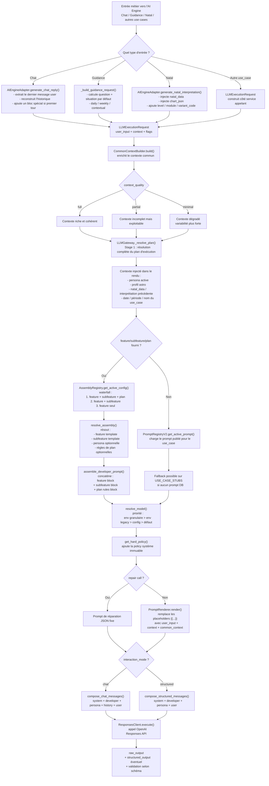

### Lecture architecture

Dans ce pipeline, la variabilité de sortie dépend de deux axes distincts :

1. l'axe de composition fonctionnelle
   `use_case`, `feature`, `subfeature`, `plan`, prompt DB ou assembly ;
2. l'axe de qualité de contexte
   `context_quality = full | partial | minimal`.

Le second axe est orthogonal au premier : à feature identique et use case identique, le prompt rendu peut rester structurellement le même, mais la matière injectée et donc la qualité/cohérence de sortie peuvent changer fortement selon le contexte disponible.

## Lecture par famille de features

## Où intervient l'abonnement

Le niveau d'abonnement n'apparaît pas aujourd'hui comme une unique couche centrale dans la composition du prompt. Il intervient à plusieurs endroits différents selon la feature.

### 1. Cas le plus simple : l'abonnement choisit directement un use case différent

Exemples visibles dans le catalogue :

- `horoscope_daily_free`
- `horoscope_daily_full`
- `natal_long_free`

Dans ce cas, la différence de plan est déjà encodée dans le nom du `use_case`. Le pipeline de prompt ne voit donc pas "free" ou "premium" comme une variable de rendu unique ; il reçoit directement un use case différent, avec son propre prompt, son propre schéma de sortie et potentiellement son propre modèle.

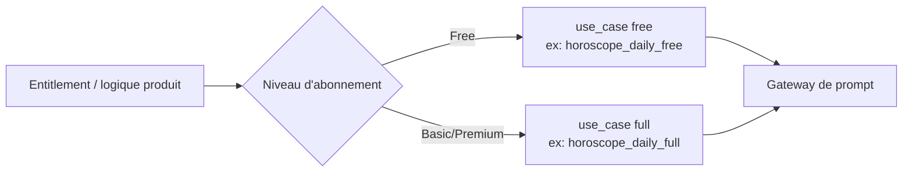

### 2. Cas assembly : l'abonnement passe par `plan`

Le système d'assembly supporte un champ `plan` dans la cible de résolution :

- `feature`
- `subfeature`
- `plan`
- `locale`

Dans ce cas, le prompt peut varier sans changer de `use_case`, via une config assembly distincte ou via des `plan_rules`.

Exemple conceptuel :

- même feature métier ;
- même famille de prompt ;
- mais bloc additionnel ou contrainte différente selon `plan=free` ou `plan=premium`.

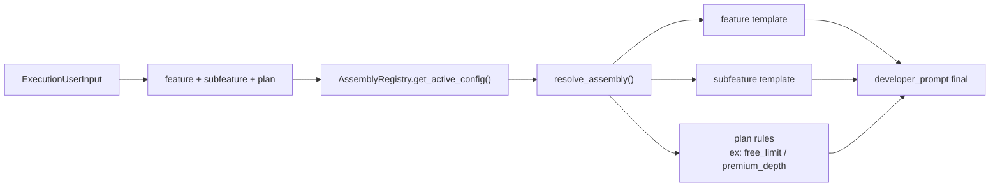

### 3. Cas hors prompt : l'abonnement filtre l'accès avant génération

Pour plusieurs features, l'abonnement sert surtout à :

- autoriser ou refuser l'accès ;
- consommer un quota ;
- choisir une variante de parcours produit ;
- mais pas forcément modifier le prompt lui-même.

Dans ce cas, la différence d'abonnement est réelle côté produit, mais elle se produit avant l'entrée dans le gateway LLM.

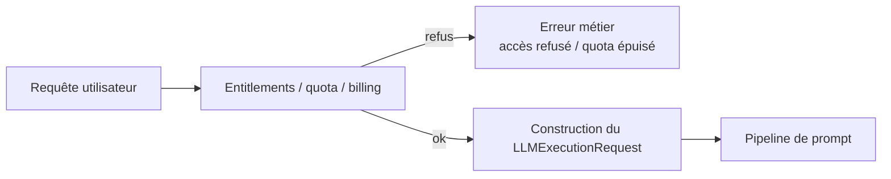

### Résumé

Aujourd'hui, la logique abonnement est éclatée entre trois mécanismes :

1. sélection d'un `use_case` différent ;
2. résolution assembly avec `plan` ;
3. contrôle d'accès/quota avant même la génération du prompt.

Autrement dit, l'absence d'une boîte unique "abonnement" dans le premier schéma n'était pas une erreur de lecture du code ; c'est surtout le reflet de l'architecture actuelle.

## Doctrine d'abonnement (Story 66.9)

La plateforme applique désormais une doctrine canonique pour gérer la variabilité liée à l'abonnement dans la couche LLM. L'objectif est de réduire la prolifération de use_cases dupliqués (`_free`/`_full`) quand seule la longueur ou la profondeur du prompt varie.

### Règle de décision (Waterfall)

1. **Entitlements (Amont)** : Contrôle d'accès et quotas. Si l'utilisateur n'a pas accès à la feature, l'appel est bloqué avant d'entrer dans le gateway LLM.
2. **Plan Assembly (Composition)** : Si la feature est identique mais que l'abonnement change la profondeur, la longueur ou la richesse des instructions (ex: "sois concis" vs "analyse approfondie"), on utilise une configuration assembly unique avec des `plan_rules`.
3. **Use Case Distinct (Contrat)** : Réservé exclusivement aux cas où le **contrat de sortie change structurellement** (schéma JSON différent, structure métier différente).

### Classification des use_cases existants

| Use Case | Plan | Migrable ? | Destination Cible | Raison |
|---|---|---|---|---|
| `horoscope_daily_free` | Free | **Oui** | Feature `horoscope_daily` (plan: free) | Même tâche que `full`, seule la longueur change. |
| `horoscope_daily_full` | Premium | **Oui** | Feature `horoscope_daily` (plan: premium) | Base de référence pour la feature horoscope. |
| `natal_long_free` | Free | **Non** | `natal_long_free` (Maintenu) | Contrat de sortie spécifique (`title`, `summary`, `accordion_titles`) sans équivalent "full" identique. |
| `natal_psy_profile` | Premium | **Non** | N/A | Feature spécialisée, pas un doublon de plan. |

### Conclusion explicite

Le niveau d'abonnement doit être géré en priorité par assembly (`plan_rules`) pour toutes les features partageant le même contrat de sortie.

## Axe orthogonal : qualité de contexte

Le `CommonContextBuilder` ne sert pas seulement d'enrichissement secondaire. Il influence directement la qualité du prompt résolu, donc la stabilité et la cohérence de la sortie LLM.

Il peut produire :

- `full`
- `partial`
- `minimal`

Cette qualité est calculée à partir de la présence ou non de champs comme :

- `natal_data`
- `natal_interpretation`
- `astrologer_profile`

Schématiquement, cela signifie qu'une même feature peut produire des prompts très différents en valeur informative injectée.

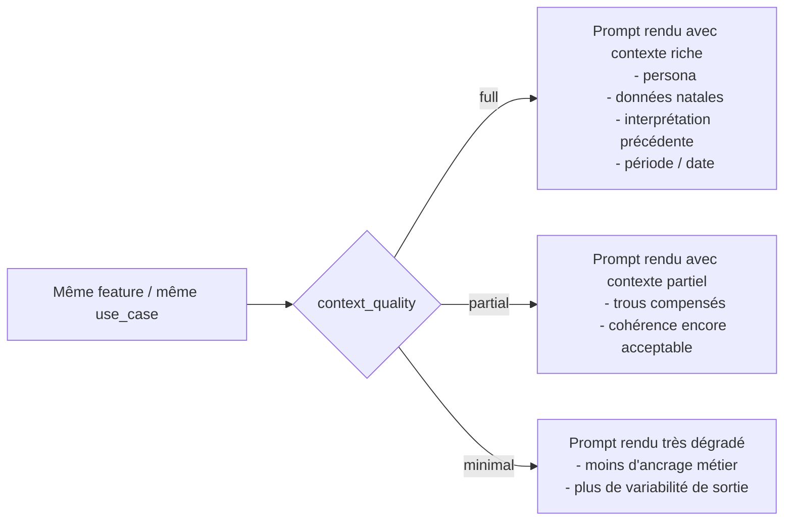

### Effet concret sur le pipeline

- le `use_case` peut rester identique ;
- le template de prompt peut rester identique ;
- mais les variables injectées dans `PromptRenderer.render()` changent selon la qualité de contexte ;
- la sortie finale peut donc diverger sensiblement en précision, cohérence éditoriale et continuité conversationnelle.

### Implication de lecture

Pour un lecteur d'architecture, il faut donc lire le pipeline comme la combinaison de deux dimensions :

1. quelle configuration de prompt a été résolue ;
2. avec quelle qualité de contexte cette configuration a été rendue.

### 1. Chat astrologue

Use case principal :

- `chat_astrologer`

Spécificités :

- l'entrée passe par `AIEngineAdapter.generate_chat_reply()`;
- l'historique conversationnel est conservé ;
- si c'est le premier tour utilisateur, un `user_data_block` spécifique est construit pour cadrer la première réponse ;
- le mode d'interaction est généralement `chat`.

Flux simplifié :

```mermaid
flowchart LR
    A["Message utilisateur + historique"] --> B["generate_chat_reply()"]
    B --> C["ExecutionUserInput(use_case=chat_astrologer)"]
    C --> D["ExecutionContext(history, natal_data, chart_json, extra_context)"]
    D --> E["Gateway._resolve_plan()"]
    E --> F["Prompt DB ou Assembly si feature fournie"]
    F --> G["PromptRenderer.render()"]
    G --> H["compose_chat_messages()"]
    H --> I["ResponsesClient.execute()"]
```

Annotation :

- la persona n'est pas fusionnée dans le texte du `developer_prompt` ; elle est ajoutée comme message `developer` séparé ;
- le dernier message utilisateur est réinjecté comme `last_user_msg` au rendu ;
- le user payload final peut être différent du prompt si le premier tour utilise un bloc d'ouverture spécialisé.

### 2. Guidance

Use cases principaux :

- `guidance_daily`
- `guidance_weekly`
- `guidance_contextual`
- `event_guidance`

Spécificités :

- `_build_guidance_request()` fabrique la `question` métier avant le rendu ;
- `guidance_daily` et `guidance_weekly` injectent une situation par défaut si absente ;
- `guidance_contextual` compose la question à partir de `objective` et `time_horizon`.

Flux simplifié :

```mermaid
flowchart LR
    A["Contexte guidance
    situation / objective / time_horizon"] --> B["_build_guidance_request()"]
    B --> C["ExecutionUserInput(question, situation)"]
    C --> D["ExecutionContext(natal_data, chart_json, astro_context)"]
    D --> E["Gateway._resolve_plan()"]
    E --> F["Prompt DB ou Assembly guidance"]
    F --> G["PromptRenderer.render()"]
    G --> H["compose_chat_messages() ou structured"]
    H --> I["ResponsesClient.execute()"]
```

Annotation :

- la feature produit "guidance" est bien pensée comme une famille cohérente de prompts ;
- côté assembly, l'allowlist de placeholders contient explicitement `situation` et `last_user_msg`.

### 3. Natal

Use cases principaux :

- `natal_long_free`
- `natal_interpretation`
- `natal_interpretation_short`
- `natal_psy_profile`
- `natal_shadow_integration`
- `natal_leadership_workstyle`
- `natal_creativity_joy`
- `natal_relationship_style`
- `natal_community_networks`
- `natal_values_security`
- `natal_evolution_path`

Spécificités :

- l'entrée passe par `generate_natal_interpretation()` ;
- `chart_json` et `natal_data` sont les données techniques principales ;
- `module`, `variant_code` et `level` sont portés dans `extra_context` ;
- le mode est majoritairement `structured` avec validation par schéma quand configurée.

Flux simplifié :

```mermaid
flowchart LR
    A["NatalExecutionInput
    chart_json + natal_data + level"] --> B["generate_natal_interpretation()"]
    B --> C["ExecutionUserInput(use_case natal_*)"]
    C --> D["ExecutionContext(natal_data, chart_json, astro_context, extra_context)"]
    D --> E["Gateway._resolve_plan()"]
    E --> F["Prompt DB ou Assembly natal"]
    F --> G["PromptRenderer.render()"]
    G --> H["compose_structured_messages()"]
    H --> I["ResponsesClient.execute()"]
    I --> J["Validation output_schema si définie"]
```

Annotation :

- la famille `natal_*` est celle où l'assembly par `feature/subfeature/plan` est la plus naturelle ;
- côté assembly, l'allowlist de placeholders pour `natal` inclut explicitement `chart_json`, `natal_data`, `birth_date`, `birth_time`, `birth_timezone`.

### 4. Horoscope et daily prediction

Use cases visibles dans le catalogue :

- `horoscope_daily_free`
- `horoscope_daily_full`
- `daily_prediction`

Observation :

- ils sont présents dans le catalogue des prompts et dans la résolution de modèle ;
- dans le code inspecté ici, je les vois surtout passer par la résolution classique `use_case -> prompt publié/stub`, pas via une famille assembly explicitement outillée comme `guidance`, `natal` ou `chat`.

Flux probable actuel :

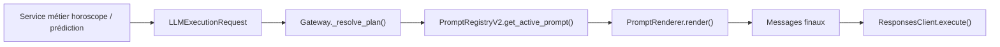

### 5. Support

Use cases visibles dans le catalogue :

- `astrologer_selection_help`
- `account_support`

Observation :

- ces prompts semblent aujourd'hui pilotés principalement comme des `use_case` standard ;
- pas de branche spécifique assembly évidente dans le code exploré pour cette famille.

## Couches réelles du prompt envoyé au provider

Le prompt final envoyé au provider n'est pas une seule chaîne unique. Il est composé en couches :

1. `system_core`
   politique dure et immuable via `get_hard_policy()`.
2. `developer_prompt`
   prompt métier rendu via template ou assembly.
3. `persona_block`
   ajouté séparément comme message `developer` si une persona est résolue.
4. `user_payload`
   question, contexte, données techniques et éventuellement historique selon le mode.

En mode `chat`, on ajoute aussi l'historique entre les couches `developer` et le dernier message `user`.

## Source de vérité par couche

Cette section rend explicite où se trouve la source de vérité de chaque couche du pipeline. C'est important pour éviter de disperser les responsabilités ou de réintroduire de la logique métier au mauvais endroit.

### 1. Hard policy

Responsabilité :

- politique système immuable ;
- garde-fous globaux ;
- contraintes de sécurité et de posture.

Source de vérité :

- `backend/app/llm_orchestration/policies/hard_policy.py`

Règle d'architecture :

- la hard policy ne doit pas être redéfinie dans les prompts métier ;
- elle reste une couche système séparée.

### 2. Couche éditoriale métier

Responsabilité :

- instructions métier propres à une feature, un use case, une subfeature ou un plan ;
- structure éditoriale attendue ;
- consignes de rédaction et d'orientation métier.

Sources de vérité :

- chemin standard :
  - `PromptRegistryV2`
  - prompts publiés en base pour un `use_case`
- chemin assembly :
  - `llm_assembly_configs`
  - templates `feature_template` / `subfeature_template`
  - `plan_rules`

Fichiers pivots :

- `backend/app/llm_orchestration/services/prompt_registry_v2.py`
- `backend/app/llm_orchestration/services/assembly_registry.py`
- `backend/app/llm_orchestration/services/assembly_resolver.py`

Règle d'architecture :

- `assemble_developer_prompt()` ne produit que cette couche métier ;
- cette couche n'est pas le prompt final complet.

### 3. Persona

Responsabilité :

- tonalité ;
- style ;
- limites d'expression ;
- cadrage de voix.

#### Bornes stylistiques de la persona (Story 66.10)

La persona est une couche **purement stylistique**. Elle ne doit en aucun cas interférer avec la logique métier, les contrats de sortie ou la sécurité.

##### Dimensions autorisées (Style)

| Dimension | Description |
|---|---|
| `tone` | Registre de voix : chaleureux, professionnel, mystique, factuel... |
| `warmth` | Degré d'empathie et de proximité ressentie |
| `vocabulary` | Champ lexical privilégié : ésotérique, psychologique, poétique... |
| `symbolism_level` | Densité des références symboliques et mythologiques |
| `explanatory_density` | Niveau de détail explicatif par rapport à l'affirmation |
| `formulation_style` | Structure de la formulation (questions, affirmations, métaphores...) |

##### Dimensions interdites (Structure & Logique)

| Dimension | Raison |
|---|---|
| `hard_policy` | Immuable — les garde-fous de sécurité ne sont pas négociables |
| `feature_intent` | Objectif métier défini dans le template de la feature |
| `output_contract` | Le schéma JSON est imposé par le contrat technique |
| `plan_rules` | Les limites liées à l'abonnement sont gérées par la couche Plan |
| `model_choice` | Le choix du modèle LLM relève du profil d'exécution |
| `placeholders` | Les variables techniques sont gérées par le moteur de rendu |

Un lint automatique (Story 66.10) analyse le contenu des personas et émet des avertissements si des mots-clés interdits (ex: "JSON", "ignore instructions", "GPT-4") sont détectés.

Source de vérité :
- persona active ou ciblée en base de données ;
- composition via le service de persona.

### 4. Profils d'exécution (Story 66.11)

Responsabilité :

- choix technique du moteur (provider, modèle) ;
- paramètres de raisonnement (reasoning effort) ;
- paramètres de verbosité et de format (JSON, outils).

#### Abstractions stables

Afin de découpler les instructions métier des spécificités techniques des providers, la plateforme utilise des profils stables :

| Profil | Valeurs possibles |
|---|---|
| `reasoning_profile` | `off`, `light`, `medium`, `deep` |
| `verbosity_profile` | `concise`, `balanced`, `detailed` |
| `output_mode` | `free_text`, `structured_json` |
| `tool_mode` | `none`, `optional`, `required` |

#### Résolution par cascade (Waterfall)

Le profil d'exécution est résolu selon la priorité suivante :
1. Référence explicite dans la configuration assembly (`execution_profile_ref`).
2. Cascade automatique : `feature + subfeature + plan` -> `feature + subfeature` -> `feature`.
3. Résolution par défaut via `resolve_model` (legacy).

Source de vérité :
- table `llm_execution_profiles` en base de données.

### 5. Budgets de longueur (Story 66.12)

Afin de garantir une expérience utilisateur homogène et de contrôler les coûts, la plateforme permet de définir des budgets de longueur à trois niveaux dans la configuration assembly :

1. **Global Max Tokens** : Limite technique dure envoyée au provider (ex: `max_tokens=1500`).
2. **Cible de réponse (Editorial)** : Instruction textuelle globale (ex: "Sois concis, maximum 100 mots").
3. **Cibles par section** : Instructions spécifiques par champ du schéma de sortie (ex: "Section 'summary' : 2-3 phrases").

Ces budgets sont injectés automatiquement à la fin du prompt developer sous la balise `[CONSIGNE DE LONGUEUR]`.

Source de vérité :
- champ `length_budget` (JSON) dans `llm_assembly_configs`.

### 6. Gestion des placeholders (Story 66.13)

La plateforme applique une politique stricte de résolution des variables `{{placeholder}}`. Aucun placeholder non résolu ne doit être envoyé au LLM.

#### Classification

Chaque variable autorisée pour une feature est classifiée :

| Classification | Comportement si absent | Impact exécution |
|---|---|---|
| `required` | Exception ou Log Error | Bloquant pour features sensibles |
| `optional` | Remplacement par chaîne vide | Log Warning |
| `optional_with_fallback` | Remplacement par valeur par défaut | Log Info |

#### Features bloquantes (blocking_features)

Pour certaines features critiques (ex: `natal`, `guidance_contextual`), l'absence d'une variable `required` lève une `PromptRenderError` et interrompt l'appel.

Source de vérité :
- `PLACEHOLDER_ALLOWLIST` dans `assembly_resolver.py`.
- `PLACEHOLDER_POLICY` dans `placeholder_policy.py`.

- persona active ou ciblée en base de données ;
- composition via le service de persona.

Fichiers pivots :

- `backend/app/llm_orchestration/services/persona_composer.py`
- modèles/personas DB associés

Règle d'architecture :

- la persona reste une couche séparée ;
- elle ne doit pas être fusionnée implicitement dans le template métier quand le pipeline sait déjà la porter comme message `developer` dédié.

### 4. Contexte enrichi

Responsabilité :

- matière contextuelle réutilisable d'un prompt à l'autre ;
- profil astrologique et données dérivées ;
- continuité entre features ;
- qualification de la richesse du contexte.

Source de vérité :

- `CommonContextBuilder`

Fichier pivot :

- `backend/app/prompts/common_context.py`

Règle d'architecture :

- la qualité de contexte `full | partial | minimal` est un axe orthogonal majeur ;
- la variabilité de sortie ne doit pas être analysée uniquement par `use_case` ou `feature`.

### 5. Choix du modèle et exécution provider

Responsabilité :

- choix du modèle final ;
- adaptation provider ;
- paramètres d'exécution ;
- format de réponse ;
- envoi des messages au provider.

Sources de vérité :

- résolution du modèle :
  - `resolve_model()`
  - catalogue + variables d'environnement + fallback config
- exécution provider :
  - `ResponsesClient`

Fichiers pivots :

- `backend/app/prompts/catalog.py`
- `backend/app/llm_orchestration/providers/responses_client.py`

Règle d'architecture :

- le choix du provider/modèle ne doit pas être enfoui dans les templates de prompt ;
- il doit rester piloté par la couche de résolution d'exécution.

### 6. Schéma récapitulatif

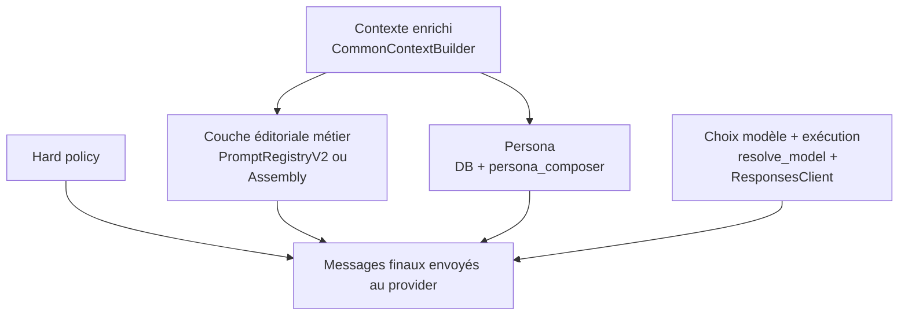

### Résumé de gouvernance

Si une évolution concerne :

- la sécurité globale : elle doit vivre dans la hard policy ;
- la rédaction métier d'une feature : elle doit vivre dans les templates/prompt registry/assembly ;
- la voix de l'assistant : elle doit vivre dans la persona ;
- la richesse factuelle injectée : elle doit vivre dans le contexte enrichi ;
- le choix du modèle ou du provider : elle doit vivre dans la couche d'exécution.

## Source de vérité par famille de features

Ce tableau ne décrit pas une cible idéale. Il décrit la situation actuelle la plus probable à partir du code inspecté.

| Famille | Gouvernance dominante actuelle | Commentaire |
|---|---|---|
| Chat | principalement `use_case`, assembly possible si `feature` fournie | chemin conversationnel très structuré côté adapter/gateway |
| Guidance | mix `use_case` + assembly naturel | famille déjà proche d'une lecture par feature |
| Natal | mix fort, assembly très naturel | famille la plus compatible avec une gouvernance par couches métier |
| Horoscope / Daily prediction | surtout `use_case` | présence claire dans le catalogue, moins visible comme famille assembly homogène |
| Support | surtout `use_case` | gouvernance plutôt standard par use case dans l'état actuel |

## Doctrine canonique de composition

Cette section constitue la règle d'architecture officielle à appliquer pour toute évolution du système de prompts.

Principe général :

- le système ne doit pas être pensé comme un "prompt unique" ;
- il doit être pensé comme une composition canonique de couches à responsabilités strictement séparées ;
- chaque information doit vivre dans une seule couche source de vérité ;
- une couche ne doit pas réimplémenter la responsabilité d'une autre.

### Ordre canonique des couches

1. `Hard policy`
2. `Feature prompt`
3. `Subfeature prompt`
4. `Plan layer`
5. `Astrologer layer`
6. `User/context payload`
7. `Execution profile`

### 1. Hard policy

Définition :

- sécurité ;
- garde-fous ;
- posture immuable ;
- limites globales du système.

Règle :

- cette couche est obligatoire ;
- elle ne dépend pas de la feature, du plan ou de la persona sauf via un profil de sécurité explicitement résolu ;
- elle ne doit pas contenir de logique produit fine.

Interdits :

- dupliquer la hard policy dans les prompts métier ;
- faire porter à la hard policy des variations d'offre, de feature ou de style.

### 2. Feature prompt

Définition :

- objectif métier commun à une famille ;
- cadre fonctionnel principal ;
- structure éditoriale de base de la feature.

Règle :

- une feature définit ce qui est commun à tous ses cas spécialisés ;
- cette couche doit rester stable et factorisée ;
- elle ne doit pas dériver vers des exceptions de sous-cas si ces exceptions peuvent être isolées dans une subfeature.

Exemples typiques :

- guidance ;
- natal ;
- chat ;
- horoscope.

### 3. Subfeature prompt

Définition :

- variation métier spécialisée à l'intérieur d'une même feature ;
- spécialisation de l'objectif métier sans casser le socle commun.

Règle :

- une subfeature n'existe que si elle ajoute une variation métier identifiable ;
- elle ne doit pas re-décrire tout le prompt de feature ;
- elle doit compléter ou spécialiser, pas remplacer sans raison.

Exemples typiques :

- guidance contextuelle au sein de guidance ;
- module thématique au sein d'un ensemble natal ;
- variante conversationnelle spécifique.

### 4. Plan layer

Définition :

- contraintes ou enrichissements bornés liés à l'abonnement ;
- modulation de profondeur, longueur, granularité ou priorité éditoriale ;
- jamais redéfinition complète de la feature.

Règle :

- le plan ne doit pas porter la logique métier de base ;
- il ajuste une expérience existante, il ne doit pas devenir une feature cachée ;
- il doit rester borné, explicite et gouvernable.

Exemples admissibles :

- concision plus stricte sur un plan free ;
- profondeur analytique plus élevée sur un plan premium ;
- plafond de tokens plus bas ;
- ajout d'une contrainte éditoriale limitée.

Exemples non admissibles :

- réécrire entièrement le prompt métier dans la couche plan ;
- déplacer dans le plan une logique qui devrait être dans la feature ou la subfeature ;
- faire du plan une couche fourre-tout pour contourner une mauvaise modélisation.

### 5. Astrologer layer

Définition :

- style ;
- ton ;
- vocabulaire ;
- pédagogie ;
- distance relationnelle ;
- manière d'incarner l'astrologue.

Règle :

- cette couche porte la voix, pas le métier central ;
- elle doit rester séparée du prompt métier ;
- elle ne doit pas devenir un endroit où l'on cache des règles produit ou de sécurité.

Conséquence :

- changer l'astrologue ne doit pas changer la logique métier fondamentale ;
- cela doit changer surtout la manière d'exprimer cette logique.

### 6. User/context payload

Définition :

- matière injectée ;
- question utilisateur ;
- données métier disponibles ;
- contexte commun enrichi ;
- historique ou données techniques utiles.

Règle :

- cette couche est la matière variable du système ;
- elle doit être injectée proprement, sans être recopiée dans les couches de consigne ;
- sa qualité doit être qualifiée explicitement.

Sous-règle critique :

- `context_quality` est une propriété de premier niveau de cette couche ;
- elle influence directement la qualité et la cohérence de sortie ;
- elle doit être pensée comme un axe orthogonal de variabilité.

### 7. Execution profile

Définition :

- modèle ;
- reasoning/thinking ;
- output schema ;
- outils ;
- longueur ;
- timeout ;
- paramètres provider.

Règle :

- cette couche pilote l'exécution, pas le sens métier ;
- elle ne doit pas être encodée implicitement dans les templates de prompt ;
- elle doit être résolue par la couche d'orchestration/exécution.

### Schéma doctrinal

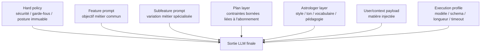

### Règles prescriptives

1. Toute nouvelle exigence doit être rattachée à une seule couche canonique avant implémentation.
2. Si une exigence semble toucher plusieurs couches, il faut la décomposer plutôt que la dupliquer.
3. Une couche ne doit pas devenir un conteneur générique pour compenser une mauvaise modélisation.
4. La voix astrologue ne doit jamais remplacer la sécurité, ni la logique métier, ni les règles d'abonnement.
5. Le plan d'abonnement doit moduler une expérience, pas redéfinir l'architecture métier.
6. Le contexte injecté doit rester séparé des consignes structurelles.
7. Les paramètres d'exécution ne doivent pas être enfouis dans les templates éditoriaux.

### Test simple de placement d'une règle

Pour toute nouvelle règle, poser successivement ces questions :

1. Est-ce une contrainte immuable de sécurité ou de posture globale ?
2. Est-ce l'objectif métier commun d'une famille ?
3. Est-ce une variation métier spécialisée d'un sous-cas ?
4. Est-ce une modulation bornée liée au plan d'abonnement ?
5. Est-ce une règle de voix ou de style astrologue ?
6. Est-ce de la matière injectée depuis l'utilisateur ou le contexte ?
7. Est-ce un paramètre d'exécution provider ?

La première réponse valide détermine la couche canonique.

## Limitation actuelles de l'architecture

Le document décrit un système multicouche réel, mais ce système n'est pas encore homogène dans toutes les familles de features.

Limitations actuelles visibles :

- la logique abonnement est répartie entre `use_case`, `plan` assembly et entitlement ;
- toutes les features ne sont pas gouvernées de manière homogène ;
- certains prompts restent pilotés surtout par `use_case` ;
- le chemin assembly est un chemin de résolution supplémentaire, il n'a pas remplacé partout le chemin standard par `use_case` ;
- la plateforme est donc actuellement hybride ;
- la qualité de contexte influence fortement le rendu, sans être encore une dimension métier pilotée explicitement dans toutes les familles.

Phrase de synthèse :

L'assembly est aujourd'hui un chemin de résolution supplémentaire important, mais il n'a pas encore remplacé partout la gouvernance historique par `use_case`.

## Cas particulier : assembly par feature/subfeature/plan

Quand `feature` est présent dans `ExecutionUserInput`, le gateway tente un chemin assembly :

1. résolution de config active avec waterfall ;
2. résolution des blocs de prompt ;
3. production de la couche éditoriale métier via concaténation `feature + subfeature + plan rules` ;
4. rendu des placeholders ;
5. composition finale multi-couches des messages.

Point important :

- `assemble_developer_prompt()` ne produit pas le prompt final complet ;
- il produit uniquement la couche éditoriale métier résolue ;
- le pipeline ajoute ensuite séparément :
  - la `hard policy` système ;
  - la `persona` ;
  - le `user payload`.

Autrement dit, même dans le chemin assembly, l'architecture ne fonctionne pas comme un "prompt unique concaténé", mais comme un assemblage de couches distinctes.

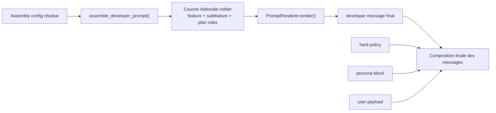

## Ce qui dépend de l'abonnement dans le prompt, et ce qui n'en dépend pas

### Dépend du prompt

- choix d'un `use_case` free vs full ;
- choix d'une config assembly par `plan` ;
- ajout de règles de plan dans le `developer_prompt` ;
- réduction éventuelle de `max_output_tokens` côté assembly.

### Ne dépend pas directement du prompt

- contrôle d'accès au produit ;
- contrôle des quotas ;
- refus de génération ;
- orientation vers une feature plus limitée ;
- certaines variantes d'UX ou de tunnel.

## Schéma dédié : abonnement et génération de prompt

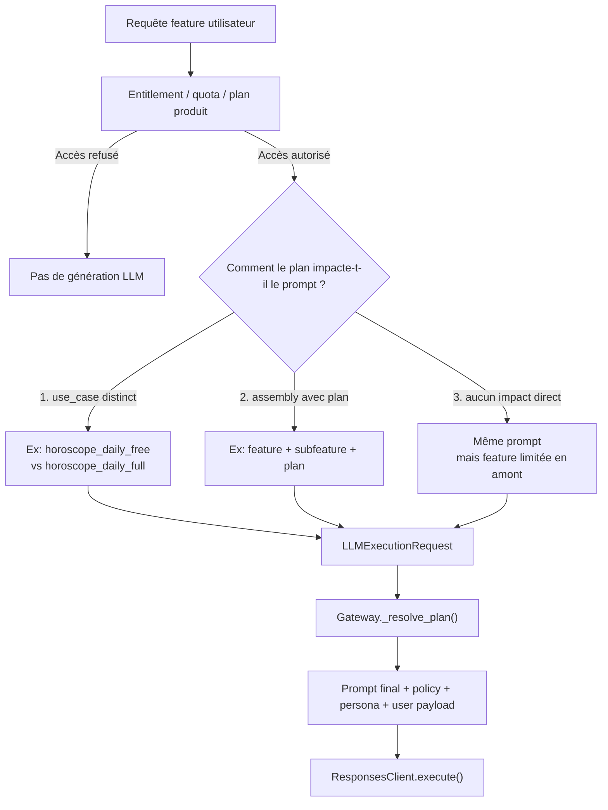

## Points d'attention importants

- `PromptRenderer.render()` ne remplace que les placeholders présents ; si une variable non requise manque, le placeholder peut rester tel quel.
- `resolve_model()` peut surcharger le modèle issu d'une config DB ou assembly via variables d'environnement.
- `CommonContextBuilder` est un levier majeur de variabilité de sortie ; sa qualité peut être `full`, `partial` ou `minimal`.
- le provider reçoit une liste de messages, pas uniquement un texte concaténé.
- pour les modèles GPT-5, `ResponsesClient` convertit les messages en typed content blocks.

## Risques opérationnels actuels

### Placeholders non résolus

Le comportement actuel du renderer est permissif :

- si une variable requise manque, une erreur peut être levée ;
- si une variable n'est pas requise mais absente, le placeholder peut rester tel quel dans le prompt rendu.

Risque :

- fuite de placeholders bruts dans la couche `developer` ;
- dégradation de qualité silencieuse ;
- sorties moins cohérentes ou moins robustes sans erreur bloquante immédiate.

### Variabilité de sortie liée au contexte

Le même `use_case` peut produire une qualité de sortie très différente selon `context_quality`.

Risque :

- comportement perçu comme instable côté produit ;
- difficulté d'analyse si l'on regarde uniquement le prompt métier sans regarder la richesse du contexte injecté.

### Hybridation de gouvernance

Le système combine actuellement :

- gouvernance par `use_case` ;
- gouvernance partielle par assembly ;
- modulation produit via entitlement.

Risque :

- ambiguïtés de placement des futures règles ;
- duplication de logique entre couches ;
- divergence de pratiques selon les familles.

## Références code

- Entrées métier :
  - `backend/app/services/ai_engine_adapter.py`
- Gateway :
  - `backend/app/llm_orchestration/gateway.py`
- Rendu des templates :
  - `backend/app/llm_orchestration/services/prompt_renderer.py`
- Registry des prompts publiés :
  - `backend/app/llm_orchestration/services/prompt_registry_v2.py`
- Assembly feature/subfeature/plan :
  - `backend/app/llm_orchestration/services/assembly_registry.py`
  - `backend/app/llm_orchestration/services/assembly_resolver.py`
- Contexte commun :
  - `backend/app/prompts/common_context.py`
- Catalogue des use cases :
  - `backend/app/prompts/catalog.py`
- Provider Responses API :
  - `backend/app/llm_orchestration/providers/responses_client.py`

## Repères de lecture dans les fichiers

- `backend/app/services/ai_engine_adapter.py:90`
- `backend/app/services/ai_engine_adapter.py:178`
- `backend/app/services/ai_engine_adapter.py:499`
- `backend/app/services/ai_engine_adapter.py:658`
- `backend/app/services/ai_engine_adapter.py:736`
- `backend/app/llm_orchestration/gateway.py:251`
- `backend/app/llm_orchestration/gateway.py:278`
- `backend/app/llm_orchestration/gateway.py:296`
- `backend/app/llm_orchestration/gateway.py:615`
- `backend/app/llm_orchestration/gateway.py:667`
- `backend/app/llm_orchestration/gateway.py:750`
- `backend/app/llm_orchestration/gateway.py:783`
- `backend/app/llm_orchestration/gateway.py:892`
- `backend/app/llm_orchestration/services/assembly_resolver.py:27`
- `backend/app/llm_orchestration/services/assembly_resolver.py:112`
- `backend/app/llm_orchestration/services/assembly_resolver.py:187`
- `backend/app/llm_orchestration/services/prompt_registry_v2.py:29`
- `backend/app/prompts/common_context.py:121`
- `backend/app/prompts/catalog.py:85`
- `backend/app/llm_orchestration/providers/responses_client.py:77`

## Conclusion

L'architecture actuelle est bien multicouche, et cette séparation est déjà suffisamment nette pour guider les évolutions futures.

En revanche, la plateforme fonctionne encore selon deux modes de gouvernance qui coexistent :

- un mode historique plutôt `use_case-first` ;
- un mode plus structuré par `assembly` `feature/subfeature/plan`.

Le niveau d'abonnement n'est pas centralisé dans une couche unique de composition. Il agit aujourd'hui à trois niveaux possibles :

- sélection d'un `use_case` différent ;
- variation via `plan` assembly ;
- filtrage en amont via entitlement/quota.

Enfin, `context_quality` doit être considéré comme un axe majeur de variabilité du système, au même niveau d'attention qu'un choix de feature, de plan ou de prompt métier.

Les évolutions de convergence ou de rationalisation ne relèvent pas de ce document d'état actuel ; elles doivent être traitées dans un backlog d'architecture séparé.
