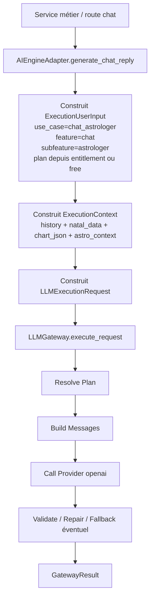
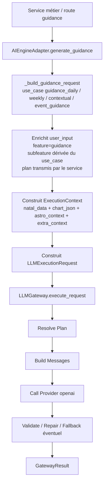
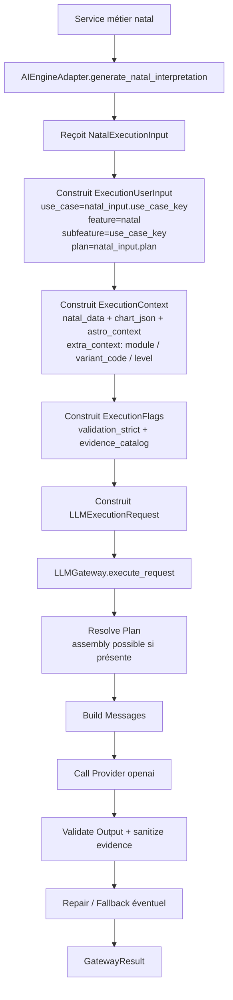
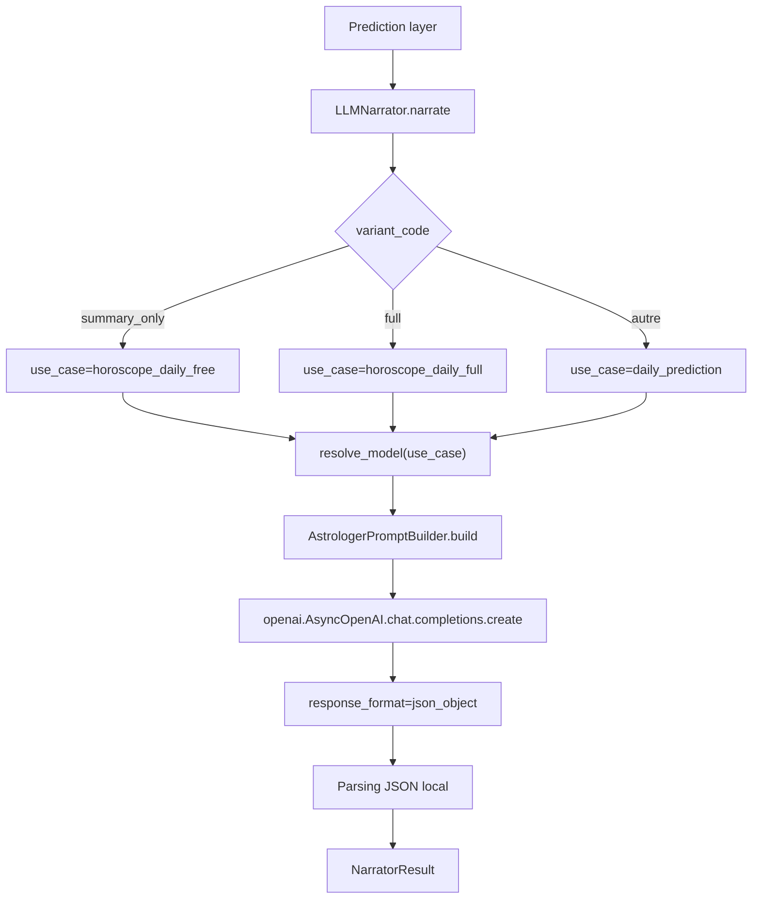
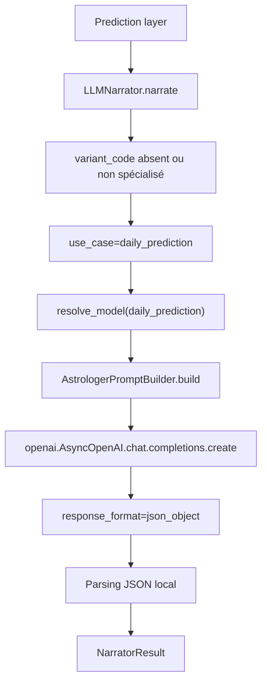
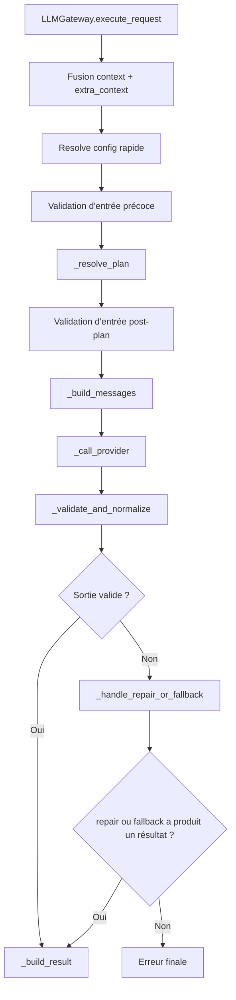

# Génération des Prompts LLM par Feature

Ce document décrit le processus canonique actuellement utilisé pour construire un prompt LLM dans la plateforme, tel qu'il résulte des stories 66.9 à 66.18.

Objectifs :

- donner une source de vérité pratique pour les développeurs ;
- expliquer où chaque décision doit vivre ;
- documenter l'ordre réel de résolution dans le gateway ;
- éviter de réintroduire des variations concurrentes entre `use_case`, `assembly`, `persona`, `plan_rules`, `ExecutionProfile` et paramètres provider.

## Portée

Le document couvre :

- la doctrine d'abonnement et de différenciation par plan ;
- la sélection de la configuration assembly ;
- la résolution des profils d'exécution ;
- l'injection des budgets de longueur ;
- la gestion des placeholders ;
- l'adaptation à `context_quality` ;
- la traduction des profils internes stables vers les paramètres provider ;
- les fallbacks de compatibilité encore actifs.

Il décrit le fonctionnement réel du backend autour de :

- `backend/app/llm_orchestration/gateway.py`
- `backend/app/llm_orchestration/services/assembly_resolver.py`
- `backend/app/llm_orchestration/services/prompt_renderer.py`
- `backend/app/llm_orchestration/services/context_quality_injector.py`
- `backend/app/llm_orchestration/services/provider_parameter_mapper.py`
- `backend/app/prompts/catalog.py`

## Vue d'ensemble

Le pipeline ne part plus d'un simple `use_case -> prompt -> model`.

La résolution suit désormais ce principe :

1. contrôler l'accès au produit en amont ;
2. sélectionner une configuration de composition par `feature/subfeature/plan` ;
3. appliquer les couches textuelles et éditoriales ;
4. résoudre un profil d'exécution séparé du texte ;
5. construire un `ResolvedExecutionPlan` unique ;
6. exécuter le provider à partir de ce plan.

Le `use_case` reste supporté, mais il n'est plus la source canonique de variation dès qu'une feature est migrée vers le chemin assembly.

### Diagramme du processus canonique

```mermaid
flowchart TD
    A["Appel métier"] --> B{"Entitlements OK ?"}
    B -->|Non| X["Blocage amont<br/>pas d'appel LLM"]
    B -->|Oui| C["Entrée gateway<br/>use_case + feature/subfeature/plan"]

    C --> D{"use_case déprécié ?"}
    D -->|Oui| E["Mapping compatibilité<br/>DEPRECATED_USE_CASE_MAPPING"]
    D -->|Non| F["Contexte d'exécution inchangé"]
    E --> F

    F --> G["Construction common context<br/>+ calcul context_quality"]

    G --> H{"Assembly explicite<br/>ou active trouvée ?"}
    H -->|Oui| I["Résolution PromptAssemblyConfig"]
    H -->|Non| J["Fallback use_case-first"]

    I --> K["Composition textuelle<br/>feature + subfeature + plan_rules + persona"]
    J --> K2["Prompt legacy / config historique"]

    K --> L["Injection LengthBudget"]
    K2 --> M["Base developer_prompt résolue"]
    L --> M

    M --> N["Blocs context_quality"]
    N --> O["ContextQualityInjector si nécessaire"]
    O --> P["Injection unique verbosity_profile"]
    P --> Q["Rendu placeholders"]
    Q --> R["Validation finale<br/>aucun placeholder brut restant"]

    R --> S{"ExecutionProfile trouvé ?"}
    S -->|Oui| T["Résolution profils internes<br/>reasoning / verbosity / output / tool"]
    S -->|Non| U["Fallback resolve_model"]

    T --> V["ProviderParameterMapper"]
    U --> W["Paramètres runtime legacy"]
    V --> Y["ResolvedExecutionPlan final"]
    W --> Y

    Y --> Z{"Provider runtime supporté ?"}
    Z -->|Oui: OpenAI| AA["Exécution ResponsesClient"]
    Z -->|Non| AB["Fallback runtime OpenAI"]
    AB --> AA

    AA --> AC["Validation / repair / fallback éventuel"]
    AC --> AD["Réponse finale"]
```

## Stories 66.9 à 66.18

| Story | Apport canonique | Impact dans le processus |
|---|---|---|
| `66.9` | Doctrine d'abonnement | `entitlements > assembly plan_rules > use_case distinct` |
| `66.10` | Bornes stylistiques persona | la persona reste une couche de style, pas de structure ni d'exécution |
| `66.11` | ExecutionProfiles | séparation stricte entre texte du prompt et choix d'exécution |
| `66.12` | LengthBudget | budgets éditoriaux par plan/section + plafond global |
| `66.13` | Placeholders | classification `required/optional/fallback`, jamais de `{{...}}` survivant |
| `66.14` | Context quality | adaptation explicite du prompt à `full/partial/minimal` |
| `66.15` | Convergence assembly | migration progressive des familles guidance/natal/chat vers `feature/subfeature/plan` |
| `66.16` | Matrice d'évaluation | garde-fous de non-régression sur la composition |
| `66.17` | Doctrine canonique de responsabilité | clarification documentaire des rôles de chaque entité |
| `66.18` | Profils provider stables | encapsulation des paramètres provider derrière des profils internes |

## Couverture réelle par famille

Cette section ne décrit que ce qui est explicitement visible dans le code. Elle n'emploie volontairement ni “niveau de convergence”, ni appréciation qualitative lorsqu'aucune source de vérité unique ne le code.

| Famille | Indice explicite dans le code | Chemin effectivement observable | Commentaire strictement dérivé du code |
|---|---|---|---|
| `horoscope_daily` | `DEPRECATED_USE_CASE_MAPPING` mappe `horoscope_daily_free` et `horoscope_daily_full` vers `feature="horoscope_daily"` avec `plan="free"` ou `plan="premium"` | compatibilité `use_case` legacy vers `feature/plan` | c'est la seule famille dont la migration `use_case -> feature/plan` est explicitement codée dans `catalog.py` |
| `natal` | `seed_assembly.py` crée une assembly publiée pour `feature="natal_interpretation"` ; `generate_natal_interpretation()` continue à construire un `use_case` canonique | chemin hybride : use case canonique + support assembly explicite | le code prouve l'existence d'un support assembly pour `natal_interpretation`, mais l'entrée métier reste encore construite côté adapter à partir d'un `use_case` |
| `guidance` | `generate_guidance()` construit des requêtes à partir de `guidance_daily`, `guidance_weekly`, `guidance_contextual` | chemin observable `use_case-first` côté adapter ; support assembly possible si `feature` est fourni | aucun mapping déprécié ni seed assembly guidance n'est codé en dur dans les sources inspectées |
| `chat` | `generate_chat_reply()` construit aujourd'hui `use_case="chat_astrologer"` | chemin observable `use_case-first` côté adapter ; support assembly possible si `feature` est fourni | aucun mapping déprécié ni seed assembly chat n'est codé en dur dans les sources inspectées |
| `daily_prediction` | `llm_narrator.py` route encore entre `horoscope_daily_free`, `horoscope_daily_full` et `daily_prediction` | chemin observable `use_case-first` | aucune résolution `feature/subfeature/plan` dédiée à `daily_prediction` n'est explicitement codée dans les sources inspectées |
| `support` | aucune orchestration LLM spécifique à cette famille n'a été trouvée dans les sources inspectées pour ce document | non documenté comme famille LLM active à partir des sources inspectées | ne pas lui attribuer un statut de convergence sans nouvelle preuve dans le code |

### Clarification sur `natal`

Le vocabulaire n'est pas encore parfaitement homogène entre les couches :

- dans le seed d'assembly, on observe une publication pour `feature="natal_interpretation"` ;
- dans l'entrée canonique métier au runtime, `AIEngineAdapter.generate_natal_interpretation()` normalise aujourd'hui l'appel vers `feature="natal"` et `subfeature=use_case_key`.

Ce point doit être lu comme un état hybride du système, pas comme deux vérités concurrentes.

### Règle de lecture

- une ligne n'affirme qu'un comportement appuyé par une source explicite du dépôt ;
- “support assembly possible” signifie que le gateway sait résoudre une assembly si `feature/subfeature/plan` est fourni, pas que cette famille est migrée de bout en bout ;
- l'absence d'évidence explicite dans cette section ne prouve pas l'absence absolue d'usage runtime, mais interdit de présenter cet usage comme un fait d'architecture établi.

## Schémas fonctionnels par famille

Les schémas ci-dessous décrivent uniquement les chemins de génération de réponse LLM explicitement observables dans le code.

### Chat

### Guidance

### Natal

### Horoscope Daily

### Daily Prediction

### Support

Aucun pipeline de génération de réponse LLM spécifique à une famille `support` n'a été identifié dans les sources inspectées pour ce document. Cette famille n'a donc pas de schéma Mermaid dédié ici.

### Synthèse sur `horoscope_daily` et `daily_prediction`

À date, `horoscope_daily` et `daily_prediction` restent documentés comme des parcours hors pipeline canonique du gateway :

- ils passent par `LLMNarrator.narrate()` ;
- ils appellent OpenAI directement via `chat.completions.create` ;
- ils ne passent pas par `LLMGateway.execute_request()` dans le chemin principal observé ici.

## Doctrine d'abonnement

La règle officielle est la suivante :

1. `entitlements` décident si l'appel a le droit d'exister ;
2. `plan` dans `PromptAssemblyConfig` module profondeur, longueur et richesse ;
3. un `use_case` distinct par plan n'est justifié que si le contrat de sortie change réellement.

### Règle de décision

Utiliser `plan_rules` quand la différence entre deux variantes porte sur :

- la longueur ;
- la densité ;
- la profondeur ;
- la richesse d'explication ;
- le niveau de détail éditorial.

Conserver un `use_case` distinct quand la différence porte sur :

- un schéma JSON différent ;
- une structure métier différente ;
- une fonctionnalité réellement différente, pas seulement une version “courte” ou “longue”.

### Fallback de compatibilité

Le gateway supporte encore un mapping `deprecated_use_case -> feature + plan` via `DEPRECATED_USE_CASE_MAPPING`.

But :

- ne pas casser les anciens appelants ;
- permettre une migration progressive vers le chemin assembly ;
- journaliser explicitement qu'un ancien use_case a été redirigé.

## Source de vérité par couche

| Entité | Source de vérité pour | Ne doit pas porter |
|---|---|---|
| `PromptAssemblyConfig` | sélection de configuration, activation de blocs, plan, longueur, liens vers persona et exécution | paramètres provider bruts, règles métier cachées dans les `plan_rules` |
| `LlmPromptVersionModel` | contenu textuel des blocs feature/subfeature | choix de modèle, provider, règles de sécurité |
| `LlmPersonaModel` / composition persona | ton, chaleur, vocabulaire, densité symbolique | JSON schema, provider, plan, hard policy |
| `ExecutionProfile` | modèle, provider, reasoning/verbosity/output/tool profiles, timeout, max tokens techniques | texte métier, longueur éditoriale par section |
| `LengthBudget` | instruction éditoriale de longueur + plafond global optionnel | sélection du provider |
| `PromptRenderer` | rendu final des blocs conditionnels et placeholders | logique de choix de modèle |
| `ResolvedExecutionPlan` | vérité runtime finale utilisée pour l'appel provider | logique métier supplémentaire downstream |

## Processus canonique de résolution

### 1. Entrée canonique

Le gateway reçoit un `LLMExecutionRequest` avec :

- `use_case` ;
- `feature`, `subfeature`, `plan` si disponibles ;
- `context` ;
- `flags` ;
- éventuellement des overrides.

Pour les familles migrées, l'appelant doit préférer `feature/subfeature/plan`.

### 2. Fallback de compatibilité `use_case`

Si le `use_case` est marqué comme déprécié et mappé vers une feature assembly, le gateway convertit l'entrée avant la résolution principale et loggue un `deprecation_warning`.

### 3. Construction du contexte commun

Si possible, `CommonContextBuilder` enrichit le contexte avec les données partagées.

Ce builder calcule aussi `context_quality` :

- `full`
- `partial`
- `minimal`
- `unknown` en absence de contexte qualifié

Ce niveau n'est pas décoratif : il influence directement le prompt résolu.

### 4. Résolution de la source de composition

Le gateway tente dans cet ordre :

1. configuration assembly explicite si `assembly_config_id` est fourni ;
2. assembly actif par `feature/subfeature/plan/locale` ;
3. fallback vers la configuration historique `use_case-first`.

En pratique, le chemin assembly devient la source canonique dès qu'une famille a migré, mais le fallback legacy reste actif comme filet de sécurité.

### 5. Composition assembly

Quand une assembly est trouvée, elle agrège :

- template feature ;
- template subfeature optionnel ;
- bloc persona éventuel ;
- règles de plan ;
- budget de longueur ;
- références de contrat et de profil d'exécution.

## Pipeline d'orchestration du gateway

Le point d'orchestration central des appels LLM est `LLMGateway.execute_request()`.

Le gateway ne porte pas la logique produit. Il :

- résout la configuration ;
- compose les messages ;
- appelle le provider ;
- valide la sortie ;
- tente une réparation ou un fallback si nécessaire ;
- journalise le résultat final.

### Stages explicites

Le pipeline d'exécution métier suit six étapes stables :

1. **Resolve Plan** : `_resolve_plan()` construit le `ResolvedExecutionPlan` et qualifie le contexte ;
2. **Build Messages** : `_build_messages()` compose les couches `system`, `developer`, `persona`, `history`, `user` ;
3. **Call Provider** : `_call_provider()` exécute l'appel technique au provider ;
4. **Validate & Normalize** : `_validate_and_normalize()` parse et valide la sortie ;
5. **Recovery** : `_handle_repair_or_fallback()` gère la réparation automatique ou le fallback de use case ;
6. **Build Final Result** : `_build_result()` assemble le `GatewayResult` final et ses métadonnées.

En plus de ces six étapes, `execute_request()` exécute aujourd'hui deux validations d'entrée autour du stage 1 :

- une validation rapide avant `_resolve_plan()` pour échouer tôt sur un contrat d'entrée invalide ;
- une seconde validation juste après la résolution du plan, pour sécuriser le chemin effectivement résolu.

Cette double validation est intentionnelle. Elle n'est pas un doublon accidentel :

- la première coupe court avant la composition complète si l'entrée est déjà invalide ;
- la seconde revalide le contrat après résolution effective de la configuration et du plan.

### Pipeline runtime complet

Vu depuis `execute_request()`, le pipeline réel est aujourd'hui le suivant :

1. fusion préliminaire de `context` et `extra_context` ;
2. résolution rapide de config puis validation d'entrée précoce ;
3. `_resolve_plan()` :
   - fallback éventuel `deprecated use_case -> feature/plan`
   - enrichissement `CommonContextBuilder`
   - résolution assembly explicite ou active
   - fallback `use_case-first`
   - résolution `ExecutionProfile`
   - merge final modèle / provider / max tokens
   - rendu final du `developer_prompt`
   - construction du `ResolvedExecutionPlan`
4. seconde validation d'entrée sur la configuration effectivement résolue ;
5. `_build_messages()` ;
6. `_call_provider()` ;
7. `_validate_and_normalize()` ;
8. `_handle_repair_or_fallback()` ;
9. `_build_result()`.

### Diagramme du pipeline gateway

### Repair

Le `repair` n'est pas un use case séparé.

Il s'agit d'une relance technique du même appel avec :

- un prompt developer minimal et technique ;
- le même contrat de sortie ;
- des garde-fous anti-boucle.

## Pipeline de validation de sortie

La réponse brute du provider n'est pas utilisée telle quelle.

Le pipeline de validation suit quatre étapes :

1. **Parse JSON** : conversion de la sortie brute ;
2. **Schema Validation** : validation contre le schéma configuré si applicable ;
3. **Field Normalization** : normalisations de compatibilité ou d'alias ;
4. **Evidence Sanitization** : filtrage des évidences hors catalogue ou incohérentes quand ce mécanisme s'applique.

Ce pipeline a deux objectifs :

- garantir que la structure de sortie reste exploitable ;
- préserver la continuité de service sans laisser passer des artefacts invalides ou des hallucinations de structure.

## Couche applicative canonique

Le nom historique `AIEngineAdapter` est conservé, mais cette couche joue le rôle d'adapter applicatif canonique entre les services métier et le gateway.

### Responsabilités de `AIEngineAdapter`

- transformer une intention métier en `LLMExecutionRequest` ;
- construire les contrats d'entrée typés des parcours majeurs ;
- appeler `LLMGateway.execute_request()` ;
- traduire les erreurs techniques de la plateforme en erreurs applicatives cohérentes.

### Contrats d'entrée typés

Le système s'appuie sur des modèles d'entrée explicites :

- `LLMExecutionRequest`
- `ExecutionUserInput`
- `ExecutionContext`
- `ExecutionFlags`
- `ExecutionOverrides`
- `ExecutionMessage`
- contrats métier spécialisés comme `NatalExecutionInput`

### Règle de migration legacy

`LLMGateway.execute()` reste un wrapper legacy.

Toute nouvelle logique de plateforme doit être implémentée dans `execute_request()`, pas dans le wrapper historique.

## Ordre canonique des transformations textuelles

L'ordre est important. Il évite les effets de bord et les sources concurrentes de variation.

1. point de départ : `developer_prompt` issu de la config résolue ;
2. application des variations `context_quality` ;
3. injection éventuelle de compensation `ContextQualityInjector` ;
4. injection éventuelle de l'instruction de verbosité ;
5. rendu des placeholders ;
6. validation finale d'absence de `{{...}}`.

### Détail

#### A. Blocs `context_quality`

Le renderer supporte les blocs conditionnels du type :

`{{#context_quality:minimal}}...{{/context_quality}}`

Ils sont résolus avant les placeholders classiques.

#### B. Compensation `ContextQualityInjector`

Si le template ne gère pas explicitement le niveau de contexte, un addendum est injecté selon :

- la feature ;
- le niveau `full/partial/minimal`.

Pour `full`, aucune compensation n'est injectée.

#### C. Verbosity profile

`verbosity_profile` ne doit pas être géré à plusieurs endroits.

La règle en vigueur est :

- le mapper fournit une instruction textuelle de verbosité ;
- le gateway l'injecte une seule fois dans le `developer_prompt` ;
- le même profil peut aussi fournir une recommandation de `max_output_tokens`, mais seulement comme dernier recours.

### Garantie d'injection unique

L'instruction de verbosité ne doit exister qu'à un seul endroit dans le pipeline de composition.

Règle d'architecture :

- `ProviderParameterMapper` calcule l'instruction éventuelle de verbosité ;
- le gateway l'injecte une seule fois dans le `developer_prompt` ;
- aucun template métier, bloc persona ou `plan_rules` ne doit réintroduire une seconde consigne concurrente de verbosité.

Cette règle évite les contradictions de ton, de densité et de longueur dans le prompt final.

#### D. Placeholders

Les placeholders sont résolus avec une politique explicite :

- `required`
- `optional`
- `optional_with_fallback`

Règle absolue :

- aucun placeholder brut ne doit survivre dans le prompt final.

Pour les features bloquantes, un placeholder `required` manquant doit casser le rendu.

### Features bloquantes pour les placeholders requis

Toutes les features n'appliquent pas nécessairement le même niveau de sévérité lorsqu'un placeholder `required` est absent.

La liste des **features bloquantes** est définie dans la politique de résolution des placeholders du backend. À date, elle contient :

- `natal`
- `guidance_contextual`

Pour ces familles :

- un placeholder `required` manquant doit provoquer un échec de rendu ;
- aucun appel provider ne doit être déclenché tant que le prompt n'est pas entièrement résolu.

Pour les autres familles :

- le comportement peut rester plus tolérant en phase de transition ;
- mais aucun placeholder brut `{{...}}` ne doit survivre dans le prompt final.

### Règle de lecture

- la **classification** d'un placeholder (`required`, `optional`, `optional_with_fallback`) relève de l'allowlist ;
- la **sévérité runtime** relève de la politique de placeholders de la feature.

## Profils d'exécution

Le texte du prompt et l'exécution provider sont deux couches séparées.

### Résolution

Le profil d'exécution est résolu dans cet ordre :

1. `execution_profile_ref` porté par l'assembly ;
2. waterfall `feature + subfeature + plan` ;
3. waterfall `feature + subfeature` ;
4. waterfall `feature` ;
5. fallback legacy `resolve_model()`.

### Profils internes stables

Le système expose des abstractions stables :

| Champ | Valeurs |
|---|---|
| `reasoning_profile` | `off`, `light`, `medium`, `deep` |
| `verbosity_profile` | `concise`, `balanced`, `detailed` |
| `output_mode` | `free_text`, `structured_json` |
| `tool_mode` | `none`, `optional`, `required` |

### Traduction provider

La traduction des profils internes vers les paramètres provider est faite par `ProviderParameterMapper`.

### Support runtime effectif actuel des providers

La plateforme expose des profils internes stables et un `ProviderParameterMapper`, mais cela ne signifie pas que tous les providers sont exécutés réellement par le runtime à date.

À ce jour :

- **OpenAI** est le provider effectivement supporté et exécuté par le gateway ;
- les autres providers éventuels peuvent être modélisés dans les abstractions internes, mais ne doivent pas être considérés comme support runtime complet tant que leur mapper et leur client d'exécution ne sont pas implémentés et activés ;
- le code retombe explicitement sur le chemin de compatibilité OpenAI / `resolve_model()` pour les cas actuellement couverts de compatibilité, notamment mapper non implémenté et provider `anthropic` ;
- `_call_provider()` n'accepte aujourd'hui que `openai` comme chemin d'exécution effectif.

### Conséquence de gouvernance

Les profils internes (`reasoning_profile`, `verbosity_profile`, `output_mode`, `tool_mode`) sont la source de vérité canonique côté plateforme.
Le support runtime effectif dépend ensuite :

1. du mapper provider disponible ;
2. du client provider disponible ;
3. de l'activation effective de ce provider dans le gateway.

### Mapping OpenAI

| `reasoning_profile` | Traduction OpenAI |
|---|---|
| `off` | pas de `reasoning_effort` |
| `light` | `reasoning_effort="low"` |
| `medium` | `reasoning_effort="medium"` |
| `deep` | `reasoning_effort="high"` |

## Pilotage de la longueur

Le pilotage de la longueur vient de deux couches différentes, qui ne doivent pas être confondues.

### 1. Couche éditoriale

`LengthBudget` appartient à la composition assembly et permet de définir :

- `target_response_length`
- `section_budgets`
- `global_max_tokens`

Le budget éditorial est injecté dans le prompt comme instruction de rédaction.

### 2. Couche technique

`ExecutionProfile.max_output_tokens` est un réglage d'exécution provider.

### Priorité finale sur `max_output_tokens`

L'ordre final est :

1. `LengthBudget.global_max_tokens`
2. `ExecutionProfile.max_output_tokens`
3. recommandation issue de `verbosity_profile`

Le point 3 est un défaut de sécurité, pas une contrainte prioritaire.

## Persona : bornes strictes

La persona est une couche de style uniquement.

Elle peut influencer :

- le ton ;
- la chaleur ;
- le vocabulaire ;
- la densité symbolique ;
- la densité explicative ;
- le style de formulation.

Elle ne doit pas influencer :

- la hard policy ;
- le contrat de sortie ;
- le choix du modèle ;
- les règles d'abonnement ;
- les placeholders ;
- la logique métier de la feature.

## Chemins de compatibilité encore actifs

Le système reste hybride par design, pour éviter les régressions.

Ces compatibilités ne doivent pas être lues comme des variantes concurrentes équivalentes, mais comme des mécanismes transitoires ou de sécurité destinés à préserver la non-régression.

### Compatibilités encore supportées

- fallback `use_case-first` quand aucune assembly active n'est trouvée ;
- fallback `resolve_model()` quand aucun `ExecutionProfile` n'est résolu ;
- support des anciens use_cases mappés vers `feature + plan` ;
- chemin legacy dans certains services métier pendant la convergence complète.

### Chemins legacy actifs à date

Les chemins ci-dessous sont explicitement observables dans le code actuel.

| Chemin legacy | Où il vit | Rôle actuel |
|---|---|---|
| `LLMGateway.execute()` | [gateway.py](/c:/dev/horoscope_front/backend/app/llm_orchestration/gateway.py) | wrapper de compatibilité vers `execute_request()` |
| fallback `deprecated use_case -> feature/plan` | [catalog.py](/c:/dev/horoscope_front/backend/app/prompts/catalog.py) + [gateway.py](/c:/dev/horoscope_front/backend/app/llm_orchestration/gateway.py) | préserve les anciens appelants `horoscope_daily_free/full` |
| fallback `use_case-first` | [gateway.py](/c:/dev/horoscope_front/backend/app/llm_orchestration/gateway.py) | reste utilisé quand aucune assembly n'est résolue |
| fallback `resolve_model()` | [catalog.py](/c:/dev/horoscope_front/backend/app/prompts/catalog.py) + [gateway.py](/c:/dev/horoscope_front/backend/app/llm_orchestration/gateway.py) | maintient le chemin historique de choix de modèle |
| compatibilité `ExecutionConfigAdmin` brut | [gateway.py](/c:/dev/horoscope_front/backend/app/llm_orchestration/gateway.py) | supporte encore `reasoning_effort` / `verbosity` portés directement par la config |
| fallback provider vers OpenAI | [gateway.py](/c:/dev/horoscope_front/backend/app/llm_orchestration/gateway.py) | réabsorbe les providers non encore réellement supportés |
| narrator hors gateway | [llm_narrator.py](/c:/dev/horoscope_front/backend/app/prediction/llm_narrator.py) | pipeline legacy direct OpenAI pour `horoscope_daily_*` et `daily_prediction` |
| fallback de test hors provider | [ai_engine_adapter.py](/c:/dev/horoscope_front/backend/app/services/ai_engine_adapter.py) | continuité locale / tests quand la config provider est absente |
| chemin sans DB dans certains parcours natal | [natal_interpretation_service.py](/c:/dev/horoscope_front/backend/app/services/natal_interpretation_service.py) | compatibilité pour tests unitaires et modes dégradés historiques |

### Exemple concret

Pour `natal_interpretation` :

- avec DB et config assembly résolue, le service suit le chemin canonique `feature/subfeature/plan` ;
- sans DB dans certains tests unitaires historiques, un chemin de compatibilité peut rester actif tant qu'il ne change pas le contrat fonctionnel attendu.

## Observabilité et télémétrie

La lecture des réponses LLM ne repose pas uniquement sur le contenu retourné. Les métadonnées exposent plusieurs axes orthogonaux.

### Axes de lecture

- **chemin d'exécution** : nominal, repaired, fallback, etc. ;
- **qualité de contexte** : `full`, `partial`, `minimal`, `unknown` ;
- **transformations appliquées** : normalisations, filtrages, adaptations.

Cette séparation permet de distinguer :

- un incident technique ;
- une dégradation liée à la qualité des données ;
- une transformation volontaire du pipeline.

### Exemple de lecture croisée

Exemple :

- `execution_path = repaired`
- `context_quality = minimal`
- `normalizations_applied = ["evidence_alias_normalized", "evidence_filtered_non_catalog"]`

Lecture :

- le premier appel provider a produit une sortie invalide ;
- le contexte disponible était partiel au point de tomber en `minimal` ;
- la sortie finale a été réparée puis normalisée avant restitution.

## Matrice d'évaluation

La validation du pipeline ne repose plus uniquement sur les tests unitaires métier.

Une matrice d'évaluation couvre les combinaisons :

- feature ;
- plan ;
- persona ;
- context quality.

Elle sert à vérifier notamment :

- l'absence de fuite de placeholders ;
- le respect des budgets de longueur ;
- l'effet réel de la persona ;
- la stabilité des contrats de sortie.

## Où mettre une nouvelle règle

| Besoin | Endroit correct |
|---|---|
| varier la profondeur free/premium sans changer le schéma | `plan_rules` + `LengthBudget` |
| changer le modèle ou le provider | `ExecutionProfile` |
| rendre le style plus empathique | persona |
| changer la structure JSON de sortie | contrat / `use_case` distinct si nécessaire |
| injecter une donnée utilisateur | placeholder autorisé + politique de résolution |
| adapter le ton à un contexte incomplet | `context_quality` |

## Violations fréquentes à éviter

- mettre “utilise GPT-5” dans un template métier ;
- demander “réponds toujours en JSON” dans une persona ;
- encoder une sélection de feature dans des `plan_rules` ;
- laisser coexister plusieurs injections de verbosité ;
- utiliser `max_output_tokens` comme substitut à une consigne éditoriale de longueur ;
- créer un nouveau `use_case_free` alors que seul le niveau de détail change.

## Résumé exécutable

Le processus cible est :

1. entrée canonique `feature/subfeature/plan` quand disponible ;
2. fallback éventuel depuis un ancien `use_case` ;
3. enrichissement du contexte et calcul de `context_quality` ;
4. résolution assembly ou fallback legacy ;
5. résolution du profil d'exécution ;
6. application ordonnée des transformations textuelles ;
7. construction d'un `ResolvedExecutionPlan` unique ;
8. appel provider à partir de ce plan, avec `openai` comme seul chemin d'exécution effectivement accepté par le gateway à date ;
9. validation et garde-fous via la matrice d'évaluation.

Ce document doit être lu comme la référence de mise en oeuvre. Si le code diverge, c'est le pipeline réel du gateway qui fait foi jusqu'à mise à jour de cette documentation.

## Maintenance de cette documentation

Ce document doit être maintenu comme une référence d'architecture vivante.

### Discipline de mise à jour

Toute story ou PR qui modifie l'un des points suivants doit mettre à jour ce document :

- la doctrine d'abonnement ;
- l'ordre canonique des transformations textuelles ;
- la source de vérité d'une couche ;
- la résolution d'un profil d'exécution ;
- la politique de placeholders ;
- le rôle de `context_quality` ;
- les fallbacks de compatibilité ;
- le support runtime effectif des providers.

### Vérification

Dernière vérification manuelle contre le pipeline réel du gateway :
- date : `2026-04-09`
- commit / tag : `63b492de`

Si le code diverge, le pipeline réel du gateway fait foi jusqu'à mise à jour de cette documentation.
