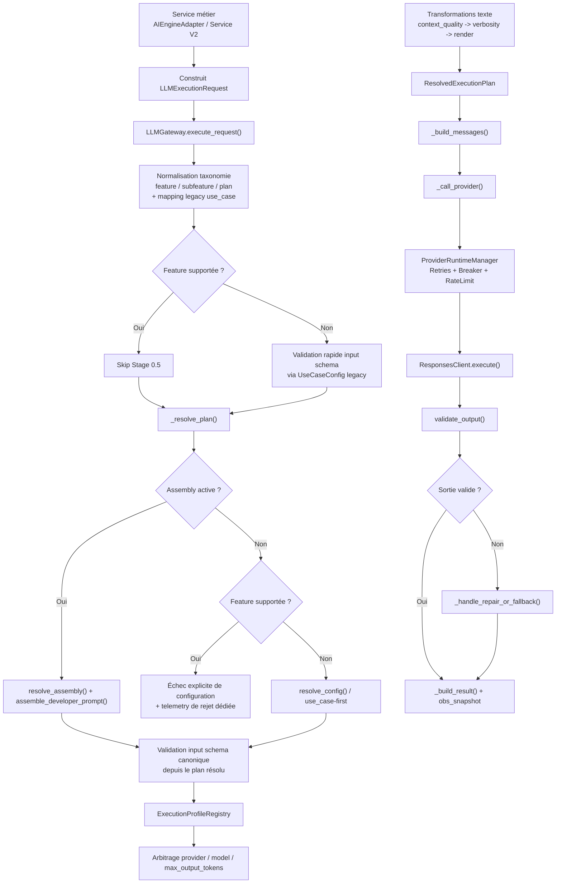
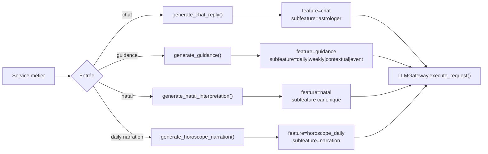
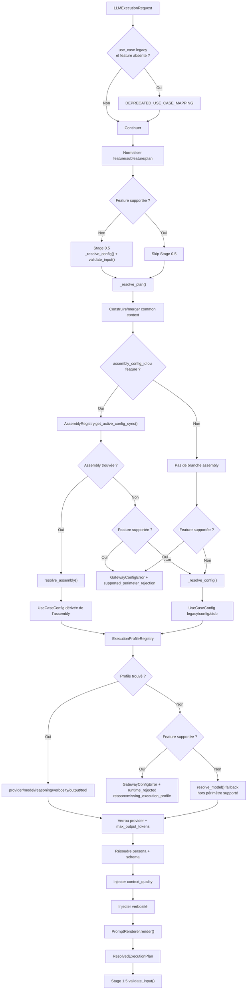
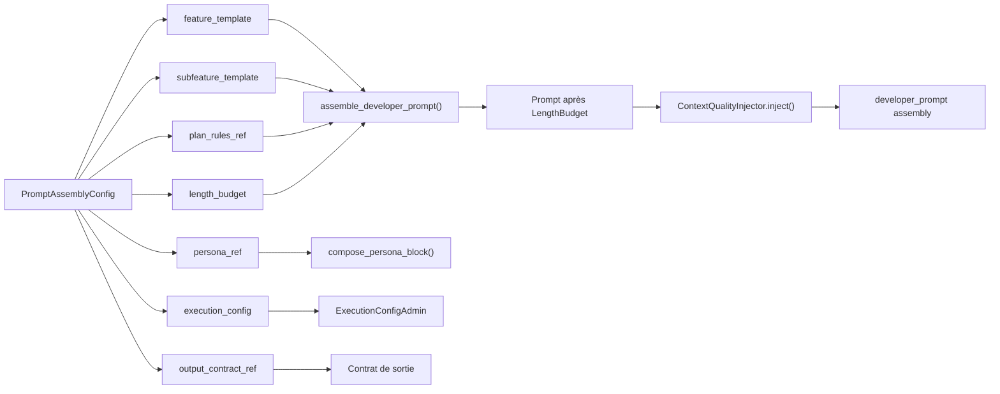
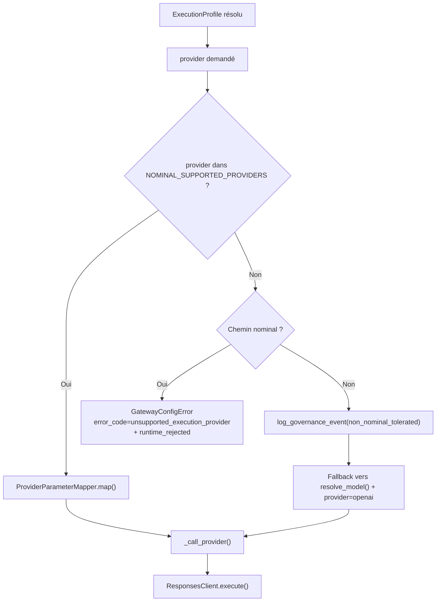
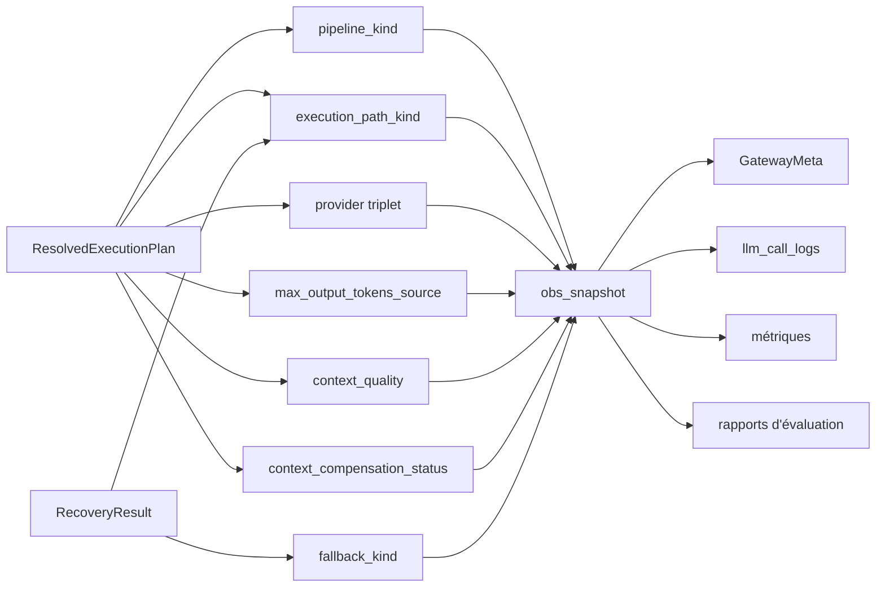

# Génération des Prompts LLM par Feature

Ce document décrit le pipeline LLM réellement exécuté dans l'application après l'epic 66. Il est volontairement centré sur le runtime observé dans le dépôt, pas sur une architecture cible idéale.

Objectifs :

- donner une source de vérité exploitable par les développeurs ;
- rendre lisible l'ordre exact de résolution dans `LLMGateway.execute_request()` ;
- montrer où vivent les variations `feature/subfeature/plan`, persona, profils d'exécution, budgets, placeholders et fallbacks ;
- éviter de réintroduire des variations concurrentes entre `use_case`, assemblies, `ExecutionProfile` et paramètres provider.

## Portée

Le document couvre :

- les points d'entrée métier qui construisent `LLMExecutionRequest` ;
- la résolution canonique dans `backend/app/llm_orchestration/gateway.py` ;
- la composition assembly ;
- la résolution des profils d'exécution ;
- le verrou provider ;
- la gestion des placeholders, de `context_quality` et des budgets de longueur ;
- l'observabilité runtime ;
- la matrice d'évaluation et la gouvernance documentaire.

Il décrit le fonctionnement réel du backend autour de :

- `backend/app/services/ai_engine_adapter.py`
- `backend/app/services/natal_interpretation_service_v2.py`
- `backend/app/llm_orchestration/gateway.py`
- `backend/app/llm_orchestration/services/assembly_resolver.py`
- `backend/app/llm_orchestration/services/execution_profile_registry.py`
- `backend/app/llm_orchestration/services/prompt_renderer.py`
- `backend/app/llm_orchestration/services/context_quality_injector.py`
- `backend/app/llm_orchestration/services/provider_parameter_mapper.py`
- `backend/app/llm_orchestration/services/fallback_governance.py`
- `backend/app/llm_orchestration/supported_providers.py`
- `backend/app/prompts/catalog.py`

## Résumé exécutable

Le pipeline cible exécuté aujourd'hui est :

1. les services métier construisent un `LLMExecutionRequest` canonique ;
2. le gateway normalise tôt `feature`, `subfeature`, `plan` et les alias legacy `use_case -> feature` quand une entrée dépréciée vise une famille supportée ;
3. la prévalidation Stage 0.5 par `UseCaseConfig` n'existe plus que pour les features hors périmètre supporté ;
4. `_resolve_plan()` tente une résolution assembly si `feature/subfeature/plan` est présent ;
5. les familles supportées `chat`, `guidance`, `natal`, `horoscope_daily` échouent explicitement si aucune assembly canonique active n'est trouvée ; le fallback `use_case-first` est éteint sur ce périmètre ;
6. le gateway reconstruit ensuite une config dérivée du plan résolu et valide l'`input_schema` canonique en Stage 1.5 ;
7. le gateway résout ensuite le `ExecutionProfile` depuis l'assembly ou par waterfall. Sur le périmètre supporté (`chat`, `guidance`, `natal`, `horoscope_daily`), tout échec de résolution (profil manquant, provider non supporté, mapping impossible) lève une `GatewayConfigError` ; le fallback historique `resolve_model()` est strictement interdit.
8. au publish et au boot, un validateur de cohérence central contrôle aussi `execution_profile_ref`, waterfall, contrat de sortie, placeholders, persona et `LengthBudget` ; depuis 66.32, au startup, le scan priorise le snapshot de release actif ; sur le périmètre nominal supporté, l’absence de snapshot actif est un état invalide de configuration, pas un second mode nominal de vérité ;
9. le prompt est transformé dans cet ordre : assembly déjà concaténée, injection `context_quality`, injection de verbosité, rendu des placeholders ;
10. l'appel provider passe aujourd'hui nominalement uniquement par `openai` ;
11. la sortie est validée, éventuellement réparée, puis éventuellement basculée vers un `fallback_use_case` legacy uniquement hors périmètre supporté ;
12. le résultat final publie un snapshot d'observabilité canonique qui inclut aussi l'identité de la release active réellement exécutée.

Le `use_case` existe encore, mais il n'est plus la source canonique de variation sur les familles convergées. Il sert surtout de clé de compatibilité, de routage legacy, de sélection de schéma et de fallback résiduel pour les features hors périmètre supporté.

## Vue d'ensemble

## Source de vérité par couche

| Couche | Source de vérité | Rôle | Ne doit pas porter |
|---|---|---|---|
| Point d'entrée métier | `AIEngineAdapter`, `NatalInterpretationServiceV2` | construire `LLMExecutionRequest` à partir des données métier | logique provider, composition de prompt profonde |
| Taxonomie | `ExecutionUserInput.feature/subfeature/plan` + `feature_taxonomy.py` | identifier la famille canonique et normaliser les alias | style, budgets, paramètres provider |
| Compatibilité `use_case` | `backend/app/prompts/catalog.py` | `DEPRECATED_USE_CASE_MAPPING`, `PROMPT_CATALOG`, `resolve_model()` | gouvernance canonique d'une famille convergée |
| Composition | `PromptAssemblyConfig` + `resolve_assembly()` | sélectionner les blocs feature/subfeature/plan/persona/contrat/exécution | choix provider brut en dehors de l'execution config |
| Style | `LlmPersonaModel` + `compose_persona_block()` | ton, voix, vocabulaire, densité stylistique | hard policy, schéma JSON, logique d'accès |
| Exécution | `ExecutionProfileRegistry` + `ProviderParameterMapper` | provider, modèle, reasoning, verbosity, output mode, tool mode | contenu métier des prompts |
| Rendu | `PromptRenderer` | blocs `context_quality`, placeholders, validation de placeholders | choix du provider |
| Garde-fous | `FallbackGovernanceRegistry`, `supported_providers.py` | blocage des fallbacks et des providers interdits | composition métier du prompt |
| Cohérence publish/boot | `ConfigCoherenceValidator`, `run_llm_coherence_startup_validation()` | bloquer une config incohérente avant exécution ou au démarrage runtime, sur le snapshot actif pour le périmètre nominal supporté | simulation complète du métier ou fallback runtime |
| Release runtime | `LlmReleaseSnapshotModel`, `LlmActiveReleaseModel`, `ReleaseService` | figer et activer atomiquement le bundle `assembly/profile/schema/persona` réellement servi ; sur le périmètre nominal supporté, cette release active est obligatoire | édition directe d'artefacts vivants au moment de l'exécution |
| Vérité finale | `ResolvedExecutionPlan` | agrégation immuable de l'exécution courante, y compris la release active et l'entrée de manifest utilisée | persistance admin |

## Stories 66.9 à 66.35

| Story | Apport canonique | Impact runtime observable |
|---|---|---|
| `66.9` | doctrine abonnement | `entitlements` décident l'accès, `plan` module la profondeur |
| `66.10` | bornes persona | la persona reste une couche de style |
| `66.11` | `ExecutionProfile` | séparation texte / exécution |
| `66.12` | `LengthBudget` | consigne éditoriale + arbitrage `max_output_tokens` |
| `66.13` | placeholders | allowlist, classification et blocage sur familles fermées |
| `66.14` | `context_quality` | blocs template + injecteur de compensation |
| `66.15` | convergence assembly | chat, guidance, natal convergent via adapter + gateway |
| `66.16` | matrice d'évaluation | couverture structurée des familles et plans |
| `66.17` | doctrine de responsabilité | répartition explicite des règles |
| `66.18` | profils stables provider | mapping interne -> paramètres provider |
| `66.19` | migration narrator daily | `AIEngineAdapter.generate_horoscope_narration()` devient le chemin principal |
| `66.20` | fermeture nominale | assembly obligatoire pour `chat`, `guidance`, `natal`, `horoscope_daily` |
| `66.21` | gouvernance des fallbacks | blocage des fallbacks `à retirer` sur chemins nominaux |
| `66.22` | verrou provider | `openai` seul provider nominalement supporté |
| `66.23` | taxonomie natal | `feature="natal"` devient l'unique clé nominale |
| `66.24` | matrice daily | `pipeline_kind` distingue nominal et transitoire |
| `66.25` | observabilité | snapshot canonique unique dans `obs_snapshot` |
| `66.26` | gouvernance documentaire | doc et template PR deviennent obligatoires |
| `66.27` | propagation `context_quality` | `context_quality_handled_by_template` est figé dans le plan puis relayé jusqu'au snapshot et à la persistance |
| `66.28` | fermeture canonique daily | `daily_prediction` est absorbé dans `horoscope_daily`, les reliquats d'évaluation sont supprimés et les publications admin legacy sont bloquées |
| `66.29` | extinction fallback | fermeture définitive du fallback `use_case-first` sur le périmètre supporté (`chat`, `guidance`, `natal`, `horoscope_daily`) |
| `66.30` | extinction fallback d'exécution | `ExecutionProfile` devient obligatoire sur le périmètre supporté ; `resolve_model()` ne survit plus qu'hors support avec rejet explicite, `error_code` stable et compteur dédié |
| `66.31` | validation fail-fast de cohérence | publish et startup bloquent désormais les incohérences de configuration sur l'état publié actif, avec `error_code` structurés et scan startup borné à la cible runtime réellement résoluble |
| `66.32` | release snapshot atomique | le runtime nominal lit désormais un snapshot de release actif, activable et rollbackable, avec propagation de `active_snapshot_id/version` et `manifest_entry_id` dans le plan et l'observabilité |
| `66.33` | durcissement runtime provider OpenAI | `_call_provider()` passe désormais par `ProviderRuntimeManager`, avec retries applicatifs bornés, breaker `provider:family`, timeouts par famille, taxonomie d'erreurs enrichie et observabilité provider-centric propagée jusqu'au snapshot canonique |
| `66.35` | qualification de charge et gate pré-prod | le gateway dispose désormais d'un harness de qualification par famille, d'un endpoint ops d'évaluation de qualification et d'une doctrine de corrélation stricte à la release active réellement exécutée ; un run sans corrélation release recevable est rejeté |
| `66.36` | golden regression gate bloquant | le publish admin exécute désormais une campagne golden corrélée au snapshot actif réellement exécutable ; `fail` et `invalid` bloquent, `constrained` publie avec warning explicite |

## Familles et points d'entrée réels

| Famille | Point d'entrée observé | Taxonomie injectée | Statut de gouvernance |
|---|---|---|---|
| `chat` | `AIEngineAdapter.generate_chat_reply()` | `feature="chat"`, `subfeature="astrologer"` | `nominal_canonical` |
| `guidance` | `AIEngineAdapter.generate_guidance()` | `feature="guidance"`, `subfeature` dérivée du `use_case` | `nominal_canonical` |
| `natal` | `AIEngineAdapter.generate_natal_interpretation()` | `feature="natal"`, `subfeature` issue du `use_case_key` puis normalisée | `nominal_canonical` |
| `horoscope_daily` | `AIEngineAdapter.generate_horoscope_narration()` | `feature="horoscope_daily"`, `subfeature="narration"` | `nominal_canonical` |
| `support` | aucune orchestration LLM dédiée identifiée dans ce pipeline | aucune | ne pas documenter comme famille LLM active |

### Diagramme de routage par famille

## Ordre exact de résolution dans le gateway

L'ordre réel, tel qu'il ressort de `execute_request()` et `_resolve_plan()`, est le suivant :

1. lecture du `use_case`, de la taxonomie fournie et des flags de visite/réparation ;
2. mapping de compatibilité `DEPRECATED_USE_CASE_MAPPING` si le `use_case` est déprécié et qu'aucune `feature` n'a été fournie ;
3. normalisation précoce de `feature`, `subfeature` et `plan` ;
4. blocage des boucles de fallback (`visited_use_cases`) ;
5. merge du `context_dict` ;
6. Stage 0.5 : prévalidation `UseCaseConfig` seulement si la feature n'appartient pas au périmètre supporté ;
7. exécution de `_resolve_plan()` ;
8. enrichissement éventuel du common context via `CommonContextBuilder` ;
9. tentative de résolution assembly via `AssemblyRegistry` ;
10. blocage explicite si famille supportée sans assembly active ;
11. fallback `use_case-first` via `_resolve_config()` seulement hors périmètre supporté ;
12. résolution du `ExecutionProfile` par référence assembly, puis waterfall `feature+subfeature+plan`, puis `feature+subfeature`, puis `feature` ; sur le périmètre supporté, cette résolution lit d'abord le bundle du snapshot actif ;
13. arbitrage provider, modèle, timeout et `max_output_tokens` ;
14. résolution du schéma de sortie et du bloc persona si nécessaire, avec priorité au contenu figé du snapshot actif ;
15. gel du `ResolvedExecutionPlan`, y compris `active_snapshot_id`, `active_snapshot_version` et `manifest_entry_id` lorsque l'exécution provient d'une release active ;
16. Stage 1.5 : reconstruction d'une config dérivée du plan et validation de l'`input_schema` canonique ;
17. composition des messages ;
18. appel provider ;
19. validation de sortie ;
20. réparation éventuelle puis fallback `fallback_use_case` éventuel, uniquement hors périmètre supporté ;
21. construction du `GatewayResult` final et du snapshot d'observabilité, incluant l'identité de la release active réellement exécutée.

### Diagramme détaillé de `execute_request()` + `_resolve_plan()`

## Assemblies et composition

`resolve_assembly()` est volontairement simple. Il ne fait pas tout le pipeline ; il produit un artefact intermédiaire `ResolvedAssembly`.

Composition réellement observée :

1. bloc `feature_template` ;
2. bloc `subfeature_template` si présent ;
3. bloc `plan_rules` si activé ;
4. injection éventuelle `LengthBudgetInjector` ;
5. injection éventuelle `ContextQualityInjector` ;
6. la persona n'est pas concaténée dans le developer prompt assembly ; elle reste un bloc séparé dans les messages ;
7. la hard policy est résolue à part via `get_hard_policy()`.

### Diagramme de composition assembly

## Doctrine d'abonnement et normalisation de plan

La règle officielle reste :

1. `entitlements` décident si l'appel a le droit d'exister ;
2. `plan` module la profondeur, la longueur et certains réglages d'exécution ;
3. un `use_case` distinct n'est justifié que si le contrat métier ou le schéma de sortie change réellement.

Normalisation runtime actuellement codée dans `_normalize_plan_for_assembly()` :

- `premium`, `pro`, `ultra`, `full` -> `premium`
- toute autre valeur, absence comprise -> `free`

Conséquence importante :

- `horoscope_daily` (nommé ainsi depuis Story 66.19) absorbe désormais systématiquement les anciennes `daily_prediction`.
- Le gateway normalise le `plan` en `free` s'il est absent.
- La famille est désormais considérée comme nominale fermée.
- l'alias `daily_prediction` n'est toléré qu'en compatibilité d'entrée ; il ne peut plus être republié nominalement via l'admin.

## Taxonomie canonique natal

Depuis 66.23 :

- `feature="natal"` est l'unique identifiant nominal autorisé ;
- `feature="natal_interpretation"` est interdit sur les chemins nominaux ;
- les subfeatures canoniques natal sont non préfixées ;
- `normalize_subfeature()` convertit encore l'alias historique `natal_interpretation` vers `interpretation`.

En pratique côté adapter :

- `generate_natal_interpretation()` alimente `subfeature` à partir de `use_case_key` ;
- pour `natal_interpretation_short`, l'adapter remplace d'abord la valeur par `natal_interpretation` ;
- le gateway normalise ensuite cette valeur en `interpretation`.

## Placeholders et rendu

Le rendu effectif est porté par `PromptRenderer.render()` :

1. résolution des blocs `{{#context_quality:VALUE}}...{{/context_quality}}` ;
2. chargement de l'allowlist de placeholders ;
3. classification des placeholders (`required`, `optional`, `optional_with_fallback`) ;
4. remplissage ou blocage selon la feature et la politique ;
5. substitution finale `{{variable}}`.

### Règles observées

- les placeholders universels sont `locale`, `use_case`, `persona_name`, `last_user_msg` ;
- les familles nominales `chat`, `guidance`, `natal`, `horoscope_daily` bloquent les placeholders non autorisés ;
- l'allowlist hardcodée de `assembly_resolver.py` couvre explicitement `chat`, `guidance`, `natal` ;
- les chemins daily passent surtout leur contexte principal dans `question`, donc dépendent moins de placeholders assembly spécialisés.

## Context Quality

Le traitement de `context_quality` repose sur deux mécanismes distincts :

1. les blocs conditionnels dans les templates ;
2. l'injecteur `ContextQualityInjector`.

Le runtime essaye d'éviter la double compensation :

- si le prompt contient déjà `{{#context_quality:partial}}` ou `{{#context_quality:minimal}}`, l'injecteur ne rajoute rien ;
- sinon il ajoute une consigne de compensation adaptée à la feature.

### Observabilité et Propagation

Depuis 66.27, `ContextQualityInjector.inject()` ne se contente plus de signaler si une compensation a été injectée ; il remonte aussi si le niveau de qualité dégradé est déjà pris en charge par le prompt/template courant.

Le code calcule et propage donc `context_quality_handled_by_template` dans `_resolve_plan()`. Ce booléen est figé dans le `ResolvedExecutionPlan` et sert de source de vérité pour l'observabilité.

Conséquences runtime observées :

- `template_handled` est publié dans `obs_snapshot.context_compensation_status` quand le template courant gère explicitement `partial` ou `minimal` ;
- `injector_applied` est publié uniquement lorsqu'une consigne de compensation a réellement été ajoutée ;
- la persistance `llm_call_logs.context_compensation_status` relaie la valeur du snapshot canonique, sans recalcul concurrent dans la couche d'observabilité.

## Profils d'exécution

Le profil d'exécution est résolu dans cet ordre :

1. `execution_profile_ref` de l'assembly active ;
2. waterfall `feature + subfeature + plan` ;
3. waterfall `feature + subfeature` ;
4. waterfall `feature` ;
5. fallback `resolve_model()` uniquement hors périmètre supporté et seulement pour une compatibilité legacy explicitement bornée par la gouvernance centrale.

Les abstractions internes stables exposées sont :

| Champ | Valeurs |
|---|---|
| `reasoning_profile` | `off`, `light`, `medium`, `deep` |
| `verbosity_profile` | `concise`, `balanced`, `detailed` |
| `output_mode` | `free_text`, `structured_json` |
| `tool_mode` | `none`, `optional`, `required` |

Le mapper provider traduit ensuite ces profils :

- OpenAI : `reasoning_effort`, `response_format`, `tool_choice`
- Anthropic : mapping préparé dans le code, mais non nominalement supporté par la plateforme

Sur le périmètre supporté :

- absence de profil -> `GatewayConfigError` avec `error_code="missing_execution_profile"` ;
- provider non supporté -> `GatewayConfigError` avec `error_code="unsupported_execution_provider"` ;
- échec de mapping provider -> `GatewayConfigError` avec `error_code="provider_mapping_failed"` ;
- ces rejets publient un événement `runtime_rejected` et incrémentent le compteur dédié `llm_runtime_rejection_total`.
- un `ResolvedExecutionPlan` supporté ne peut plus être construit avec `execution_profile_source="fallback_resolve_model"` ou `"fallback_provider_unsupported"`, même via mock ou injection incohérente.

## Validation fail-fast publish et startup

Depuis 66.31, la doctrine n'est plus seulement documentaire. Une validation centrale `ConfigCoherenceValidator` est exécutée :

- au publish d'une assembly via `AssemblyAdminService.publish_config()` ;
- au boot runtime via `run_llm_coherence_startup_validation()` appelé depuis `main.py` ;
- avec un mode startup `strict|warn|off` piloté par `LLM_COHERENCE_VALIDATION_MODE`.

Depuis 66.32, ce scan startup suit une hiérarchie explicite :

- s'il existe un `active_snapshot_id`, le boot revalide d'abord le manifest complet du snapshot actif ;
- cette revalidation travaille sur le bundle figé du snapshot pour `assembly`, `profile`, `schema` et `persona`, sans fallback silencieux vers les tables vivantes sur le périmètre supporté ;
- le scan des tables publiées “les plus récentes par cible” ne reste qu'un fallback pour les chemins hors périmètre supporté ou pour une phase transitoire explicitement non nominale.

Le scan startup reste volontairement borné :

- il ne parcourt pas l'historique complet ;
- il ignore les snapshots non actifs, les archives, brouillons et anciennes versions `published` non retenues comme état actif ;
- s'il n'y a pas de snapshot actif, il ne peut pas considérer le périmètre nominal supporté comme correctement configuré ;
- hors périmètre nominal supporté, il peut encore dédupliquer par cible runtime (`feature`, `subfeature`, `plan`, `locale`) et ne valider que la version publiée la plus récente par cible ;
- il ne contrôle donc que les artefacts effectivement résolubles par le runtime nominal courant.

### Ce que valide concrètement 66.31 puis 66.32

- `execution_profile_ref` explicite si présent, sinon waterfall canonique `feature+subfeature+plan -> feature+subfeature -> feature` ;
- absence de retour à `resolve_model()` comme issue de validation sur le périmètre supporté ;
- `output_contract_ref` résolu par UUID ou par nom, pour rester aligné avec les seeds et avec la résolution runtime, avec contrôle documentaire attendu de cohérence avec `output_mode` du profil effectivement résolu ;
- placeholders validés statiquement contre l'allowlist et la structure attendue de la famille canonique, sans mini-runtime ;
- persona existante et activée lorsqu'elle est référencée ;
- invariants `plan_rules` / `LengthBudget` ;
- interdiction des dépendances legacy sur les familles nominales fermées.

Depuis 66.32, la nuance critique est la suivante :

- la validation d'un snapshot actif ou candidat se fait sur le manifest et le bundle gelé, pas sur un recalcul opportuniste à partir des lignes live ;
- si un bundle est fourni au validateur, l'absence d'un `profile`, `schema` ou `persona` requis dans ce bundle est une erreur de release, pas une invitation à relire la table source ;
- cela garantit qu'une release activable reste auto-suffisante pour son périmètre nominal supporté et qu'un rollback réactive bien un état cohérent `N-1`.

## Release snapshot active et rollback

Depuis 66.32, le périmètre nominal convergé (`chat`, `guidance`, `natal`, `horoscope_daily`) ne lit plus une simple constellation de lignes `published`. Il lit une release active explicite :

- `LlmReleaseSnapshotModel` stocke un manifest immutable des bundles runtime par cible ;
- `LlmActiveReleaseModel` porte le pointeur d'activation courant ;
- `ReleaseService` expose `build_snapshot`, `validate_snapshot`, `activate_snapshot` et `rollback` ;
- l'activation invalide les caches runtime post-commit ;
- le rollback `N-1` réactive le snapshot précédent au lieu de republier manuellement chaque artefact.

Sur le périmètre nominal convergé, cette release active n'est pas optionnelle :

- `chat`, `guidance`, `natal` et `horoscope_daily` doivent disposer d'un snapshot actif pour être considérés comme exécutablement cohérents ;
- l'absence de snapshot actif y est un défaut de configuration à rejeter au boot et au runtime ;
- il n'y a donc plus deux modes de vérité nominaux, mais une seule vérité runtime canonique : la release active.

### Nature du gel par artefact

Le manifest ne se contente pas de stocker des pointeurs abstraits. Il capture, artefact par artefact, ce qui est nécessaire pour rejouer fidèlement l'exécution :

- `PromptAssemblyConfigModel` : copie figée complète de l'assembly runtime, y compris ses références et dépendances de composition sérialisées ;
- `LlmExecutionProfileModel` : copie figée complète du profil effectivement résolu pour la cible, même si ce profil existe aussi comme artefact versionné en table ;
- `LlmOutputSchemaModel` : copie figée complète du contrat runtime nécessaire à l'exécution, stockée comme bundle `schema` ;
- `LlmPersonaModel` : copie figée complète de la persona runtime nécessaire à l'exécution, portée dans l'assembly sérialisée ;
- `LlmPromptVersionModel` transitivement requis : contenu figé déjà capturé dans les blocs de template sérialisés de l'assembly.

Autrement dit :

- le runtime peut s'appuyer sur des IDs immutables comme métadonnées de traçabilité ;
- mais le rollback fidèle ne dépend pas d'une relecture live de ces objets sur le périmètre nominal supporté ;
- la règle de sûreté est “bundle exécutable auto-suffisant”, pas “liste de références à recharger plus tard”.

Conséquences de lecture runtime :

- `AssemblyRegistry` résout d'abord l'assembly depuis le snapshot actif ;
- `ExecutionProfileRegistry` et le gateway réutilisent le bundle attaché à l'assembly résolue pour éviter tout mélange avec les tables vivantes ;
- `ConfigCoherenceValidator.scan_active_configurations()` revalide d'abord le snapshot actif au boot ;
- les tables sources restent un backing store d'édition et de build, pas la vérité finale de l'exécution nominale quand un snapshot actif existe.

### Taxonomie minimale des erreurs de cohérence

Les erreurs stables de cohérence à utiliser côté publish/startup sont les suivantes :

- `missing_execution_profile`
- `invalid_execution_profile_ref`
- `unsupported_execution_provider`
- `missing_output_contract`
- `invalid_output_contract_ref`
- `placeholder_policy_violation`
- `persona_not_allowed`
- `plan_rules_scope_violation`
- `length_budget_scope_violation`
- `legacy_dependency_forbidden`

### Surface API admin

En cas de rejet au publish assembly, l'API admin renvoie un payload d'erreur structuré dédié :

- `error.code = "coherence_validation_failed"` ;
- `error.details.errors[*].error_code` contient les codes de cohérence détaillés ;
- cette erreur reste distincte des rejets runtime et ne doit pas être interprétée comme un `execution_path_kind` nominal.

## Durcissement Provider OpenAI (Story 66.33)

Depuis 66.33, l'appel nominal à OpenAI est protégé par un **Provider Runtime Hardening Layer** porté par `ProviderRuntimeManager`.

### 1. Politique de Retry Bornée
- Les retries implicites du SDK OpenAI sont désactivés (`max_retries=0`).
- Le retry est piloté par l'application avec un backoff exponentiel et jitter.
- Classification explicite des erreurs :
    - **Retryable** : Timeouts, erreurs de connexion, erreurs 5xx, erreurs 409 (Conflict).
    - **Terminal** : Quota épuisé, erreurs d'authentification, Bad Request (400).
- Budget de retry global épuisé -> `RetryBudgetExhaustedError`.

### 2. Timeouts par Famille
Le runtime n'utilise plus un timeout global unique. Les timeouts sont résolus par `feature` (famille) :
- `chat` : 30s
- `guidance` : 30s
- `natal` : 120s
- `horoscope_daily` : 60s
- Valeur par défaut : 30s

### 3. Circuit Breaker
Un circuit breaker est maintenu par couple `provider:family` (ex: `openai:chat`).
- État **OPEN** si le seuil d'échecs (`AI_ENGINE_CB_FAILURE_THRESHOLD`, défaut 5) est atteint.
- Blocage immédiat des requêtes suivantes pendant une période de cooldown (`AI_ENGINE_CB_RECOVERY_TIMEOUT_SEC`, défaut 60s) -> `UpstreamCircuitOpenError`.
- Passage en **HALF_OPEN** pour laisser passer une sonde après le cooldown.
- L'évaluation d'ouverture repose sur une fenêtre glissante de défaillances ; un historique ancien ne doit pas garder durablement le breaker en posture défensive.

### 4. Gestion fine des Rate Limits
- Utilisation de `.with_raw_response` pour accéder aux headers HTTP.
- Extraction du header `Retry-After` pour caler le délai de retry applicatif.
- Distinction nette entre rate limit passager et épuisement définitif du quota.
- Les erreurs serveur provider (`5xx`) sont séparées des timeouts, des erreurs de connexion et de `retry_budget_exhausted`.

### 5. Contrat aval et taxonomie propagée
Le runtime provider n'est plus écrasé en un unique `llm_unavailable`.
- `UpstreamCircuitOpenError` est mappée en `503` avec `code="upstream_circuit_open"`.
- `RetryBudgetExhaustedError` est mappée en `502` avec `code="retry_budget_exhausted"`.
- `UpstreamRateLimitError` conserve `429` et propage `retry_after_ms`.
- `UpstreamTimeoutError` conserve `504`.
- Les erreurs `bad_request`, `auth/config`, `connection_error` et `server_error` restent distinguables via `details` et la taxonomie adapter/runtime.

#### Matrice canonique de mapping

| Exception interne | HTTP status | Code API | Retryable côté client produit |
|---|---|---|---|
| `UpstreamRateLimitError` | `429` | `rate_limit_exceeded` | oui, selon `retry_after_ms` |
| `UpstreamTimeoutError` | `504` | `upstream_timeout` | oui |
| `UpstreamCircuitOpenError` | `503` | `upstream_circuit_open` | oui |
| `RetryBudgetExhaustedError` | `502` | `retry_budget_exhausted` | oui, avec backoff produit borné |
| `UpstreamConnectionError` | `502` | `upstream_connection_error` | oui |
| `UpstreamBadRequestError` | `400` | `upstream_error` | non |
| `UpstreamAuthError` | `502` | `upstream_error` | non, incident serveur/configuration |
| `UpstreamServerError` | `502` | `upstream_error` | oui, si la politique produit décide de retenter |

### 6. Observabilité Opérationnelle
Le snapshot d'observabilité et les logs `llm_call_logs` sont enrichis :
- `executed_provider_mode` : mode réel d'exécution provider observé à runtime.
- `attempt_count` : nombre total de tentatives pour l'appel.
- `provider_error_code` : code d'erreur brut renvoyé par OpenAI.
- `breaker_state` / `breaker_scope` : état du circuit au moment de l'appel.
- Ces champs sont aussi persistés sur le chemin d'erreur `log_call(error=...)`, y compris pour `circuit_open`.
- Un résultat servi en mode dégradé ne doit jamais compter comme succès nominal provider.

### 7. Mode dégradé réellement autorisé
La story 66.33 introduit le vocabulaire `nominal` / `dégradé`, mais le contrat produit actuel reste volontairement strict sur le périmètre nominal :
- pour `chat`, `guidance`, `natal` et `horoscope_daily`, les incidents provider (`rate_limit`, `timeout`, `circuit_open`, `retry_budget_exhausted`) remontent aujourd'hui prioritairement comme erreurs explicites ;
- aucun chemin nominal documenté ne doit inventer une réponse de remplacement silencieuse pour masquer un incident OpenAI ;
- un futur mode dégradé produit restera possible, mais il devra être documenté famille par famille, avec contrat de surface explicite et comptage séparé des succès nominaux.

Autrement dit, à date :
- `executed_provider_mode=nominal` signifie appel OpenAI réellement exécuté ;
- `executed_provider_mode=circuit_open` ou un code voisin décrit un court-circuit runtime explicite ;
- sur le périmètre nominal supporté, un éventuel libellé `degraded` ne doit pas être lu comme un fallback fonctionnel produit ; il ne décrit au mieux qu'un état technique générique à corréler avec la télémétrie canonique.
- un mode dégradé productisé par famille n'est pas encore une voie nominale décrite pour `chat`, `guidance`, `natal` ou `horoscope_daily`.

## Verrou provider

Le support provider nominal est porté par une source de vérité unique :

- `backend/app/llm_orchestration/supported_providers.py`
- `NOMINAL_SUPPORTED_PROVIDERS = ["openai"]`

Conséquences runtime :

- `openai` est le seul provider nominalement autorisé ;
- un provider non supporté sur un chemin nominal provoque un échec explicite ;
- un provider non supporté sur un chemin non nominal peut être toléré avec fallback vers OpenAI ;
- `_call_provider()` n'exécute effectivement que `openai`.

### Diagramme de verrou provider

## Pilotage de la longueur

Deux couches distinctes coexistent :

### 1. Couche éditoriale

`LengthBudget` injecte une consigne de longueur dans le developer prompt :

- `target_response_length`
- `section_budgets`
- `global_max_tokens`

### 2. Couche technique

L'exécution provider arbitre `max_output_tokens` dans cet ordre :

1. `LengthBudget.global_max_tokens`
2. `ExecutionProfile.max_output_tokens`
3. recommandation issue de `verbosity_profile`
4. sinon valeur héritée de la config/stub

## Fallbacks et gouvernance

Le registre de gouvernance est `FallbackGovernanceRegistry`.

Points structurants observés :

- `USE_CASE_FIRST` est `à retirer` et **interdit** sur `chat`, `guidance`, `natal`, `horoscope_daily` ;
- sur ces familles supportées, l'absence d'assembly canonique obligatoire n'est plus racontée comme un fallback : c'est un rejet explicite de configuration avec télémétrie dédiée ;
- `RESOLVE_MODEL` est désormais `à retirer` et **interdit** sur `chat`, `guidance`, `natal`, `horoscope_daily` ;
- `NARRATOR_LEGACY` est interdit sur `horoscope_daily` ;
- `TEST_LOCAL` est interdit en production ;
- un fallback `à retirer` sur un chemin nominal lève une `GatewayError`, même si la famille n'est pas explicitement listée comme interdite ;
- chaque fallback réel passe par la métrique `llm_gateway_fallback_usage_total`.
- l'alias legacy `daily_prediction` peut encore être accepté en entrée, mais il est remappé immédiatement vers `horoscope_daily` et ne peut plus être réactivé via `publish` ou `rollback` admin.
- l'input schema canonique des assemblies supportées est désormais persisté dans `llm_assembly_configs.input_schema`, backfillé par la migration `8b2d52442493` et réaligné par `seed_66_20_taxonomy()`.

## Observabilité runtime

Depuis 66.25, le gateway publie un snapshot canonique unique dans `result.meta.obs_snapshot`.

Champs observés :

- `pipeline_kind`
- `execution_path_kind`
- `fallback_kind`
- `requested_provider`
- `resolved_provider`
- `executed_provider`
- `context_quality`
- `context_compensation_status`
- `max_output_tokens_source`
- `max_output_tokens_final`
- `active_snapshot_id`
- `active_snapshot_version`
- `manifest_entry_id`
- `executed_provider_mode`
- `attempt_count`
- `provider_error_code`
- `breaker_state`
- `breaker_scope`

## Qualification de charge et capacité (Story 66.35)

La story 66.35 ajoute une couche de qualification d'exploitabilité au-dessus du runtime déjà documenté par 66.25, 66.32 et 66.33. Cette couche ne change pas la taxonomie nominale du gateway ; elle transforme les signaux existants en verdict machine-évaluable avant promotion production.

### Endpoint et contrat de qualification

L'entrée ops dédiée est :

- `POST /v1/ops/monitoring/performance-qualification`

Le contrat actuellement observé est le suivant :

- l'évaluation reçoit les compteurs de run (`total_requests`, `success_count`, `protection_count`, `error_count`), les percentiles de latence et le débit ;
- le contrôleur traduit un contexte de qualification invalide en réponse structurée `422` avec `code=invalid_qualification_context` ;
- le service rejette explicitement un run si `active_snapshot_id` ou `active_snapshot_version` ne peuvent pas être résolus ;
- `manifest_entry_id` doit être résolu de manière non ambiguë ; il peut être fourni explicitement, ou implicitement déduit seulement si le snapshot actif ne contient qu'une seule entrée de manifest ; sur un snapshot multi-cibles, l'absence de valeur explicite invalide la qualification ;
- un manifest invalide ou non exploitable n'est pas traité comme une qualification partielle ; il déclenche un rejet métier explicite.

### Corrélation release exigée

La règle d'exploitation est désormais :

- aucun rapport de qualification recevable ne doit être produit sans résolution non ambiguë de `active_snapshot_id`, `active_snapshot_version` et `manifest_entry_id` ;
- `active_snapshot_id/version` décrivent la release active réellement exécutée ;
- `manifest_entry_id` identifie l'entrée exacte du manifest figé par la release ;
- une corrélation partielle n'est pas "mieux que rien" ; elle invalide le run ;
- cette exigence vaut même si les métriques de latence et d'erreur semblent bonnes.

### Source de vérité des seuils

La doctrine de qualification n'est pas seulement narrative. À date, la source de vérité versionnée des seuils utilisés par le verdict vit dans :

- [backend/app/llm_orchestration/performance_registry.py](/c:/dev/horoscope_front/backend/app/llm_orchestration/performance_registry.py) pour les `PERFORMANCE_SLO_REGISTRY` et `PERFORMANCE_SLA_REGISTRY` par famille ;
- [backend/app/llm_orchestration/services/performance_qualification_service.py](/c:/dev/horoscope_front/backend/app/llm_orchestration/services/performance_qualification_service.py) pour l'application de ces seuils au run, le calcul du budget d'erreurs et la production du verdict.

En conséquence :

- le `pass / fail / constrained-pass` n'est pas décidé par lecture manuelle du rapport ;
- le rapport lisible doit être interprété comme la projection d'une décision déjà calculée par le code ;
- toute évolution des thresholds SLO/SLA ou du budget d'erreurs doit passer par ces artefacts versionnés.

### Ce que 66.35 qualifie réellement

Le périmètre qualifié est le périmètre nominal supporté :

- `chat`
- `guidance`
- `natal`
- `horoscope_daily`

La qualification vise :

- charge nominale par famille ;
- burst court ;
- stress avec protections runtime et recovery ;
- consommation de budget d'erreurs ;
- verdict `go / no-go / go-with-constraints`.

Elle ne doit pas être interprétée comme la preuve d'un fallback fonctionnel nominal. Sur ces familles, les incidents provider restent prioritairement visibles comme erreurs explicites ou protections runtime canoniques.

### Lecture correcte d'un run qualifié

Un run de qualification doit être lu conjointement avec :

- le snapshot canonique `obs_snapshot` ;
- les axes `executed_provider_mode`, `attempt_count`, `provider_error_code`, `breaker_state`, `breaker_scope` ;
- la release active (`active_snapshot_id`, `active_snapshot_version`) ;
- l'entrée de manifest (`manifest_entry_id`) ;
- le verdict du rapport de capacité.

En pratique :

- un run sans identifiants de release complets ne vaut pas preuve ;
- un `429`, `upstream_timeout`, `upstream_circuit_open` ou `retry_budget_exhausted` ne doit jamais être reclassé en succès nominal ;
- un rejet de qualification pour défaut de corrélation release est un défaut de contexte ops, pas une réussite dégradée.

## Golden Regression Gate (Story 66.36)

La story 66.36 ajoute un second niveau de gate avant publication, complémentaire à 66.35. Là où 66.35 qualifie la capacité et la stabilité sous charge, 66.36 qualifie la non-régression structurelle et d'observabilité sur un golden set synthétique et versionné.

### Point de branchement réel

Le branchement effectif observé est :

- `PATCH /v1/admin/llm/use-cases/{key}/prompts/{version_id}/publish`
- appel à `GoldenRegressionService.run_campaign(...)` avant `PromptRegistryV2.publish_prompt(...)`

Conséquence runtime :

- `pass` : publication autorisée ;
- `constrained` : publication autorisée avec warning `golden_regression_constrained_drift` ;
- `fail` : publication bloquée avec réponse structurée `409` ;
- `invalid` : publication bloquée avec réponse structurée `409`.

### Source de vérité et artefacts

Les artefacts versionnés introduits pour ce gate sont :

- `backend/app/llm_orchestration/services/golden_regression_service.py`
- `backend/app/llm_orchestration/golden_regression_registry.py`
- `backend/tests/fixtures/golden/`

La séparation doctrinale est désormais la suivante :

- la fixture golden porte l'entrée synthétique et la baseline canonique ;
- le registre golden porte la classification des champs `obs_snapshot` et les états legacy interdits ;
- le rapport golden produit le verdict agrégé et les diffs safe-by-design.

Pour éviter toute ambiguïté entre "seuils" et "classification", la mise en oeuvre 66.38 expose aussi explicitement la vue doctrinale `OBS_SNAPSHOT_CLASSIFICATION_DEFAULT`, dérivée du registre golden mais dédiée à la lecture gouvernance/doc ↔ code.

À date, le golden set effectivement introduit reste minimal et sert de socle versionné pour le gate. Il n'est pas encore la couverture exhaustive finale de toutes les variantes métier de `chat`, `guidance`, `natal` et `horoscope_daily`, mais le contrat de campagne et le point de branchement bloquant sont désormais en place.

### Corrélation release obligatoire

Un run golden recevable doit être corrélé à la release réellement exécutable, selon les mêmes invariants de traçabilité que 66.32 et 66.35 :

- `active_snapshot_id`
- `active_snapshot_version`
- `manifest_entry_id`

Le service résout d'abord le snapshot actif, puis charge le manifest de release, puis résout une entrée de manifest non ambiguë à partir des fixtures. Si cette corrélation échoue, le verdict global devient `invalid` et la publication est bloquée.

### Ce que compare le gate

La comparaison golden n'est pas textuelle. Elle repose sur :

- `validation_status`
- la `shape` canonique de `structured_output`
- la présence de placeholders survivants
- `obs_snapshot` avec classification `strict`, `thresholded`, `informational`
- l'absence de réapparition de chemins legacy interdits

La comparaison applique une canonicalisation explicite avant diff pour neutraliser les variations d'ordre ou de structure non pertinentes au verdict.

En pratique, la couche de canonicalisation actuellement observée :

- trie les clés des objets pour stabiliser les diffs structurels ;
- compare la shape et non le wording éditorial ;
- traite les placeholders survivants comme une dérive bloquante ;
- ne transforme pas le rapport en diff textuel de contenu.

### Classification `obs_snapshot`

Le registre golden applique désormais une classification explicite des champs d'observabilité :

- `strict` : `pipeline_kind`, `execution_path_kind`, `fallback_kind`, triplet provider, `context_compensation_status`, `max_output_tokens_source` ;
- `thresholded` : `max_output_tokens_final` avec tolérance versionnée ;
- `informational` : `executed_provider_mode`, `attempt_count`, `provider_error_code`, `breaker_state`, `breaker_scope`, `active_snapshot_id`, `active_snapshot_version`, `manifest_entry_id`.

Source de vérité runtime :

- `GOLDEN_THRESHOLDS_DEFAULT` reste la source de vérité des tolérances et des états legacy interdits ;
- `OBS_SNAPSHOT_CLASSIFICATION_DEFAULT` expose explicitement la classification `strict` / `thresholded` / `informational` relue par le gate documentaire.

Règle de lecture :

- un écart `strict` est bloquant ;
- un écart `thresholded` peut produire un verdict `constrained` ;
- un champ `informational` enrichit le rapport mais ne bloque pas à lui seul.

### Anti-réapparition legacy

Sur le périmètre nominal supporté, le gate considère comme bloquants :

- `legacy_use_case_fallback`
- `legacy_execution_profile_fallback`
- `non_nominal_provider_tolerated`
- `fallback_resolve_model`
- `fallback_provider_unsupported`
- tout `fallback_kind` interdit par le registre golden

Cette règle vaut autant pour les champs d'observabilité que pour `execution_profile_source`.

### Rapport safe-by-design

Le rapport de golden regression reste aligné sur la politique de minimisation de 66.34 :

- pas de prompt brut ;
- pas de `raw_output` ;
- pas de dump complet de `structured_output` ;
- pas de contenu utilisateur rejouable dans la réponse admin nominale ;
- seulement des identifiants de fixture, verdicts, diffs structurels bornés, diffs `obs_snapshot` et erreurs legacy.

### Règle de lecture ops

Un publish supporté ne doit plus être considéré recevable si :

- la campagne golden n'a pas été exécutée ;
- la campagne retourne `fail` ;
- la campagne retourne `invalid` faute de corrélation release exploitable ;
- un run laisse réapparaître un chemin legacy interdit, même si la structure de sortie semble nominale.

### Axes de lecture

| Axe | Sens |
|---|---|
| `pipeline_kind` | statut de gouvernance attendu de la famille |
| `execution_path_kind` | chemin structurel effectivement emprunté |
| `fallback_kind` | cause dominante de fallback si fallback réel |
| provider triplet | provider demandé, résolu, exécuté |
| `context_compensation_status` | compensation de contexte observée |
| `max_output_tokens_source` | source finale de l'arbitrage de sortie |
| `executed_provider_mode` | mode réel d'exécution provider (`nominal`, `circuit_open` ou autre valeur technique stable) ; sur le périmètre supporté, une valeur `degraded` éventuelle ne vaut pas fallback produit |
| `attempt_count` | nombre total de tentatives réellement consommées |
| `provider_error_code` | taxonomie finale de l'échec provider ou du rejet runtime |
| `breaker_state/scope` | état et granularité du breaker ayant piloté la décision runtime |
| `active_snapshot_id/version` | release active réellement exécutée |
| `manifest_entry_id` | entrée de manifest exacte utilisée pour cette exécution |

Pour l'axe `context_compensation_status`, la lecture correcte est désormais :

- `not_needed` : `context_quality=full` ;
- `template_handled` : le prompt courant gère déjà explicitement le niveau dégradé ;
- `injector_applied` : une consigne additionnelle a été injectée ;
- `unknown` : l'information n'est pas déterminable sur le chemin considéré.

### Couche d'exploitation ops dédiée (Story 66.37)

Depuis 66.37, l'observabilité LLM ne se limite plus au dashboard admin agrégé par `use_case`.

Une surface read-only dédiée est exposée via :

- `GET /v1/ops/monitoring/llm/dashboard`

Cette surface lit exclusivement `llm_call_logs` comme vérité consolidée d'exploitation. Elle ne repose pas sur `metrics.py`, qui reste limité aux signaux `instance_local`.

Le read model ops expose actuellement :

- des vues 1D : `family`, `plan`, `persona`, `pipeline_kind`, `active_snapshot_version`, `active_snapshot_id`, `manifest_entry_id` ;
- des vues croisées : `family × execution_path_kind`, `family × fallback_kind`, `family × requested_provider/resolved_provider/executed_provider`, `family × context_quality`, `family × max_output_tokens_source` ;
- pour chaque bucket : volume, `avg`, `p50`, `p95`, `p99`, taux d'échec, taux de repair, taux de fallback.

Règles de lecture importantes :

- la dimension `persona` côté ops est portée par `persona_id` ;
- un `display_value` peut afficher `LlmPersonaModel.name` en dashboard, mais ce libellé éditorial ne doit pas participer au label set des alertes ;
- `active_snapshot_id`, `active_snapshot_version` et `manifest_entry_id` sont propagés pour corréler une dérive à la release réellement exécutée ;
- la surface reste safe-by-design : pas de prompt, pas de `raw_output`, pas de dump `structured_output`.

### Alertes d'exploitation LLM

66.37 introduit aussi une première couche d'alertes structurées calculées sur la fenêtre demandée à partir de `llm_call_logs`.

Décision d'architecture à date :

- les alertes 66.37 sont aujourd'hui calculées à la demande par le read model ops ;
- aucun `alert event` append-only dédié à 66.37 n'est encore persisté dans cette première version ;
- si une persistance d'événements d'alerte est ajoutée plus tard, elle devra réutiliser le pattern idempotent déjà employé côté ops canonique, et non un scheduler opportuniste embarqué dans FastAPI.

Classes actuellement exposées :

- `llm_repair_rate_hike` : hausse du taux de repairs sur `family × plan × persona × pipeline_kind` ;
- `llm_nominal_fallback_detected` : `fallback_kind` observé sur le périmètre nominal `chat`, `guidance`, `natal`, `horoscope_daily` ;
- `llm_provider_divergence` : divergence sur le triplet `requested/resolved/executed_provider` ;
- `llm_impossible_state_detected` : combinaison runtime interdite par contrat ;
- `llm_unknown_path_violation` : apparition d'un `unknown` non permis par contrat.

Doctrine d'implémentation actuelle :

- la baseline repairs compare la fenêtre courante à la fenêtre précédente de même taille ;
- le déclenchement exige un volume minimal, un seuil absolu de taux, et un écart relatif ou absolu suffisant ;
- les labels d'alerte restent canoniques et bornés ;
- les annotations restent limitées à `summary`, `description`, `runbook_url`.

Table de triage actuellement documentée :

| Classe | Sévérité actuelle | Lecture ops |
|---|---|---|
| `llm_repair_rate_hike` | `high` | dérive de qualité de sortie confirmée par seuil + baseline |
| `llm_nominal_fallback_detected` | `high` | compatibilité anormale observée sur périmètre nominal |
| `llm_provider_divergence` | `high` | divergence runtime sur triplet provider |
| `llm_unknown_path_violation` | `high` | violation de contrat sur chemin observé |
| `llm_impossible_state_detected` | `critical` | état interdit par contrat, à investiguer immédiatement |

Politique anti-bruit actuelle :

- pas de firing unitaire sur simple métrique locale d'instance ;
- calcul sur fenêtre explicite (`1h`, `24h`, `7d`) à partir de `llm_call_logs` ;
- volume minimal et delta minimal pour les repairs ;
- pas encore de mécanisme `for`/`keep_firing_for` persisté dans l'application elle-même.

Cette dernière limite est volontaire : dans l'état courant, l'anti-flapping repose d'abord sur les règles de calcul du read model ; une couche de persistance ou d'orchestration externe devra porter les politiques temporelles plus avancées si le besoin apparaît.

### Contrat unique des états permis et interdits

La source de vérité des états d'exploitation autorisés/interdits est centralisée dans `backend/app/llm_orchestration/policies/ops_contract.py`.

Ce module gouverne :

- les chemins `unknown` encore tolérés ;
- les combinaisons `pipeline_kind` / `execution_path_kind` / `fallback_kind` impossibles ;
- les seuils contractuels de repairs ;
- la canonicalisation du label `persona` pour l'alerting.

Conséquence : une logique d'anomalie ne doit pas réinventer ses propres règles dans plusieurs services. Toute évolution du contrat ops doit partir de ce module unique.

### Place des rejets canoniques dans la lecture ops

La surface `GET /v1/ops/monitoring/llm/dashboard` documente des exécutions effectivement persistées dans `llm_call_logs` et les anomalies dérivées de ces exécutions.

Elle ne doit pas être lue comme la source primaire des rejets canoniques bloquants. Les cas `runtime_rejected` et `supported_perimeter_rejection` restent portés par leur télémétrie structurée dédiée :

- événements structurés de rejet ;
- logs structurés associés ;
- compteur discriminant `llm_runtime_rejection_total` avec `reason`.

Règle de lecture :

- un `fallback_observed` correspond à une exécution complétée avec compatibilité observée ;
- un `runtime_rejected` correspond à un rejet canonique et n'est pas reclassé en faux chemin nominal ;
- un `impossible_state_detected` correspond à une combinaison persistée mais interdite par contrat ;
- un `unknown_contract_violation` correspond à un état observé non permis par le contrat versionné.

Autrement dit, la surface ops 66.37 complète la lecture des rejets canoniques, mais ne remplace pas la télémétrie spécifique qui les porte déjà.

## Protection des données sensibles (Story 66.34)

L'application applique désormais une politique runtime unique de classification et de rédaction pour empêcher qu'un prompt, une sortie LLM, une donnée natale, un identifiant métier corrélable ou un secret soit recopié par erreur dans une surface d'exploitation.

### 1. Source de vérité centrale

Le module de référence est `backend/app/core/sensitive_data.py`.

Il porte :
- la taxonomie des catégories de données ;
- la matrice `sink -> traitement` ;
- l'allowlist positive `OPERATIONAL_FIELDS` des métadonnées explicitement autorisées ;
- les helpers de classification, transformation et sanitation réutilisés par logs, audit, observabilité et admin.

Les catégories actuellement codées sont :
- `secret_credential`
- `direct_identifier`
- `technical_correlation_identifier`
- `correlable_business_identifier`
- `user_authored_content`
- `derived_sensitive_domain_data`
- `operational_metadata`

Règle de lecture :
- un champ inconnu n'est pas promu en métadonnée ops par défaut ;
- l'autorisation en clair repose sur l'allowlist positive, pas sur l'idée qu'un champ "aide au debug".

### 2. Matrice de traitement par sink

| Sink | Règle effective |
|---|---|
| `structured_logs` | secrets supprimés, identifiants directs redacts, IDs métier masqués, contenu utilisateur redacted |
| `obs_snapshot` | uniquement métadonnées ops et identifiants techniques explicitement admis, notamment `request_id`, `trace_id`, `active_snapshot_id`, `active_snapshot_version` et `manifest_entry_id` |
| `llm_call_logs` | uniquement métadonnées ops + empreintes irréversibles autorisées (`hash`) |
| `llm_replay_snapshots` | seul store pouvant contenir du rejouable sensible, sous forme chiffrée et isolée |
| `admin_api` | payloads de sortie assainis via `sanitize_payload(..., Sink.ADMIN_API)` |
| `audit_trail` | détails sanitisés avant persistance, identifiants métier masqués, contenu utilisateur interdit |

Conséquences structurantes :
- `llm_call_logs` reste un journal d'exploitation sans contenu utilisateur en clair ;
- `LlmReplaySnapshotModel` reste la seule zone de stockage rejouable ;
- `obs_snapshot` et `GatewayMeta` restent des transports de métadonnées, pas de contenu ;
- les identifiants métier corrélables n'ont pas vocation à apparaître en clair dans `obs_snapshot`.

### 3. Frontière explicite entre exploitation et replay

La frontière d'architecture est désormais la suivante :
- `llm_call_logs` : corrélation ops, statuts, latence, coûts, taxonomie provider, discriminants runtime ;
- `llm_replay_snapshots` : input rejouable sensible, chiffré, TTL court, hors dashboards ;
- audit/admin : références sûres et détails bornés, jamais dump opportuniste du payload source.

Le replay admin ne renvoie plus par défaut :
- `raw_output`
- `structured_output`
- aperçu textuel
- diff textuel de contenu
- citation partielle
- comparaison sémantique textuelle

La réponse nominale de replay reste limitée à des métadonnées ops et à un diff non textuel de statut/validation ; cela exclut aussi toute preview, tout extrait de contenu et toute comparaison sémantique dérivée du texte rejoué.

### 4. Audit et admin

Le contrat audit a été durci de deux façons :
- les événements LLM sensibles utilisent des DTOs safe dédiés, par exemple `LlmPromptAuditDetails` et `NatalInterpretationAuditDetails` dans `backend/app/schemas/audit_details.py` ;
- les call sites legacy qui passent encore un `dict` libre sont normalisés en structure JSON bornée avant sanitation, sans exécuter de sérialisation riche arbitraire.

Côté admin :
- les erreurs API passent par `_error_response(... sanitize_payload(..., Sink.ADMIN_API))` ;
- `AdminLogsPage` applique un masquage récursif de défense en profondeur sur les `details` d'audit avant affichage ;
- cette défense UI ne remplace pas le contrat backend, elle ne fait qu'ajouter un garde-fou terminal.

### 5. Logging runtime

Le filet terminal `SensitiveDataFilter` couvre maintenant :
- les messages structurés passés comme `dict` ;
- les arguments positionnels (`logger.info("%s", value)`) ;
- les champs `extra={...}` fusionnés dans le `LogRecord`.

Ce filtre reste volontairement un garde-fou final.
La hiérarchie de confiance est :
1. serializers et DTOs bornés par sink ;
2. sanitation explicite avant persistance / restitution ;
3. filtre global logging en dernier recours.

### 6. Hashing, non-fuite et maintenance

`compute_input_hash()` s'appuie sur la politique `Sink.LLM_CALL_LOGS` avant calcul du SHA-256 pour éviter qu'un hash serve de prétexte à persister l'entrée brute.

La vérification locale de cette story s'appuie au minimum sur :
- `backend/tests/unit/test_sensitive_data_non_leakage.py`

Cette suite couvre notamment :
- la distinction entre identifiants techniques et identifiants métier corrélables ;
- l'absence de whitelist implicite pour des conteneurs génériques comme `payload` ou `details` ;
- la sanitation des champs `extra=` dans le logging ;
- l'absence de fuite dans l'audit après sanitation.

Règle de maintenance :
- toute nouvelle métadonnée ops doit être ajoutée explicitement à `OPERATIONAL_FIELDS` ;
- toute nouvelle surface admin, audit ou replay doit choisir son sink et sa stratégie de traitement avant d'exposer un champ.

### Taxonomies actuellement exposées

#### `pipeline_kind`

- `nominal_canonical` pour `chat`, `guidance`, `natal`, `horoscope_daily`
- `transitional_governance` pour le reste (ex: use cases legacy non encore migrés)

#### `execution_path_kind`

- `canonical_assembly`
- `legacy_use_case_fallback`
- `legacy_execution_profile_fallback`
- `repair`
- `non_nominal_provider_tolerated`

Important :

- un chemin supporté rejeté faute d'assembly canonique obligatoire n'émet pas de `GatewayResult` de succès avec `legacy_use_case_fallback` ;
- un chemin supporté rejeté faute d'`ExecutionProfile` valide n'émet pas de `GatewayResult` de succès avec `legacy_execution_profile_fallback` ni `non_nominal_provider_tolerated` ;
- ce scénario est visible via l'erreur explicite et la télémétrie de rejet (`supported_perimeter_rejection`), pas via un faux chemin nominal.

### Garde-fou de maintenance

Toute future PR doit préserver l'invariant suivant :

- aucune valeur legacy interdite (`fallback_resolve_model`, `fallback_provider_unsupported`, `legacy_execution_profile_fallback`, `non_nominal_provider_tolerated`) ne doit réapparaître comme état acceptable pour `chat`, `guidance`, `natal`, `horoscope_daily` ;
- cette interdiction vaut autant pour les enums et modèles runtime que pour les fixtures admin, plans mockés, snapshots d'observabilité et assertions de tests ;
- si une compatibilité hors support est encore testée, elle doit rester explicitement bornée à un chemin non nominal ou legacy hors périmètre supporté.

### Rejets canoniques

Lorsqu'un chemin supporté échoue faute d'assembly canonique obligatoire ou faute d'`ExecutionProfile` exploitable :

- le runtime lève une erreur explicite de configuration au lieu de produire un `GatewayResult` nominal ;
- le scénario n'est donc pas encodé comme `execution_path_kind` de succès ;
- la lecture ops passe par la télémétrie de rejet dédiée, en particulier l'événement structuré (`supported_perimeter_rejection` ou `runtime_rejected`), les logs structurés associés, et pour 66.30 le compteur dédié `llm_runtime_rejection_total` avec un label `reason` discriminant ;
- l'absence volontaire de `execution_path_kind` dédié évite de confondre un rejet canonique avec un chemin d'exécution réellement complété.

#### `fallback_kind`

- nullable quand aucun fallback réel n'est observé ;
- sinon résumé dominant aligné sur la gouvernance.

### Diagramme de lecture de l'observabilité

## Matrice d'évaluation

La validation ne repose pas seulement sur les tests unitaires. Une matrice d'évaluation croise :

- `feature`
- `plan`
- `persona`
- `context_quality`
- `pipeline_kind`

Elle vérifie notamment :

- absence de placeholders survivants ;
- application des budgets ;
- différenciation de persona ;
- stabilité des contrats ;
- cohérence entre gouvernance attendue et chemin observé.

Depuis 66.36, cette matrice n'est plus seulement une grille de qualification documentaire. Une partie de ses invariants est désormais exécutée avant publication via la campagne golden :

- comparaison structurelle machine-readable ;
- comparaison `obs_snapshot` classifiée ;
- corrélation obligatoire à la release active ;
- rejet bloquant de toute réapparition legacy interdite.

Depuis 66.24 (mis à jour en 66.28) :

- `horoscope_daily` est évalué comme `nominal_canonical` ;
- `daily_prediction` a été absorbé dans `horoscope_daily` et n'apparaît plus comme famille autonome ;
- un chemin obligatoire manquant rend la campagne incomplète ou bloquante.

## Où mettre une nouvelle règle

| Besoin | Endroit correct |
|---|---|
| varier la profondeur free/premium sans changer le schéma | `plan_rules` + `LengthBudget` |
| changer le provider ou le modèle | `ExecutionProfile` |
| rendre le style plus empathique | persona |
| changer la structure JSON de sortie | contrat / schéma de sortie |
| injecter une donnée utilisateur | placeholder autorisé + politique de résolution |
| adapter le ton à un contexte incomplet | `context_quality` |

## Violations fréquentes à éviter

- mettre un nom de modèle dans un template métier ;
- demander du JSON dans une persona ;
- encoder une logique de feature dans des `plan_rules` ;
- utiliser `max_output_tokens` comme substitut d'une consigne éditoriale ;
- créer un nouveau `use_case_free` alors que seul le niveau de détail change ;
- documenter comme “nominal” un chemin qui n'est observé qu'en compatibilité ou en test.

## Règle de lecture

- une affirmation n'est présente ici que si elle est appuyée par une source explicite du dépôt ;
- lorsqu'un comportement est supporté par les types/tests mais pas complètement propagé par le runtime, cette nuance est écrite explicitement ;
- si le code diverge, le code fait foi jusqu'à mise à jour de cette documentation.

## Maintenance de cette documentation

Ce document constitue une **règle d'ingénierie explicite**. Sa maintenance est **obligatoire**, **traçable** et désormais **partiellement automatisée** (Story 66.38).

### Contrôles automatiques (CI/Quality Gate)

Depuis 66.38, le contrôle documentaire exécutable repose sur trois briques explicites :

- le manifeste unique `backend/app/llm_orchestration/doc_conformity_manifest.py` ;
- le script local/CI `backend/scripts/check_doc_conformity.py` ;
- le workflow PR bloquant `.github/workflows/llm-doc-conformity.yml`.

Le manifeste est la seule source de vérité pour :

- les fichiers structurants du pipeline LLM ;
- le chemin de ce document ;
- le marqueur du bloc de preuve documentaire final ;
- les motifs bornés de justification autorisés dans le template PR.

Le pipeline de CI et le quality gate local (`scripts/quality-gate.ps1`) exécutent désormais les contrôles suivants :

- **Lint de conformité doc ↔ code** :
  - taxonomie canonique via `SUPPORTED_FAMILIES` ;
  - alias legacy tolérés via `feature_taxonomy.py`, avec contrôle explicite des mappings `daily_prediction -> horoscope_daily` et `natal_interpretation -> natal` ;
  - provider nominal via `NOMINAL_SUPPORTED_PROVIDERS`, avec rejet des providers nominaux documentés en trop ;
  - fallbacks structurants `USE_CASE_FIRST` et `RESOLVE_MODEL`, avec contrôle du statut doctrinal et du périmètre de familles interdites ;
  - classification `obs_snapshot` sur les trois classes `strict`, `thresholded`, `informational` à partir de `OBS_SNAPSHOT_CLASSIFICATION_DEFAULT`, dérivée du registre golden versionné.
- **Détection d'impact structurel** :
  - le script calcule d'abord le changeset à partir d'un merge-base avec la branche de base quand cette référence est disponible ;
  - en CI, le workflow transmet explicitement `github.base_ref` au script via `DOC_CONFORMITY_BASE_REF` ;
  - en local ou en contexte Git atypique, le script retombe de façon déterministe sur des fallbacks bornés (`origin/main`, `main`, puis `HEAD~1` ou `HEAD`) ;
  - il ajoute aussi les changements `staged`, `unstaged` et `untracked` pour que le gate local couvre le working tree, pas seulement les commits déjà créés ;
  - si un fichier structurant est touché, ce document doit être mis à jour dans le même changeset, sauf justification bornée explicitement autorisée.
- **Validation du bloc de preuve documentaire** :
  - si ce document est modifié sur un change structurel, le contrôle exige qu'au minimum la `Date` et/ou la `Référence stable` du bloc final changent effectivement ;
  - un simple changement cosmétique dans la section de preuve ne satisfait pas le gate.
- **Validation du template PR** :
  - le workflow PR lit le corps de la pull request et vérifie la cohérence entre fichiers touchés, mise à jour documentaire et justification déclarée ;
  - en contexte PR, la section de gouvernance documentaire doit être explicitement renseignée ; un corps vide ou une section laissée sans réponse fait désormais échouer le contrôle ;
  - les motifs autorisés sont bornés à `REF_ONLY`, `FIX_TYPO`, `TEST_ONLY`, `DOC_ONLY`, `NON_LLM` ;
  - `DOC_ONLY` n'est recevable que si ce document a effectivement été mis à jour ;
  - en l'absence de mise à jour documentaire sur un change structurel, exactement un motif autorisé doit être sélectionné.

### Discipline de mise à jour et règle de PR

Toute Pull Request modifiant la structure ou la gouvernance du pipeline LLM doit :

1. Soit mettre à jour ce document dans le même change set pour refléter la nouvelle réalité technique.
2. Soit fournir dans le template PR la justification bornée explicitement prévue par le workflow.

Le template PR n'est pas un simple rappel humain. Il est désormais couplé à un contrôle CI bloquant qui valide :

- la présence d'une réponse documentaire explicite ;
- la cohérence entre cette réponse et les fichiers réellement modifiés ;
- l'usage exclusif des motifs autorisés quand aucune mise à jour doc n'est livrée.

### Zones à impact documentaire obligatoire

La revue de ce document est **obligatoire** pour toute modification portant sur le périmètre structurel centralisé dans `backend/app/llm_orchestration/doc_conformity_manifest.py`.

À la date de cette vérification, ce périmètre couvre au minimum :

- `docs/llm-prompt-generation-by-feature.md`
- `.github/pull_request_template.md`
- `.github/workflows/llm-doc-conformity.yml`
- `backend/app/llm_orchestration/gateway.py`
- `backend/app/llm_orchestration/doc_conformity_manifest.py`
- `backend/app/llm_orchestration/feature_taxonomy.py`
- `backend/app/llm_orchestration/services/doc_conformity_validator.py`
- `backend/app/llm_orchestration/services/fallback_governance.py`
- `backend/app/llm_orchestration/services/provider_parameter_mapper.py`
- `backend/app/llm_orchestration/services/config_coherence_validator.py`
- `backend/app/llm_orchestration/golden_regression_registry.py`
- `backend/app/llm_orchestration/supported_providers.py`
- `backend/app/llm_orchestration/models.py`
- `backend/scripts/check_doc_conformity.py`

La liste versionnée dans le manifeste fait foi si elle diverge de ce résumé.

Conséquence importante :

- le gate documentaire est désormais lui-même dans son propre périmètre de gouvernance ;
- une modification du manifeste, du validateur, du script ou du workflow PR/CI est donc traitée comme un changement documentaire structurel et ne peut plus dériver silencieusement hors de cette documentation.

### Vérification et Traçabilité

Toute mention de vérification ci-dessous atteste d'une **revue manuelle effective** contre le code réel à la référence indiquée. Les références flottantes (`HEAD`, `main`, etc.) sont interdites.

Dernière vérification manuelle contre le pipeline réel du gateway :

- **Date** : `2026-04-13`
- **Référence stable (Commit SHA)** : `deb8cc6f`

Si le code diverge, le pipeline réel du gateway fait foi jusqu'à mise à jour de cette documentation, mais l'absence de mise à jour constitue une **dette de gouvernance**.
