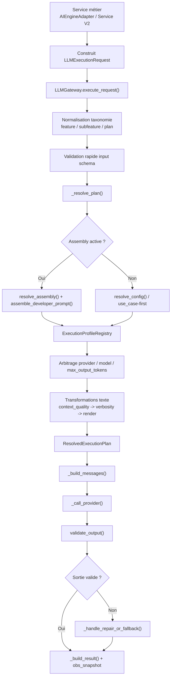
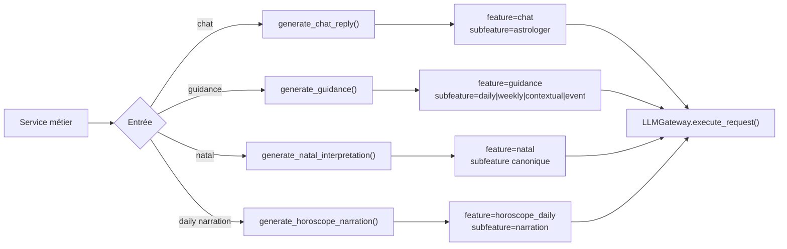
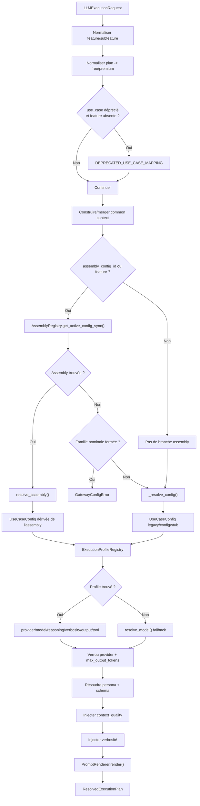
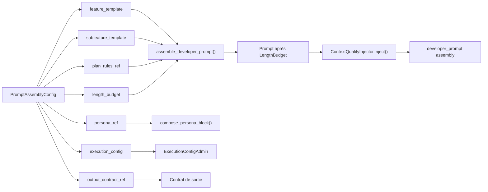
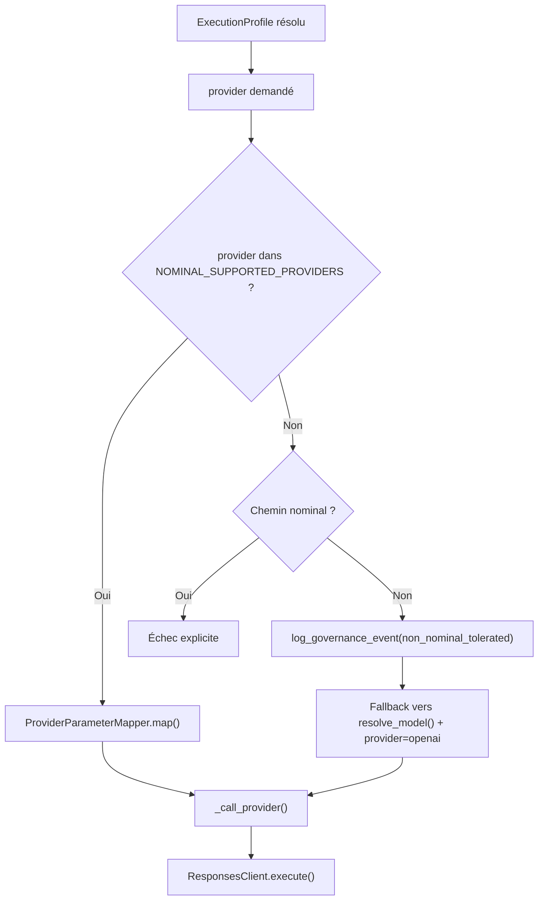
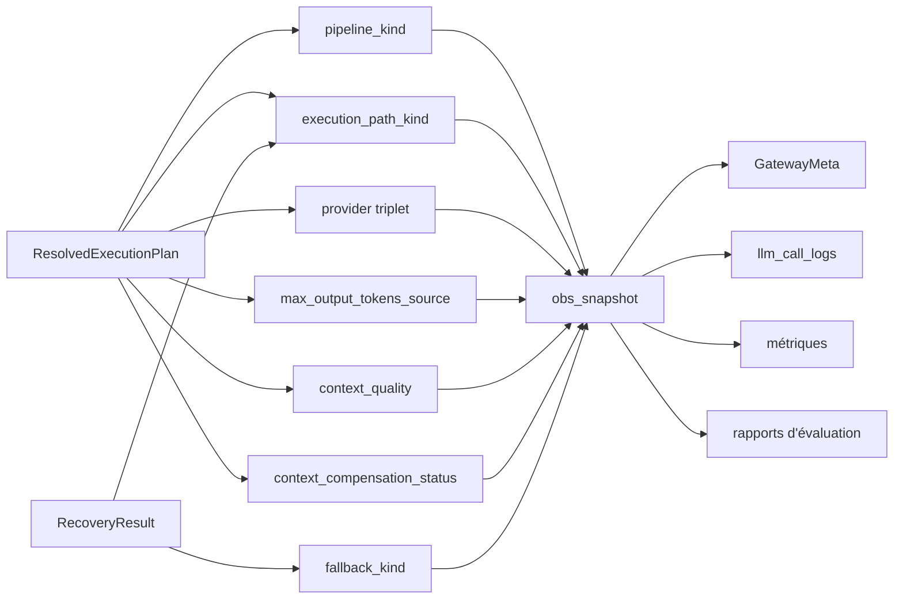

# Génération des Prompts LLM par Feature

Ce document décrit le pipeline LLM réellement exécuté dans l'application après l'epic 66. Il est volontairement centré sur le runtime observé dans le dépôt, pas sur une architecture cible idéale.

Objectifs :

- donner une source de vérité exploitable par les développeurs ;
- rendre lisible l'ordre exact de résolution dans `LLMGateway.execute_request()` ;
- montrer où vivent les variations `feature/subfeature/plan`, persona, profils d'exécution, budgets, placeholders et fallbacks ;
- éviter de réintroduire des variations concurrentes entre `use_case`, assemblies, `ExecutionProfile` et paramètres provider.

## Portée

Le document couvre :

- les points d'entrée métier qui construisent `LLMExecutionRequest` ;
- la résolution canonique dans `backend/app/llm_orchestration/gateway.py` ;
- la composition assembly ;
- la résolution des profils d'exécution ;
- le verrou provider ;
- la gestion des placeholders, de `context_quality` et des budgets de longueur ;
- l'observabilité runtime ;
- la matrice d'évaluation et la gouvernance documentaire.

Il décrit le fonctionnement réel du backend autour de :

- `backend/app/services/ai_engine_adapter.py`
- `backend/app/services/natal_interpretation_service_v2.py`
- `backend/app/llm_orchestration/gateway.py`
- `backend/app/llm_orchestration/services/assembly_resolver.py`
- `backend/app/llm_orchestration/services/execution_profile_registry.py`
- `backend/app/llm_orchestration/services/prompt_renderer.py`
- `backend/app/llm_orchestration/services/context_quality_injector.py`
- `backend/app/llm_orchestration/services/provider_parameter_mapper.py`
- `backend/app/llm_orchestration/services/fallback_governance.py`
- `backend/app/llm_orchestration/supported_providers.py`
- `backend/app/prompts/catalog.py`

## Résumé exécutable

Le pipeline cible exécuté aujourd'hui est :

1. les services métier construisent un `LLMExecutionRequest` canonique ;
2. le gateway normalise tôt `feature`, `subfeature` et `plan` ;
3. le gateway tente une résolution assembly si `feature/subfeature/plan` est présent ;
4. les familles nominales `chat`, `guidance`, `natal`, `horoscope_daily` échouent si aucune assembly active n'est trouvée ;
5. le gateway résout ensuite le `ExecutionProfile` depuis l'assembly ou par waterfall ;
6. le prompt est transformé dans cet ordre : assembly déjà concaténée, injection `context_quality`, injection de verbosité, rendu des placeholders ;
7. l'appel provider passe aujourd'hui nominalement uniquement par `openai` ;
8. la sortie est validée, éventuellement réparée, puis éventuellement basculée vers un `fallback_use_case` legacy ;
9. le résultat final publie un snapshot d'observabilité canonique.

Le `use_case` existe encore, mais il n'est plus la source canonique de variation sur les familles convergées. Il sert surtout de clé de compatibilité, de routage legacy, de sélection de schéma et de fallback résiduel.

## Vue d'ensemble

## Source de vérité par couche

| Couche | Source de vérité | Rôle | Ne doit pas porter |
|---|---|---|---|
| Point d'entrée métier | `AIEngineAdapter`, `NatalInterpretationServiceV2` | construire `LLMExecutionRequest` à partir des données métier | logique provider, composition de prompt profonde |
| Taxonomie | `ExecutionUserInput.feature/subfeature/plan` + `feature_taxonomy.py` | identifier la famille canonique et normaliser les alias | style, budgets, paramètres provider |
| Compatibilité `use_case` | `backend/app/prompts/catalog.py` | `DEPRECATED_USE_CASE_MAPPING`, `PROMPT_CATALOG`, `resolve_model()` | gouvernance canonique d'une famille convergée |
| Composition | `PromptAssemblyConfig` + `resolve_assembly()` | sélectionner les blocs feature/subfeature/plan/persona/contrat/exécution | choix provider brut en dehors de l'execution config |
| Style | `LlmPersonaModel` + `compose_persona_block()` | ton, voix, vocabulaire, densité stylistique | hard policy, schéma JSON, logique d'accès |
| Exécution | `ExecutionProfileRegistry` + `ProviderParameterMapper` | provider, modèle, reasoning, verbosity, output mode, tool mode | contenu métier des prompts |
| Rendu | `PromptRenderer` | blocs `context_quality`, placeholders, validation de placeholders | choix du provider |
| Garde-fous | `FallbackGovernanceRegistry`, `supported_providers.py` | blocage des fallbacks et des providers interdits | composition métier du prompt |
| Vérité finale | `ResolvedExecutionPlan` | agrégation immuable de l'exécution courante | persistance admin |

## Stories 66.9 à 66.26

| Story | Apport canonique | Impact runtime observable |
|---|---|---|
| `66.9` | doctrine abonnement | `entitlements` décident l'accès, `plan` module la profondeur |
| `66.10` | bornes persona | la persona reste une couche de style |
| `66.11` | `ExecutionProfile` | séparation texte / exécution |
| `66.12` | `LengthBudget` | consigne éditoriale + arbitrage `max_output_tokens` |
| `66.13` | placeholders | allowlist, classification et blocage sur familles fermées |
| `66.14` | `context_quality` | blocs template + injecteur de compensation |
| `66.15` | convergence assembly | chat, guidance, natal convergent via adapter + gateway |
| `66.16` | matrice d'évaluation | couverture structurée des familles et plans |
| `66.17` | doctrine de responsabilité | répartition explicite des règles |
| `66.18` | profils stables provider | mapping interne -> paramètres provider |
| `66.19` | migration narrator daily | `AIEngineAdapter.generate_horoscope_narration()` devient le chemin principal |
| `66.20` | fermeture nominale | assembly obligatoire pour `chat`, `guidance`, `natal`, `horoscope_daily` |
| `66.21` | gouvernance des fallbacks | blocage des fallbacks `à retirer` sur chemins nominaux |
| `66.22` | verrou provider | `openai` seul provider nominalement supporté |
| `66.23` | taxonomie natal | `feature="natal"` devient l'unique clé nominale |
| `66.24` | matrice daily | `pipeline_kind` distingue nominal et transitoire |
| `66.25` | observabilité | snapshot canonique unique dans `obs_snapshot` |
| `66.26` | gouvernance documentaire | doc et template PR deviennent obligatoires |
| `66.27` | propagation `context_quality` | `context_quality_handled_by_template` est figé dans le plan puis relayé jusqu'au snapshot et à la persistance |

## Familles et points d'entrée réels

| Famille | Point d'entrée observé | Taxonomie injectée | Statut de gouvernance |
|---|---|---|---|
| `chat` | `AIEngineAdapter.generate_chat_reply()` | `feature="chat"`, `subfeature="astrologer"` | `nominal_canonical` |
| `guidance` | `AIEngineAdapter.generate_guidance()` | `feature="guidance"`, `subfeature` dérivée du `use_case` | `nominal_canonical` |
| `natal` | `AIEngineAdapter.generate_natal_interpretation()` | `feature="natal"`, `subfeature` issue du `use_case_key` puis normalisée | `nominal_canonical` |
| `horoscope_daily` | `AIEngineAdapter.generate_horoscope_narration()` | `feature="horoscope_daily"`, `subfeature="narration"` | `nominal_canonical` |
| `support` | aucune orchestration LLM dédiée identifiée dans ce pipeline | aucune | ne pas documenter comme famille LLM active |

### Diagramme de routage par famille

## Ordre exact de résolution dans le gateway

L'ordre réel, tel qu'il ressort de `execute_request()` et `_resolve_plan()`, est le suivant :

1. normalisation précoce de `feature` et `subfeature` si la requête est déjà taxonomisée ;
2. normalisation précoce du `plan` via `_normalize_plan_for_assembly()` ;
3. résolution rapide d'une `UseCaseConfig` pour valider l'input schema une première fois ;
4. exécution de `_resolve_plan()` :
5. fallback de compatibilité `DEPRECATED_USE_CASE_MAPPING` si le `use_case` est déprécié et qu'aucune `feature` n'a été fournie ;
6. enrichissement éventuel du common context via `CommonContextBuilder` ;
7. tentative de résolution assembly via `AssemblyRegistry` ;
8. blocage si famille nominale fermée sans assembly active ;
9. fallback `use_case-first` via `_resolve_config()` si aucune assembly n'est retenue ;
10. résolution du `ExecutionProfile` par référence assembly, puis waterfall `feature+subfeature+plan`, puis `feature+subfeature`, puis `feature` ;
11. arbitrage provider, modèle, timeout et `max_output_tokens` ;
12. résolution de la persona si le chemin n'est pas déjà assembly ;
13. résolution du schéma de sortie ;
14. transformations du prompt dans cet ordre :
15. injecteur `context_quality` ;
16. consigne de verbosité ;
17. rendu `PromptRenderer.render()` avec blocs `{{#context_quality:...}}` puis placeholders ;
18. gel du `ResolvedExecutionPlan` ;
19. composition des messages ;
20. appel provider ;
21. validation de sortie ;
22. réparation éventuelle puis fallback `fallback_use_case` éventuel ;
23. construction du `GatewayResult` final et du snapshot d'observabilité.

### Diagramme détaillé de `_resolve_plan()`

## Assemblies et composition

`resolve_assembly()` est volontairement simple. Il ne fait pas tout le pipeline ; il produit un artefact intermédiaire `ResolvedAssembly`.

Composition réellement observée :

1. bloc `feature_template` ;
2. bloc `subfeature_template` si présent ;
3. bloc `plan_rules` si activé ;
4. injection éventuelle `LengthBudgetInjector` ;
5. injection éventuelle `ContextQualityInjector` ;
6. la persona n'est pas concaténée dans le developer prompt assembly ; elle reste un bloc séparé dans les messages ;
7. la hard policy est résolue à part via `get_hard_policy()`.

### Diagramme de composition assembly

## Doctrine d'abonnement et normalisation de plan

La règle officielle reste :

1. `entitlements` décident si l'appel a le droit d'exister ;
2. `plan` module la profondeur, la longueur et certains réglages d'exécution ;
3. un `use_case` distinct n'est justifié que si le contrat métier ou le schéma de sortie change réellement.

Normalisation runtime actuellement codée dans `_normalize_plan_for_assembly()` :

- `premium`, `pro`, `ultra`, `full` -> `premium`
- toute autre valeur, absence comprise -> `free`

Conséquence importante :

- `horoscope_daily` (nommé ainsi depuis Story 66.19) absorbe désormais systématiquement les anciennes `daily_prediction`.
- Le gateway normalise le `plan` en `free` s'il est absent.
- La famille est désormais considérée comme nominale fermée.

## Taxonomie canonique natal

Depuis 66.23 :

- `feature="natal"` est l'unique identifiant nominal autorisé ;
- `feature="natal_interpretation"` est interdit sur les chemins nominaux ;
- les subfeatures canoniques natal sont non préfixées ;
- `normalize_subfeature()` convertit encore l'alias historique `natal_interpretation` vers `interpretation`.

En pratique côté adapter :

- `generate_natal_interpretation()` alimente `subfeature` à partir de `use_case_key` ;
- pour `natal_interpretation_short`, l'adapter remplace d'abord la valeur par `natal_interpretation` ;
- le gateway normalise ensuite cette valeur en `interpretation`.

## Placeholders et rendu

Le rendu effectif est porté par `PromptRenderer.render()` :

1. résolution des blocs `{{#context_quality:VALUE}}...{{/context_quality}}` ;
2. chargement de l'allowlist de placeholders ;
3. classification des placeholders (`required`, `optional`, `optional_with_fallback`) ;
4. remplissage ou blocage selon la feature et la politique ;
5. substitution finale `{{variable}}`.

### Règles observées

- les placeholders universels sont `locale`, `use_case`, `persona_name`, `last_user_msg` ;
- les familles nominales `chat`, `guidance`, `natal`, `horoscope_daily` bloquent les placeholders non autorisés ;
- l'allowlist hardcodée de `assembly_resolver.py` couvre explicitement `chat`, `guidance`, `natal` ;
- les chemins daily passent surtout leur contexte principal dans `question`, donc dépendent moins de placeholders assembly spécialisés.

## Context Quality

Le traitement de `context_quality` repose sur deux mécanismes distincts :

1. les blocs conditionnels dans les templates ;
2. l'injecteur `ContextQualityInjector`.

Le runtime essaye d'éviter la double compensation :

- si le prompt contient déjà `{{#context_quality:partial}}` ou `{{#context_quality:minimal}}`, l'injecteur ne rajoute rien ;
- sinon il ajoute une consigne de compensation adaptée à la feature.

### Observabilité et Propagation

Depuis 66.27, `ContextQualityInjector.inject()` ne se contente plus de signaler si une compensation a été injectée ; il remonte aussi si le niveau de qualité dégradé est déjà pris en charge par le prompt/template courant.

Le code calcule et propage donc `context_quality_handled_by_template` dans `_resolve_plan()`. Ce booléen est figé dans le `ResolvedExecutionPlan` et sert de source de vérité pour l'observabilité.

Conséquences runtime observées :

- `template_handled` est publié dans `obs_snapshot.context_compensation_status` quand le template courant gère explicitement `partial` ou `minimal` ;
- `injector_applied` est publié uniquement lorsqu'une consigne de compensation a réellement été ajoutée ;
- la persistance `llm_call_logs.context_compensation_status` relaie la valeur du snapshot canonique, sans recalcul concurrent dans la couche d'observabilité.

## Profils d'exécution

Le profil d'exécution est résolu dans cet ordre :

1. `execution_profile_ref` de l'assembly active ;
2. waterfall `feature + subfeature + plan` ;
3. waterfall `feature + subfeature` ;
4. waterfall `feature` ;
5. fallback `resolve_model()`.

Les abstractions internes stables exposées sont :

| Champ | Valeurs |
|---|---|
| `reasoning_profile` | `off`, `light`, `medium`, `deep` |
| `verbosity_profile` | `concise`, `balanced`, `detailed` |
| `output_mode` | `free_text`, `structured_json` |
| `tool_mode` | `none`, `optional`, `required` |

Le mapper provider traduit ensuite ces profils :

- OpenAI : `reasoning_effort`, `response_format`, `tool_choice`
- Anthropic : mapping préparé dans le code, mais non nominalement supporté par la plateforme

## Verrou provider

Le support provider nominal est porté par une source de vérité unique :

- `backend/app/llm_orchestration/supported_providers.py`
- `NOMINAL_SUPPORTED_PROVIDERS = ["openai"]`

Conséquences runtime :

- `openai` est le seul provider nominalement autorisé ;
- un provider non supporté sur un chemin nominal provoque un échec explicite ;
- un provider non supporté sur un chemin non nominal peut être toléré avec fallback vers OpenAI ;
- `_call_provider()` n'exécute effectivement que `openai`.

### Diagramme de verrou provider

## Pilotage de la longueur

Deux couches distinctes coexistent :

### 1. Couche éditoriale

`LengthBudget` injecte une consigne de longueur dans le developer prompt :

- `target_response_length`
- `section_budgets`
- `global_max_tokens`

### 2. Couche technique

L'exécution provider arbitre `max_output_tokens` dans cet ordre :

1. `LengthBudget.global_max_tokens`
2. `ExecutionProfile.max_output_tokens`
3. recommandation issue de `verbosity_profile`
4. sinon valeur héritée de la config/stub

## Fallbacks et gouvernance

Le registre de gouvernance est `FallbackGovernanceRegistry`.

Points structurants observés :

- `USE_CASE_FIRST` est `à retirer` sur `chat`, `guidance`, `natal`, `horoscope_daily` ;
- `NARRATOR_LEGACY` est interdit sur `horoscope_daily` ;
- `TEST_LOCAL` est interdit en production ;
- un fallback `à retirer` sur un chemin nominal lève une `GatewayError`, même si la famille n'est pas explicitement listée comme interdite ;
- chaque fallback passe par la métrique `llm_gateway_fallback_usage_total`.

## Observabilité runtime

Depuis 66.25, le gateway publie un snapshot canonique unique dans `result.meta.obs_snapshot`.

Champs observés :

- `pipeline_kind`
- `execution_path_kind`
- `fallback_kind`
- `requested_provider`
- `resolved_provider`
- `executed_provider`
- `context_quality`
- `context_compensation_status`
- `max_output_tokens_source`
- `max_output_tokens_final`

### Axes de lecture

| Axe | Sens |
|---|---|
| `pipeline_kind` | statut de gouvernance attendu de la famille |
| `execution_path_kind` | chemin structurel effectivement emprunté |
| `fallback_kind` | cause dominante de fallback si fallback réel |
| provider triplet | provider demandé, résolu, exécuté |
| `context_compensation_status` | compensation de contexte observée |
| `max_output_tokens_source` | source finale de l'arbitrage de sortie |

Pour l'axe `context_compensation_status`, la lecture correcte est désormais :

- `not_needed` : `context_quality=full` ;
- `template_handled` : le prompt courant gère déjà explicitement le niveau dégradé ;
- `injector_applied` : une consigne additionnelle a été injectée ;
- `unknown` : l'information n'est pas déterminable sur le chemin considéré.

### Taxonomies actuellement exposées

#### `pipeline_kind`

- `nominal_canonical` pour `chat`, `guidance`, `natal`, `horoscope_daily`
- `transitional_governance` pour le reste (ex: use cases legacy non encore migrés)

#### `execution_path_kind`

- `canonical_assembly`
- `legacy_use_case_fallback`
- `legacy_execution_profile_fallback`
- `repair`
- `non_nominal_provider_tolerated`

#### `fallback_kind`

- nullable quand aucun fallback réel n'est observé ;
- sinon résumé dominant aligné sur la gouvernance.

### Diagramme de lecture de l'observabilité

## Matrice d'évaluation

La validation ne repose pas seulement sur les tests unitaires. Une matrice d'évaluation croise :

- `feature`
- `plan`
- `persona`
- `context_quality`
- `pipeline_kind`

Elle vérifie notamment :

- absence de placeholders survivants ;
- application des budgets ;
- différenciation de persona ;
- stabilité des contrats ;
- cohérence entre gouvernance attendue et chemin observé.

Depuis 66.24 (mis à jour en 66.28) :

- `horoscope_daily` est évalué comme `nominal_canonical` ;
- `daily_prediction` a été absorbé dans `horoscope_daily` et n'apparaît plus comme famille autonome ;
- un chemin obligatoire manquant rend la campagne incomplète ou bloquante.

## Où mettre une nouvelle règle

| Besoin | Endroit correct |
|---|---|
| varier la profondeur free/premium sans changer le schéma | `plan_rules` + `LengthBudget` |
| changer le provider ou le modèle | `ExecutionProfile` |
| rendre le style plus empathique | persona |
| changer la structure JSON de sortie | contrat / schéma de sortie |
| injecter une donnée utilisateur | placeholder autorisé + politique de résolution |
| adapter le ton à un contexte incomplet | `context_quality` |

## Violations fréquentes à éviter

- mettre un nom de modèle dans un template métier ;
- demander du JSON dans une persona ;
- encoder une logique de feature dans des `plan_rules` ;
- utiliser `max_output_tokens` comme substitut d'une consigne éditoriale ;
- créer un nouveau `use_case_free` alors que seul le niveau de détail change ;
- documenter comme “nominal” un chemin qui n'est observé qu'en compatibilité ou en test.

## Règle de lecture

- une affirmation n'est présente ici que si elle est appuyée par une source explicite du dépôt ;
- lorsqu'un comportement est supporté par les types/tests mais pas complètement propagé par le runtime, cette nuance est écrite explicitement ;
- si le code diverge, le code fait foi jusqu'à mise à jour de cette documentation.

## Maintenance de cette documentation

Ce document constitue une **règle d'ingénierie explicite**. Sa maintenance est **obligatoire** et **traçable**.

### Discipline de mise à jour et règle de PR

Toute Pull Request modifiant la structure ou la gouvernance du pipeline LLM doit :

1. Soit mettre à jour ce document dans le même change set pour refléter la nouvelle réalité technique.
2. Soit justifier explicitement dans la description de la PR pourquoi ce document reste valide sans changement.

### Zones à impact documentaire obligatoire

La revue de ce document est **obligatoire** pour toute modification portant sur :

- **Gateway & Orchestration** : `_resolve_plan()`, `execute_request()`, `_call_provider()`, `_handle_repair_or_fallback()`, `_build_messages()`
- **Composition & Rendu** : `PromptRenderer`, `PromptAssemblyConfig`, `context_quality`, `ContextQualityInjector`, budgets de longueur
- **Paramétrage & Fallbacks** : `ProviderParameterMapper`, `FallbackGovernanceRegistry`, `NOMINAL_SUPPORTED_PROVIDERS`
- **Taxonomie & Profils** : taxonomie canonique `feature/subfeature/plan`, `ExecutionProfile`
- **Doctrine & Contrats** : toute logique modifiant la source de vérité décrite dans les sections précédentes

### Vérification et Traçabilité

Toute mention de vérification ci-dessous atteste d'une **revue manuelle effective** contre le code réel à la référence indiquée. Les références flottantes (`HEAD`, `main`, etc.) sont interdites.

Dernière vérification manuelle contre le pipeline réel du gateway :

- **Date** : `2026-04-11`
- **Référence stable (Commit SHA)** : `b7c3a079`

Si le code diverge, le pipeline réel du gateway fait foi jusqu'à mise à jour de cette documentation, mais l'absence de mise à jour constitue une **dette de gouvernance**.
