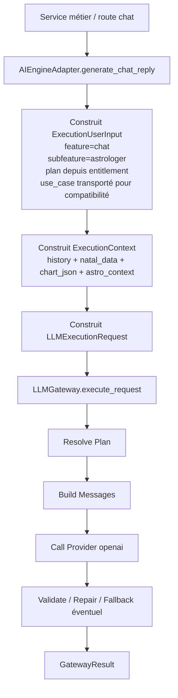
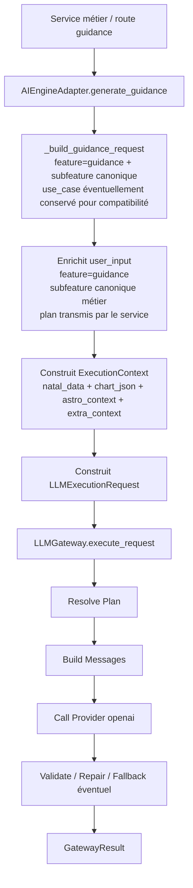
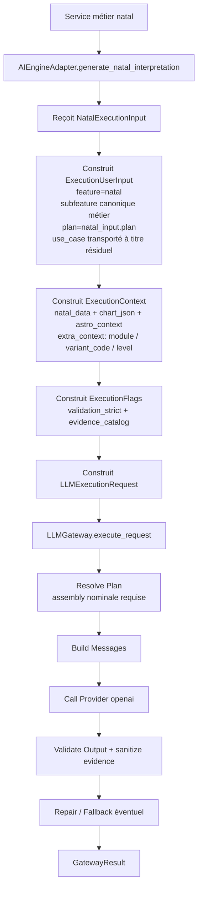
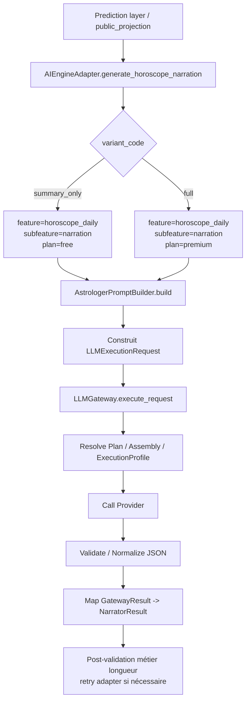
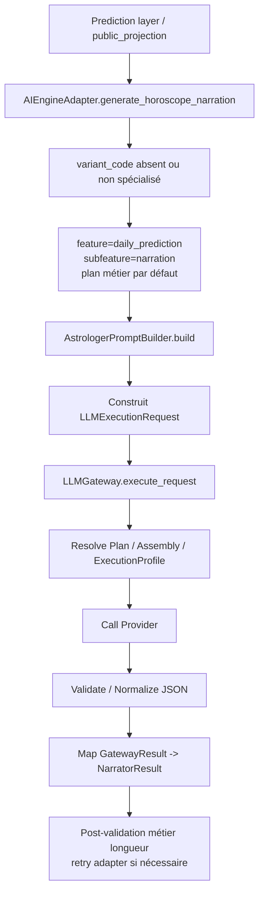
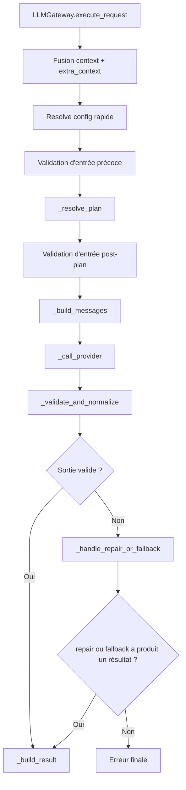

# Génération des Prompts LLM par Feature

Ce document décrit le processus canonique actuellement utilisé pour construire un prompt LLM dans la plateforme, tel qu'il résulte des stories 66.9 à 66.21.

Objectifs :

- donner une source de vérité pratique pour les développeurs ;
- expliquer où chaque décision doit vivre ;
- documenter l'ordre réel de résolution dans le gateway ;
- éviter de réintroduire des variations concurrentes entre `use_case`, `assembly`, `persona`, `plan_rules`, `ExecutionProfile` et paramètres provider.

## Portée

Le document couvre :

- la doctrine d'abonnement et de différenciation par plan ;
- la sélection de la configuration assembly ;
- la résolution des profils d'exécution ;
- l'injection des budgets de longueur ;
- la gestion des placeholders ;
- l'adaptation à `context_quality` ;
- la traduction des profils internes stables vers les paramètres provider ;
- la gouvernance des fallbacks de compatibilité encore actifs.

Il décrit le fonctionnement réel du backend autour de :

- `backend/app/llm_orchestration/gateway.py`
- `backend/app/llm_orchestration/services/assembly_resolver.py`
- `backend/app/llm_orchestration/services/prompt_renderer.py`
- `backend/app/llm_orchestration/services/context_quality_injector.py`
- `backend/app/llm_orchestration/services/provider_parameter_mapper.py`
- `backend/app/prompts/catalog.py`

## Vue d'ensemble

Le pipeline ne part plus d'un simple `use_case -> prompt -> model`.

La résolution suit désormais ce principe :

1. contrôler l'accès au produit en amont ;
2. sélectionner une configuration de composition par `feature/subfeature/plan` ;
3. appliquer les couches textuelles et éditoriales ;
4. résoudre un profil d'exécution séparé du texte ;
5. construire un `ResolvedExecutionPlan` unique ;
6. exécuter le provider à partir de ce plan.

Le `use_case` reste supporté, mais il n'est plus la source canonique de variation dès qu'une feature est migrée vers le chemin assembly.

### Diagramme du processus canonique

```mermaid
flowchart TD
    A["Appel métier"] --> B{"Entitlements OK ?"}
    B -->|Non| X["Blocage amont<br/>pas d'appel LLM"]
    B -->|Oui| C["Entrée gateway<br/>use_case + feature/subfeature/plan"]

    C --> D{"use_case déprécié ?"}
    D -->|Oui| E["Mapping compatibilité<br/>DEPRECATED_USE_CASE_MAPPING"]
    D -->|Non| F["Contexte d'exécution inchangé"]
    E --> F

    F --> G["Construction common context<br/>+ calcul context_quality"]

    G --> H{"Assembly explicite<br/>ou active trouvée ?"}
    H -->|Oui| I["Résolution PromptAssemblyConfig"]
    H -->|Non| J["Fallback use_case-first<br/>compatibilité non nominale uniquement"]

    I --> K["Composition textuelle<br/>feature + subfeature + plan_rules + persona"]
    J --> K2["Prompt legacy / config historique"]

    K --> L["Injection LengthBudget"]
    K2 --> M["Base developer_prompt résolue"]
    L --> M

    M --> N["Blocs context_quality"]
    N --> O["ContextQualityInjector si nécessaire"]
    O --> P["Injection unique verbosity_profile"]
    P --> Q["Rendu placeholders"]
    Q --> R["Validation finale<br/>aucun placeholder brut restant"]

    R --> S{"ExecutionProfile trouvé ?"}
    S -->|Oui| T["Résolution profils internes<br/>reasoning / verbosity / output / tool"]
    S -->|Non| U["Fallback resolve_model"]

    T --> V["ProviderParameterMapper"]
    U --> W["Paramètres runtime legacy"]
    V --> Y["ResolvedExecutionPlan final"]
    W --> Y

    Y --> Z{"Provider supporté nominalement ?"}
    Z -->|Oui: OpenAI| AA["Exécution ResponsesClient"]
    Z -->|Non| AC1{"Chemin nominal ?"}
    AC1 -->|Oui| AD1["Échec explicite (ValueError)"]
    AC1 -->|Non| AB["Fallback runtime OpenAI"]
    AB --> AA

    AA --> AC["Validation / repair / fallback éventuel"]
    AC --> AD["Réponse finale"]
```

## Stories 66.9 à 66.22

| Story | Apport canonique | Impact dans le processus |
|---|---|---|
| `66.9` | Doctrine d'abonnement | `entitlements > assembly plan_rules > use_case distinct` |
| `66.10` | Bornes stylistiques persona | la persona reste une couche de style, pas de structure ni d'exécution |
| `66.11` | ExecutionProfiles | séparation stricte entre texte du prompt et choix d'exécution |
| `66.12` | LengthBudget | budgets éditoriaux par plan/section + plafond global |
| `66.13` | Placeholders | classification `required/optional/fallback`, jamais de `{{...}}` survivant |
| `66.14` | Context quality | adaptation explicite du prompt à `full/partial/minimal` |
| `66.15` | Convergence assembly | migration progressive des familles guidance/natal/chat vers `feature/subfeature/plan` |
| `66.16` | Matrice d'évaluation | garde-fous de non-régression sur la composition |
| `66.17` | Doctrine canonique de responsabilité | clarification documentaire des rôles de chaque entité |
| `66.18` | Profils provider stables | encapsulation des paramètres provider derrière des profils internes |
| `66.19` | Migration narrator daily | convergence de `horoscope_daily` et `daily_prediction` vers `AIEngineAdapter` puis `LLMGateway.execute_request()` |
| `66.20` | Convergence canonique obligatoire | assemblies nominales obligatoires pour `chat`, `guidance`, `natal`, `horoscope_daily` + normalisation des plans runtime vers `free/premium` |
| `66.21` | Gouvernance des fallbacks LLM | matrice de statut, télémétrie `llm_gateway_fallback_usage_total`, blocage des fallbacks à retirer sur chemins nominaux, bornes explicites des compatibilités legacy/test |
| `66.22` | Verrouillage des providers supportés | registre canonique `NOMINAL_SUPPORTED_PROVIDERS`, blocage des providers non supportés sur chemins nominaux, fallback OpenAI borné aux chemins non nominaux |

## Couverture réelle par famille

Cette section ne décrit que ce qui est explicitement visible dans le code. Elle n'emploie volontairement ni “niveau de convergence”, ni appréciation qualitative lorsqu'aucune source de vérité unique ne le code.

| Famille | Indice explicite dans le code | Chemin effectivement observable | Commentaire strictement dérivé du code |
|---|---|---|---|
| `horoscope_daily` | `AIEngineAdapter.generate_horoscope_narration()` route vers `feature="horoscope_daily"`, `subfeature="narration"` | entrée canonique `feature/subfeature/plan` via adapter puis gateway | convergence totale ; mapping déprécié conservé uniquement pour compatibilité descendante |
| `natal` | `AIEngineAdapter.generate_natal_interpretation()` impose `feature="natal"` et `subfeature` métier | entrée canonique systématique via adapter | convergence totale ; taxonomie homogène entre code, seeds et exécution |
| `guidance` | `generate_guidance()` construit `feature="guidance"` et `subfeature` dérivé | entrée canonique systématique via adapter | convergence totale ; assemblies et profils d'exécution obligatoires |
| `chat` | `generate_chat_reply()` impose `feature="chat"`, `subfeature="astrologer"` | entrée canonique systématique via adapter | convergence totale ; assemblies et profils d'exécution obligatoires |
| `daily_prediction` | `AIEngineAdapter.generate_horoscope_narration()` route vers `feature="daily_prediction"`, `subfeature="narration"` | entrée canonique `feature/subfeature/plan` via adapter puis gateway | convergence totale |
| `support` | aucune orchestration LLM spécifique à cette famille n'a été trouvée dans les sources inspectées | non documenté comme famille LLM active | ne pas lui attribuer un statut de convergence sans nouvelle preuve dans le code |

### Synthèse de convergence (Story 66.20)

Depuis la story 66.20, l'usage de la taxonomie `feature/subfeature/plan` est devenu obligatoire pour les familles nominales (`chat`, `guidance`, `natal`, `horoscope_daily`). Le gateway rejette désormais tout appel nominal vers ces familles qui ne résoudrait pas une assembly valide.

Depuis la story 66.21, ce rejet est gouverné avec une distinction explicite entre :

- **chemin nominal** : appel canonique produit/runtime ; les fallbacks classés `à retirer` y sont bloquants ;
- **chemin non nominal** : compatibilité legacy explicitement mappée, test local, ou parcours de migration ; les fallbacks peuvent être tolérés s'ils sont classés et télémétrés.

La redirection via `DEPRECATED_USE_CASE_MAPPING` reste donc autorisée uniquement comme compatibilité déclarée et observable. Elle ne doit pas être confondue avec une résolution nominale `use_case-first`.

Pour ces familles, le plan runtime est d'abord normalisé vers la taxonomie assembly canonique :

- `premium`, `pro`, `ultra`, `full` -> `premium`
- `free`, `basic`, `trial`, `none`, `guest`, `unknown` et absence de plan -> `free`

Cette normalisation sert à résoudre l'assembly et le `ExecutionProfile`. Elle ne remplace pas la logique d'accès produit portée en amont par les entitlements.

La convergence 66.20 couvre notamment les assemblies `guidance/contextual/free` et `guidance/contextual/premium`, afin que les parcours de guidance contextuelle aient une résolution canonique pour les plans gratuits et premium.

### Règle de lecture

- une ligne n'affirme qu'un comportement appuyé par une source explicite du dépôt ;
- “support assembly possible” signifie que le gateway sait résoudre une assembly si `feature/subfeature/plan` est fourni, pas que cette famille est migrée de bout en bout ;
- l'absence d'évidence explicite dans cette section ne prouve pas l'absence absolue d'usage runtime, mais interdit de présenter cet usage comme un fait d'architecture établi.

## Schémas fonctionnels par famille

Les schémas ci-dessous décrivent uniquement les chemins de génération de réponse LLM explicitement observables dans le code.

### Chat

### Guidance

### Natal

### Horoscope Daily

### Daily Prediction

### Support

Aucun pipeline de génération de réponse LLM spécifique à une famille `support` n'a été identifié dans les sources inspectées pour ce document. Cette famille n'a donc pas de schéma Mermaid dédié ici.

### Synthèse sur `horoscope_daily` et `daily_prediction`

À date, `horoscope_daily` et `daily_prediction` ont convergé vers le pipeline canonique pour leur chemin principal observé :

- `public_projection.py` appelle `AIEngineAdapter.generate_horoscope_narration()` ;
- l'adapter construit un `LLMExecutionRequest` canonique avec `feature/subfeature/plan` selon `variant_code` ;
- l'exécution passe par `LLMGateway.execute_request()` puis par la validation structurée ;
- le contrat aval reste `NarratorResult` grâce à un mapping explicite `GatewayResult -> NarratorResult`.

Le composant `LLMNarrator` existe encore dans le dépôt, mais il est désormais documenté comme déprécié et ne constitue plus le chemin principal de narration daily.

La fermeture nominale imposée par la story 66.20 vise explicitement `horoscope_daily` ; `daily_prediction` est documenté ici comme convergé sur son chemin principal, sans être promu dans ce document au même statut de famille nominale fermée.

## Doctrine d'abonnement

La règle officielle est la suivante :

1. `entitlements` décident si l'appel a le droit d'exister ;
2. `plan` dans `PromptAssemblyConfig` module profondeur, longueur et richesse ;
3. un `use_case` distinct par plan n'est justifié que si le contrat de sortie change réellement.

### Règle de décision

Utiliser `plan_rules` quand la différence entre deux variantes porte sur :

- la longueur ;
- la densité ;
- la profondeur ;
- la richesse d'explication ;
- le niveau de détail éditorial.

Conserver un `use_case` distinct quand la différence porte sur :

- un schéma JSON différent ;
- une structure métier différente ;
- une fonctionnalité réellement différente, pas seulement une version “courte” ou “longue”.

### Fallback de compatibilité

Le gateway supporte encore un mapping `deprecated_use_case -> feature + subfeature + plan` via `DEPRECATED_USE_CASE_MAPPING`.

But :

- ne pas casser les anciens appelants ;
- permettre une migration progressive vers le chemin assembly ;
- journaliser explicitement qu'un ancien use_case a été redirigé.

## Source de vérité par couche

| Entité | Source de vérité pour | Ne doit pas porter |
|---|---|---|
| `PromptAssemblyConfig` | sélection de configuration, activation de blocs, plan, longueur, liens vers persona et exécution | paramètres provider bruts, règles métier cachées dans les `plan_rules` |
| `LlmPromptVersionModel` | contenu textuel des blocs feature/subfeature | choix de modèle, provider, règles de sécurité |
| `LlmPersonaModel` / composition persona | ton, chaleur, vocabulaire, densité symbolique | JSON schema, provider, plan, hard policy |
| contrat de sortie / schéma de validation | structure JSON attendue, champs requis et validation de sortie | choix de provider, paramètres runtime, style de persona |
| `ExecutionProfile` | modèle, provider, reasoning/verbosity/output/tool profiles, timeout, max tokens techniques | texte métier, longueur éditoriale par section |
| `LengthBudget` | instruction éditoriale de longueur + plafond global optionnel | sélection du provider |
| `PromptRenderer` | rendu final des blocs conditionnels et placeholders | logique de choix de modèle |
| `ResolvedExecutionPlan` | vérité runtime finale utilisée pour l'appel provider | logique métier supplémentaire downstream |

## Processus canonique de résolution

### 1. Entrée canonique

Le gateway reçoit un `LLMExecutionRequest` avec :

- `use_case` ;
- `feature`, `subfeature`, `plan` si disponibles ;
- `context` ;
- `flags` ;
- éventuellement des overrides.

Pour `chat`, `guidance`, `natal` et `horoscope_daily`, l'appelant doit fournir `feature/subfeature/plan` comme entrée nominale. Sur ces familles, `use_case` ne doit plus être utilisé comme clé primaire de résolution, seulement comme champ de compatibilité, d'observabilité ou de transition contractuelle si nécessaire.

### 2. Fallback de compatibilité `use_case`

Si le `use_case` est marqué comme déprécié et mappé vers une feature assembly, le gateway convertit l'entrée avant la résolution principale et loggue un `deprecation_warning`.

### 3. Construction du contexte commun

Si possible, `CommonContextBuilder` enrichit le contexte avec les données partagées.

Ce builder calcule aussi `context_quality` :

- `full`
- `partial`
- `minimal`
- `unknown` en absence de contexte qualifié

Ce niveau n'est pas décoratif : il influence directement le prompt résolu.

### 4. Résolution de la source de composition

Le gateway tente dans cet ordre :

1. configuration assembly explicite si `assembly_config_id` est fourni ;
2. assembly actif par `feature/subfeature/plan/locale` après normalisation éventuelle du plan runtime vers `free/premium` ;
3. fallback vers la configuration historique `use_case-first` sur les seuls chemins non nominaux encore autorisés.

En pratique, le chemin assembly devient la source canonique dès qu'une famille a migré, mais le fallback legacy reste actif comme filet de sécurité uniquement pour les chemins explicitement legacy, non nominaux ou de test local. Pour `chat`, `guidance`, `natal` et `horoscope_daily`, l'absence d'assembly résolue est désormais une erreur de configuration nominale, pas un motif de retomber silencieusement sur le chemin `use_case-first`. `daily_prediction` suit bien le pipeline canonique observé via assembly pour son chemin principal documenté, mais n'est pas classé ici parmi les familles nominales explicitement fermées par la story 66.20.

### 5. Composition assembly

Quand une assembly est trouvée, elle agrège :

- template feature ;
- template subfeature optionnel ;
- bloc persona éventuel ;
- règles de plan ;
- budget de longueur ;
- références de contrat et de profil d'exécution.

## Pipeline d'orchestration du gateway

Le point d'orchestration central des appels LLM est `LLMGateway.execute_request()`.

Le gateway ne porte pas la logique produit. Il :

- résout la configuration ;
- compose les messages ;
- appelle le provider ;
- valide la sortie ;
- tente une réparation ou un fallback si nécessaire ;
- journalise le résultat final.

### Stages explicites

Le pipeline d'exécution métier suit six étapes stables :

1. **Resolve Plan** : `_resolve_plan()` construit le `ResolvedExecutionPlan` et qualifie le contexte ;
2. **Build Messages** : `_build_messages()` compose les couches `system`, `developer`, `persona`, `history`, `user` ;
3. **Call Provider** : `_call_provider()` exécute l'appel technique au provider ;
4. **Validate & Normalize** : `_validate_and_normalize()` parse et valide la sortie ;
5. **Recovery** : `_handle_repair_or_fallback()` gère la réparation automatique ou le fallback de use case ;
6. **Build Final Result** : `_build_result()` assemble le `GatewayResult` final et ses métadonnées.

En plus de ces six étapes, `execute_request()` exécute aujourd'hui deux validations d'entrée autour du stage 1 :

- une validation rapide avant `_resolve_plan()` pour échouer tôt sur un contrat d'entrée invalide ;
- une seconde validation juste après la résolution du plan, pour sécuriser le chemin effectivement résolu.

Cette double validation est intentionnelle. Elle n'est pas un doublon accidentel :

- la première coupe court avant la composition complète si l'entrée est déjà invalide ;
- la seconde revalide le contrat après résolution effective de la configuration et du plan.

### Pipeline runtime complet

Vu depuis `execute_request()`, le pipeline réel est aujourd'hui le suivant :

1. fusion préliminaire de `context` et `extra_context` ;
2. résolution rapide de config puis validation d'entrée précoce ;
3. `_resolve_plan()` :
   - fallback éventuel `deprecated use_case -> feature/subfeature/plan`
   - enrichissement `CommonContextBuilder`
   - résolution assembly explicite ou active
   - fallback `use_case-first` uniquement sur les chemins non nominaux encore autorisés
   - résolution `ExecutionProfile`
   - merge final modèle / provider / max tokens
   - contrôle du provider contre `NOMINAL_SUPPORTED_PROVIDERS` sur chemin nominal
   - rendu final du `developer_prompt`
   - construction du `ResolvedExecutionPlan`
4. seconde validation d'entrée sur la configuration effectivement résolue ;
5. `_build_messages()` ;
6. `_call_provider()` ;
7. `_validate_and_normalize()` ;
8. `_handle_repair_or_fallback()` ;
9. `_build_result()`.

### Diagramme du pipeline gateway

### Repair

Le `repair` n'est pas un use case séparé.

Il s'agit d'une relance technique du même appel avec :

- un prompt developer minimal et technique ;
- le même contrat de sortie ;
- des garde-fous anti-boucle.

## Pipeline de validation de sortie

La réponse brute du provider n'est pas utilisée telle quelle.

Le pipeline de validation suit quatre étapes :

1. **Parse JSON** : conversion de la sortie brute ;
2. **Schema Validation** : validation contre le schéma configuré si applicable ;
3. **Field Normalization** : normalisations de compatibilité ou d'alias ;
4. **Evidence Sanitization** : filtrage des évidences hors catalogue ou incohérentes quand ce mécanisme s'applique.

Ce pipeline a deux objectifs :

- garantir que la structure de sortie reste exploitable ;
- préserver la continuité de service sans laisser passer des artefacts invalides ou des hallucinations de structure.

## Couche applicative canonique

Le nom historique `AIEngineAdapter` est conservé, mais cette couche joue le rôle d'adapter applicatif canonique entre les services métier et le gateway.

### Responsabilités de `AIEngineAdapter`

- transformer une intention métier en `LLMExecutionRequest` ;
- construire les contrats d'entrée typés des parcours majeurs ;
- appeler `LLMGateway.execute_request()` ;
- traduire les erreurs techniques de la plateforme en erreurs applicatives cohérentes.

### Contrats d'entrée typés

Le système s'appuie sur des modèles d'entrée explicites :

- `LLMExecutionRequest`
- `ExecutionUserInput`
- `ExecutionContext`
- `ExecutionFlags`
- `ExecutionOverrides`
- `ExecutionMessage`
- contrats métier spécialisés comme `NatalExecutionInput`

### Règle de migration legacy

`LLMGateway.execute()` est officiellement requalifié comme **wrapper legacy transitoire**.

- **Interdiction** : Toute nouvelle logique plateforme est interdite dans ce wrapper.
- **Usage** : Réservé exclusivement à la compatibilité des call sites n'ayant pas encore migré vers `execute_request()`.
- **Critère de retrait** : Ce wrapper sera supprimé dès que le dernier call site legacy aura été migré.

## Gouvernance des compatibilités et fallbacks

Le système n'autorise aucun mécanisme de compatibilité "implicite". Chaque fallback est classé selon une trajectoire ferme de gouvernance. Cette section remplace et clôt l'ancien inventaire descriptif.

### Matrice de Gouvernance

| Fallback / Chemin | Statut | Périmètre autorisé | Observabilité | Condition de retrait / Maintien | Justification |
| :--- | :--- | :--- | :--- | :--- | :--- |
| `LLMGateway.execute()` | **Transitoire** | Appelants legacy existants | Log `deprecation_warning` + call site | Migration du dernier appelant | Wrapper de façade (Story 66.21). |
| Mapping `deprecated use_case` | **Transitoire** | Use cases dans `DEPRECATED_USE_CASE_MAPPING`, comme compatibilité non nominale | Compteur `llm_gateway_fallback_usage_total` | Compteurs à zéro en production | Transition vers `feature/subfeature/plan`. |
| Fallback `use_case-first` | **À retirer** sur familles fermées ; **transitoire** ailleurs | **Interdit comme chemin nominal** pour `chat`, `guidance`, `natal`, `horoscope_daily`; toléré seulement sur chemins non nominaux classés | Compteur `llm_gateway_fallback_usage_total`; anomalie si nominal | Migration 100% des features | Éteindre la concurrence avec le pipeline canonique sans casser la compatibilité déclarée. |
| Fallback `resolve_model()` | **Transitoire** | Chemins sans `ExecutionProfile` | Compteur `llm_gateway_fallback_usage_total` | Généralisation des `ExecutionProfile` | Filet de sécurité de résolution. |
| `ExecutionConfigAdmin` brut | **À retirer** | Dette technique identifiée ; interdit comme source primaire sur nouveau parcours nominal | Compteur `llm_gateway_fallback_usage_total`; blocage si nominal | Migration vers `ExecutionProfile` | Ancienne config directe (dette). |
| Fallback OpenAI | **Toléré durablement hors nominal** | Runtime OpenAI-only actuel ; autorisé uniquement pour compatibilités legacy, dev et test explicitement non nominales | Compteur `llm_gateway_fallback_usage_total` + métrique provider 66.22 attendue | Activation multi-provider réelle | Limitation runtime assumée. Interdit comme fallback silencieux sur chemin nominal. |
| Narrator legacy | **À retirer** | **Interdit** pour `horoscope_daily` | Blocage technique / Exception | Suppression du fichier `llm_narrator.py` | Obsolète (remplacé par gateway). |
| Fallback local/tests | **Toléré durablement** | Environnements `dev` et `test` uniquement, y compris absence de provider ou assembly de test manquante | **Interdit en production** | Pérenne (hors production) | Productivité développement et stabilité des tests sans provider externe. |
| Natal sans DB | **Transitoire** en production nominale ; **toléré durablement** en test ciblé | Tests unitaires / modes dégradés non nominaux uniquement | Log `context_degraded_no_db`; log critique si erreur DB masquée en production | DB obligatoire en production nominale | Souplesse de test historique, sans droit de masquer une panne DB produit. |

### Politiques de Statut

- **Transitoire** : Le mécanisme est toléré mais possède un critère de sortie explicite. Aucune nouvelle dépendance ne doit être ajoutée.
- **Toléré durablement** : Le mécanisme est assumé comme faisant partie de l'architecture (souvent pour des raisons hors-production ou de limitation runtime), mais ses bornes de périmètre sont strictes.
- **À retirer** : Le mécanisme est en cours d'extinction. Son usage sur les périmètres interdits déclenche une anomalie bloquante. Son utilisation sur des chemins autorisés reste tracée comme une dette.

### Règles runtime par story de gouvernance

#### Story 66.21 — Gouvernance des fallbacks

Le registre `FallbackGovernanceRegistry` applique les règles suivantes :

1. chaque fallback émet `llm_gateway_fallback_usage_total` avec `fallback_type`, `status`, `call_site`, `feature` et `is_nominal` ;
2. les familles fermées (`chat`, `guidance`, `natal`, `horoscope_daily`) bloquent `use_case-first` uniquement quand l'usage est nominal ;
3. les fallbacks classés `à retirer`, dont `ExecutionConfigAdmin`, bloquent les dépendances nominales ;
4. les compatibilités explicitement legacy ou de test sont tracées avec `is_nominal=false` et ne doivent pas être interprétées comme chemins produit ;
5. `TEST_LOCAL` est strictement interdit en production ; il matérialise la ligne de matrice `Fallback local/tests`, et ne constitue ni un nouveau statut ni un chemin runtime parallèle ;
6. les erreurs d'assembly obligatoire peuvent déclencher le fallback local/test hors production, mais ne doivent pas masquer une erreur de configuration nominale en production.

#### Story 66.22 — Verrouillage provider

La story 66.22 ajoute une seconde ligne de défense, distincte de la gouvernance générale des fallbacks : le provider réellement exécutable doit être présent dans un registre canonique.

1. `NOMINAL_SUPPORTED_PROVIDERS` est la source de vérité des providers supportés nominalement. À date, elle contient uniquement `openai`.
2. Les surfaces admin et publication doivent consommer ce registre, sans allowlist locale divergente.
3. Un chemin nominal ne doit jamais transformer un provider non supporté en appel OpenAI silencieux.
4. Un chemin non nominal peut rester compatible avec OpenAI seulement s'il est déjà classé `legacy`, `dev` ou `test`, et tracé avec `is_nominal=false`.
5. Le provider demandé, le provider effectivement exécuté, la feature, l'environnement et le type d'événement doivent rester observables.

## Ordre canonique des transformations textuelles

L'ordre est important. Il évite les effets de bord et les sources concurrentes de variation.

1. point de départ : `developer_prompt` issu de la config résolue ;
2. application des variations `context_quality` ;
3. injection éventuelle de compensation `ContextQualityInjector` ;
4. injection éventuelle de l'instruction de verbosité ;
5. rendu des placeholders ;
6. validation finale d'absence de `{{...}}`.

### Détail

#### A. Blocs `context_quality`

Le renderer supporte les blocs conditionnels du type :

`{{#context_quality:minimal}}...{{/context_quality}}`

Ils sont résolus avant les placeholders classiques.

#### B. Compensation `ContextQualityInjector`

Si le template ne gère pas explicitement le niveau de contexte, un addendum est injecté selon :

- la feature ;
- le niveau `full/partial/minimal`.

Pour `full`, aucune compensation n'est injectée.

#### C. Verbosity profile

`verbosity_profile` ne doit pas être géré à plusieurs endroits.

La règle en vigueur est :

- le mapper fournit une instruction textuelle de verbosité ;
- le gateway l'injecte une seule fois dans le `developer_prompt` ;
- le même profil peut aussi fournir une recommandation de `max_output_tokens`, mais seulement comme dernier recours.

### Garantie d'injection unique

L'instruction de verbosité ne doit exister qu'à un seul endroit dans le pipeline de composition.

Règle d'architecture :

- `ProviderParameterMapper` calcule l'instruction éventuelle de verbosité ;
- le gateway l'injecte une seule fois dans le `developer_prompt` ;
- aucun template métier, bloc persona ou `plan_rules` ne doit réintroduire une seconde consigne concurrente de verbosité.

Cette règle évite les contradictions de ton, de densité et de longueur dans le prompt final.

#### D. Placeholders

Les placeholders sont résolus avec une politique explicite :

- `required`
- `optional`
- `optional_with_fallback`

Règle absolue :

- aucun placeholder brut ne doit survivre dans le prompt final.

Pour les features bloquantes, un placeholder `required` manquant doit casser le rendu.

### Features bloquantes pour les placeholders requis

Toutes les features n'appliquent pas nécessairement le même niveau de sévérité lorsqu'un placeholder `required` est absent.

La liste des **features bloquantes** est définie dans la politique de résolution des placeholders du backend. À date, elle contient :

- `natal`
- `guidance_contextual` (désignation legacy de politique, correspondant au domaine `feature="guidance"` avec une variante contextuelle)

Pour ces familles :

- un placeholder `required` manquant doit provoquer un échec de rendu ;
- aucun appel provider ne doit être déclenché tant que le prompt n'est pas entièrement résolu.

Pour les autres familles :

- le comportement peut rester plus tolérant en phase de transition ;
- mais aucun placeholder brut `{{...}}` ne doit survivre dans le prompt final.

### Règle de lecture

- la **classification** d'un placeholder (`required`, `optional`, `optional_with_fallback`) relève de l'allowlist ;
- la **sévérité runtime** relève de la politique de placeholders de la feature.

## Profils d'exécution

Le texte du prompt et l'exécution provider sont deux couches séparées.

### Résolution

Le profil d'exécution est résolu dans cet ordre :

1. `execution_profile_ref` porté par l'assembly ;
2. waterfall `feature + subfeature + plan` ;
3. waterfall `feature + subfeature` ;
4. waterfall `feature` ;
5. fallback legacy `resolve_model()`.

### Profils internes stables

Le système expose des abstractions stables :

| Champ | Valeurs |
|---|---|
| `reasoning_profile` | `off`, `light`, `medium`, `deep` |
| `verbosity_profile` | `concise`, `balanced`, `detailed` |
| `output_mode` | `free_text`, `structured_json` |
| `tool_mode` | `none`, `optional`, `required` |

### Traduction provider

La traduction des profils internes vers les paramètres provider est faite par `ProviderParameterMapper`.

### Support runtime effectif actuel des providers (Story 66.22)

La plateforme expose des profils internes stables et un `ProviderParameterMapper`, mais le support nominal d'un provider ne dépend pas seulement de l'existence d'un mapper. Le support nominal dépend d'un registre canonique explicite.

À ce jour :

- **OpenAI** est le seul provider déclaré dans `backend/app/llm_orchestration/supported_providers.py`.
- `NOMINAL_SUPPORTED_PROVIDERS` est la source de vérité du support provider nominal. Les autres listes, fixtures, seeds ou mappers ne doivent pas être interprétés comme preuve de support runtime.
- `_call_provider()` n'exécute techniquement que `openai`.
- `ProviderParameterMapper` peut contenir des traductions pour d'autres providers afin de préparer une extension future, mais cela ne les rend pas publiables ni exécutables nominalement.

### Chemin nominal et chemin non nominal

Le verrou 66.22 distingue deux cas.

**Chemin nominal** :

- une requête produit/runtime avec `feature/subfeature/plan` résolus ;
- une publication d'assembly destinée à devenir active ;
- un `ExecutionProfile` publié ou référencé par une assembly publiée.

Sur ce chemin, un provider absent du registre doit produire un échec explicite. Il ne doit pas passer par `resolve_model()` ni être transformé en OpenAI sous le capot.

**Chemin non nominal** :

- compatibilité legacy explicitement classée ;
- tests locaux ;
- chemins `dev` ou migration non production.

Sur ce chemin, un fallback vers OpenAI peut rester toléré si l'événement est tracé comme `is_nominal=false`. Cette tolérance ne crée pas un support nominal du provider demandé.

### Verrouillage et Déverrouillage d'un Provider

Le verrouillage cible trois niveaux :

1. **Admin** : les payloads d'administration d'`ExecutionProfile` doivent refuser un provider absent du registre.
2. **Publication** : une `PromptAssemblyConfig` nominale ne doit pas être publiée si son `execution_profile_ref` ou son `execution_config.provider` pointe vers un provider non supporté.
3. **Gateway** : un `ResolvedExecutionPlan` nominal doit être rejeté avant tout appel provider si `plan.provider` est absent du registre.

Points d'attention d'implémentation :

- la validation doit être appliquée avant tout fallback `resolve_model()` ou fallback OpenAI ;
- les rollbacks et réactivations de configurations doivent repasser par le même verrou de publication ;
- doctrine de statut : la création d'un profil en brouillon peut rester possible pour préparer un futur provider, mais le passage à `PUBLISHED`, la référence par une assembly publiée et toute seed/migration publiant un profil doivent être interdits tant que le provider est absent du registre.

**Procédure de déverrouillage** : pour supporter nominalement un nouveau provider (ex: `anthropic`), il doit être ajouté à `NOMINAL_SUPPORTED_PROVIDERS` seulement après validation de trois éléments : mapper provider, client runtime effectif dans le gateway, et tests nominaux de publication/exécution.

### Conséquence de gouvernance

Les profils internes (`reasoning_profile`, `verbosity_profile`, `output_mode`, `tool_mode`) sont la source de vérité canonique côté plateforme.
Le support runtime effectif dépend ensuite :

1. du mapper provider disponible ;
2. du client provider disponible ;
3. de l'activation effective de ce provider dans le gateway.

### Mapping OpenAI

| `reasoning_profile` | Traduction OpenAI |
|---|---|
| `off` | pas de `reasoning_effort` |
| `light` | `reasoning_effort="low"` |
| `medium` | `reasoning_effort="medium"` |
| `deep` | `reasoning_effort="high"` |

## Pilotage de la longueur

Le pilotage de la longueur vient de deux couches différentes, qui ne doivent pas être confondues.

### 1. Couche éditoriale

`LengthBudget` appartient à la composition assembly et permet de définir :

- `target_response_length`
- `section_budgets`
- `global_max_tokens`

Le budget éditorial est injecté dans le prompt comme instruction de rédaction.

### 2. Couche technique

`ExecutionProfile.max_output_tokens` est un réglage d'exécution provider.

### Priorité finale sur `max_output_tokens`

L'ordre final est :

1. `LengthBudget.global_max_tokens`
2. `ExecutionProfile.max_output_tokens`
3. recommandation issue de `verbosity_profile`

Le point 3 est un défaut de sécurité, pas une contrainte prioritaire.

## Persona : bornes strictes

La persona est une couche de style uniquement.

Elle peut influencer :

- le ton ;
- la chaleur ;
- le vocabulaire ;
- la densité symbolique ;
- la densité explicative ;
- le style de formulation.

Elle ne doit pas influencer :

- la hard policy ;
- le contrat de sortie ;
- le choix du modèle ;
- les règles d'abonnement ;
- les placeholders ;
- la logique métier de la feature.

## Observabilité et télémétrie

La lecture des réponses LLM ne repose pas uniquement sur le contenu retourné. Les métadonnées exposent plusieurs axes orthogonaux.

### Axes de lecture

- **chemin d'exécution** : nominal, repaired, fallback, etc. ;
- **qualité de contexte** : `full`, `partial`, `minimal`, `unknown` ;
- **transformations appliquées** : normalisations, filtrages, adaptations.

Cette séparation permet de distinguer :

- un incident technique ;
- une dégradation liée à la qualité des données ;
- une transformation volontaire du pipeline.

### Télémétrie provider 66.22

Les événements liés au verrou provider doivent être observables avec une métrique unifiée permettant de séparer les cas suivants :

- `event_type=publish_rejected` : une publication nominale est refusée parce que le provider résolu n'est pas supporté ;
- `event_type=runtime_rejected` : le gateway bloque une exécution nominale avant l'appel provider ;
- `event_type=non_nominal_tolerated` : un chemin legacy, dev ou test tolère explicitement un fallback OpenAI.

Les labels minimum attendus sont :

- `provider` : provider demandé ou résolu avant fallback ;
- `feature` : feature concernée, ou `unknown` si elle n'existe pas encore sur un chemin legacy ;
- `is_nominal` : `true` ou `false` ;
- `environment` : environnement applicatif au moment de l'événement.

Cette métrique ne remplace pas `llm_gateway_requests_total` ni `llm_gateway_fallback_usage_total`. Elle sert à auditer spécifiquement le verrou provider introduit par 66.22.

### Exemple de lecture croisée

Exemple :

- `execution_path = repaired`
- `context_quality = minimal`
- `normalizations_applied = ["evidence_alias_normalized", "evidence_filtered_non_catalog"]`

Lecture :

- le premier appel provider a produit une sortie invalide ;
- le contexte disponible était partiel au point de tomber en `minimal` ;
- la sortie finale a été réparée puis normalisée avant restitution.

## Matrice d'évaluation

La validation du pipeline ne repose plus uniquement sur les tests unitaires métier.

Une matrice d'évaluation couvre les combinaisons :

- feature ;
- plan ;
- persona ;
- context quality.

Elle sert à vérifier notamment :

- l'absence de fuite de placeholders ;
- le respect des budgets de longueur ;
- l'effet réel de la persona ;
- la stabilité des contrats de sortie.

## Où mettre une nouvelle règle

| Besoin | Endroit correct |
|---|---|
| varier la profondeur free/premium sans changer le schéma | `plan_rules` + `LengthBudget` |
| changer le modèle ou le provider | `ExecutionProfile` |
| rendre le style plus empathique | persona |
| changer la structure JSON de sortie | contrat / `use_case` distinct si nécessaire |
| injecter une donnée utilisateur | placeholder autorisé + politique de résolution |
| adapter le ton à un contexte incomplet | `context_quality` |

## Violations fréquentes à éviter

- mettre “utilise GPT-5” dans un template métier ;
- demander “réponds toujours en JSON” dans une persona ;
- encoder une sélection de feature dans des `plan_rules` ;
- laisser coexister plusieurs injections de verbosité ;
- utiliser `max_output_tokens` comme substitut à une consigne éditoriale de longueur ;
- créer un nouveau `use_case_free` alors que seul le niveau de détail change.

## Résumé exécutable

Le processus cible est :

1. entrée canonique obligatoire `feature/subfeature/plan` pour `chat`, `guidance`, `natal` et `horoscope_daily` ;
2. fallback éventuel depuis un ancien `use_case` ;
3. enrichissement du contexte et calcul de `context_quality` ;
4. résolution assembly ; fallback legacy seulement pour les chemins explicitement autorisés ;
5. résolution du profil d'exécution ;
6. contrôle du provider résolu contre `NOMINAL_SUPPORTED_PROVIDERS` sur tout chemin nominal ;
7. application ordonnée des transformations textuelles ;
8. construction d'un `ResolvedExecutionPlan` unique ;
9. appel provider à partir de ce plan, avec `openai` comme seul chemin d'exécution effectivement accepté par le gateway à date ;
10. validation et garde-fous via la matrice d'évaluation.

Ce document doit être lu comme la référence de mise en oeuvre. Si le code diverge, c'est le pipeline réel du gateway qui fait foi jusqu'à mise à jour de cette documentation.

## Maintenance de cette documentation

Ce document doit être maintenu comme une référence d'architecture vivante.

### Discipline de mise à jour

Toute story ou PR qui modifie l'un des points suivants doit mettre à jour ce document :

- la doctrine d'abonnement ;
- l'ordre canonique des transformations textuelles ;
- la source de vérité d'une couche ;
- la résolution d'un profil d'exécution ;
- la politique de placeholders ;
- le rôle de `context_quality` ;
- les fallbacks de compatibilité ;
- le support runtime effectif des providers.

### Vérification

Dernière vérification manuelle contre le pipeline réel du gateway :
- date : `2026-04-10`
- commit / tag : `ac0ed7cb`

Si le code diverge, le pipeline réel du gateway fait foi jusqu'à mise à jour de cette documentation.
