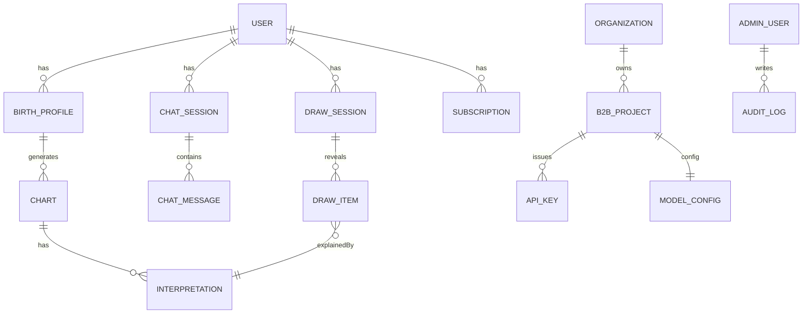
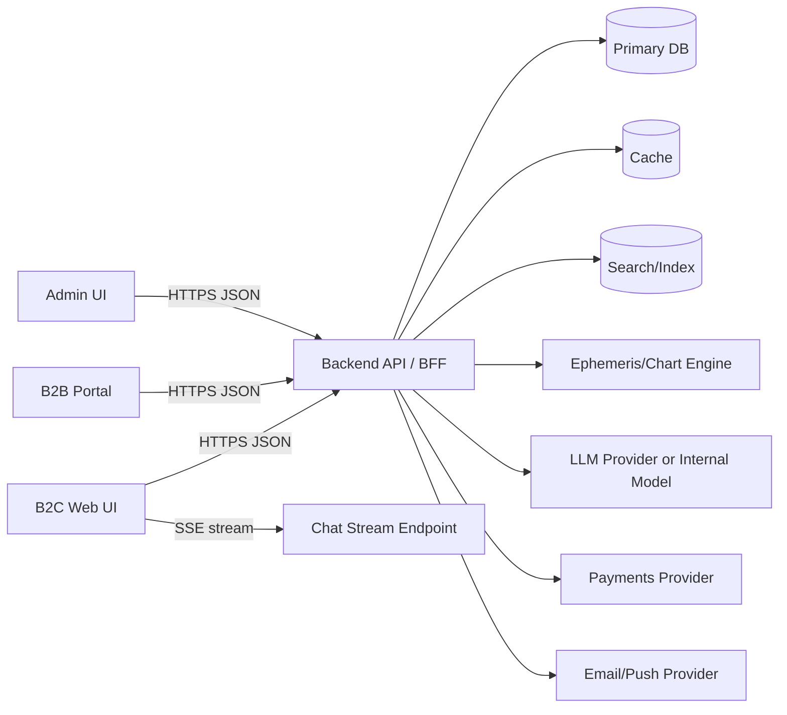
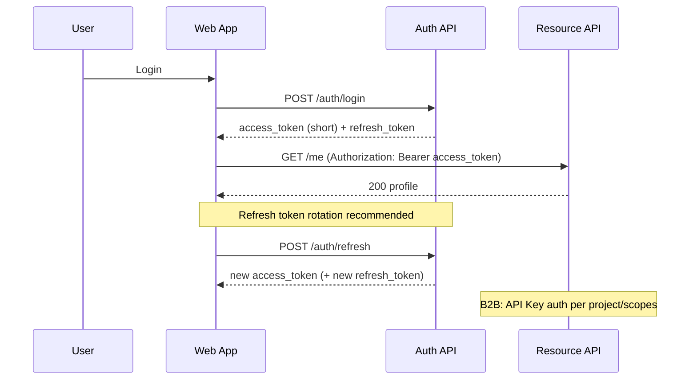
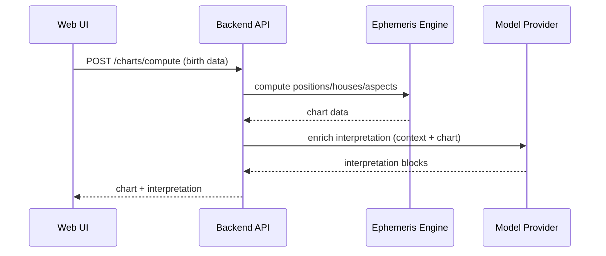

# Interface web d’astrologie : spécification UX/UI et architecture d’implémentation

## Résumé exécutif

Cette spécification décrit une interface **moderne, efficace et “premium”** pour une application web d’astrologie combinant : lecture de thème astral, chat avec astrologue virtuel, choix d’astrologue (humain/pro), tirage de cartes/runes, espace utilisateur, portail B2B (API keys + configuration “modèle”), et back-office admin. L’objectif est de permettre à un agent (ou une équipe) d’implémenter l’interface **sans ambiguïté**, avec un design system complet, des parcours clés, une architecture de l’information, des maquettes recommandées (pages + états), des animations, et des contrats API.  

La direction UX se fonde sur quelques piliers éprouvés : **progressive disclosure** (réduire la charge cognitive en masquant l’avancé tant qu’il n’est pas utile) et onboarding non-intrusif. citeturn2search2turn2search7turn2search11

Recommandation d’implémentation front-end (par défaut) : **React + Next.js (App Router) + TypeScript** pour la robustesse, la structure de routage, et l’écosystème, en s’appuyant sur des primitives accessibles (ex. composants headless / primitives orientées accessibilité) pour garantir **WCAG 2.1 AA**. citeturn1search0turn1search3turn3search0turn12search15turn20search7  
Pour la couche data : **TanStack Query** (server-state) + un store léger (ex. Zustand ou Redux Toolkit si complexité) afin de séparer proprement cache réseau vs état UI local. citeturn4search0turn4search12turn4search2turn4search1  
Pour i18n FR : **react-i18next** (et option ICU via FormatJS si besoin de messages complexes). citeturn5search0turn5search2  
Pour tests : **Vitest** (unit) + **Testing Library** (composants orientés usage) + **Playwright** (E2E cross-browser). citeturn6search0turn6search1turn5search3turn5search10  

Enfin, le design system est structuré autour de **design tokens** (format interopérable basé sur le travail du Design Tokens Community Group) et de variables CSS pour une implémentation stable et facilement themable (light/dark). citeturn0search3turn0search7turn17search0turn17search12

## Objectifs produit et hypothèses structurantes

### Objectifs produit

**Objectifs “grand public” (B2C)**  
1) Réduire la friction de démarrage : passer de “je découvre” à “j’ai mon premier insight utile” en < 2 minutes (flow thème astral minimal + 1 insight). L’onboarding doit rester léger et contextualisé (éviter les tutos longs qui interrompent). citeturn2search7turn2search11  
2) Construire la confiance : transparence sur les limites (ex. heure de naissance inconnue), explicabilité des interprétations, clarté visuelle, et cohérence.  
3) Favoriser la rétention : rituels (ex. “carte du jour”, mini-transits), notifications opt-in, bibliothèque d’historique (tirages, chats, rapports).  

**Objectifs “Pro/B2B”**  
1) Permettre l’intégration de fonctionnalités d’astrologie via API : génération de thèmes, interprétations, tirages, chat.  
2) Offrir **une gouvernance** : clés API, rotation/révocation, métriques d’usage, quotas, environnements, webhooks. (Les bonnes pratiques de gestion de secrets et de clés sont cruciales.) citeturn13search2turn13search22turn13search12turn7search0  

**Objectifs “Admin”**  
1) Modération, gestion de contenu (textes d’interprétation, FAQ, prompts/variantes), gestion des astrologues, tickets support.  
2) Sécurité et auditabilité (RBAC, logs, traçabilité). (Risques OWASP API Top 10 : autorisation objet/propriété, auth, exposition de données, etc.) citeturn7search0  

### Hypothèses (stack, budget, délais non spécifiés)

- Backend non imposé : la proposition suppose une API HTTP JSON (REST) + streaming (SSE ou WebSocket) pour le chat. Les SSE permettent au serveur de pousser des données au navigateur ; WebSocket apporte une communication bidirectionnelle persistante. citeturn19search0turn19search1turn19search17  
- Conformité : application visant un niveau **WCAG 2.1 AA** et intégration des principes de minimisation et privacy by design (RGPD). citeturn20search7turn10search4turn10search12  
- Positionnement : esthétique “cosmique” mais **sobre** (éviter l’ésotérisme kitsch), comparable à des leaders de marché qui mélangent personnalisation, lecture de thème, compatibilités, contenus audio, et consultation (inspiration fonctionnelle, pas mimétique). citeturn14search0turn14search8turn14search1turn14search2turn15search6  

### Références marché et inspirations visuelles

On observe chez des applications populaires : personnalisation via date/heure/lieu de naissance, compatibilité, contenus guidés, et accès à des experts (astrologues/tarot). citeturn14search5turn14search3turn14search4turn14search2turn14search1turn14search8  

image_group{"layout":"carousel","aspect_ratio":"1:1","query":["Co-Star astrology app interface screenshot","The Pattern app interface screenshot","CHANI app interface screenshot","Sanctuary astrology app interface screenshot"],"num_per_query":1}

**Note de cadrage** : l’objectif n’est pas de copier les UI existantes, mais d’en extraire des patterns : “insights courts + approfondissement”, navigation très directe, et mise en scène de rituels (tirage, chat, résumé du jour). citeturn2search2turn14search6turn14search19  

## Personas et parcours utilisateurs

### Personas

**Persona A — Grand public (B2C)**  
- Motivation : comprendre “Big Three” (Soleil/Lune/Ascendant), obtenir des conseils relationnels, faire un tirage rapide.  
- Frictions : données de naissance inconnues, méfiance envers le jargon, surcharge d’information.  
- Besoins : langage clair, progressivité, choix “léger vs avancé”, explicabilité, mode sombre confortable.  

**Persona B — Utilisateur Pro/B2B (développeur, product builder, intégrateur)**  
- Motivation : intégrer thèmes astrals + interprétations dans sa propre app ; avoir un portail clair (clés, quotas, logs, webhooks).  
- Frictions : documentation insuffisante, manque de sandbox, gestion des secrets risquée. (Les guides de gestion des secrets/clefs recommandent rotation, contrôle d’accès, audit, non-exposition dans le code.) citeturn13search2turn13search12turn7search0  
- Besoins : API stable, contrats clairs, environnements test/prod, monitoring, export usage.  

**Persona C — Administrateur (ops / content / support)**  
- Motivation : maintenir la qualité (contenu), gérer astrologues, modérer, corriger incidents, traiter demandes RGPD.  
- Frictions : outils admin mal structurés, absence d’audit trail, manque de recherche/filtre.  
- Besoins : RBAC, recherche, logs, métriques, workflows (draft/publish). (OWASP Top 10 API souligne des risques récurrents liés à l’autorisation et à l’exposition de données.) citeturn7search0  

### Parcours clés par feature

#### Lecture de thème astral

**B2C — “Premier thème en 2 minutes”**  
1) Landing “Découvrir mon thème” → CTA.  
2) Formulaire naissance : date, heure (option “je ne sais pas”), ville/pays (autocomplete).  
3) Consentement : stockage du profil + usage pour personnalisation (privacy by design : minimiser et expliquer). citeturn10search4turn10search12  
4) Écran résultat “Résumé” : Big Three + 3 insights lisibles.  
5) CTA “Approfondir” → placements détaillés, aspects, maisons.

**Points UX critiques**  
- Si heure inconnue : basculer en mode “heure approximative”, expliquer l’impact sur Ascendant/maisons (et marquer les éléments incertains).  
- Progressive disclosure : d’abord un résumé, puis l’avance. citeturn2search2  

#### Chat avec astrologue virtuel

**B2C — “Question contextuelle”**  
1) Entrer dans Chat (depuis thème ou tirage).  
2) Suggestion de prompts : “Carrière”, “Relations”, “Ce mois-ci”.  
3) Réponse en streaming (indicateur de génération).  
4) Liens vers explications (placements utilisés, cartes tirées).  
5) Sauvegarde dans l’historique.

**Technique/UX**  
- Streaming : SSE adapté pour pousser des segments ; WebSocket si interaction bidirectionnelle étendue. citeturn19search0turn19search1  
- “Mode réduit” : désactiver animations non essentielles si préférence utilisateur. citeturn0search2turn0search18turn2search1  

#### Choix d’astrologue

**B2C — “Je veux parler à un humain”**  
1) “Astrologues” → liste filtrable (spécialités, prix, langue).  
2) Fiche astrologue : bio, expertises, créneaux, avis (si présent).  
3) Choix : “message” / “session” / “rapport”.  
4) Paiement (si applicable) + confirmation + rappel.

**Option Pro (B2B)** : “catalogue d’experts” pour une entreprise qui redistribue/white-label.

#### Tirage cartes/runes avec interprétation

**B2C — “Rituel rapide”**  
1) Page Tirage : choisir “Carte du jour / 3 cartes / Runes”.  
2) Intention (champ optionnel) + CTA “Tirer”.  
3) Animation de tirage (flip carte / révélation rune).  
4) Interprétation structurée : “Résumé / Détails / Conseil action”.  
5) CTA “En parler au chat” (contexte injecté).  

**Note “contenu”** : un deck tarot standard est généralement 78 cartes (22 majeurs, 56 mineurs). citeturn9search5  

#### Profil utilisateur

**B2C — “Compte & préférences”**  
- Gérer profils de naissance multiples (moi / enfant / partenaire).  
- Préférences : langue, thème light/dark, notifications.  
- Export/suppression : exigences RGPD (minimisation, privacy by design). citeturn10search4turn10search12  

#### Backend admin

**Admin — “publier un contenu d’interprétation”**  
1) Recherche “règle” (ex. “Vénus en Maison 7”).  
2) Édition : versioning (draft), aperçu, validation.  
3) Publication + log.  

**Admin — “gestion des astrologues”**  
- Onboarding expert, disponibilité, tarification, statut (actif/inactif), modération.  

#### Portail B2B

**Pro/B2B — “Créer une clé + tester en sandbox”**  
1) Créer un “projet” (app) → générer clé.  
2) Définir scopes (read:charts, write:chat, etc.), quotas.  
3) Copier exemple cURL + tester.  
4) Rotation/révocation (SECRETS management). citeturn13search2turn13search22turn13search12  

## Architecture de l’information et wireframes recommandés

### Architecture de l’information

Pour limiter la complexité et garantir une navigation “rituel first”, l’IA est centrée sur 5 entrées B2C :

- **Accueil** : “insight du jour”, raccourcis, historique récent  
- **Thème** : profil naissance, résumé, détails (placements, aspects, maisons)  
- **Chat** : astrologue virtuel (contextualisé)  
- **Tirages** : tarot/runes (rituels)  
- **Profil** : compte, préférences, abonnements

Cette hiérarchie s’appuie sur la progressive disclosure (résumé → détail). citeturn2search2  

**IA B2B** (séparée) :  
- Dashboard, API Keys, Usage & quotas, Webhooks, Modèle & config, Logs, Docs.

**IA Admin** (séparée) :  
- Utilisateurs, Contenu, Astrologues, Conversations (modération), Incidents, Audit logs, Paramètres.

### Sitemap recommandé

**B2C**  
- `/` Accueil  
- `/onboarding` (optionnel, très court)  
- `/birth-profile/new` Saisie naissance  
- `/chart/:profileId` Thème astral (Résumé)  
- `/chart/:profileId/details` Détails (Placements/Aspects/Maisons)  
- `/chat` Chat (sessions)  
- `/chat/:sessionId` Chat (fil)  
- `/draw` Tirages (chooser)  
- `/draw/tarot/:drawId` Tirage tarot  
- `/draw/runes/:drawId` Tirage runes  
- `/astrologers` Catalogue astrologues  
- `/astrologers/:id` Fiche astrologue  
- `/settings` Profil & préférences  

**B2B**  
- `/b2b` Overview  
- `/b2b/projects`  
- `/b2b/projects/:id/keys`  
- `/b2b/projects/:id/usage`  
- `/b2b/projects/:id/model`  
- `/b2b/docs`  

**Admin**  
- `/admin`  
- `/admin/content`  
- `/admin/astrologers`  
- `/admin/users`  
- `/admin/audit`  

### Wireframes / maquettes recommandées

#### Page “Saisie naissance”

**Desktop** : card centrée (640–720px), à gauche explication, à droite formulaire.  
**Mobile** : full-screen, champs en pile, CTA sticky bas.

États indispensables (tous écrans) :  
- Default, Loading, Error (validation), Empty (pas de profil), “Time unknown”.

**Accessibilité formulaire** : labels explicites, messages d’erreur textuels (pas uniquement couleur), focus visible, structure sémantique. citeturn12search12turn12search1turn11search3  

#### Page “Thème astral — Résumé”

Structure :  
- Header : nom du profil + sélecteur profil + actions (export / partager)  
- Bloc “Big Three” (3 cartes)  
- Bloc “Aujourd’hui” (insight court)  
- CTA “Approfondir”

**Détails** : le “Résumé” doit rester lisible en 20–30 secondes ; le détail est un écran secondaire (tabs : Placements / Aspects / Maisons / Transits). Cette séparation suit la logique de progressive disclosure. citeturn2search2  

image_group{"layout":"carousel","aspect_ratio":"16:9","query":["astrological birth chart wheel houses diagram","modern astrology dashboard UI dark mode","tarot card spread UI design mobile"],"num_per_query":1}

#### Page “Chat astrologue virtuel”

Layout (mobile-first) :  
- Top bar : nom session + “contexte” (profil actif, tirage actif) + menu  
- Corps : messages (bubbles) + citations/“sources internes” (placements utilisés)  
- Composer : input multi-ligne, actions quick prompts, bouton envoyer  
- Streaming : “typing indicator” + segments.

**États** :  
- Empty (nouvelle session) avec prompts,  
- Loading (connexion),  
- Error (timeout / quota),  
- “Safety / guidance message” (si question sensible).

#### Page “Choix d’astrologue”

- Filtres : spécialité, prix, langue, disponibilité  
- Liste : cards uniformes, CTA principal “Voir profil”  
- Fiche : bio, méthodes, créneaux, avis, CTA “Contacter”.

#### Page “Tirage tarot / runes”

- Écran intention (optionnel)  
- Écran tirage (animation)  
- Écran résultat : “Résumé / Détails / Conseils / Actions” + CTA “Ouvrir chat”.

#### Admin

- Sidebar : sections (contenu, astrologues, users, audit)  
- Table view : recherche, filtres, colonnes, actions en ligne  
- Fiche : onglets + historique modifications.

**Modals admin** : suivre pattern accessible : focus trap, échap ferme, focus initial, retour focus trigger. citeturn0search1turn0search5  

## Design system : style guide, tokens, composants et accessibilité

### Style visuel

**Direction artistique** : “Cosmic Minimal”  
- Fond : “space black” nuancé + surfaces légèrement bleutées  
- Accents : lavande / cyan / or pour hiérarchie  
- Effets : gradients très contrôlés (ex. aura subtile), blur léger réservé aux backgrounds, jamais sur texte  
- Iconographie : trait fin (outline), géométrique, peu de remplissages, cohérente entre états.

**Mode sombre par défaut** (recommandé dans ce domaine) + mode clair complet.

### Typographie

- Sans-serif principale (UI) : lisibilité, chiffres clairs, bonne perf.  
- Serif/Display optionnelle (titres “rituels”) : parcimonie (H1/H2).  
- Règles : capitalisation phrase (cohérence microcopy), interlignage généreux.

(La guidance “content design” type Material recommande une cohérence de style rédactionnel et de capitalisation.) citeturn20search13  

### Palette couleur (hex) et règles de contraste

Référence contrastes WCAG : **4.5:1** minimum pour texte normal (AA) et **3:1** pour texte large. citeturn0search8turn0search4  

**Couleurs de base**  
- `Space-950` : `#070A14` (fond dark)  
- `Space-900` : `#0B1020` (surface)  
- `Space-800` : `#1B2445` (surface élevée)  
- `Ink-950` : `#0B1020` (texte dark)  
- `Mist-50` : `#F7F8FF` (fond light)  
- `Mist-100` : `#F5F7FF` (texte sur dark)

**Accents**  
- `Aura-Lavender` : `#B8A9FF` (primary)  
- `Aura-Cyan` : `#66E6FF` (info/focus)  
- `Aura-Teal` : `#00D3A7` (success)  
- `Aura-Gold` : `#FFC857` (highlight)  
- `Aura-Rose` : `#FF4D6D` (error)

**États**  
- Border subtle : `#2C3557`  
- Disabled text : `#A0A6BC`  
- Overlay : `rgba(7,10,20,0.72)`

### Design tokens

Les tokens sont définis en **JSON** (format de design tokens interopérable) + exposés en variables CSS. Le format token vise l’échange entre outils et l’industrialisation. citeturn0search3turn0search7turn17search6  

#### Tokens (extrait DTCG JSON)

```json
{
  "$schema": "https://www.designtokens.org/tr/drafts/format/",
  "color": {
    "bg": {
      "dark": { "$type": "color", "$value": "#070A14" },
      "light": { "$type": "color", "$value": "#F7F8FF" }
    },
    "surface": {
      "1": { "$type": "color", "$value": "#0B1020" },
      "2": { "$type": "color", "$value": "#1B2445" }
    },
    "text": {
      "onDark": { "$type": "color", "$value": "#F5F7FF" },
      "onLight": { "$type": "color", "$value": "#0B1020" },
      "muted": { "$type": "color", "$value": "#A0A6BC" }
    },
    "accent": {
      "primary": { "$type": "color", "$value": "#B8A9FF" },
      "info": { "$type": "color", "$value": "#66E6FF" },
      "success": { "$type": "color", "$value": "#00D3A7" },
      "warning": { "$type": "color", "$value": "#FFC857" },
      "danger": { "$type": "color", "$value": "#FF4D6D" }
    }
  },
  "space": {
    "0": { "$type": "dimension", "$value": "0px" },
    "1": { "$type": "dimension", "$value": "4px" },
    "2": { "$type": "dimension", "$value": "8px" },
    "3": { "$type": "dimension", "$value": "12px" },
    "4": { "$type": "dimension", "$value": "16px" },
    "5": { "$type": "dimension", "$value": "20px" },
    "6": { "$type": "dimension", "$value": "24px" },
    "7": { "$type": "dimension", "$value": "32px" },
    "8": { "$type": "dimension", "$value": "40px" },
    "9": { "$type": "dimension", "$value": "48px" }
  },
  "radius": {
    "sm": { "$type": "dimension", "$value": "10px" },
    "md": { "$type": "dimension", "$value": "14px" },
    "lg": { "$type": "dimension", "$value": "18px" },
    "pill": { "$type": "dimension", "$value": "999px" }
  },
  "shadow": {
    "sm": { "$type": "shadow", "$value": "0 6px 16px rgba(0,0,0,0.22)" },
    "md": { "$type": "shadow", "$value": "0 10px 30px rgba(0,0,0,0.30)" }
  },
  "motion": {
    "duration": {
      "fast": { "$type": "duration", "$value": "120ms" },
      "base": { "$type": "duration", "$value": "200ms" },
      "slow": { "$type": "duration", "$value": "320ms" }
    }
  }
}
```

#### Variables CSS (extrait)

Les variables CSS sont une base standard pour le theming (cascade + scopes). citeturn17search0turn17search12  

```css
:root {
  --color-bg-dark: #070A14;
  --color-bg-light: #F7F8FF;
  --color-surface-1: #0B1020;
  --color-surface-2: #1B2445;
  --color-text-on-dark: #F5F7FF;
  --color-text-on-light: #0B1020;
  --color-accent-primary: #B8A9FF;
  --color-accent-info: #66E6FF;
  --color-accent-success: #00D3A7;
  --color-accent-warning: #FFC857;
  --color-accent-danger: #FF4D6D;

  --space-1: 4px;
  --space-2: 8px;
  --space-4: 16px;
  --r-md: 14px;

  --dur-fast: 120ms;
  --dur-base: 200ms;
  --dur-slow: 320ms;
}
```

### Composants UI et comportements

#### Fondations d’accessibilité (WCAG 2.1 AA)

- Contraste texte respecté selon seuils WCAG. citeturn0search8turn0search4  
- Focus visible : toujours fournir un indicateur de focus clavier. citeturn11search3turn11search6  
- Reflow : assurer la lisibilité sans scroll 2D à 320px de largeur (sauf contenus nécessitant 2D). citeturn11search2turn11search16  
- Formulaires : erreurs explicitement identifiées, labels/instructions présents. citeturn12search12turn12search1turn12search17  
- Modals : focus trap, échap ferme, tab/shift-tab contenus dans le dialog. citeturn0search1  
- Respect “reduce motion” : réduire/remplacer animations si préférence OS. citeturn0search2turn0search18turn2search1  
- Icônes décoratives : masquer aux lecteurs d’écran (`aria-hidden="true"`). citeturn17search7turn17search3  

#### Responsive et priorités adaptatives

**Breakpoints (recommandés)**  
- Mobile : 360–639  
- Tablet : 640–1023  
- Desktop : 1024+

**Priorités adaptatives**  
- Mobile : navigation bottom bar (5 items max), CTA sticky, contenu “résumé d’abord”, charts et tables simplifiées.  
- Tablet : 2 colonnes possibles (résumé + détail).  
- Desktop : sidebar + panneau détail, data dense pour pro/admin.

**Touch targets** : viser taille confortable (guides plateforme ~44pt iOS / ~48dp Material). citeturn11search10turn11search4turn11search7  

### Animations & transitions

Les systèmes motion recommandent des durées cohérentes et des courbes d’animation (easing/duration tokens). citeturn2search4turn2search8  

#### Exemple CSS (transitions + reduce motion)

```css
:root {
  --ease-out: cubic-bezier(0.16, 1, 0.3, 1);
}

.ui-fade-in {
  animation: fadeIn var(--dur-base) var(--ease-out) both;
}

@keyframes fadeIn {
  from { opacity: 0; transform: translateY(6px); }
  to   { opacity: 1; transform: translateY(0); }
}

@media (prefers-reduced-motion: reduce) {
  .ui-fade-in { animation: none; }
  * { scroll-behavior: auto; }
}
```

Le media query `prefers-reduced-motion` sert à détecter la préférence utilisateur pour réduire les animations. citeturn0search2turn0search18  
La guidance “Reduced Motion” recommande de désactiver certains effets (parallax, multi-axis motion, auto-advancing) lorsque l’utilisateur a activé la réduction de mouvement. citeturn2search1  

#### Exemple JS (animation de “flip” carte tarot)

```js
export function flipCard(el, flipped) {
  el.style.transform = flipped ? "rotateY(180deg)" : "rotateY(0deg)";
}
```

### Catalogue de composants et exemples de code (React / JSX)

> Le catalogue ci-dessous est structuré “primitives” (design system) + “feature components”.

#### Button

**Variants** : `primary | secondary | ghost | danger`  
**Sizes** : `sm | md | lg`  
**États** : `default | hover | pressed | focus | disabled | loading`

```tsx
import * as React from "react";

type ButtonVariant = "primary" | "secondary" | "ghost" | "danger";
type ButtonSize = "sm" | "md" | "lg";

export type ButtonProps = React.ButtonHTMLAttributes<HTMLButtonElement> & {
  variant?: ButtonVariant;
  size?: ButtonSize;
  loading?: boolean;
  leftIcon?: React.ReactNode;
  rightIcon?: React.ReactNode;
};

export function Button({
  variant = "primary",
  size = "md",
  loading = false,
  leftIcon,
  rightIcon,
  disabled,
  children,
  ...rest
}: ButtonProps) {
  const isDisabled = disabled || loading;

  return (
    <button
      {...rest}
      disabled={isDisabled}
      className={[
        "ui-btn",
        `ui-btn--${variant}`,
        `ui-btn--${size}`,
        isDisabled ? "ui-btn--disabled" : "",
      ].join(" ")}
    >
      {loading ? <span className="ui-spinner" aria-hidden="true" /> : leftIcon}
      <span className="ui-btn__label">{children}</span>
      {rightIcon}
    </button>
  );
}
```

#### Input / TextField

Contraintes WCAG : label explicite + erreur identifiée (texte). citeturn12search12turn12search1  

```tsx
type TextFieldProps = {
  id: string;
  label: string;
  value: string;
  onChange: (v: string) => void;
  placeholder?: string;
  hint?: string;
  error?: string;
  required?: boolean;
};

export function TextField({
  id, label, value, onChange, placeholder, hint, error, required
}: TextFieldProps) {
  const describedBy = [
    hint ? `${id}-hint` : null,
    error ? `${id}-err` : null
  ].filter(Boolean).join(" ");

  return (
    <div className="ui-field">
      <label className="ui-label" htmlFor={id}>
        {label}{required ? " *" : ""}
      </label>

      <input
        id={id}
        className={`ui-input ${error ? "ui-input--error" : ""}`}
        value={value}
        placeholder={placeholder}
        onChange={(e) => onChange(e.target.value)}
        aria-invalid={Boolean(error)}
        aria-describedby={describedBy || undefined}
      />

      {hint && !error && <div id={`${id}-hint`} className="ui-hint">{hint}</div>}
      {error && <div id={`${id}-err`} className="ui-error">{error}</div>}
    </div>
  );
}
```

#### Select / Combobox (ville/pays)

Le pattern combobox doit gérer correctement clavier (flèches, enter, escape) selon APG. citeturn12search3turn12search15  

*(Implémentation recommandée via primitives accessibles plutôt que “from scratch”, sauf expertise a11y solide.)* citeturn12search15  

#### Modal / Dialog

Respecter le pattern “modal dialog” (focus trap, tab sequence interne, sortie via fermeture). citeturn0search1turn0search5  

```tsx
type ModalProps = {
  open: boolean;
  title: string;
  onClose: () => void;
  children: React.ReactNode;
};

export function Modal({ open, title, onClose, children }: ModalProps) {
  if (!open) return null;

  return (
    <div className="ui-overlay" role="presentation" onMouseDown={onClose}>
      <div
        className="ui-modal"
        role="dialog"
        aria-modal="true"
        aria-label={title}
        onMouseDown={(e) => e.stopPropagation()}
      >
        <header className="ui-modal__header">
          <h2 className="ui-modal__title">{title}</h2>
          <button className="ui-icon-btn" onClick={onClose} aria-label="Fermer">
            ×
          </button>
        </header>
        <div className="ui-modal__body">{children}</div>
      </div>
    </div>
  );
}
```

#### Toast / Notifications

- Notifications non bloquantes : succès, erreur, info.  
- “Action” optionnelle (undo, réessayer).  
- Respect reduce motion. citeturn0search2  

#### Cartes (Card) et “Insight blocks”

- Cards uniformes : titre + description + CTA  
- Hover subtil desktop, pressed mobile  
- Skeleton loading pour data fetch.

#### Composants métier (feature components)

- `ChartSummaryCard` : Big Three + tags  
- `PlacementList` : planète → signe → maison → aspects  
- `AspectChip` : aspect + intensité, tooltip accessible  
- `ChatThread` : messages + citations internes  
- `AstrologerCard` : price, dispo, skills  
- `TarotSpread` : cartes face-down, reveal + animation  
- `RuneGrid` : runes, orientation, sens

## Architecture technique : choix front, structure composants, contrats API

### Comparatifs (frameworks & bibliothèques)

#### Frameworks (web app + portails)

Tableau synthétique basé sur documentation officielle + benchmarks publics (à interpréter comme indicateurs, pas vérité absolue). citeturn1search0turn1search1turn1search2turn16search0turn16search4  

| Option | Performance | Courbe d’apprentissage | Écosystème | Accessibilité | Coût |
|---|---|---|---|---|---|
| React + Next.js | Très solide ; Next App Router exploite des features React modernes (Server Components, Suspense). citeturn1search3turn1search10 | Moyenne (concepts SSR/RSC). citeturn1search3 | Excellent (tools, libs). citeturn1search0 | Dépend des choix UI ; bonnes bases via primitives a11y. citeturn12search15 | Open-source ; coûts liés infra/équipe |
| Vue + (Nuxt) | Très bon ; Composition API offre patterns de réutilisation. citeturn1search1turn1search5 | Souvent jugée plus douce côté template | Très bon | Bon si composants accessibles | Open-source |
| Svelte + SvelteKit | Approche compilée “minimal work in browser”. citeturn1search2turn1search9turn16search9 | Rapide à prototyper ; patterns spécifiques | Écosystème plus petit | Bon si rigueur a11y ; moins de “standards de facto” | Open-source |

**Recommandation par défaut** : React + Next.js si l’objectif est d’industrialiser B2C + B2B + admin avec une base unique, et capitaliser sur l’écosystème. citeturn1search0turn1search3  

#### UI libraries (approches)

| Option | Performance | Courbe | Écosystème | Accessibilité | Coût |
|---|---|---|---|---|---|
| Radix Primitives + Tailwind | Primitives orientées accessibilité + custom design system. citeturn3search0turn3search11 | Moyen (composer soi-même) | Fort (React) | Très bon (focus a11y). citeturn3search0 | Open-source |
| Headless UI + Tailwind | Composants headless “unstyled, fully accessible”. citeturn3search1 | Moyen | Bon | Très bon (objectif explicite). citeturn3search1 | Open-source |
| Chakra UI | Système composants “accessible React components”. citeturn18search1turn18search7 | Faible à moyen | Bon | Bon (orientation accessibilité). citeturn18search1 | Open-source |
| Mantine | Bibliothèque riche, vise apps accessibles. citeturn18search2turn18search10 | Faible | Bon | Bon | Open-source |
| Ant Design | Orienté “enterprise-class UI”. citeturn18search6turn18search17 | Faible | Très bon | Variable selon usage | Open-source |

**Recommandation UX/Brand** : pour une identité “cosmic minimal” distincte, privilégier primitives/headless plutôt qu’un UI kit très typé visuellement.

### State management

- Server-state : TanStack Query (cache, invalidation, mutations). citeturn4search0turn4search4turn4search12  
- Client-state : store léger (Zustand) si l’état UI est modéré. citeturn4search2  
- Si besoin de gouvernance stricte (admin très complexe) : Redux Toolkit recommandé par Redux. citeturn4search1turn4search5  

### i18n (FR en base)

- react-i18next : framework i18n pour React basé sur i18next. citeturn5search0turn5search4  
- Messages complexes (pluriels/genre) : ICU Message syntax via FormatJS. citeturn5search2turn5search5  

### Tests

- Vitest : “Vite native test runner”, réutilise pipeline Vite. citeturn6search0turn6search11  
- Testing Library : principes orientés usage (“tests ressemblent à l’usage réel”). citeturn6search5turn6search20  
- Playwright : E2E cross-browser (Chromium/WebKit/Firefox). citeturn5search3turn5search10  

### Structure composants réutilisables (front)

Proposition d’architecture “feature-first” :

```txt
src/
  app/                     # routes (Next)
  features/
    chart/
      components/
      hooks/
      api.ts
      types.ts
    chat/
    draw/
    astrologers/
    profile/
    admin/
    b2b/
  components/
    ui/                    # primitives (Button, Modal, Tabs, Toast...)
    layout/                # AppShell, Sidebar, Topbar
  design-system/
    tokens.json
    theme.css
  lib/
    http-client.ts
    auth.ts
    analytics.ts
    i18n.ts
```

### Contrats API essentiels

Base : JSON conforme à RFC 8259. citeturn19search7turn19search10  

#### Auth (B2C)

- `POST /v1/auth/signup`
- `POST /v1/auth/login`
- `POST /v1/auth/refresh`
- `POST /v1/auth/logout`

**Flux auth modernes** : OAuth 2.1 / OIDC sont des références courantes pour auth fédérée ; l’Authorization Code Flow évite d’exposer des tokens côté user agent. citeturn7search1turn7search2turn7search5  

#### Profil utilisateur

- `GET /v1/me`
- `PATCH /v1/me`
- `GET /v1/me/birth-profiles`
- `POST /v1/me/birth-profiles`
- `PATCH /v1/me/birth-profiles/:id`
- `DELETE /v1/me/birth-profiles/:id`

**Exemple payload** (création profil naissance) :

```json
{
  "label": "Moi",
  "birthDate": "1992-08-17",
  "birthTime": "14:25",
  "birthTimeUnknown": false,
  "birthPlace": {
    "name": "Paris",
    "countryCode": "FR",
    "lat": 48.8566,
    "lon": 2.3522
  },
  "timezone": "Europe/Paris"
}
```

#### Lecture de thème astral

- `POST /v1/charts/compute` (compute à la demande)
- `GET /v1/charts/:chartId`
- `GET /v1/charts/:chartId/interpretation?depth=summary|full`

**Référence calcul** : l’éphéméride peut être fournie par un moteur interne ou une lib ; Swiss Ephemeris a des conditions de licence spécifiques (dont version pro). citeturn8search1turn8search14  

**Exemple réponse “summary”**

```json
{
  "chartId": "ch_123",
  "profileId": "bp_456",
  "bigThree": {
    "sun": { "sign": "Leo", "degree": 24.1 },
    "moon": { "sign": "Capricorn", "degree": 2.8 },
    "rising": { "sign": "Scorpio", "degree": 11.4, "confidence": "high" }
  },
  "highlights": [
    { "title": "Énergie créative", "text": "..." },
    { "title": "Structure et ambition", "text": "..." },
    { "title": "Intuition relationnelle", "text": "..." }
  ]
}
```

#### Chat astrologue virtuel

- `POST /v1/chat/sessions`
- `GET /v1/chat/sessions`
- `GET /v1/chat/sessions/:id`
- `POST /v1/chat/sessions/:id/messages`
- `GET /v1/chat/sessions/:id/stream` (SSE) ou `WS /v1/chat/ws`

Les SSE permettent au serveur de pousser des messages à tout moment via connexion persistante HTTP. citeturn19search0turn19search4  

**Exemple message**

```json
{
  "role": "user",
  "content": "Qu’est-ce que je dois privilégier cette semaine au travail ?",
  "context": {
    "profileId": "bp_456",
    "chartId": "ch_123",
    "activeDrawId": null
  }
}
```

#### Choix d’astrologue (catalogue + disponibilité)

- `GET /v1/astrologers?lang=fr&specialty=career&priceMax=80`
- `GET /v1/astrologers/:id`
- `GET /v1/astrologers/:id/availability`
- `POST /v1/consultations` (réservation)

#### Tirage cartes/runes

- `POST /v1/draws` (type = tarot|runes, spread)
- `GET /v1/draws/:id`
- `POST /v1/draws/:id/interpretation`

**Exemple création tirage**

```json
{
  "type": "tarot",
  "spread": "three_cards",
  "intention": "Clarifier ma relation",
  "rngSeed": "optional-client-seed"
}
```

#### Admin backend

- `GET /v1/admin/users`
- `GET /v1/admin/content`
- `POST /v1/admin/content`
- `PATCH /v1/admin/content/:id`
- `POST /v1/admin/astrologers`
- `PATCH /v1/admin/astrologers/:id`
- `GET /v1/admin/audit`

RBAC + audit : crucial pour éviter erreurs d’autorisation/exposition (OWASP API). citeturn7search0  

#### Portail B2B (API keys, modèle/config)

- `POST /v1/b2b/projects`
- `GET /v1/b2b/projects`
- `POST /v1/b2b/projects/:id/keys`
- `POST /v1/b2b/projects/:id/keys/:keyId/rotate`
- `DELETE /v1/b2b/projects/:id/keys/:keyId` (revoke)
- `GET /v1/b2b/projects/:id/usage`
- `PATCH /v1/b2b/projects/:id/model-config`
- `POST /v1/b2b/webhooks`

Bonnes pratiques (exemples industriels) : ne pas exposer clés secrètes, limiter accès, éviter partage insecure, rotation. citeturn13search12turn13search2turn13search22  

### Schémas d’architecture (Mermaid)

#### Modèle d’entités



#### Flux de données



#### Auth flow (B2C + B2B)



OAuth 2.1 et OIDC donnent un cadre standard pour l’accès et l’auth, notamment via Authorization Code Flow. citeturn7search1turn7search2turn7search5  

#### Intégration API externe (exemple)



## Roadmap MVP, checklist et sources prioritaires

### MVP : priorisation par sprint (3 sprints)

Objectif : livrer un MVP “rituels essentiels” + base B2B/admin minimale.

#### Sprint 1 — Fondation produit & design system
- Design tokens + theming (dark/light) + composants UI core (Button, Input, Modal, Toast, Tabs, Card).  
- Saisie naissance + validation + stockage profil.  
- Page Thème astral (Résumé) avec états loading/empty/error.  
- Auth (signup/login/refresh) + protection routes.  
- Tests de base (Vitest + Testing Library) + E2E smoke (Playwright). citeturn6search0turn6search5turn5search10  

#### Sprint 2 — Chat + Tirages
- Chat sessions + streaming (SSE) + historique. citeturn19search0turn19search4  
- Tirage tarot “carte du jour” + “3 cartes” (UI flip + interpretation).  
- Profil utilisateur (préférences, mode réduit, langue).  
- A11y pass WCAG sur flows critiques (labels, erreurs, focus visible, reflow). citeturn11search3turn11search2turn12search12  

#### Sprint 3 — Astrologues + Admin/B2B minimal
- Catalogue astrologues + fiche + disponibilité.  
- Admin minimal : users + contenu (CRUD simple) + audit log.  
- B2B minimal : projets + API key create/revoke + page docs.  
- Sécurité : secrets management, scopes, rate limits, logs (OWASP). citeturn13search2turn7search0  

### Checklist d’implémentation (condensée)

**Accessibilité**  
- Contraste AA, focus visible, erreurs textuelles, navigation clavier, modals a11y, reflow 320px, reduce motion. citeturn0search8turn11search3turn12search12turn11search2turn0search2  

**Sécurité & données**  
- Minimisation, privacy by design (RGPD/CNIL). citeturn10search4turn10search12turn10search13  
- Auth + autorisation robustes ; éviter BOLA/BOPLA (OWASP). citeturn7search0  
- Gestion clés/secrets : jamais en clair, rotation, contrôle d’accès. citeturn13search2turn13search12  

**Qualité**  
- Tests unitaires + composants + E2E. citeturn6search0turn6search20turn5search10  
- Storybook pour états rares et documentation UI. citeturn6search2turn6search6  

### Exemples d’UX copy en français

**Onboarding (naissance)**  
- Titre : “Créer ton thème astral”  
- Sous-texte : “On a besoin de ta date, et si possible de ton heure et ta ville de naissance.”  
- Aide heure inconnue : “Pas d’inquiétude : tu peux continuer sans l’heure. Certains éléments seront estimés.”

**Erreurs formulaire** (erreur explicite)  
- “L’heure doit être au format HH:MM (ex. 14:25).”  
- “Choisis une ville dans la liste pour calculer correctement le ciel.”

(La guideline “Error Identification” recommande de rendre l’erreur explicite et perceptible.) citeturn12search12  

**Empty states**  
- Chat vide : “Pose une question, ou choisis un thème ci-dessous.”  
- Historique tirages vide : “Ton premier tirage t’attend. Commence par une carte du jour.”

**Microcopy sécurité / confiance**  
- Chat : “Réponses générées à partir de ton profil astrologique. À prendre comme pistes de réflexion, pas comme vérité absolue.”  
- Profil : “Tu peux supprimer ton compte et tes données à tout moment.”

**B2B**  
- API keys : “Copie la clé maintenant : elle ne sera plus affichée ensuite.”  
- Rotation : “Rotation conseillée si la clé a été partagée par erreur.”

(Bonnes pratiques : éviter partage insecure, limiter accès, rotation.) citeturn13search12turn13search2  

### Sources prioritaires (à garder “en favoris”)

**Standards accessibilité & patterns**  
- entity["organization","W3C","web standards body"] : WCAG 2.x + documents “Understanding” (contraste, focus visible, reflow, formulaires, etc.). citeturn20search7turn11search3turn11search2turn0search8  
- WAI-ARIA Authoring Practices (patterns modal dialog, combobox…). citeturn12search15turn0search1turn12search3  
- MDN (références CSS/JS : prefers-reduced-motion, variables CSS, SSE/WebSocket). citeturn0search2turn17search0turn19search0turn19search1  

**Guidelines UI & motion**  
- entity["company","Apple","technology company"] : Human Interface Guidelines (motion, hit targets). citeturn2search5turn11search10turn2search1  
- entity["company","Google","technology company"] : Material Design 3 (motion tokens, principes). citeturn2search4turn2search8turn20search2  

**UX research / patterns**  
- entity["organization","Nielsen Norman Group","ux research firm"] : progressive disclosure, onboarding, patterns. citeturn2search2turn2search7turn2search11  

**Design tokens**  
- Design Tokens Community Group : spec + format. citeturn0search3turn0search7turn0search11  

**Sécurité & auth**  
- entity["organization","OWASP","web security nonprofit"] : API Security Top 10, cheat sheets (secrets, REST security). citeturn7search0turn13search2turn13search22  
- entity["organization","IETF","internet standards body"] : JSON (RFC 8259) + OAuth 2.1 drafts. citeturn19search7turn7search1  
- entity["organization","OpenID Foundation","open identity standards org"] : OpenID Connect (code flow). citeturn7search2turn7search6  
- entity["organization","FIDO Alliance","passkeys standards org"] : passkeys (passwordless). citeturn7search3turn7search7  

**Données & conformité FR**  
- entity["organization","CNIL","data protection authority fr"] : principes RGPD (minimisation), sécurité, mots de passe. citeturn10search4turn10search9turn10search10  
- Lignes directrices EDPB sur privacy by design/by default (article 25). citeturn10search12  

**Apps leaders (benchmark fonctionnel)**  
- entity["company","Co–Star","astrology app"] : personnalisation (naissance), compatibilité, apprentissage du thème. citeturn14search5turn14search3turn8search13  
- entity["company","The Pattern","astrology app"] : insights personnalisés + cycles + compatibilités. citeturn14search8turn14search19turn14search11  
- entity["company","CHANI","astrology app"] : birth chart readings + contenus bien-être. citeturn14search1turn14search16  
- entity["company","Sanctuary","astrology app"] : live chat experts + birth chart interactif + tarot. citeturn14search4turn14search2turn14search21  
- entity["company","TimePassages","astrology app"] : “par des astrologues pour des astrologues”, dashboard + analyses. citeturn15search6turn15search3  
- entity["company","Nebula","psychic reading app"] : mix astrologie/psychic/tarot (utile pour patterns de consultation). citeturn15search9turn15search17  

**Portail B2B / API keys (référence industrielle)**  
- entity["company","Stripe","payments platform"] : docs sur clés, rotation, bonnes pratiques de non-partage. citeturn13search4turn13search12turn13search8  

**Références “astrologie calcul” (si besoin)**  
- entity["company","Astrodienst","astrology website"] : charts/outils ; Swiss Ephemeris et licences associées. citeturn15search7turn8search1turn8search14